# 기타 CS 주제 — 내부: 그래픽, 게임 엔진, IoT, SRE 및 DevOps 내부

> **초점**: 내부 메커니즘 - 도구 사용 방법이 아니라 게임 엔진이 ECS를 구현하는 방법, GPU가 셰이더 파이프라인을 실행하는 방법, Terraform이 상태를 추적하는 방법, SRE 오류 예산이 자동화된 결정을 내리는 방법.

---

## 1. 실시간 그래픽: GPU 렌더링 파이프라인 내부

### 래스터화 파이프라인

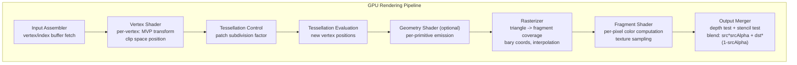

### 깊이 버퍼 및 Early-Z

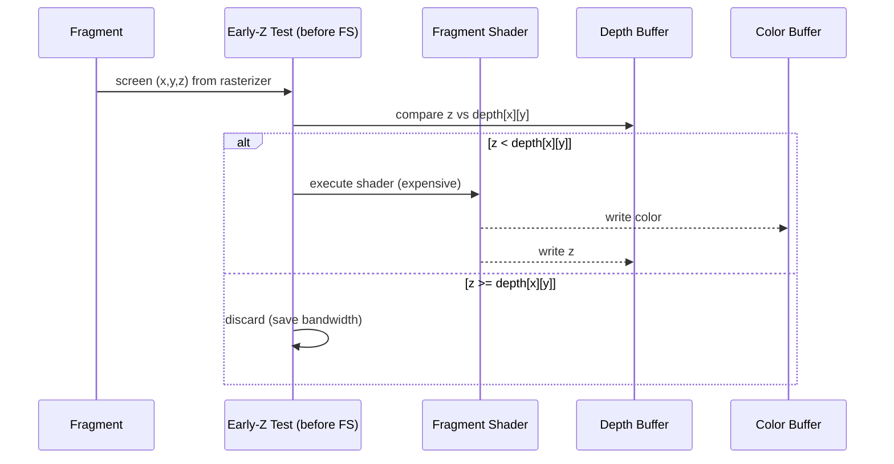

**Early-Z**는 셰이더 실행 전에 조각을 거부합니다. — 엄청난 성능 향상입니다. 셰이더가 깊이를 쓰거나 `discard`을 호출하면 깨집니다.

### 디퍼드 렌더링과 포워드 렌더링 비교

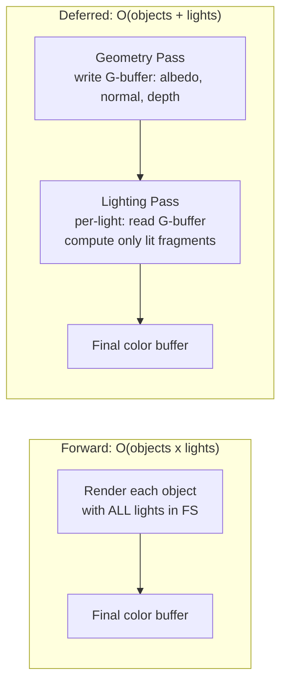

**G-버퍼 레이아웃**(MRT — 다중 렌더 타겟):
- RT0: 알베도(RGB) + 거칠기(A)
- RT1: 월드 노멀(RGB) + 금속성(A)
- RT2: 깊이(32비트 부동 소수점)
- RT3: 발광(RGB) + AO(A)

### 레이 트레이싱: BVH 탐색

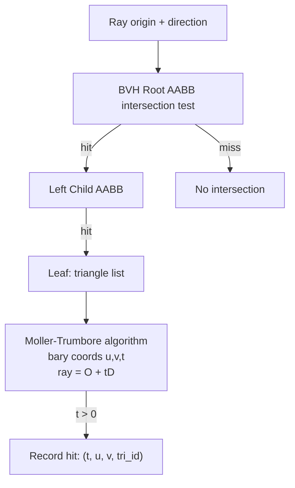

NVIDIA RTX는 하드웨어 BVH 탐색을 위해 **RT 코어**를 사용합니다. 즉, 셰이더 프로세서에서 트리 워크를 오프로드하는 고정 기능 장치입니다. BVH 빌드는 SAH(Surface Area Heuristic)를 통한 O(N log N)입니다.

---

## 2. 게임 엔진 아키텍처: ECS 및 물리학

### 엔터티-구성 요소-시스템 데이터 레이아웃

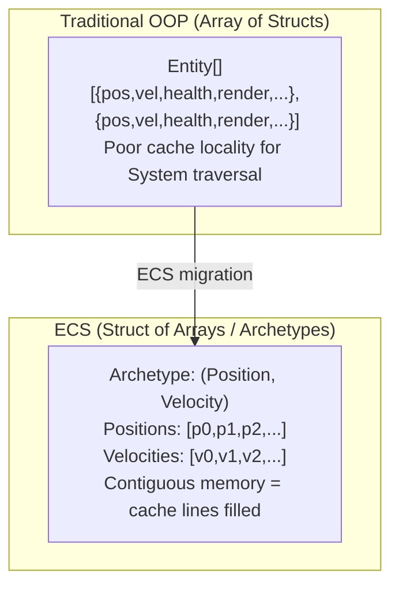

**아키타입** = 고유한 구성요소 유형 세트입니다. 동일한 구성 요소 세트를 가진 엔터티는 원형 테이블을 공유합니다. 엔터티 간 구성 요소 이동 = **아키타입 변경**(memcpy 행을 새 테이블로 이동)

### 물리 엔진: 넓은 단계 → 좁은 단계

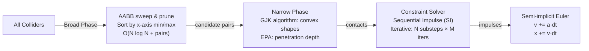

**GJK(Gilbert-Johnson-Keerthi)**: **Minkowski 차분 공간**에서 단체를 구축하여 볼록한 모양의 겹침을 감지합니다. 원점이 Minkowski 차이 내부에 있으면 모양이 겹칩니다.

### 게임 루프 타이밍

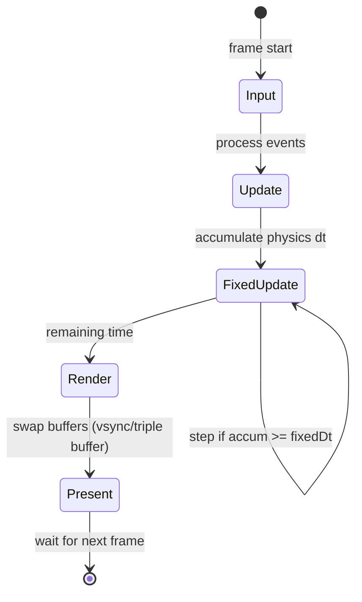

고정 시간 간격(일반적으로 50Hz)은 렌더링에서 물리적 안정성을 분리합니다. **보간 알파** = `accum / fixedDt`는 모든 FPS에서 부드러운 렌더링을 위해 마지막 두 물리 상태를 혼합합니다.

---

## 3. IoT 아키텍처: 엣지 컴퓨팅 및 프로토콜 내부

### MQTT 프로토콜 내부

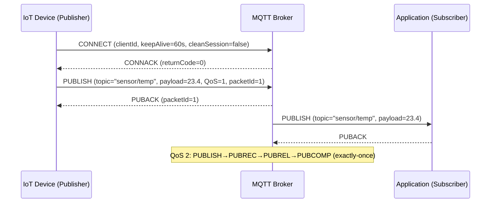

**QoS 수준**:
- QoS 0: 최대 1회(실행 후 잊어버리기, ACK 없음)
- QoS 1: 최소 한 번(PUBACK, 중복될 수 있음)
- QoS 2: 정확히 한 번(4-메시지 핸드셰이크, 저장 및 전달)

### 엣지 컴퓨팅: 데이터 파이프라인

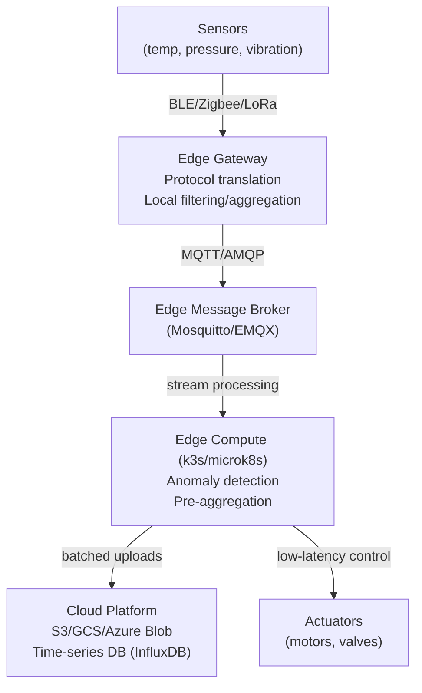

**로컬 루프 대기 시간**: 에지-액추에이터 < 10ms. 클라우드 왕복: 50~200ms — 실시간 제어에는 너무 느립니다.

### 제한된 장치의 TLS

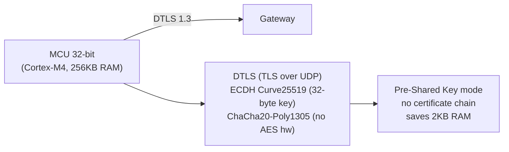

제한된 장치는 PSK와 함께 **DTLS**(데이터그램 TLS)를 사용하여 인증서 구문 분석 오버헤드를 방지합니다. ChaCha20은 AES 하드웨어 가속이 없는 장치에서 선호됩니다.

---

## 4. 코드형 인프라: Terraform 상태 머신 내부

### Terraform 계획/수명주기 적용

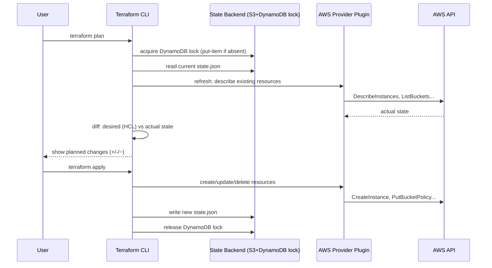

### 종속성 그래프 및 병렬성

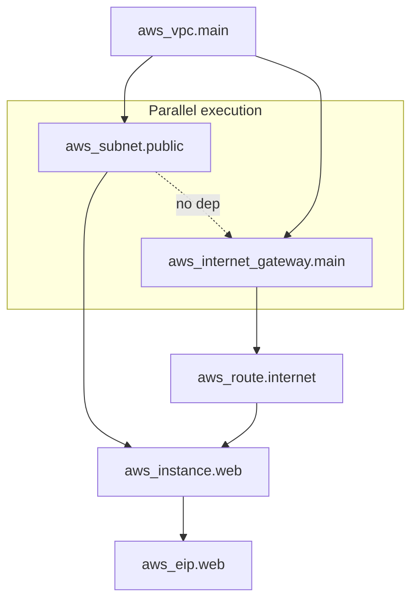

Terraform은 리소스의 DAG를 구축하고 종속성이 허용되는 경우 **병렬**을 적용합니다. `depends_on` 메타 인수는 암시적 종속성이 참조로 캡처되지 않을 때 명시적 가장자리를 강제합니다.

### 상태 파일 구조

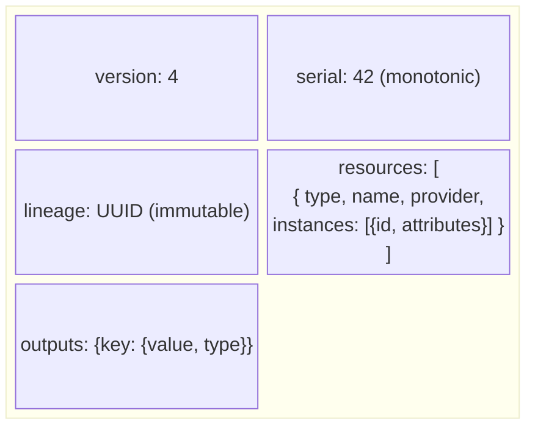

`serial` 적용할 때마다 증가 — **낙관적 잠금**에 사용됩니다. 원격 시리얼 > 로컬 시리얼인 경우 적용이 거부됩니다(다른 사람이 먼저 수정함).

---

## 5. Ansible: 푸시 기반 구성 내부

### 모듈 실행 메커니즘

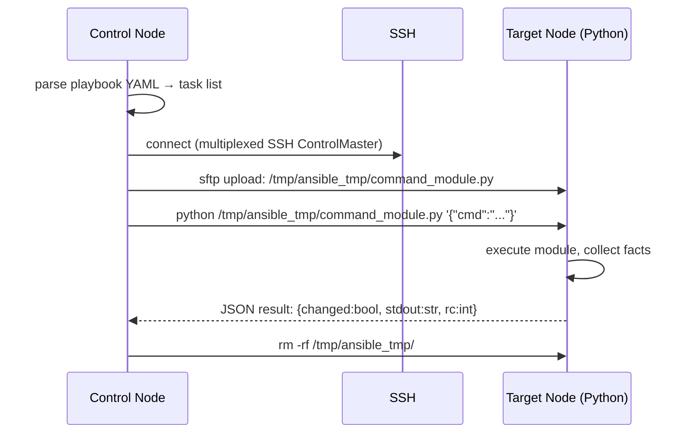

Ansible은 **에이전트가 없습니다** — Python 모듈 파일은 대상에 SCP로 지정되고 실행되며 작업별로 정리됩니다. 이는 Python을 대상에서 사용할 수 있어야 함을 의미합니다(SSH를 직접 사용하는 `raw` 모듈 제외).

### 멱등성 및 검사 모드

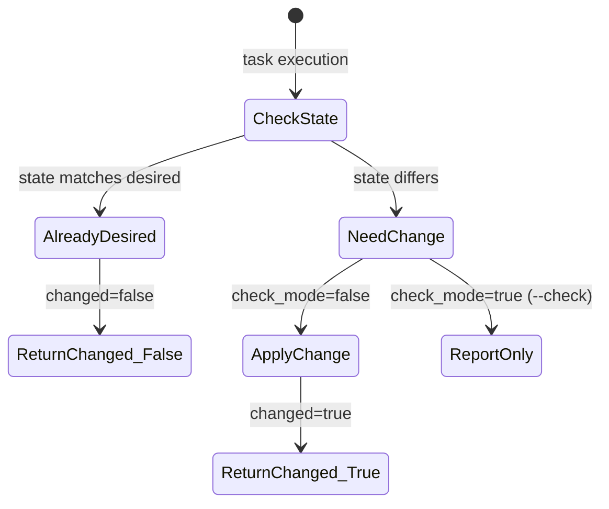

모듈은 멱등성 `get_state` → 비교 → `set_state` 논리를 구현해야 합니다. `--check` 모드는 `get_state` + 비교만 실행하고 전체 플레이북을 테스트 실행합니다.

---

## 6. SRE: 오류 예산, SLO 및 내부 알림

### SLO 오류 예산 메커니즘

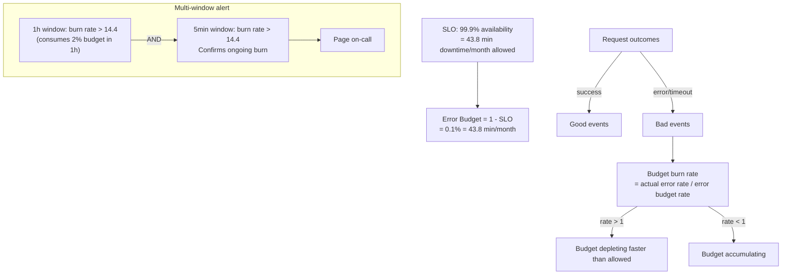

**다중 창 경고**(Google의 접근 방식): 짧은 창은 빠른 굽기를 감지하고, 긴 창은 오탐 없이 느린 굽기를 감지합니다.

### Prometheus 알림 규칙 평가

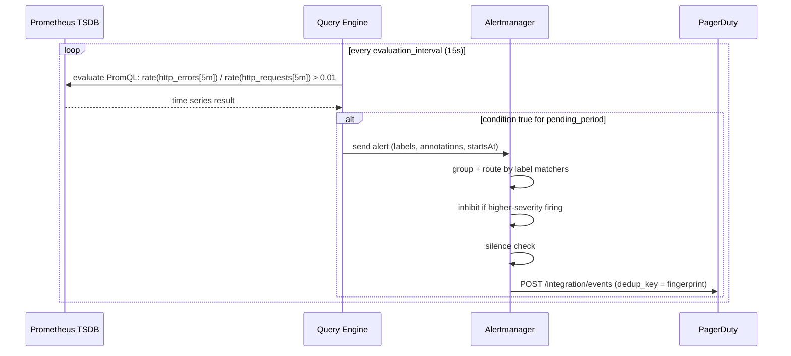

**핑거프린팅**: 경고 ID = 모든 라벨 키/값 쌍의 해시입니다. Alertmanager는 중복 제거 및 그룹화를 위해 지문을 사용합니다.

### 분산 추적: OpenTelemetry 컨텍스트 전파

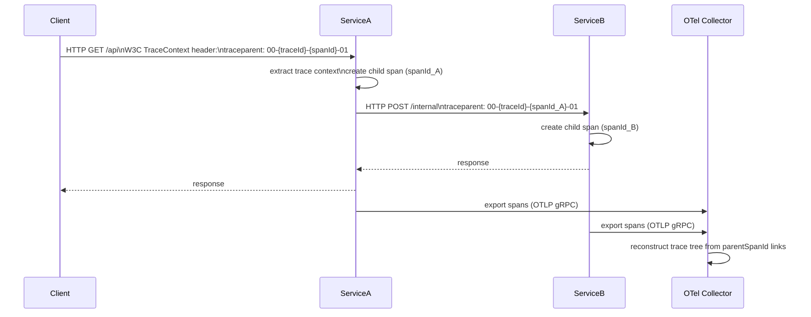

`traceId`(128비트)은 전체 요청 트리에 걸쳐 있습니다. `spanId`(64비트)은 한 서비스의 작업 단위를 식별합니다. `parentSpanId`는 하위 항목을 상위 항목에 연결하여 트리 재구성을 가능하게 합니다.

---

## 7. 테스트 방법론: 속성 기반 및 돌연변이 테스트 내부

### 속성 기반 테스트(QuickCheck / 가설)

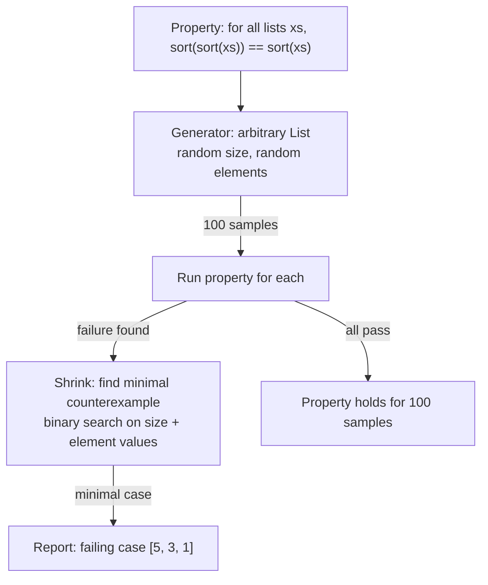

**축소**는 핵심 혁신입니다. QuickCheck는 무작위 오류를 보고할 뿐만 아니라 이를 가장 작은 반례로 최소화하여 버그를 디버깅할 수 있도록 만듭니다.

### 돌연변이 테스트 내부

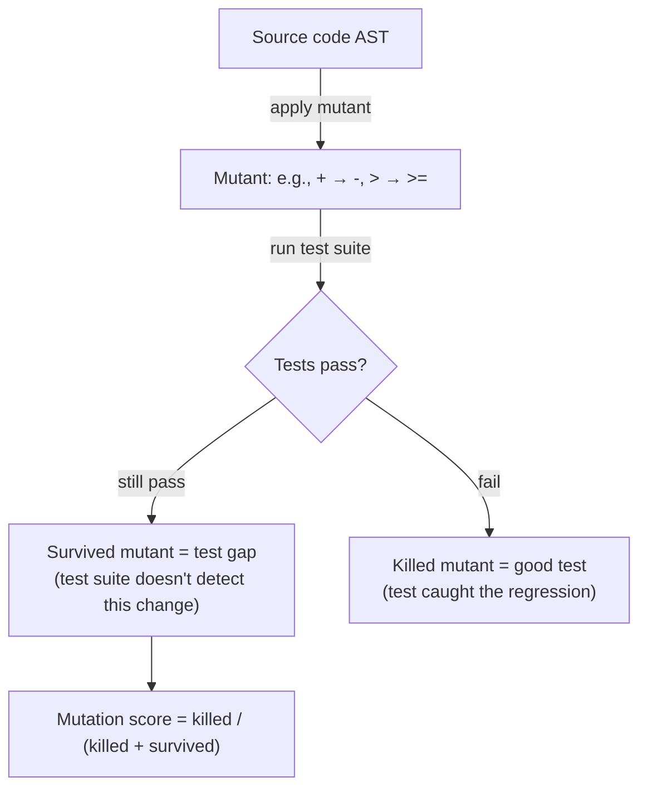

돌연변이 테스트 결과 **거짓 신뢰도**가 드러났습니다. 어설션이 정확한 값을 확인하지 않는 경우 100% 계통 적용 범위는 여전히 높은 생존 돌연변이율을 가질 수 있습니다.

---

## 8. 컴퓨터 그래픽: 셰이더 컴파일 및 SPIR-V

### GLSL → SPIR-V → 네이티브 ISA

```mermaid
flowchart TD
    GLSL["GLSL / HLSL source"] -->|glslangValidator| SPIRV["SPIR-V binary\n(vendor-neutral IR)"]
    SPIRV -->|driver compilation| ISA["GPU ISA\n(PTX→SASS for NVIDIA\nGCN for AMD\nEU ISA for Intel)"]
    SPIRV -->|optimization passes| SPIRV_Opt["spirv-opt: dead code elim\nvector width optimization"]
    SPIRV --> Vulkan["Vulkan VkShaderModule"]
    SPIRV --> Metal["SPIR-V Cross → MSL (Metal)"]
    SPIRV --> WebGPU["Naga → WGSL (WebGPU)"]
```

**SPIR-V**는 GPU 프로그램용 명시적 유형 시스템을 갖춘 레지스터 기반 SSA IR입니다. 백엔드 드라이버 컴파일에서 프런트엔드 언어를 분리하므로 하나의 셰이더가 여러 플랫폼을 대상으로 할 수 있습니다.

### 컴퓨팅 셰이더 스레드 계층 구조(CUDA/Vulkan 컴퓨팅)

```mermaid
block-beta
    columns 1
    block:hierarchy:1
        columns 1
        g["Grid: 3D array of thread groups"]
        b["Thread Group (workgroup): 64–256 threads\nshared local memory (LDS) ~48KB"]
        t["Thread (lane): executes shader\nregisters: 32–255 per thread"]
        w["Warp (SIMD32/SIMD64): 32/64 threads\nexecute in lockstep (SIMT)"]
    end
```

**워프 발산**: 워프의 스레드가 서로 다른 분기(`if (threadId % 2)`)를 취하는 경우 두 경로 모두 마스크된 비활성 레인을 사용하여 순차적으로 실행됩니다. 최악의 경우 활용도는 50%입니다.

---

## 9. 데이터베이스 내부: 쿼리 최적화 프로그램 및 실행 엔진

### 쿼리 최적화: 비용 기반 최적화 도구

```mermaid
flowchart TD
    SQL["SELECT * FROM orders o JOIN customers c ON o.cust_id = c.id WHERE c.country='US'"] --> Parse["Parse -> AST"]
    Parse --> Bind["Bind -> resolve table/column refs"]
    Bind --> Transform["Logical Plan: Filter -> Join -> Scan"]
    Transform --> Enumerate["Plan Enumeration\nDP: enumerate join orderings\nO(3^N) with pruning"]
    Enumerate --> CostModel["Cost Model\nI/O cost: #pages x seq_cost\nCPU cost: #rows x cpu_cost\nStats: table cardinality, column NDV, histograms"]
    CostModel --> BestPlan["Best Physical Plan\n(NestLoop vs HashJoin vs MergeJoin)\n(SeqScan vs IndexScan)"]
```

**통계**는 비용 추정을 유도합니다: `pg_statistic` 히스토그램, 가장 일반적인 값(MCV) 및 null 분수. 오래된 통계 → 잘못된 카디널리티 추정 → 잘못된 계획.

### 화산/반복자 실행 모델

```mermaid
sequenceDiagram
    participant Parent as HashAggregate
    participant Child as HashJoin
    participant L as SeqScan (orders)
    participant R as IndexScan (customers)

    Parent->>Child: next()
    Child->>L: next() [build phase: read all right side]
    L-->>Child: tuple
    Child->>R: next()
    R-->>Child: tuple
    Child->>Child: probe hash table
    Child-->>Parent: matched tuple
    Parent->>Parent: update hash group aggregate
```

**풀 모델(화산)**: 각 연산자는 하위 항목에 대해 `next()`을 호출합니다. 간단하지만 함수 호출 오버헤드가 높습니다. 벡터화된 실행(DuckDB, ClickHouse)은 `next()` 호출당 1024개 행의 배치를 처리합니다.

---

## 10. 애자일 및 소프트웨어 엔지니어링 프로세스 내부

### Git 분기 전략: 내부 메커니즘

```mermaid
flowchart LR
    subgraph "Trunk-Based Development"
        Main["main branch"] -->|short-lived| FB["feature branch\n(< 2 days)"]
        FB -->|PR + merge| Main
        Main -->|tag| Release["Release tag"]
    end
    subgraph "Gitflow"
        GF_Main["main"] ---|sync| GF_Dev["develop"]
        GF_Dev --> GF_Feature["feature/x"]
        GF_Dev --> GF_Release["release/1.2"]
        GF_Release --> GF_Main
        GF_Main --> GF_Hotfix["hotfix/y"]
        GF_Hotfix --> GF_Main
        GF_Hotfix --> GF_Dev
    end
```

### CI/CD 파이프라인 실행 그래프

```mermaid
flowchart TD
    Push["git push"] -->|webhook| CI["CI Server\n(Jenkins/GitLab CI/GitHub Actions)"]
    CI --> Checkout["checkout + cache restore"]
    Checkout --> Parallel{parallel jobs}
    Parallel --> Lint["lint + static analysis"]
    Parallel --> UnitTest["unit tests"]
    Parallel --> Build["build artifact"]
    Lint & UnitTest --> IntTest["integration tests\n(docker-compose up)"]
    IntTest & Build --> Package["package Docker image\ndocker build + push registry"]
    Package -->|tag=main| StagingDeploy["deploy to staging\nkubectl rollout"]
    StagingDeploy --> E2E["e2e tests (Playwright)"]
    E2E -->|manual approval| ProdDeploy["deploy to production\nblue/green or canary"]
```

---

## 11. 운영 체제 스케줄링: 실시간 및 멀티 코어

### 멀티 코어 캐시 일관성(MESI 프로토콜)

```mermaid
stateDiagram-v2
    [*] --> Invalid: cache line not present
    Invalid --> Exclusive: CPU reads, no other has it
    Exclusive --> Modified: CPU writes (no bus traffic)
    Modified --> Shared: another CPU reads (write-back + share)
    Exclusive --> Shared: another CPU reads
    Shared --> Modified: CPU writes (invalidate others)
    Shared --> Invalid: another CPU writes
    Modified --> Invalid: another CPU writes (must evict)
```

**거짓 공유**: 서로 다른 CPU에 의해 수정된 동일한 캐시 라인(64B)의 두 변수 → 지속적인 MESI 상태 전환 → 실행 직렬화. 수정: `__cacheline_aligned` / `@Contended` 주석.

### NUMA 메모리 액세스 패턴

```mermaid
flowchart LR
    subgraph "NUMA Node 0"
        CPU0["CPU 0–15\nL3 Cache 30MB"]
        RAM0["Local DRAM\n64GB\n~50ns latency"]
    end
    subgraph "NUMA Node 1"
        CPU1["CPU 16–31\nL3 Cache 30MB"]
        RAM1["Remote DRAM\n64GB\n~100ns latency (QPI/xGMI)"]
    end
    CPU0 -->|local| RAM0
    CPU0 -->|remote 2× slower| RAM1
    CPU1 -->|local| RAM1
```

`numactl --membind=0`은 로컬 NUMA 노드에 할당을 고정합니다. 교차 NUMA 할당으로 Java GC 오버헤드가 40~60% 증가합니다. JVM의 NUMA 인식 할당자(`-XX:+UseNUMAInterleaving`)가 이를 완화합니다.

---

## 요약: 기타 CS 내부 맵

```mermaid
mindmap
  root((Misc CS Internals))
    Graphics
      Rasterization pipeline stages
      G-buffer deferred rendering
      BVH ray traversal hardware
      SPIR-V cross-platform IR
      Warp divergence SIMT
    Game Engines
      ECS archetype memory layout
      GJK Minkowski difference
      Fixed timestep physics loop
      Interpolation rendering
    IoT
      MQTT QoS 3 levels
      DTLS constrained devices
      Edge compute local latency
    DevOps/IaC
      Terraform DAG parallelism
      State serial optimistic lock
      Ansible agentless SSH module
    SRE
      Error budget burn rate
      Multi-window alerting
      OTel trace context propagation
    Testing
      QuickCheck shrinking
      Mutation testing survivors
    Database
      Cost-based optimizer statistics
      Volcano pull model
      Vectorized batch execution
    OS/Multi-core
      MESI cache coherence protocol
      False sharing cache lines
      NUMA topology memory latency
```
