# 네트워킹 내부: 내부

> 합성: Forouzan *Data Communications and Networking* 4th ed, Comer *Computer Networks and Internets* 5th ed, Barrett & Silverman *SSH: The Definitive Guide*, Bourke *Server Load Balancing* 및 지원 comp(24/28/37/38/344-355/467/496/501) 참조.

---

## 1. Linux 네트워크 스택 — sk_buff 흐름

Linux의 모든 패킷은 커널을 통해 단일 힙 개체(`struct sk_buff`)로 이동합니다. 수명 주기를 이해하면 헤더가 추가/제거되는 위치, 체크섬 계산 및 라우팅 결정이 이루어지는 위치를 정확히 알 수 있습니다.

```c
struct sk_buff {
    struct sk_buff     *next, *prev;   // doubly-linked in queue
    struct sock        *sk;            // owning socket (NULL for forwarded)
    struct net_device  *dev;           // ingress/egress NIC
    unsigned char      *head;          // start of allocated buffer
    unsigned char      *data;          // start of current payload (moves as headers added/stripped)
    unsigned char      *tail;          // end of payload
    unsigned char      *end;           // end of allocated buffer
    __u32              len;            // total payload length
    __u16              protocol;       // ETH_P_IP, ETH_P_IPV6, ETH_P_ARP ...
    // ... transport header, network header, mac header pointers ...
};
```

### TX 경로(사용자 공간 쓰기 → 연결)

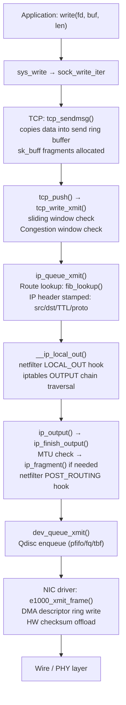

### RX 경로(와이어 → 소켓 버퍼)

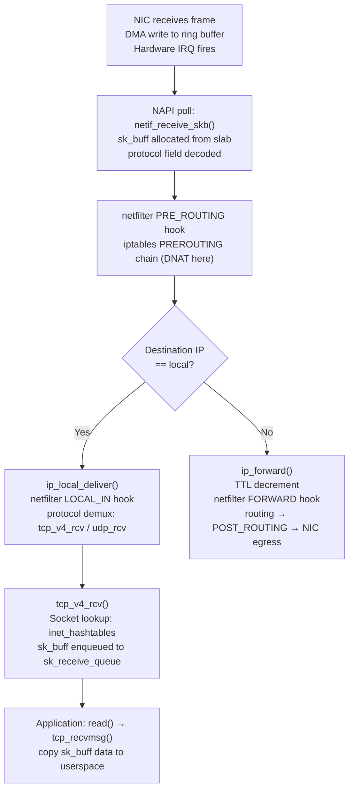

---

## 2. TCP 상태 머신 및 혼잡 제어

### TCP 전체 상태 머신

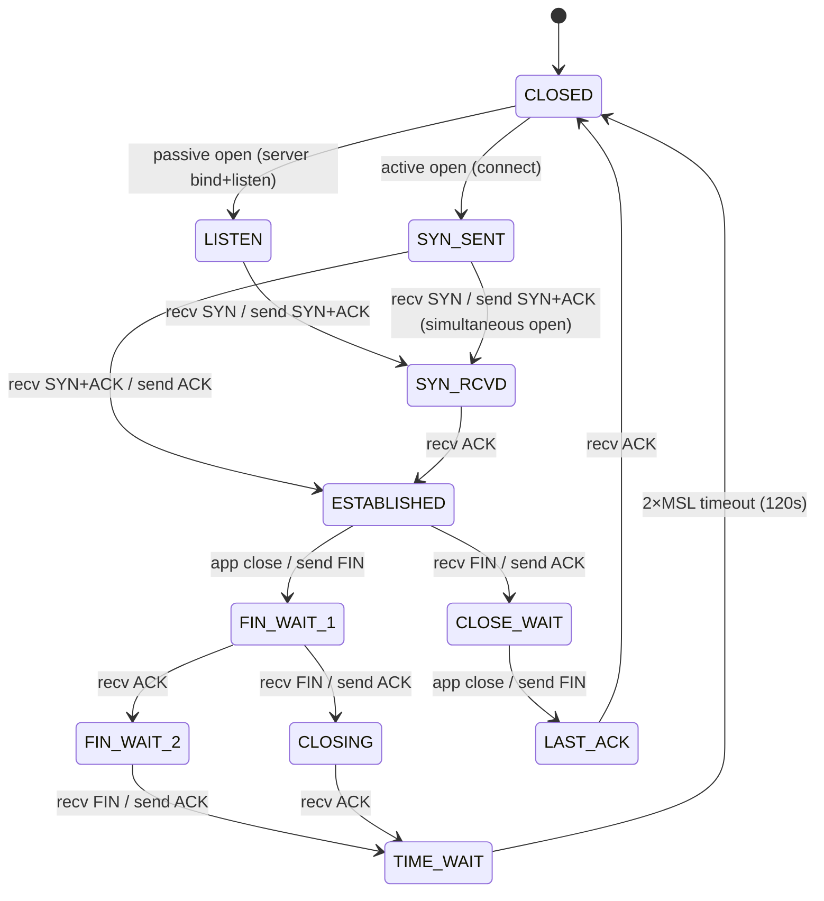

### TCP 3방향 핸드셰이크 - 커널 메모리 할당 타임라인

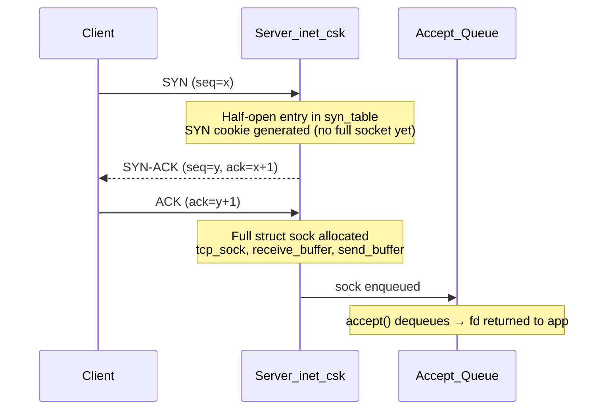

### 혼잡 제어 — CUBIC Window Evolution

```mermaid
flowchart LR
    A["Slow Start\ncwnd += 1 per ACK\n(exponential growth)"] -->|cwnd >= ssthresh| B["Congestion Avoidance\nCUBIC: W(t) = C·(t-K)³ + Wmax\nK = ³√(Wmax·β/C)"]
    B -->|packet loss (3 dup ACKs)| C["Fast Recovery\nssthresh = cwnd × β(0.7)\nEnter CUBIC recovery probe"]
    C -->|new ACK| B
    B -->|RTO timeout| D["Slow Start\ncwnd = 1 MSS\nssthresh = cwnd/2"]
    D --> A

    style A fill:#2d4a22,color:#fff
    style B fill:#1a3a5c,color:#fff
    style C fill:#5c2d1a,color:#fff
    style D fill:#4a1a1a,color:#fff
```

**CUBIC 수식 분석**:
- `C` = 0.4(배율 인수)
- `Wmax` = 마지막 정체 이벤트의 창 크기
- `K = ³√(Wmax · β / C)` — 최저점에서 Wmax에 도달하는 시간
- `t=K`에서 창은 Wmax와 같습니다. K를 넘어서면 초선형으로 성장합니다.
- `β` = 0.7 (곱셈 감소 인자, Reno의 0.5보다 덜 공격적)

**BBR(병목 대역폭 및 RTT)** — 대역폭을 직접 조사합니다.
```
BtlBw = max delivery rate over RTprop window
pacing_rate = BtlBw × pacing_gain
cwnd = BtlBw × RTprop × cwnd_gain
```
BBR은 별도의 PROBE_BW/PROBE_RTT/STARTUP/DRAIN 상태 시스템을 유지하며 손실에 직접 반응하지 않습니다.

---

## 3. IP 계층 - 헤더 처리 및 라우팅

### IPv4 헤더 메모리 레이아웃

```
 0                   1                   2                   3
 0 1 2 3 4 5 6 7 8 9 0 1 2 3 4 5 6 7 8 9 0 1 2 3 4 5 6 7 8 9 0 1
+-+-+-+-+-+-+-+-+-+-+-+-+-+-+-+-+-+-+-+-+-+-+-+-+-+-+-+-+-+-+-+-+
|Version|  IHL  |    DSCP   |ECN|         Total Length          |
+-+-+-+-+-+-+-+-+-+-+-+-+-+-+-+-+-+-+-+-+-+-+-+-+-+-+-+-+-+-+-+-+
|         Identification        |Flags|      Fragment Offset    |
+-+-+-+-+-+-+-+-+-+-+-+-+-+-+-+-+-+-+-+-+-+-+-+-+-+-+-+-+-+-+-+-+
|  Time to Live |    Protocol   |         Header Checksum       |
+-+-+-+-+-+-+-+-+-+-+-+-+-+-+-+-+-+-+-+-+-+-+-+-+-+-+-+-+-+-+-+-+
|                       Source Address                          |
+-+-+-+-+-+-+-+-+-+-+-+-+-+-+-+-+-+-+-+-+-+-+-+-+-+-+-+-+-+-+-+-+
|                    Destination Address                        |
+-+-+-+-+-+-+-+-+-+-+-+-+-+-+-+-+-+-+-+-+-+-+-+-+-+-+-+-+-+-+-+-+
```

- **IHL**(인터넷 헤더 길이): 4비트 필드 × 4 = 헤더 크기(바이트)(최소 20, 최대 60)
- **DSCP/ECN**: 차별화된 서비스 — IP_TOS는 대기열 우선 순위에 매핑됩니다. ECN 비트는 드롭 없이 신호 혼잡을 발생시킵니다.
- **식별 + 플래그 + 조각 오프셋**: 조각화 재조립 — 커널은 `ipq` 해시 테이블의 조각을 추적합니다. 재조립 타이머는 30초 후에 작동됩니다.

### FIB(전달 정보 베이스) Trie 조회

Linux는 라우팅 테이블을 O(log2W) LPM에 대한 **LC-trie**(레벨 압축 트리)로 저장합니다.

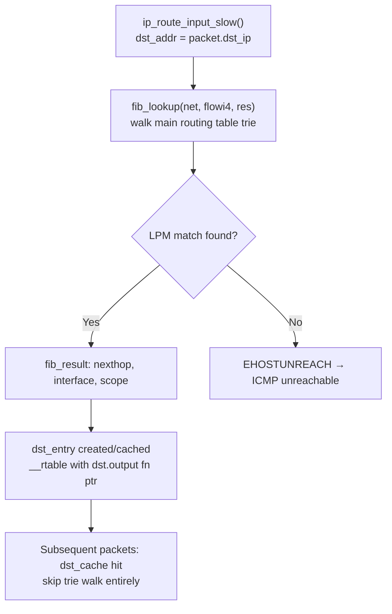

### IPv6 확장 헤더 체인

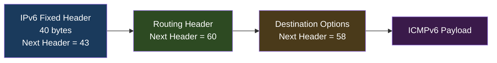

IPv6은 중간 라우터(소스 조각만)에서 조각화를 제거합니다(경로 MTU 검색 필수). 헤더 체크섬이 없습니다(전송 계층에 위임됨). NDP(Neighbor Discovery Protocol)는 ICMPv6 유형 135/136을 사용하여 ARP를 대체합니다.

---

## 4. ARP 확인 — 메모리 구조

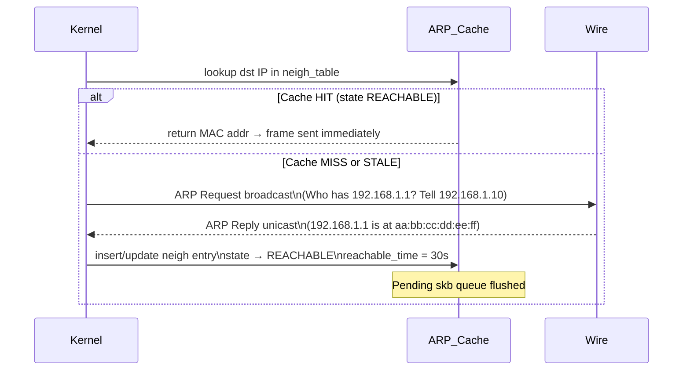

커널의 `struct neighbour`:
```c
struct neighbour {
    __u8            primary_key[4];  // IP address
    u8              ha[ALIGN(MAX_ADDR_LEN, sizeof(unsigned long))]; // MAC
    unsigned long   confirmed;        // jiffies of last confirmation
    atomic_t        refcnt;
    struct neigh_ops *ops;            // ops->output fn: arp_send or direct
    // NUD state machine: INCOMPLETE→REACHABLE→STALE→DELAY→PROBE→FAILED
};
```

---

## 5. DNS 확인 체인

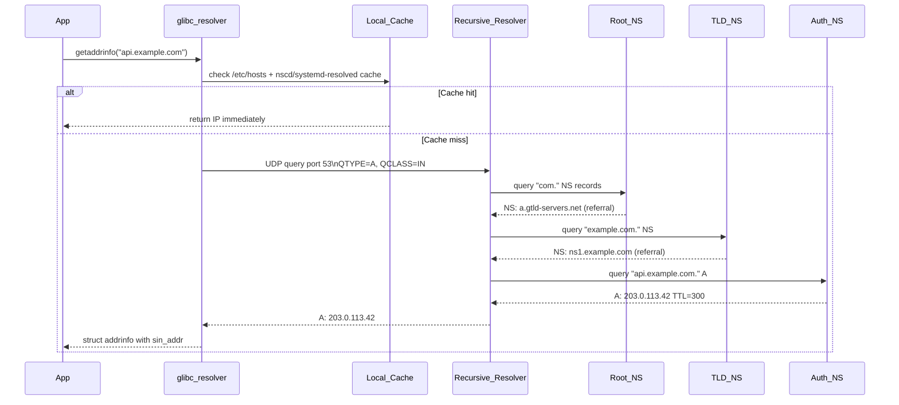

DNS 메시지 연결 형식(RFC 1035):
```
Header (12 bytes): ID(16) | QR|Opcode|AA|TC|RD|RA|Z|RCODE | QDCOUNT | ANCOUNT | NSCOUNT | ARCOUNT
Question: QNAME (labels) | QTYPE (2) | QCLASS (2)
Answer RR: NAME | TYPE | CLASS | TTL(32) | RDLENGTH | RDATA
```

DNSSEC는 **RRSIG**(RRset를 통한 서명), **DNSKEY**(영역 서명 키), **DS**(위임 서명자 해시) 및 **NSEC/NSEC3**(인증된 존재 거부)를 추가합니다. 검증 체인: 루트 KSK → TLD ZSK → 권한 있는 영역 ZSK → RRset 서명.

---

## 6. Netfilter / iptables 후크 아키텍처

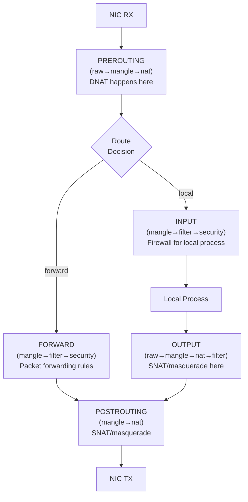

**연결 추적(conntrack)** — 해시 테이블에 저장된 각 TCP/UDP 흐름:
```
nf_conntrack_tuple: {src_ip, src_port, dst_ip, dst_port, proto, netns}
State: NEW → ESTABLISHED → RELATED → INVALID
```
NAT는 sk_buff IP/TCP 헤더를 수정하고 체크섬을 증분식으로 다시 계산하여 패킷을 다시 작성합니다(RFC 1624 1의 보완 증분 업데이트).

**nftables**는 레지스터 기반 VM을 사용하여 iptables를 대체합니다.
```
rule → list of expressions → each expression operates on registers r0..r15
verdict: accept / drop / jump / goto / return / continue
```

---

## 7. SSH 프로토콜 내부 - 암호화 핸드셰이크

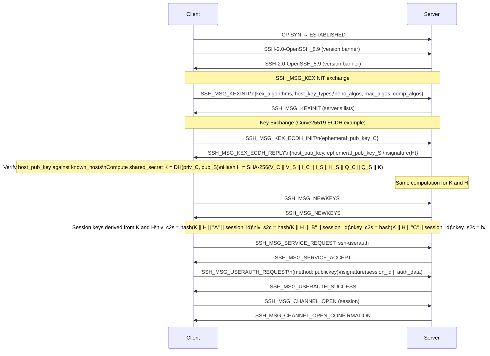

### SSH 패킷 와이어 형식(NEWKEYS 이후)

```
uint32 packet_length       // length of (padding_length + payload + random_padding)
byte   padding_length      // random padding to align to cipher block size
byte[n] payload            // SSH message (compressed if negotiated)
byte[m] random_padding     // random bytes
byte[mac_len] MAC          // HMAC-SHA2-256(sequence_number || unencrypted_packet)
```

`packet_length` 이후의 모든 필드는 AES-256-CTR 또는 ChaCha20-Poly1305로 암호화됩니다. MAC는 **일반 텍스트**를 통해 계산됩니다(Encrypt-then-MAC 또는 AEAD Poly1305가 모든 것을 다룹니다).

---

## 8. TLS 1.3 핸드셰이크 내부

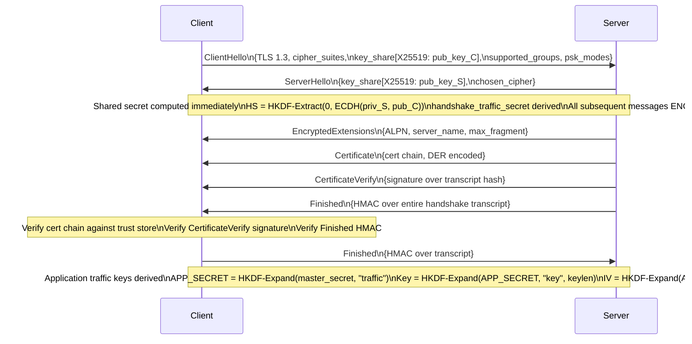

**0-RTT 재개**: 클라이언트는 이전 세션의 PSK 및 ticket_age_add를 저장합니다. 다시 연결하면 서버가 응답하기 전에 resumption_master_secret으로 암호화된 early_data를 보냅니다. 서버는 수락하거나 거부해야 합니다. 재생 방지 캐시로 완화된 재생 취약성입니다.

---

## 9. 로드 밸런싱 알고리즘 - 내부 결정 경로

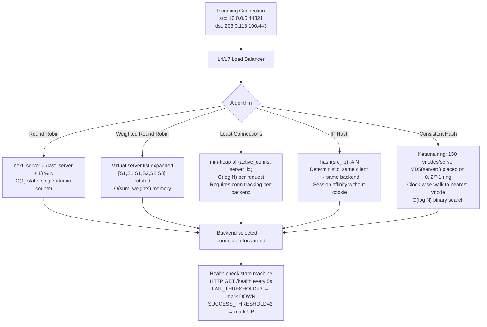

### DSR(직접 서버 반환) 대 NAT 모드

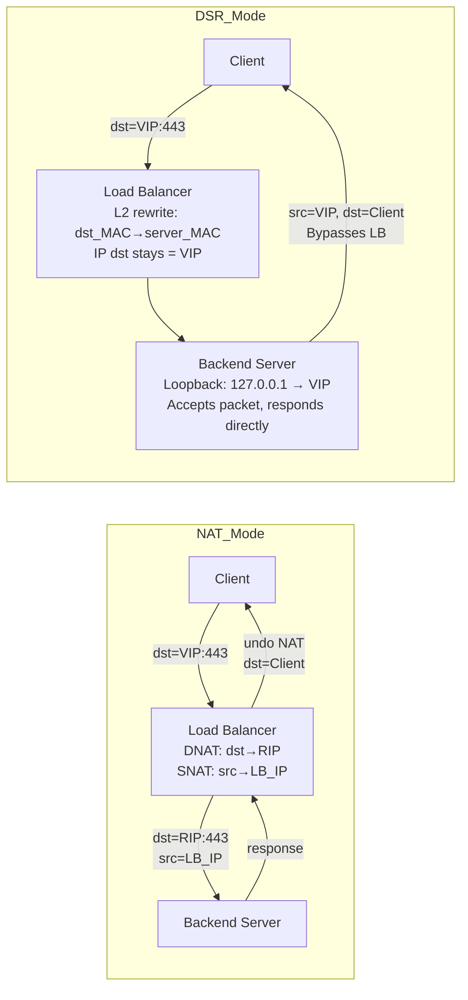

DSR은 반환 경로 병목 현상을 제거합니다. LB는 수신만 처리합니다. 동일한 L2 도메인의 모든 백엔드와 루프백(ARP'd 아님)에 구성된 VIP가 필요합니다.

---

## 10. Linux 네트워크 네임스페이스 내부

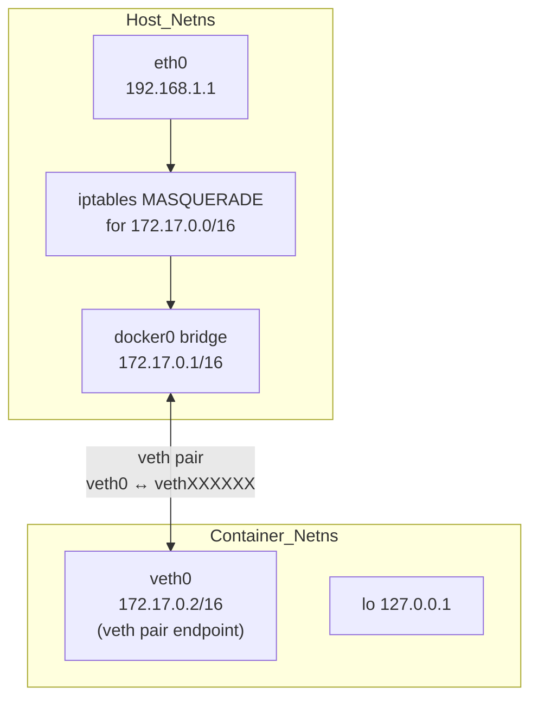

`struct net`(네트워크 네임스페이스)에는 다음이 포함됩니다.
- 라우팅 테이블(`net->ipv4.fib_main`)
- ARP 테이블(`net->ipv4.neigh_table`)
- 소켓 테이블(`net->ipv4.tcp_death_row`)
- iptables/nftables 규칙 세트
- 네트워크 기기 목록(`net->dev_base_head`)

`ip netns add foo` → `clone(CLONE_NEWNET)` → 새 `struct net` 할당됨 → `/proc/self/ns/net` 심볼릭 링크가 생성되었습니다. 컨테이너 런타임의 `unshare(CLONE_NEWNET)`는 프로세스를 새 네임스페이스로 이동합니다.

---

## 11. 무선 네트워크 내부(802.11)

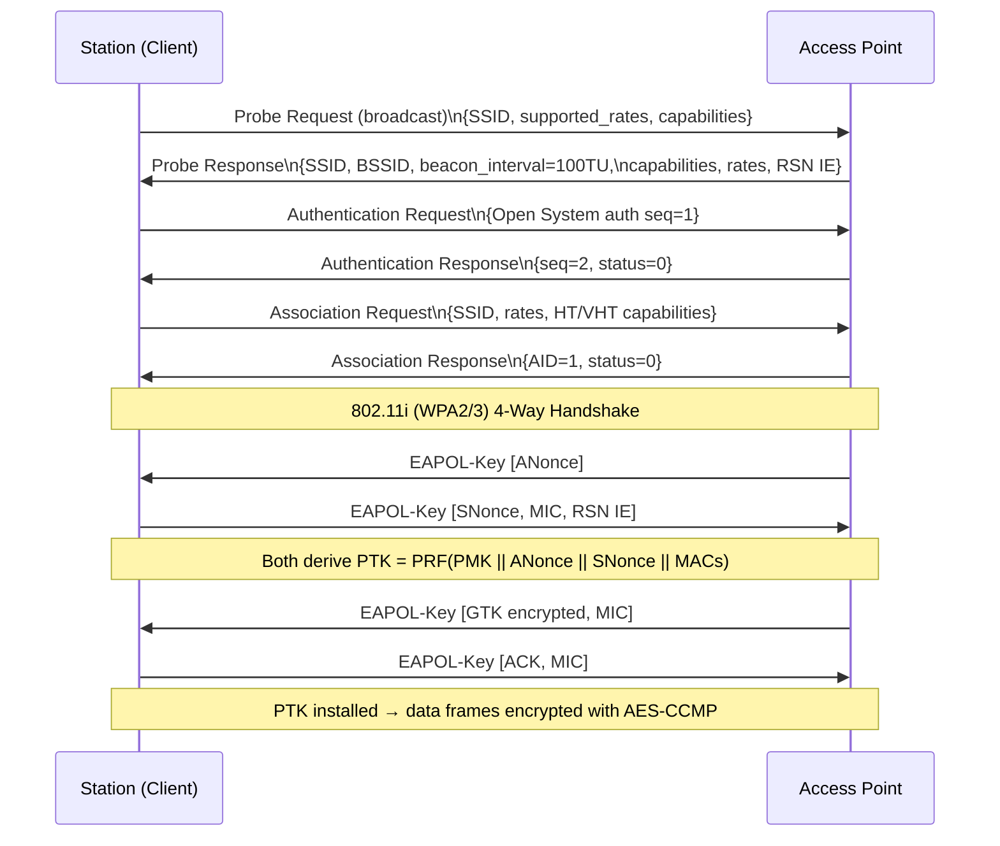

**OFDM 채널 인코딩**(802.11n/ac/ax):
- 데이터를 부반송파로 분할합니다(예: 20MHz 802.11n의 경우 데이터 52개 + 파일럿 4개)
- 각 부반송파 BPSK/QPSK/16-QAM/64-QAM/256-QAM/1024-QAM 변조
- IFFT는 주파수 영역을 시간 영역으로 변환 → 순환 프리픽스 추가 → RF
- MCS 인덱스 인코딩: 변조 × 코딩 속도 × 공간_스트림 → 처리량

---

## 12. BGP 경로 선택 내부

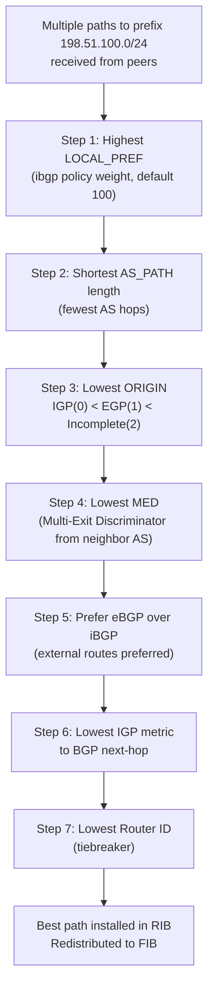

BGP UPDATE 메시지는 다음을 전달합니다.
- **WITHDRAWN ROUTES**: 접두사에 더 이상 연결할 수 없습니다.
- **경로 속성**: ORIGIN, AS_PATH, NEXT_HOP, MED, LOCAL_PREF, COMMUNITY, LARGE_COMMUNITY
- **NLRI**: 네트워크 계층 연결성 정보(접두사)

BGP 세션 상태 머신: `IDLE → CONNECT → ACTIVE → OPENSENT → OPENCONFIRM → ESTABLISHED`. Keepalive 타이머(기본값 60초)는 세션을 유지합니다. 보류 시간(180초)이 만료되면 중단됩니다.

---

## 13. TCP/UDP 체크섬 계산

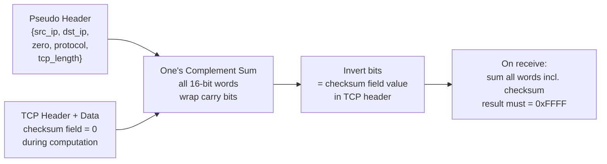

하드웨어 체크섬 오프로드(`NETIF_F_IP_CSUM`): NIC는 하드웨어에서 TCP/UDP 체크섬을 계산합니다. 커널은 `skb->ip_summed = CHECKSUM_PARTIAL`을 설정하고 부분 의사 헤더 체크섬을 작성합니다. NIC는 전용 하드웨어 로직을 사용하여 페이로드를 통해 이를 완료하여 CPU 주기를 확보합니다.

---

## 14. HTTP/2 프레임 다중화 내부

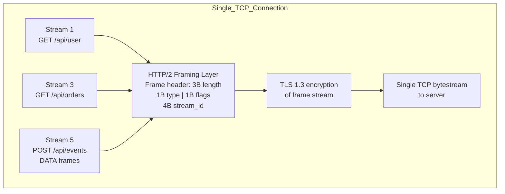

**HPACK 헤더 압축**:
- 정적 테이블: 사전 정의된 헤더 이름/값 쌍 61개(예: 인덱스 2 = `:method: GET`)
- 동적 테이블: 최근에 본 헤더의 LRU 캐시, SETTINGS를 통해 협상된 최대 크기
- 리터럴 문자열에 적용되는 허프만 인코딩
- 결과: `Content-Type: application/json` 같은 헤더 → 이전에 본 경우 1-2바이트

**흐름 제어**: 스트림별 및 연결별 기간. `WINDOW_UPDATE` 프레임이 수신 창에 추가됩니다. 각 DATA 프레임은 둘 다에서 공제됩니다. 느린 스트림이 빠른 스트림을 차단하는 것을 방지합니다.

---

## 네트워크 스택 성능 수치

| 운영 | 일반적인 지연 시간 | 메모 |
|-----------|-----------------|-------|
| L1 ARP 캐시 적중 → TX | ~5μs | NIC DMA + 드라이버 경로 |
| TCP 루프백(동일 호스트) | ~10~30μs | 유닉스 소켓을 통한 커널 우회 ~1μs |
| LAN 왕복(GbE) | ~100-200μs | 스위칭 패브릭 포함 |
| WAN RTT(대륙 간) | ~60-150ms | 빛의 속도가 제한됨 |
| DNS 조회(재귀적, 콜드) | 20-200ms | 리졸버 체인 순회 |
| TLS 1.3 핸드셰이크(웜) | 1 RTT + 암호화폐 | ~1-3ms LAN |
| iptables 규칙(선형 스캔) | O(N) 규칙 | 10,000개 규칙 = ~100μs 오버헤드 |
| nftables 규칙(해시/맵) | O(1) 일반 | 집합 기반 매칭 |
| TCP 연결 설정 | 1.5RTT | SYN + SYN-ACK + ACK + 데이터 |

---

## 요약 - 주요 내부 매핑

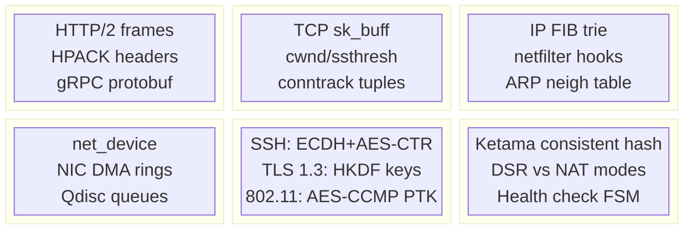

모든 바이트는 애플리케이션 버퍼 → 소켓 전송 큐 → TCP 분할 → IP 헤더 스탬핑 → 넷필터 후크 → QDisc → NIC DMA 링 → 와이어를 순회합니다. 수신 측에서 정확한 역방향 경로: DMA → NAPI 폴 → 프로토콜 demux → sk_receive_queue → 사용자 공간 복사. 이 전체 sk_buff 수명 주기(메모리 내 위치, 어떤 커널 기능이 이를 변경하는지, 어떤 후크가 이를 가로채는지)를 이해하는 것이 모든 Linux 네트워크 성능 분석 및 문제 해결의 기초입니다.
