# 프로그래밍 언어 — 내부: 런타임, 유형 시스템 및 컴파일 내부

> **초점**: 구문이나 API 사용이 아니라 언어 런타임이 고루틴을 예약하는 방법, 컴파일러가 제네릭을 단일화하는 방법, CPS가 일시 중단 코루틴을 변환하는 방법, 유형 추론이 다형성 호출 사이트에 제약 조건을 전파하는 방법에 대해 설명합니다.

---

## 1. Go 런타임: 고루틴 스케줄러 내부

Go의 런타임은 M:N 그린 스레드 스케줄링을 구현합니다. 즉, 작업 도용 스케줄러(GMP 모델)를 사용하여 M OS 스레드에 N개의 고루틴이 다중화됩니다.

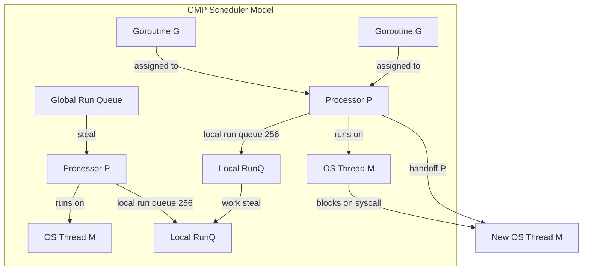

### 고루틴 스택 성장

고루틴은 2KB 스택으로 시작합니다(OS 스레드 2MB 대비). 스택이 용량을 초과하면 런타임은 **스택 복사**를 수행합니다.

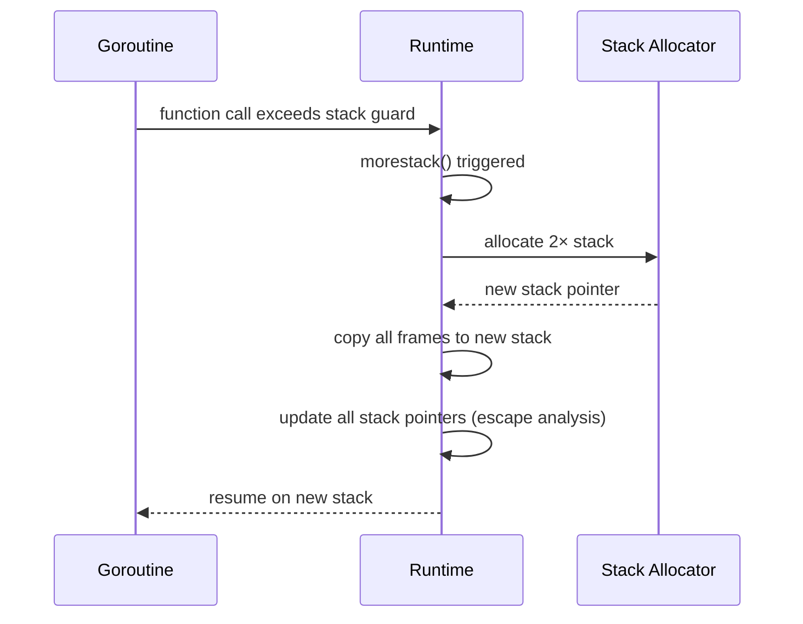

스택 프레임은 **주소에 고정되지 않습니다** — 스택의 모든 포인터는 복사 시 다시 작성됩니다. 이것이 Go가 이스케이프되는 변수를 스택하기 위한 원시 내부 포인터를 금지하는 이유입니다.

### 고루틴 상태 머신

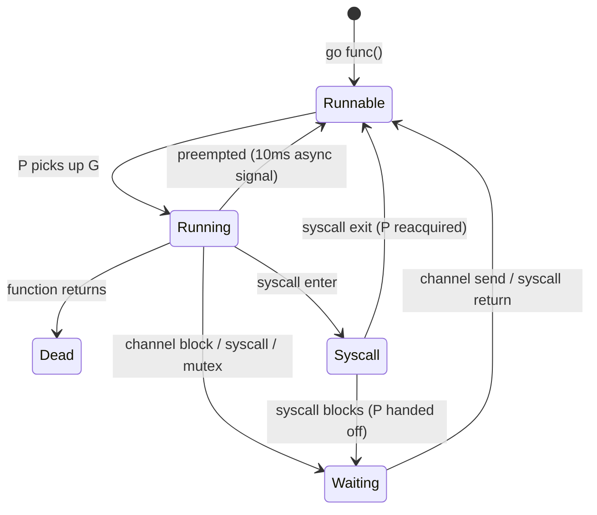

### 작업 훔치기 알고리즘

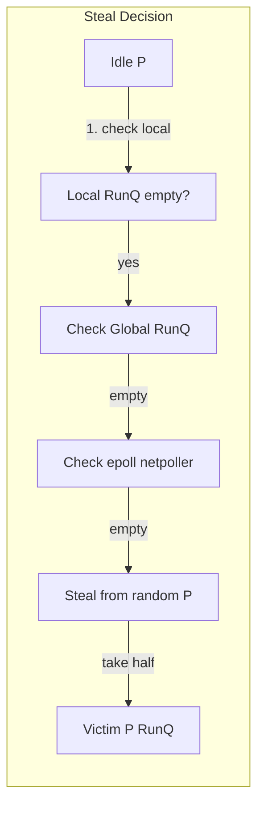

도둑질은 피해자의 로컬 실행 대기열의 **절반**을 차지하므로 공정성을 보장하면서 경합을 줄입니다. 글로벌 실행 큐는 기아를 방지하기 위해 61번째 스케줄링 틱마다 확인됩니다.

### 채널 내부: hchan 구조

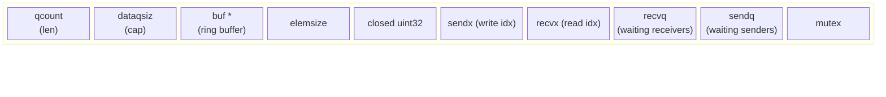

**직접 전송 최적화**: 수신자가 `recvq`에서 차단되면 발신자는 데이터를 **수신자의 스택에 직접** 복사한 다음(버퍼 우회) 수신자를 깨웁니다. 추가 복사본은 없습니다.

---

## 2. Go Garbage Collector: 삼색 동시 표시

Go는 mutator가 실행되는 동안 불변성을 유지하기 위해 쓰기 장벽이 있는 **동시 3색 표시 및 스윕** GC를 사용합니다.

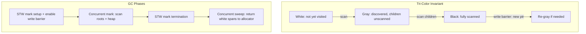

**Dijkstra 쓰기 장벽**: 모든 포인터에 `*slot = ptr`을 씁니다. `*slot`이 검은색이고 `ptr`가 흰색이면 음영은 `ptr` 회색입니다. 이는 회색 중간 없이 흑색→백색 참조를 보장하지 않습니다.

GOGC=100은 라이브 힙이 두 배가 될 때 GC가 트리거됨을 의미합니다. GC 타겟: `goal = live * (1 + GOGC/100)`.

---

## 3. Rust: 소유권, 빌림 검사기, 제로 비용 추상화

### 유형 시스템 상태로서의 소유권

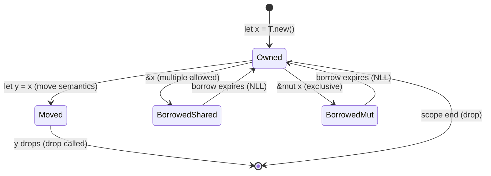

**NLL(Non-Lexical Lifetimes)**: 대여는 범위 종료가 아니라 **마지막 사용** 시 종료됩니다. 빌림 검사기는 AST가 아닌 MIR(중간 수준 IR) 제어 흐름 그래프에서 작동합니다.

### 단일화 대 동적 디스패치

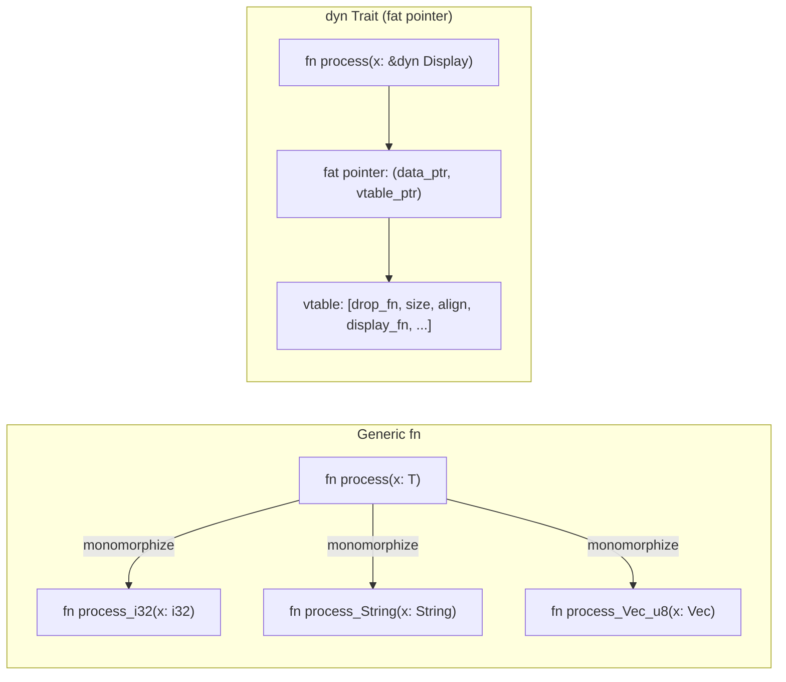

단일화: **런타임 비용 제로**, 코드 팽창, 인라인. `dyn Trait`: 하나의 복사본, vtable을 통한 간접 참조, 인라인을 방지합니다.

### 메모리 레이아웃: 스택 대 힙

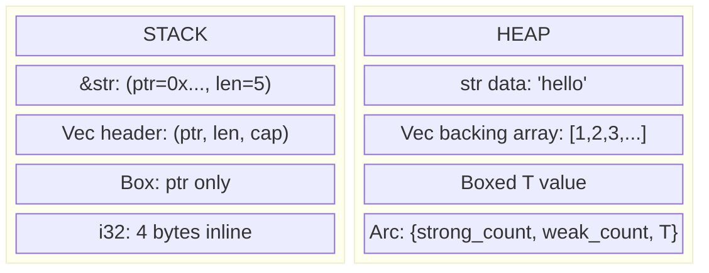

`String` = 힙 할당 UTF-8. `&str` = 임의의 문자열 데이터에 팻 포인터(ptr + len)를 쌓습니다. `Vec<T>` = 스택에 (ptr, len, cap) 헤더가 있는 힙 버퍼.

### LLVM IR 파이프라인

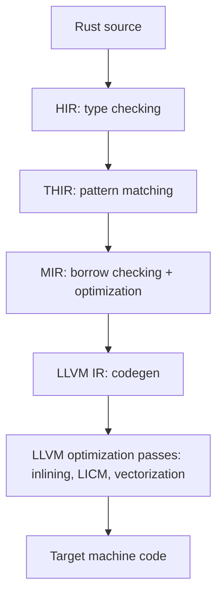

MIR은 핵심 단계입니다. **명시적인 하락이 있는 제어 흐름 그래프**입니다. 모든 변수 하락이 명시적으로 이루어지므로 빌림 검사기가 복잡한 제어 흐름을 이해하지 않고도 안전성을 확인할 수 있습니다.

---

## 4. 스칼라: 유형 시스템, JVM 컴파일 및 암시적

### 변형 및 고급 유형

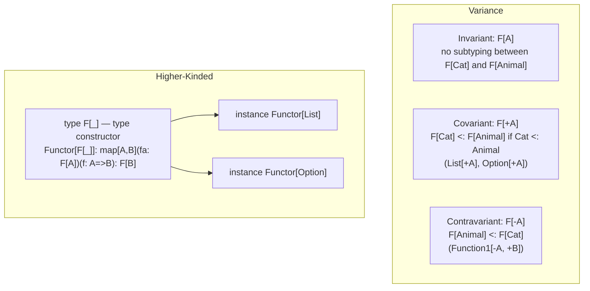

**Liskov 대체**는 분산을 결정합니다. 공변 위치(반환 유형, 읽기 전용 컨테이너)는 `+A`을 허용합니다. 반공변 위치(함수 매개변수)에는 `-A`이 필요합니다.

### 암시적 해결 알고리즘

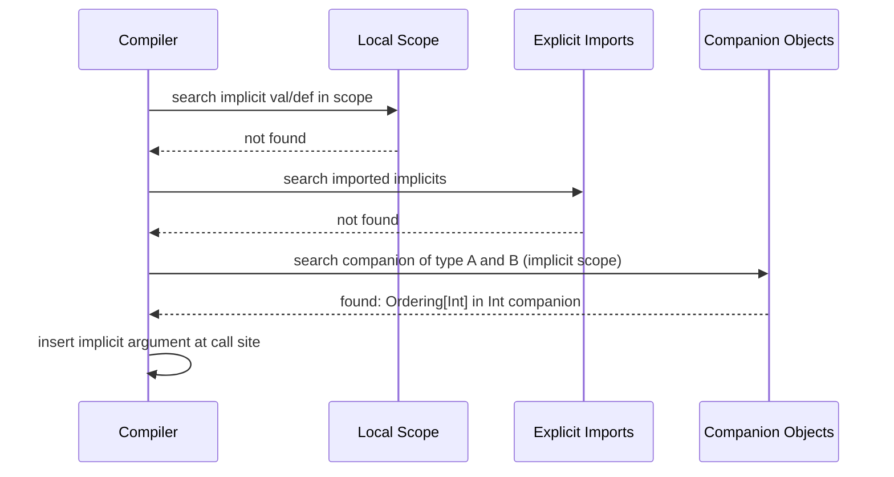

암시적 검색은 **결정적**이지만 암시적 체인이 순환을 형성하는 경우 분기될 수 있습니다. Scala 3(Dotty)에서는 명확성과 더 나은 오류 메시지를 위해 암시적을 `given`/`using`로 대체했습니다.

### Scala JVM 바이트코드: 특성 및 믹스인

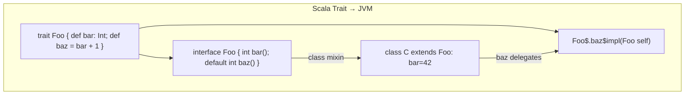

구체적인 메소드가 있는 특성은 `default` 메소드(JVM 8+)를 사용하여 Java 인터페이스로 컴파일됩니다. 복잡한 다이아몬드 상속의 경우 **정적 전달자**가 생성됩니다.

---

## 5. Kotlin: CPS 변환으로서의 코루틴

### 연속-패스 스타일 변환

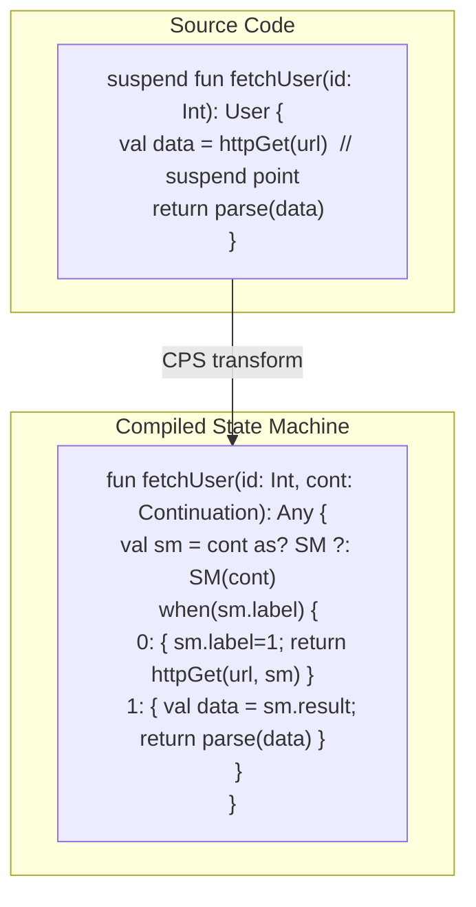

각 `suspend` 호출 사이트는 **상태 기계 레이블**이 됩니다. `Continuation` 개체는 정지 기간 동안 지역 변수를 보유합니다. 재개 시 실행은 올바른 `when` 분기로 이동합니다.

### 코루틴 연속 객체 메모리 레이아웃

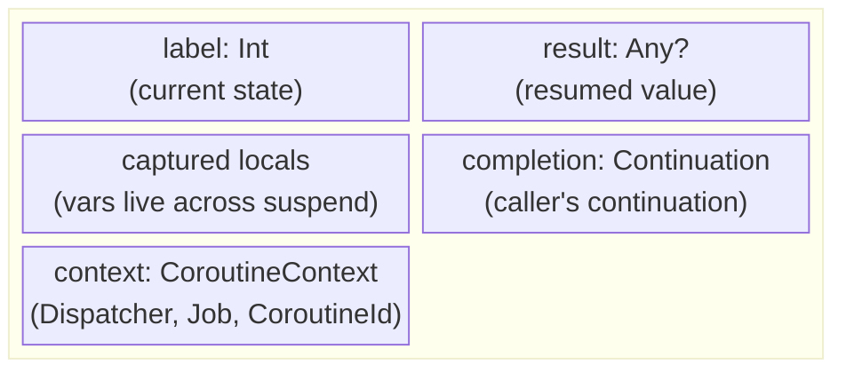

힙 할당 연속 객체는 각 정지에서 스택 프레임을 대체합니다. 이것은 **스택리스 코루틴**입니다. 코루틴당 전용 OS 스택이 없습니다(확장 가능한 스택이 있는 Go 고루틴과 다름).

### 디스패처 및 스레드 매핑

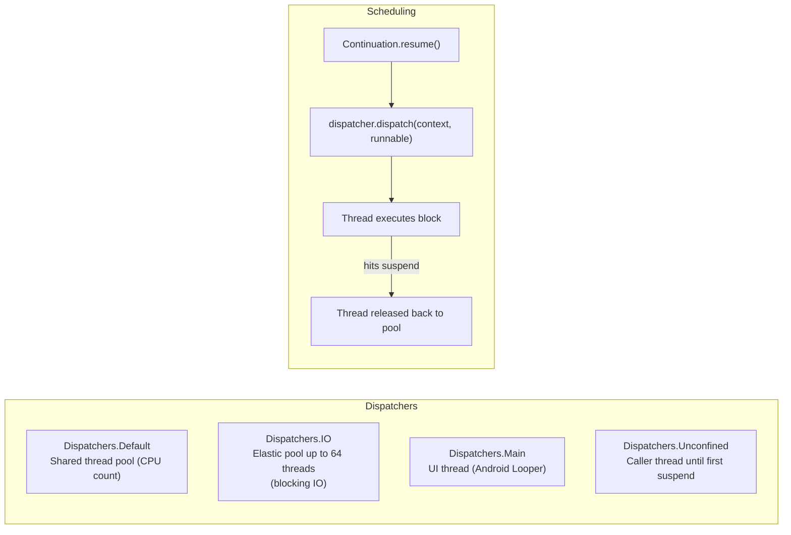

`withContext(Dispatchers.IO)`은 현재 코루틴을 일시 중단하고, IO 스레드 풀로 디스패치하고, 완료 시 원래 디스패처를 다시 시작합니다. 호출자에서 **스레드 차단 없음**.

### 구조화된 동시성 및 작업 트리

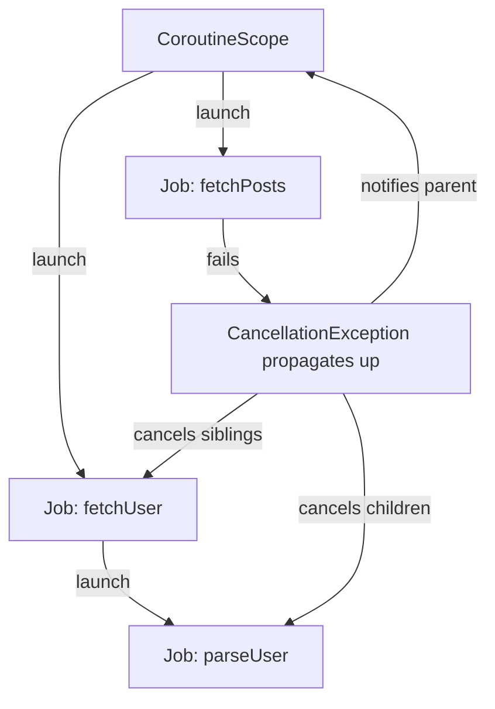

취소는 **협조적**입니다. 코루틴은 `isActive`을 확인하거나 취소를 인식하는 정지 함수를 호출해야 합니다. 상위 작업이 실패하면 모든 하위 항목이 취소됩니다(구조화된 동시성).

---

## 6. JVM 내부: HotSpot JIT 컴파일

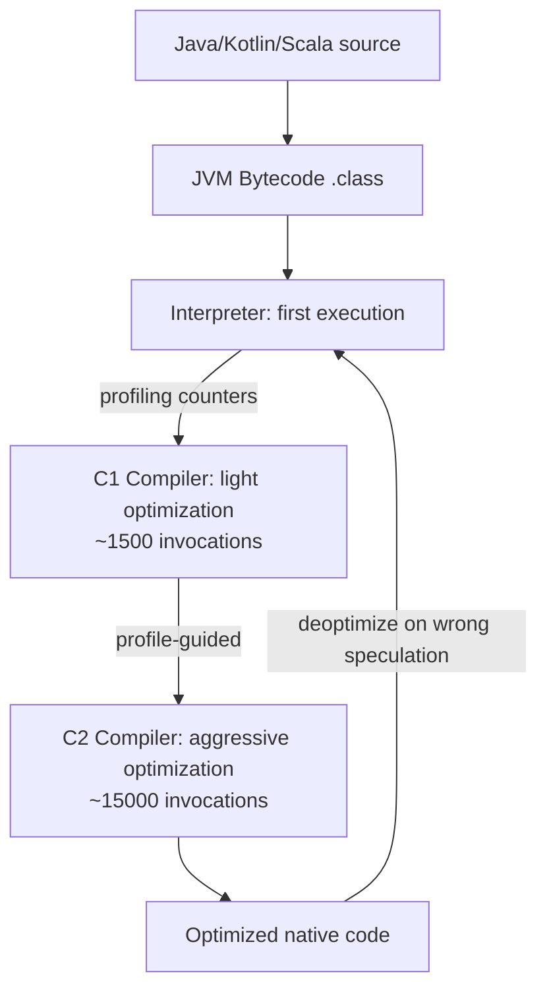

C2의 **추측적 최적화**:
- **인라이닝**: 프로필에 구현이 하나만 표시되는 경우 가상 호출이 탈가상화됨
- **이스케이프 분석**: 개체가 이스케이프 방법을 사용하지 않으면 스택에 유지됩니다.
- **루프 풀기 + 벡터화**: 배열 작업을 위한 SIMD 내장 함수
- **Null 검사 제거**: 프로필이 Null이 아님을 확인한 후 중복된 Null 검사를 제거합니다.

### JVM 메모리 레이아웃

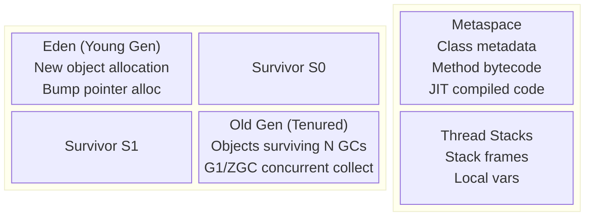

---

## 7. Go vs Rust vs JVM: 런타임 비교

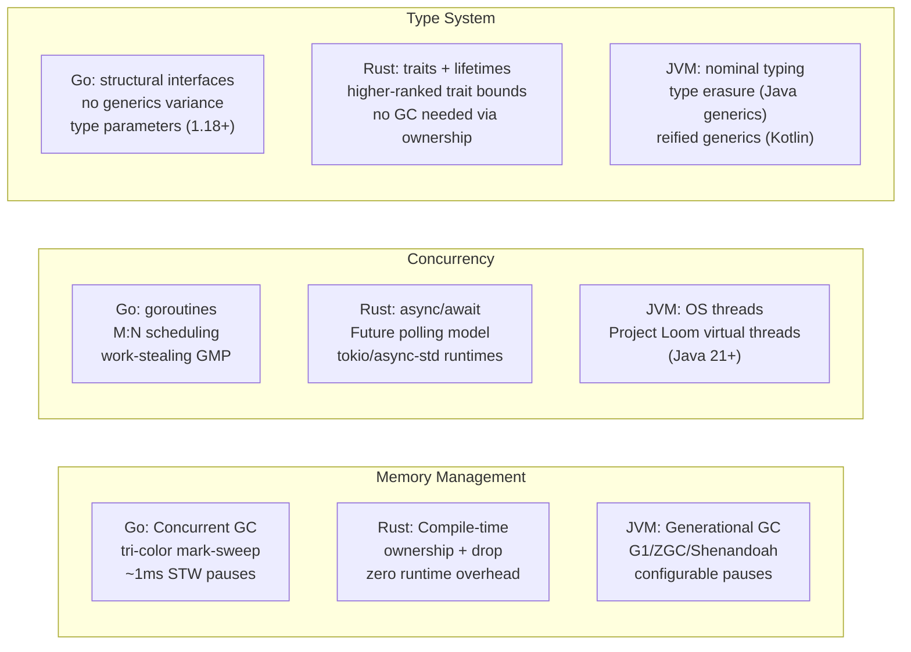

### 비동기/대기 및 고루틴: 핵심 차이점

```mermaid
sequenceDiagram
    participant RustFuture as Rust Future (Stackless)
    participant GoRoutine as Go Goroutine (Stackful)

    Note over RustFuture: poll() returns Poll::Pending
    RustFuture->>RustFuture: stores state in Future struct (heap)
    RustFuture->>RustFuture: registers Waker with reactor
    Note over RustFuture: Thread returns to event loop

    Note over GoRoutine: goroutine blocks on channel/syscall
    GoRoutine->>GoRoutine: goroutine stack preserved (2KB–nMB)
    GoRoutine->>GoRoutine: P handed to another goroutine
    Note over GoRoutine: OS thread may park or handle another G
```

Rust 선물은 **폴링 기반, 제로 스택**입니다. 명시적으로 박스화하지 않는 한 정지 당 할당이 없습니다. Go 고루틴은 **스택에서 연속**됩니다. 작성이 더 간단하고(동기화되어 보임), 고루틴 기준이 더 높습니다.

---

## 8. 기능적 언어 런타임: Haskell GHC 및 OCaml

### GHC: 지연 평가 및 썽크 메커니즘

```mermaid
flowchart TD
    subgraph "Thunk Lifecycle"
        T_created["Thunk created: closure ptr + env"] -->|first force| T_eval["Evaluate: enter closure"]
        T_eval -->|result| T_value["Update thunk to Value (WHNF)"]
        T_value -->|subsequent force| T_value
    end
    subgraph "Heap Object Layout"
        HO["Info Table Ptr | Payload..."]
        IT["Info Table: entry code | GC info | arity | srt"]
        HO --> IT
    end
```

**WHNF(약한 헤드 정규 형식)**: 가장 바깥쪽 생성자에서 평가가 중지됩니다. — `_`이 썽크인 경우에도 `Just _`은 WHNF입니다. 전체 NF 평가에는 `deepseq`이 필요합니다.

### GHC 런타임 시스템(RTS) 스케줄러

```mermaid
flowchart LR
    HEC1["HEC 1 (OS Thread)\nHaskell Execution Context"] --> RunQ1[Spark Queue]
    HEC2["HEC 2 (OS Thread)"] --> RunQ2[Spark Queue]
    RunQ1 -->|work steal| RunQ2
    HEC1 -->|STM transaction| TLog[Transaction Log]
    TLog -->|commit: validate| STMHeap[STM Heap vars]
    TLog -->|conflict: retry| TLog
```

GHC의 `par`/`seq` 스파크 풀은 추측적 병렬 처리를 가능하게 합니다. **STM(소프트웨어 트랜잭션 메모리)** 런타임은 낙관적 동시성을 사용합니다. 즉, 각 트랜잭션은 읽기/쓰기를 기록하고, 커밋 시 원자적으로 유효성을 검사하고, 충돌 시 재시도합니다.

---

## 9. 언어 기능: 패턴 매칭 컴파일

모든 ML 계열 언어는 O(1) 디스패치를 위한 **의사결정 트리**에 일치하는 패턴을 컴파일합니다.

```mermaid
flowchart TD
    Match["match expr with\n| (0, _) -> A\n| (_, 0) -> B\n| (x, y) -> C"] -->|compile| DT["Decision Tree"]
    DT --> T1["test expr.0 == 0?"]
    T1 -->|yes| A["return A"]
    T1 -->|no| T2["test expr.1 == 0?"]
    T2 -->|yes| B["return B"]
    T2 -->|no| C["return C(x, y)"]
```

컴파일러는 생성자 밀도에 따라 **스위치 디스패치**(정수 태그)와 **if-chain** 중에서 선택합니다. 열거형의 Rust `match`은 판별 태그로 색인이 지정된 점프 테이블로 컴파일됩니다.

### 대수적 데이터 유형 메모리 레이아웃(Rust/Haskell)

```mermaid
block-beta
    columns 2
    block:rust_enum:1
        columns 1
        r_label["Rust: enum Option<T>"]
        r_none["None: discriminant=0, no payload"]
        r_some["Some(T): discriminant=1, T inline"]
        r_opt["niche optimization: &T None=0x0"]
    end
    block:haskell_adt:1
        columns 1
        h_label["Haskell: data Maybe a"]
        h_nothing["Nothing: info_ptr → Nothing_info, tag=0"]
        h_just["Just a: info_ptr → Just_info, a=thunk_ptr"]
    end
```

Rust는 **틈새 최적화**를 적용합니다. `Option<&T>`은 널 포인터를 `None`로 사용합니다 — `&T`와 동일한 크기, 판별이 필요하지 않습니다.

---

## 10. 유형 추론: 알고리즘 W/HM 통합

```mermaid
sequenceDiagram
    participant TC as Type Checker
    participant Env as Type Environment
    participant Uni as Unifier

    TC->>TC: generate fresh type var α for unknown
    TC->>Env: lookup variable → τ
    TC->>TC: instantiate polymorphic type (fresh vars)
    TC->>Uni: add constraint: τ1 = τ2
    Uni->>Uni: unify: walk structure recursively
    Uni->>Uni: occurs check: α ≠ F(α) (prevents infinite types)
    Uni-->>TC: substitution σ
    TC->>TC: generalize: ∀α. τ (if α free in τ, not in env)
    TC-->>TC: principal type derived
```

**통합**은 `unify(List α, List Int)` → `α := Int`의 핵심 작업입니다. 통합 실패 = 유형 오류입니다. 발생 확인으로 `α = List α`(무한 유형)이 방지됩니다.

### 랭크 2 다형성(Rust/Haskell HRTB)

```mermaid
flowchart TD
    R1["Rank-1: ∀a. a → a\nType var instantiated at call site by caller"]
    R2["Rank-2: (∀a. a → a) → Int\nCallee receives a polymorphic function\nMust work for ANY a, not a specific one"]
    R1 -->|subsumes| R2
    R2 -->|Rust syntax| HRTB["for<'a> Fn(&'a T) -> &'a U\nHigher-Ranked Trait Bound"]
```

Rust는 클로저가 특정 추론 수명뿐만 아니라 **모든 수명** 동안 작동해야 함을 표현하기 위해 HRTB를 사용합니다.

---

## 11. 교차 언어: 상호 운용성과 FFI 역학

```mermaid
sequenceDiagram
    participant Rust
    participant CRuntime as C ABI (cdecl/SysV)
    participant Python as Python (CPython)

    Rust->>CRuntime: #[no_mangle] extern "C" fn foo()
    CRuntime->>Python: ctypes.CDLL → dlopen + dlsym
    Python->>Python: convert Python int → c_int (boxing)
    Python->>CRuntime: call via function pointer
    CRuntime->>Rust: stack frame in C calling convention
    Rust-->>CRuntime: return value
    CRuntime-->>Python: unbox to Python int
```

**PyO3 (Rust‐Python)**: Python API 호출 시 GIL을 보유해야 합니다. `pyo3::Python<'py>` 토큰은 GIL이 유지되는 컴파일 타임 증거입니다. 안전한 Rust는 유형 수준에서 GIL 버그를 방지합니다.

**JNI(Java←C/Rust)**: JNIEnv 포인터가 네이티브에 전달되었습니다. 모든 Java 객체 참조는 직접 힙 포인터가 아닌 핸들(JNI 로컬/글로벌 참조)입니다. GC는 객체를 이동할 수 있습니다. JNI 심판이 이를 고정합니다.

---

## 요약: 언어 런타임 내부 맵

```mermaid
mindmap
  root((Language Runtimes))
    Go
      GMP scheduler M:N
      Work-stealing local runq
      Growable goroutine stacks
      Tri-color concurrent GC
      hchan direct send optimization
    Rust
      Ownership = compile-time GC
      MIR borrow checker CFG
      Monomorphization zero-cost
      LLVM backend optimization
      Async stackless Future polling
    Kotlin/JVM
      CPS transform suspend fns
      Continuation state machine
      Structured concurrency Job tree
      HotSpot C1/C2 JIT tiers
      G1/ZGC generational GC
    Scala/JVM
      Variance +A/-A type system
      Implicit resolution scope chain
      Trait → default method bytecode
      Higher-kinded type parameters
    Haskell/GHC
      Lazy thunk force + update
      WHNF evaluation strategy
      STM optimistic concurrency
      Spark pool parallel HEC
```
