# Python 내부: 내부 내용

> 다음에서 합성됨: Beazley *Python Essential Reference*, Ramalho *Fluent Python* 2nd ed, Martelli *Python in a Nutshell*, CPython 소스 내부 및 comp(19/20/32/44/46-47/55/61/64-65/75/77/192/202) Python 참조.

---

## 1. CPython 개체 모델 - 모든 것이 PyObject입니다.

정수부터 함수, 클래스까지 모든 Python 값은 힙에 할당된 `PyObject`입니다. 이것이 Python 런타임의 기초입니다.

### PyObject 구조

```c
// Base type — every Python object starts with this
typedef struct _object {
    Py_ssize_t ob_refcnt;      // reference count (for garbage collection)
    PyTypeObject *ob_type;     // pointer to type object (= type(obj))
} PyObject;

// Variable-length objects (lists, tuples, bytes) extend with:
typedef struct {
    PyObject ob_base;
    Py_ssize_t ob_size;        // number of items
} PyVarObject;

// Integer example:
typedef struct {
    PyObject ob_base;
    Py_ssize_t ob_digit_count; // number of 30-bit digits
    digit ob_digit[1];         // digits array (arbitrary precision!)
} PyLongObject;
```

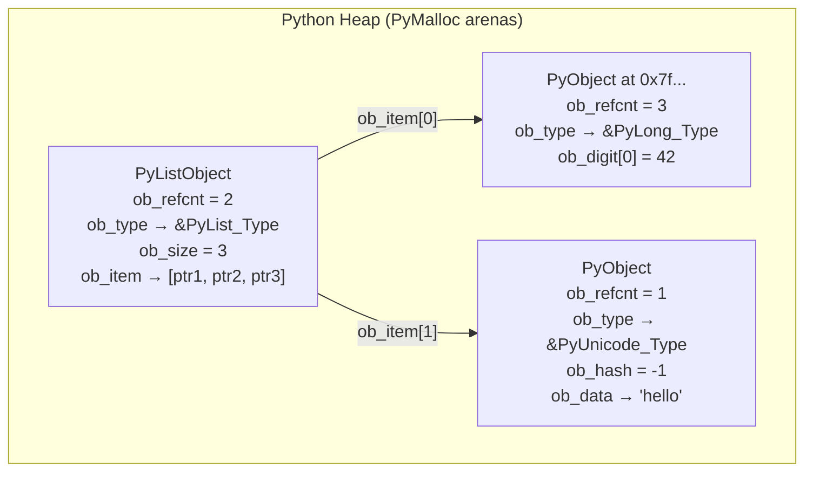

### 작은 정수 캐시

CPython은 **-5에서 256** 값에 대한 정수 객체를 미리 할당합니다. `x = 5`에 대한 모든 참조는 **동일한** PyLongObject를 가리킵니다.

```python
a = 256
b = 256
a is b   # True — same object
a = 257
b = 257
a is b   # False — separate objects (outside cache range)
```

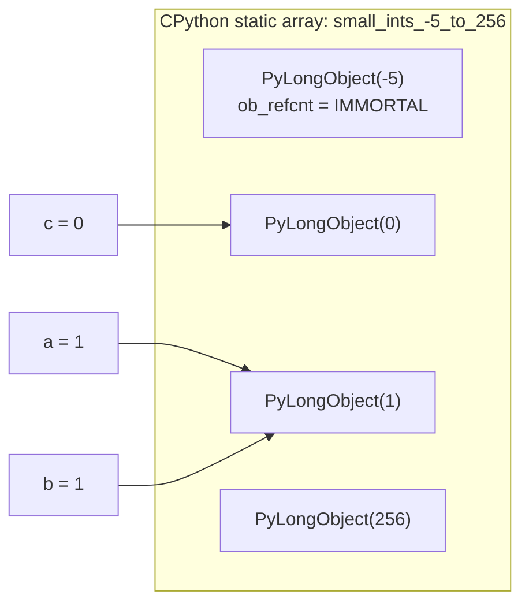

문자열 인터닝: 짧은 식별자와 유사한 문자열(영숫자, 일반적으로 20자 이하)은 전역 dict `interned`에 인터닝됩니다. `'hello' is 'hello'` → 사실입니다. 임의 문자열: 보장되지 않습니다.

---

## 2. 참조 카운팅과 가비지 컬렉션

### Py_INCREF / Py_DECREF — 원자적 연산

```c
#define Py_INCREF(op) ((op)->ob_refcnt++)
#define Py_DECREF(op)                        \
    do {                                      \
        if (--((op)->ob_refcnt) == 0)         \
            _Py_Dealloc(op);                  \
    } while(0)
```

참조 증분을 생성하는 모든 Python 작업은 다음과 같습니다. 감소를 해제하는 모든 작업. `ob_refcnt == 0` → `_Py_Dealloc()`이 호출되면 → 객체의 `tp_dealloc` 슬롯이 호출되고 → 메모리가 `PyMalloc`으로 반환됩니다.

### 순환 가비지 수집기

참조 계산에서는 주기를 수집할 수 없습니다.

```python
a = []
b = [a]
a.append(b)   # a.ob_refcnt = 2, b.ob_refcnt = 2
del a, del b  # both drop to 1 — NOT 0 — leak!
```

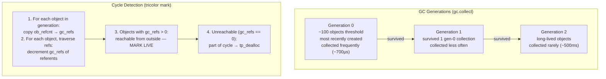

**GIL 상호작용**: 순환 GC는 GIL이 유지된 상태에서 실행됩니다(월드 스톱). CPython의 대규모 2세대 컬렉션은 10~50ms 동안 일시 중지될 수 있으며 지연 시간에 민감한 앱에서 볼 수 있습니다. 완화 방법: `gc.disable()` + 수동 `gc.collect()` 예약 또는 참조 순환 방지.

---

## 3. CPython 바이트코드와 평가 루프

### 컴파일 파이프라인

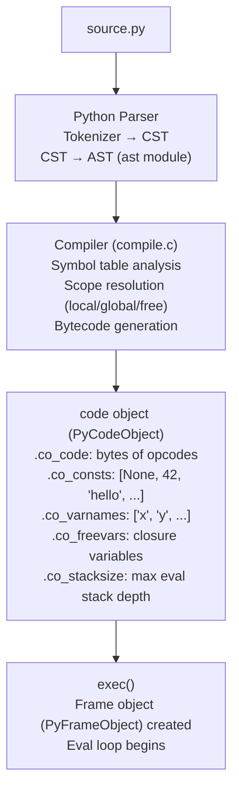

### PyCodeObject 및 PyFrameObject

```c
typedef struct {
    PyObject_HEAD
    int co_argcount;        // number of positional args
    int co_nlocals;         // number of local variables
    int co_stacksize;       // max eval stack depth needed
    PyObject *co_code;      // bytes: [opcode, arg, opcode, arg, ...]
    PyObject *co_consts;    // tuple: constants referenced by LOAD_CONST
    PyObject *co_varnames;  // tuple: local variable names
    PyObject *co_freevars;  // tuple: names from enclosing scope (closures)
    PyObject *co_filename;
    int co_firstlineno;
    PyObject *co_lnotab;    // line number table: offset → lineno mapping
} PyCodeObject;

typedef struct _frame {
    PyObject_VAR_HEAD
    struct _frame *f_back;      // caller frame (linked list)
    PyCodeObject *f_code;       // code object being executed
    PyObject **f_locals;        // local variable array
    PyObject **f_valuestack;    // base of eval stack
    PyObject **f_stacktop;      // top of eval stack (current)
    int f_lasti;                // index of last attempted instruction
    int f_lineno;               // current line number
} PyFrameObject;
```

### 바이트코드 — 디스어셈블리 예시

```python
def add(a, b):
    return a + b

import dis
dis.dis(add)
```

```
  2           0 LOAD_FAST                0 (a)    ← push locals[0] onto eval stack
              2 LOAD_FAST                1 (b)    ← push locals[1]
              4 BINARY_ADD                        ← pop 2, push result
              6 RETURN_VALUE                      ← pop and return
```

### CPython 평가 루프(ceval.c) — 단순화됨

```c
for (;;) {
    opcode = *next_instr++;
    oparg  = *next_instr++;
    
    switch(opcode) {
    case LOAD_FAST:
        PyObject *val = fastlocals[oparg];
        Py_INCREF(val);
        PUSH(val);
        break;
    case BINARY_ADD:
        PyObject *right = POP();
        PyObject *left  = TOP();
        PyObject *res   = PyNumber_Add(left, right);  // dispatch through nb_add slot
        Py_DECREF(right); Py_DECREF(left);
        SET_TOP(res);
        break;
    case RETURN_VALUE:
        return POP();
    // ... ~150 more opcodes
    }
    
    // Check for GIL release every sys.getswitchinterval() (5ms default)
    if (--eval_breaker) { check_signals(); maybe_release_GIL(); }
}
```

---

## 4. GIL — 전역 통역사 잠금

### GIL이 보호하는 것

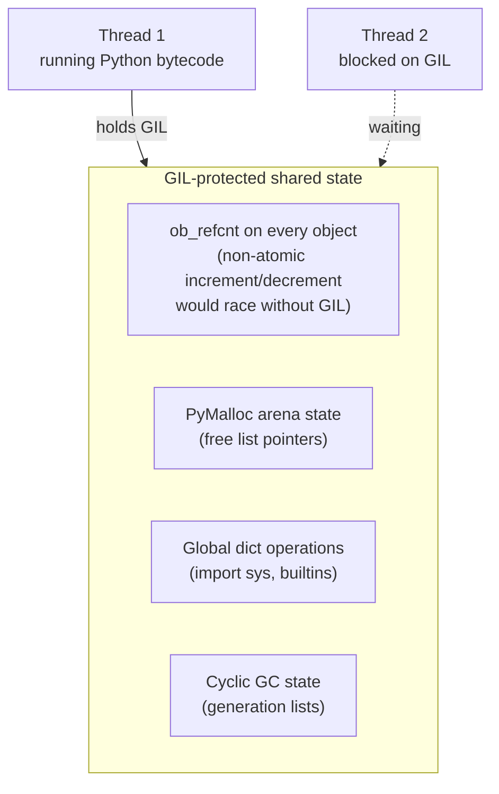

### GIL 릴리스 메커니즘

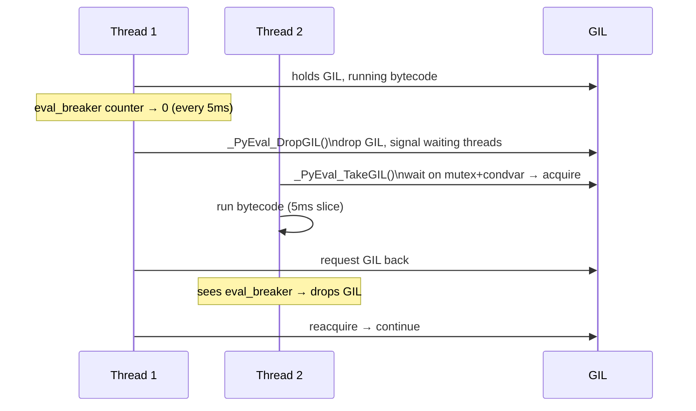

**GIL 프리 작업**: I/O(읽기/쓰기/소켓), numpy C 확장, ctypes 호출 — 모두 C 코드에서 GIL을 릴리스합니다. CPU 바인딩된 C 확장(hashlib, zlib 등)도 GIL을 릴리스합니다. 순수 Python 바이트코드 실행만이 GIL을 지속적으로 보유합니다.

**진정한 병렬성**: `multiprocessing` 모듈 — 별도의 프로세스, 별도의 GIL, 파이프/공유 메모리를 통해 통신합니다. PEP 703(CPython 3.13 실험적): 객체별 세분화된 잠금 및 편향된 참조 카운팅을 사용하는 GIL 없는 빌드입니다.

---

## 5. Python 메모리 관리자 — PyMalloc

### 3단계 할당자

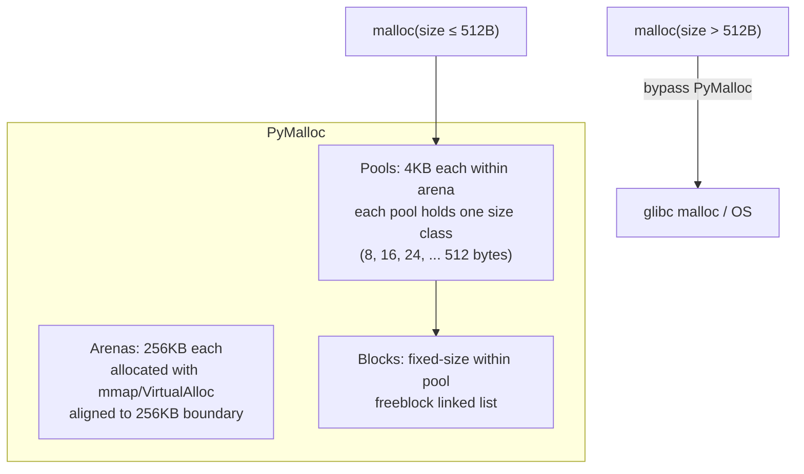

```
Arena (256KB):
+--[pool 0: 4KB]--+--[pool 1: 4KB]--+-- ... --+--[pool 63: 4KB]--+

Pool for 32-byte size class:
+--[header: 8B]--+--[block0: 32B]--+--[block1: 32B]-- ... --+--[block126: 32B]--+
                   ↑ freeblock linked list chains free blocks
```

**usedpools[64]**: 크기 클래스당 하나씩 풀 포인터 배열입니다. `malloc(size)` → 8바이트 경계로 반올림 → `size_class = (size-1) / 8` → `pool = usedpools[size_class]` → 풀의 여유 목록에서 블록을 팝합니다.

---

## 6. 디스크립터와 속성 조회 프로토콜

### 속성 조회 알고리즘(`__getattribute__`)

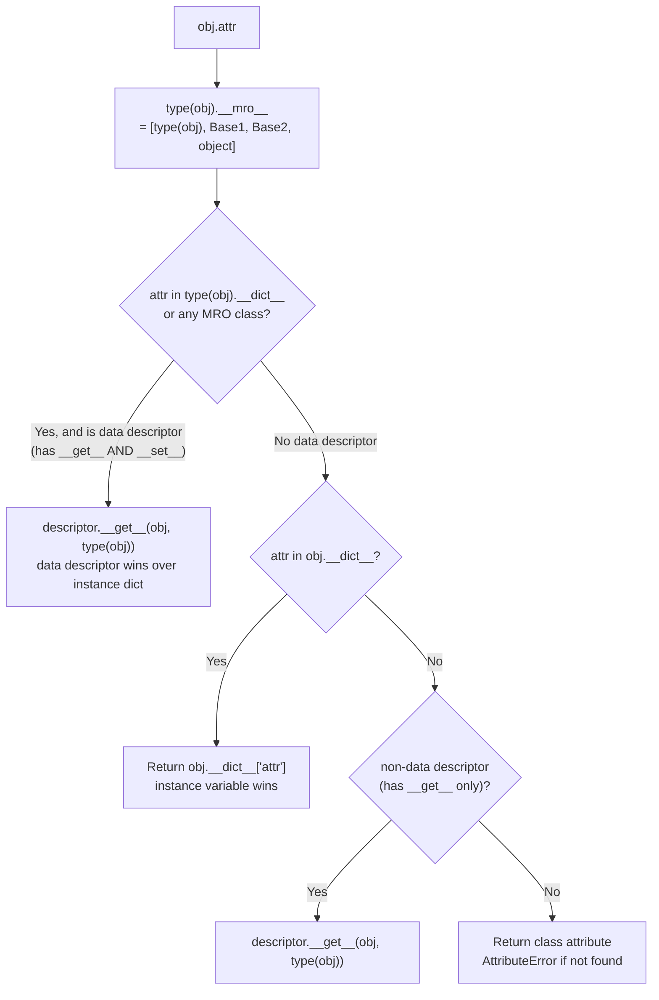

**속성**은 데이터 설명자입니다.
```python
class Property:
    def __init__(self, fget): self.fget = fget
    def __get__(self, obj, cls):
        if obj is None: return self          # class access → return descriptor itself
        return self.fget(obj)                # instance access → call getter
    def __set__(self, obj, val): raise AttributeError  # data descriptor (blocks instance __dict__)
```

**함수 → 바인딩된 메서드**: `function.__get__(instance, cls)`은 `(self, func)`을 래핑하는 `PyMethodObject`을 반환합니다. 모든 `obj.method` 호출은 동적으로 메소드 객체를 생성합니다(`functools.cached_property`에 의해 캐시되지 않는 한).

---

## 7. 생성기와 코루틴 내부

### 발전기 프레임 서스펜션

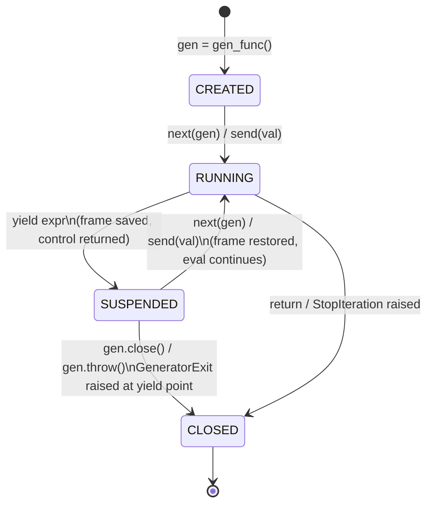

`yield`이 실행될 때:
1. 프레임에 저장된 현재 `f_stacktop`
2. `f_lasti`이(가) 현재 명령어 인덱스로 업데이트되었습니다.
3. 프레임의 `f_executing` 플래그가 지워졌습니다.
4. 프레임이 해제되지 **않음** - 생성기 객체에 의해 활성 상태로 유지됨
5. `next()` 호출자에게 반환된 산출 값

`next()`이 재개되면:
1. 동일한 `PyFrameObject`이(가) `_PyEval_EvalFrameDefault()`에 다시 전달되었습니다.
2. `f_lasti`은(는) 저장된 명령에서 재개됩니다.
3. `f_valuestack`에서 복원된 평가 스택

### async/await — 이벤트 루프 통합

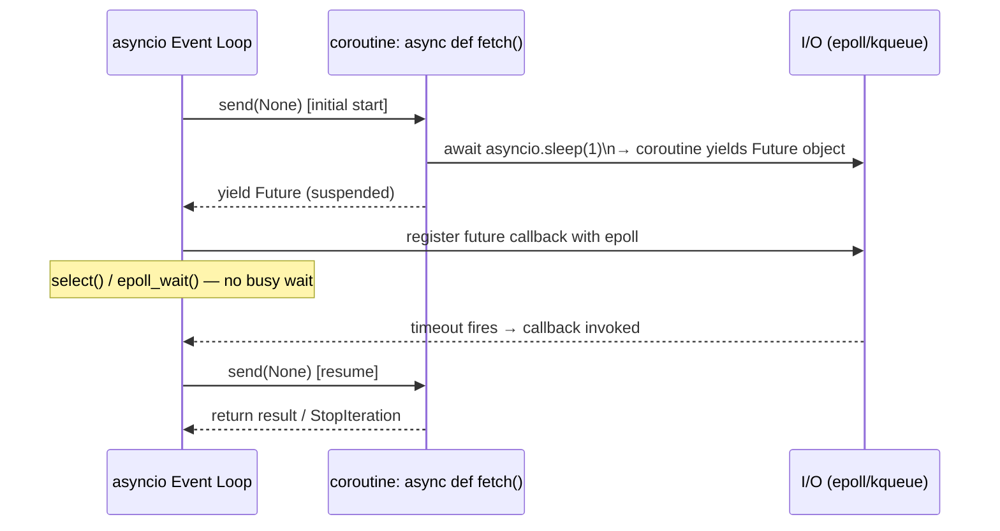

`await expr`은 `GET_AWAITABLE` + `YIELD_FROM` 바이트코드로 컴파일됩니다. 코루틴 객체는 그 자체로 완료될 때까지 `__next__`이 내부 대기 가능 항목을 구동하는 반복자입니다.

---

## 8. Python의 데이터 모델 — 특수 메서드 및 슬롯

### 유형 개체 슬롯

```c
typedef struct _typeobject {
    PyObject_VAR_HEAD
    const char *tp_name;           // "int", "str", "list", ...
    Py_ssize_t tp_basicsize;       // sizeof(PyXxxObject)
    
    // Number protocol
    PyNumberMethods *tp_as_number; // nb_add, nb_sub, nb_mul, nb_truediv, ...
    
    // Sequence protocol  
    PySequenceMethods *tp_as_sequence; // sq_length, sq_item, sq_contains, ...
    
    // Mapping protocol
    PyMappingMethods *tp_as_mapping;   // mp_length, mp_subscript, ...
    
    // Core slots
    hashfunc tp_hash;       // __hash__
    reprfunc tp_repr;       // __repr__
    ternaryfunc tp_call;    // __call__
    destructor tp_dealloc;  // called when ob_refcnt → 0
    
    // Attribute access
    getattrofunc tp_getattro;  // __getattr__/__getattribute__
    setattrofunc tp_setattro;  // __setattr__/__delattr__
    
    PyObject *tp_dict;      // class __dict__
    PyObject *tp_bases;     // tuple of base classes
    PyObject *tp_mro;       // tuple: Method Resolution Order
} PyTypeObject;
```

`a + b` → `PyNumber_Add(a, b)` → `type(a)->tp_as_number->nb_add` 확인 → 구현되지 않은 경우 `type(b)->tp_as_number->nb_add`을 확인하세요. 내장 유형에 대해 우회된 특수 메소드(직접 슬롯 호출, dict 조회보다 빠릅니다).

---

## 9. 사전 내부 — 컴팩트 해시 테이블

### CPython dict(Python 3.6+ 컴팩트 레이아웃)

```
indices array (sparse):
[0]: slot=2   [1]: empty   [2]: slot=0   [3]: slot=1   ...
  ↑ 1 byte per entry (small dicts), 2 or 4 for larger

entries array (dense):
slot 0: {hash=0x..., key="name",   value="Alice"}
slot 1: {hash=0x..., key="age",    value=30}
slot 2: {hash=0x..., key="region", value="US"}
```

`d["age"]` 조회:
1. `h = hash("age")` → 예: `0x7f3a...`
2. `i = h % len(indices)` → 인덱스 배열의 인덱스
3. `slot = indices[i]` → 1(충돌 시 또는 충돌 시 LINEAR_PROBE)
4. `entries[1].hash == h` 및 `entries[1].key == "age"` → `entries[1].value` 반환

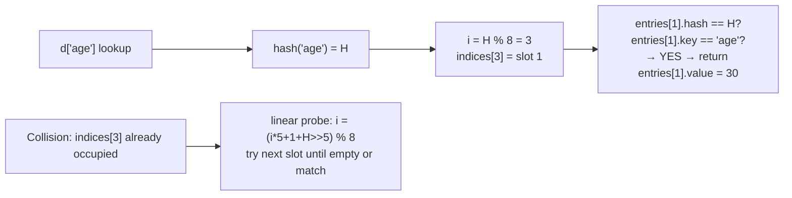

**딕셔너리 크기 조정**: `size / capacity > 2/3`일 때 `capacity * 2`로 크기를 조정합니다. 전체 인덱스 배열이 재구축되었습니다. 모든 항목이 다시 해시되었습니다. Dict는 삽입 순서를 유지하는 조밀한 항목 배열을 통해 삽입 순서(Python 3.7부터 보장됨)를 유지합니다.

---

## 10. 시스템 내부 가져오기

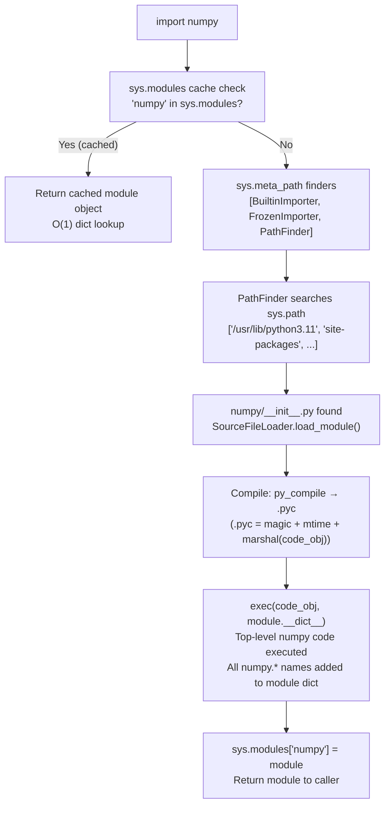

**.pyc 캐시**: `__pycache__/numpy.cpython-311.pyc`. 매직넘버 = 통역사 버전. 소스 mtime이 변경되지 않고 매직이 일치하는 경우 → 바이트코드를 직접 로드하고 재컴파일을 건너뜁니다. `marshal.loads()`은 .pyc 바이트에서 코드 객체를 역직렬화합니다.

---

## 11. Python 성능 내부

### 바이트코드 수준에서 프로파일링

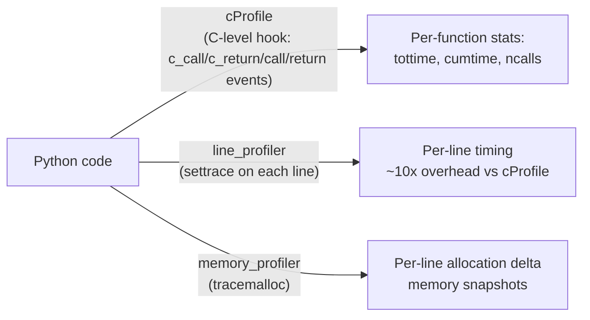

### 일반적인 성능 패턴

| 패턴 | 왜 느린가요 | 수정 |
|---------|----------|-----|
| 루프 내 `str += str` | O(n²) — 각 연결마다 새 할당 | `''.join(list)` |
| `[x for x in gen] * N` | 열심히 실현 | 게으른 반복 |
| `.get()` 없이 루프에 `dict[key]` | KeyError 예외 경로 | `dict.get(key, default)` |
| 전역 변수 액세스 | `LOAD_GLOBAL` → 사전 조회 | 로컬에 바인딩: `g = global_var` |
| `append` 대 `extend` | 반복되는 단일 항목 삽입 | `extend`를 사용한 일괄 처리 |
| 순수 Python 루프 | ~100바이트코드/μs | numpy 벡터화 |

### NumPy — CPython 속도 저하를 우회하는 방법

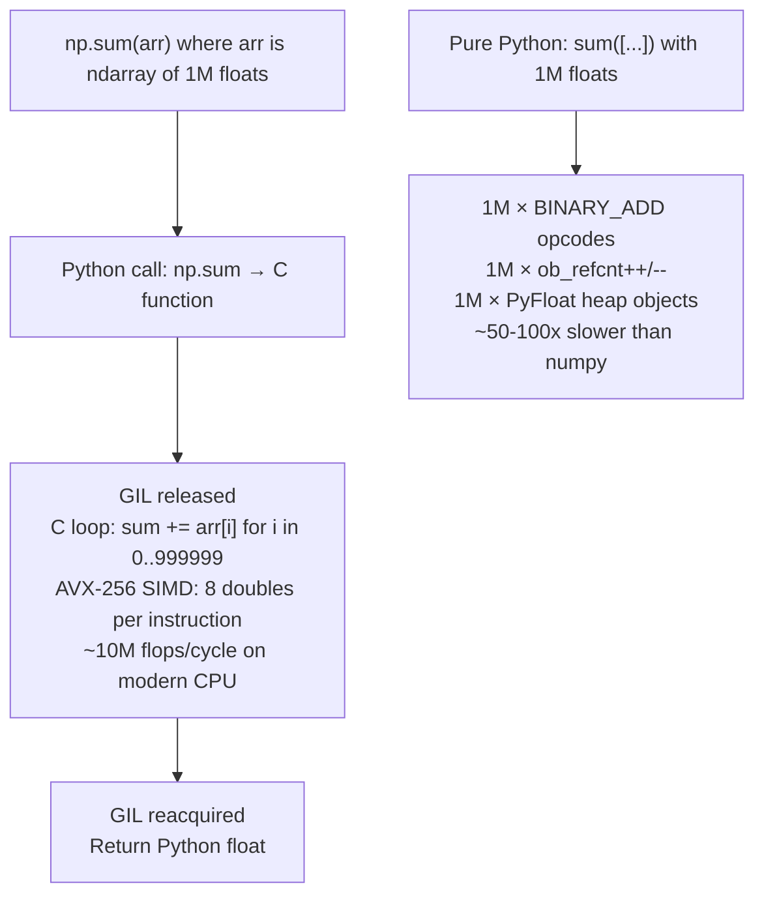

---

## Python 런타임 번호 참조

| 운영 | 시간 | 메모 |
|-----------|------|-------|
| Python 바이트코드 실행 | ~100ns/opcode | 평가 루프 반복당 |
| 함수 호출 오버헤드 | ~100-200ns | 프레임 생성 + 로컬 설정 |
| 속성 조회(dict) | ~50-100ns | LOAD_ATTR + tp_getattro |
| 메소드 호출(바운드 메소드) | ~200-300ns | __get__ + 호출 오버헤드 |
| 목록 추가 | ~50ns | 상각(용량 두 배 증가) |
| 사전 조회 | ~50-100ns | 해시 + 인덱스 + 비교 |
| GC 주기 수집(gen-0) | ~100μs | ~100개 개체 |
| GC 주기 수집(gen-2) | ~10-100ms | 수천 개의 개체 |
| 캐시된 모듈 가져오기 | ~100ns | sys.modules 사전 조회 |
| 콜드 가져오기(컴파일+실행) | 10~500ms | 최상위 코드 컴파일 + 실행 |
| 스레드 GIL 스위치 간격 | 5ms | sys.getswitchinterval() |
