# 보안 내부 요소: 암호화, 인증 및 공격 메커니즘

> 내부 정보: TLS 핸드셰이크가 키를 협상하는 방법, 해시 기능이 급증하는 방법, 버퍼 오버플로가 손상된 제어 흐름을 수행하는 방법, OAuth 토큰이 ID를 증명하는 방법(정확한 메모리 레이아웃, 상태 시스템 및 보안 메커니즘 뒤에 있는 수학적 연산).

---

## 1. 대칭 암호화: AES 내부 메커니즘

AES(Advanced Encryption Standard)는 10/12/14 라운드(128/192/256비트 키의 경우)를 통해 4×4바이트 **상태 매트릭스**에서 작동합니다.

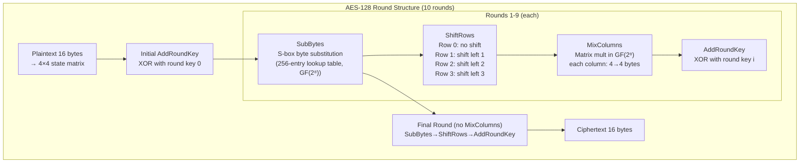

### 하위 바이트: S-Box를 GF(2⁸) 곱셈 역원으로

S-box는 임의적이지 않습니다. 각 바이트 `b`은 `b⁻¹ mod (x⁸+x⁴+x³+x+1)`(GF(2⁸)의 곱셈 역수)에 매핑된 다음 아핀 변환이 적용됩니다. 이는 다음을 제공합니다:
- **비선형성**: 모든 선형 대수 공격을 중단합니다.
- **눈사태**: 입력의 1비트 변경은 여러 라운드 후 출력 비트의 ~50%를 변경합니다.

### AES-GCM: 인증된 암호화

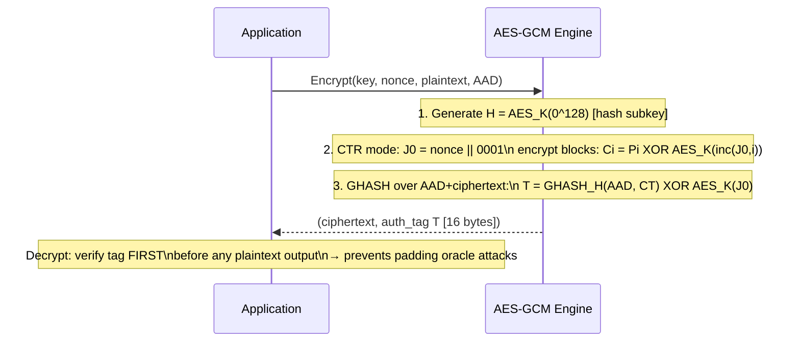

---

## 2. 공개 키 암호화: RSA 및 ECDH 내부

### RSA 키 생성 및 운영

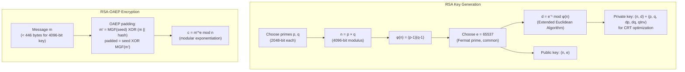

### ECDH 키 교환(Curve25519)

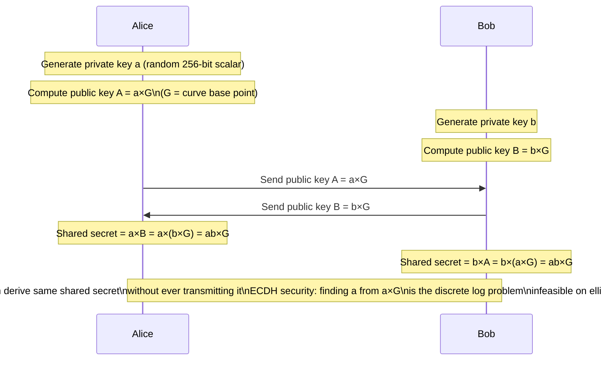

**NIST 곡선에 대한 Curve25519 이유**: Curve25519(GF(2²⁵⁵-19)에 대한 `y² = x³ + 486662x² + x`)에는 알려진 NIST 백도어가 없고 트위스트 보안이 적용되며 몽고메리 래더 구현은 일정 시간(타이밍 측면 채널 없음)입니다.

---

## 3. TLS 1.3 핸드셰이크: 모든 바이트 설명

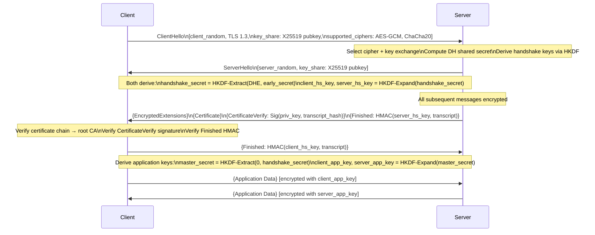

### HKDF 키 파생

TLS 1.3은 HKDF(HMAC 기반 추출 및 확장 KDF)를 사용합니다.
```
HKDF-Extract(salt, IKM) = HMAC-SHA256(salt, IKM) → PRK (pseudorandom key)
HKDF-Expand(PRK, info, L) = T(1) || T(2) || ... where T(i) = HMAC-SHA256(PRK, T(i-1)||info||i)
```

**순방향 비밀성**: TLS 1.3에서는 임시 키 교환(X25519/P-256)을 요구합니다. 세션 키는 연결당 새로운 DH 교환에서 파생됩니다. 즉, 나중에 서버의 장기 개인 키가 손상되더라도 과거 트래픽을 해독할 수 없습니다.

---

## 4. 해시 함수: SHA-256 내부

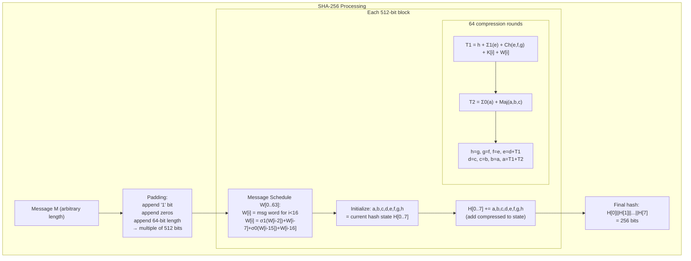

**Σ 및 σ 함수는 비트 회전 + XOR을 사용합니다**:
- `Σ0(a) = ROTR²(a) XOR ROTR¹³(a) XOR ROTR²²(a)`
- `Ch(e,f,g) = (e AND f) XOR (NOT_e AND g)` — "선택" 기능
- `Maj(a,b,c) = (a AND b) XOR (a AND c) XOR (b AND c)` — "다수" 함수

이러한 비트 연산은 **눈사태 효과**를 생성합니다. 즉, 1개의 입력 비트를 뒤집으면 출력 비트의 ~50%가 변경됩니다.

---

## 5. 비밀번호 해싱: 왜 bcrypt/Argon2와 SHA-256을 비교해야 할까요?

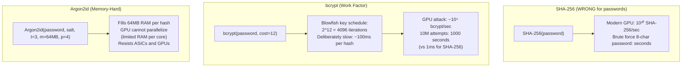

### Argon2 메모리 액세스 패턴

Argon2는 메모리 블록 매트릭스(각각 1KB)를 할당합니다. 각 블록 계산은 의사 무작위 이전 블록에 따라 달라집니다. 즉, 메모리의 전체 행렬 없이는 병렬화가 불가능합니다.

---

## 6. 버퍼 오버플로: 스택 스매싱 내부

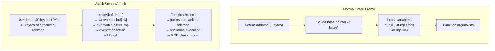

### 오버플로 중 스택 레이아웃

```
[High address]
  0x7fff1000: return address = 0x401234 (main+0x30)
  0x7ffe_fff8: saved RBP = 0x7fff2000
  0x7ffe_fff0: i = 0
  0x7ffe_ffe0: buf[0..15] = "AAAA..."
[Low address]
                         ↑
                    strcpy writes upward
After overflow:
  return address = 0x41414141 (AAAA — attacker controlled)
```

### 최신 완화 방법 및 우회 방법

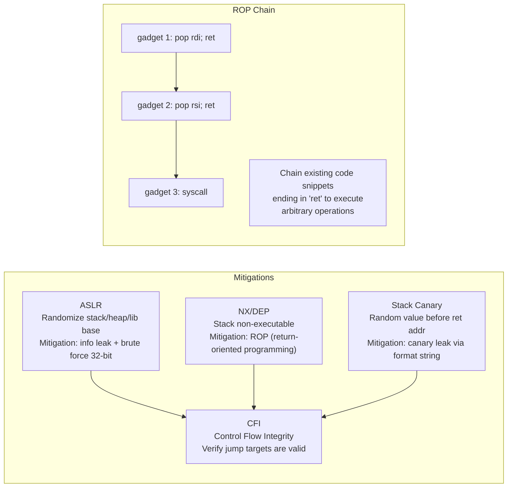

---

## 7. OAuth 2.0 / OIDC: 토큰 흐름 내부

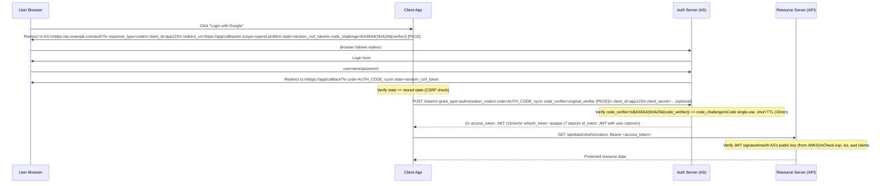

### JWT 구조 및 서명 확인

```
Header: {"alg":"RS256","typ":"JWT","kid":"key-id-123"}
        → base64url encoded

Payload: {"sub":"user123","iss":"https://auth.example.com",
          "aud":"app123","exp":1709999999,"iat":1709996399,
          "scope":"openid profile"}
         → base64url encoded

Signature: RS256_sign(private_key, header.payload)
          = RSA-PKCS1v15-SHA256(private_key, base64(header)+"."+base64(payload))
          → base64url encoded

Final: header.payload.signature (3 dots-separated parts)
```

---

## 8. SQL 주입: 구문 분석 트리 조작

```mermaid
flowchart TD
    subgraph "Vulnerable Code"
        CODE["query = 'SELECT * FROM users WHERE name=\'' + user_input + '\''"]
        LEGIT["user_input = 'alice'\n→ WHERE name='alice' ✓"]
        ATTACK["user_input = \"' OR '1'='1\"\n→ WHERE name='' OR '1'='1'\n→ returns ALL rows!"]
        CODE --> LEGIT
        CODE --> ATTACK
    end
    subgraph "Parameterized Query (Safe)"
        PARAM["query = 'SELECT * FROM users WHERE name=?'\nparams = [user_input]"]
        PARSE["DB parses SQL structure ONCE\nbefore substituting value"]
        SAFE["user_input = \"' OR '1'='1\"\n→ treated as literal string\n→ WHERE name = \"\\' OR \\'1\\'=\\'1\\'\"\n→ no rows returned ✓"]
        PARAM --> PARSE --> SAFE
    end
```

핵심: 파서 수준에서 매개변수화된 쿼리 **데이터와 별도의 코드**. SQL 엔진은 템플릿에서 구문 분석 트리를 구축한 다음 값을 데이터 리터럴로 대체합니다. 값은 트리 구조를 변경할 수 없습니다.

---

## 9. 인증서 체인 검증

```mermaid
flowchart TD
    subgraph "Certificate Chain"
        LEAF["Leaf Cert: *.example.com\nPublic Key: EC P-256\nIssuer: DigiCert TLS RSA\nSignature: RSA by DigiCert TLS RSA key"]
        INT["Intermediate CA: DigiCert TLS RSA\nPublic Key: RSA 2048\nIssuer: DigiCert Global Root CA\nSignature: RSA by Root CA key"]
        ROOT["Root CA: DigiCert Global Root CA\nPublic Key: RSA 2048\nIssuer: self-signed\nTrusted: pre-installed in OS/browser"]

        LEAF --> INT --> ROOT
    end
    subgraph "Verification Steps"
        V1["1. Verify leaf cert signature\n   using intermediate CA's public key"]
        V2["2. Verify intermediate cert signature\n   using root CA's public key"]
        V3["3. Verify root cert in trusted store\n   (OS certificate bundle)"]
        V4["4. Check hostname: CN/SAN matches\n   *.example.com → valid for www.example.com"]
        V5["5. Check validity period\n   notBefore < now < notAfter"]
        V6["6. Check revocation:\n   OCSP staple or CRL download"]
        V1 --> V2 --> V3 --> V4 --> V5 --> V6
    end
```

**인증서 투명성(CT)**: 2018년부터 브라우저에서는 발급 전에 모든 TLS 인증서가 공개 CT 로그에 기록되도록 요구합니다. 리프 인증서에는 **서명된 인증서 타임스탬프(SCT)**가 포함되어 있어 CT 로그에 제출되었음을 증명합니다. 이렇게 하면 잘못 발급된 인증서가 숨겨지는 것을 방지할 수 있습니다.

---

## 10. 메모리 안전: Use-After-Free 공격

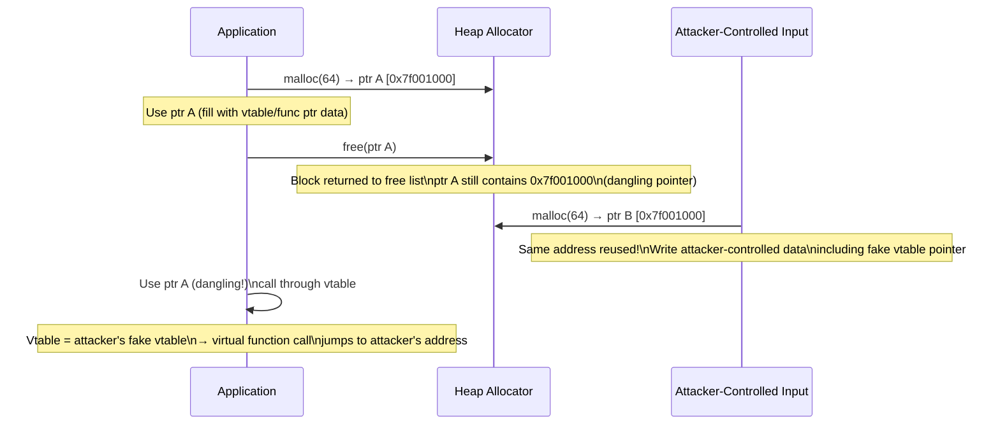

**완화**:
- **메모리 안전 언어**: Rust 빌림 검사기는 컴파일 타임에 포인터가 매달리는 것을 방지합니다.
- **AddressSanitizer**: 레드 존 + 섀도우 메모리가 런타임 시 사용 후 사용을 감지합니다(2-3배 속도 저하).
- **tcmalloc/jemalloc 포인터 무작위화**: 재사용 주소 예측을 더 어렵게 만듭니다.
- **CFI**: 예상 클래스 계층 구조에 대해 vtable 호출 대상을 검증합니다.

---

## 11. 사이드 채널 공격: 타이밍 및 캐시

### Spectre(캐시 타이밍 사이드 채널)

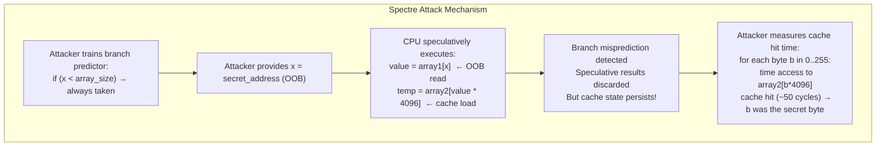

**LFENCE 완화**: 경계 확인 후 `LFENCE`을 삽입하면 OOB 액세스의 추측 실행이 방지됩니다. **Retpoline**은 간접 분기(jmp [rax])를 분기 예측자를 혼동하는 반환 기반 트램펄린으로 대체하여 BTI(분기 대상 주입)를 방지합니다.

---

## 12. 영지식 증명: 공개하지 않고 증명하기

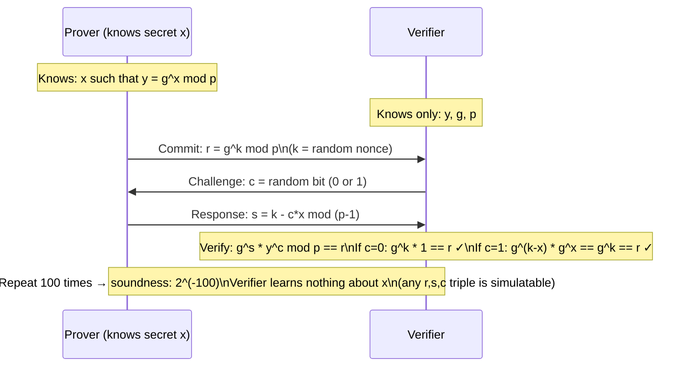

**zk-SNARKs** (ZCash, Ethereum에서 사용됨): 증명자는 회로 `C(x, w) = 1`을 만족하는 증인 `w`을 알고 있습니다. 증명 크기는 O(1)(수백 바이트)이고 검증은 회로 복잡성에 관계없이 O(1)입니다. 이를 통해 금액을 공개하지 않고도 블록체인 거래를 확인할 수 있습니다.

---

## 13. 키 교환 요약: 모든 HTTPS 연결에서 실제로 일어나는 일

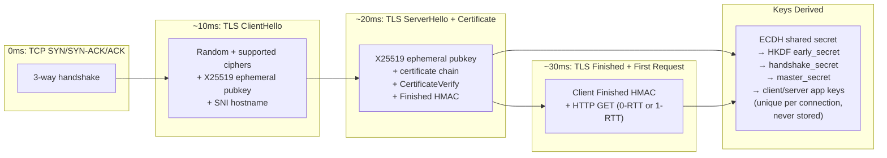

---

## 보안 속성 상호 참조

| 위협 | 메커니즘 | 국방 |
|---|---|---|
| 무차별 비밀번호 | 빠른 해시(SHA-256) | 메모리 하드 해시(Argon2id) |
| MITM 차단 | 인증 없음 | TLS 인증서 체인 확인 |
| 교통 재생 | 캡처된 토큰 재사용 | 토큰의 Nonce/타임스탬프, 짧은 TTL |
| 버퍼 오버플로 | 경계 없는 strcpy | 경계 검사 API, ASLR+NX+Canary |
| SQL 주입 | 문자열 연결 | 매개변수화된 쿼리 |
| 사용 후 무료 | C/C++ 수동 메모리 | Rust 빌림 검사기, ASan |
| 캐시 타이밍(Spectre) | 투기적 실행 | LFENCE, 리트폴린, 사이트 격리 |
| CSRF | 교차 출처 상태 변경 요청 | SameSite 쿠키, CSRF 토큰 |
| XSS | 정리되지 않은 HTML 출력 | 콘텐츠 보안 정책, 출력 인코딩 |
| 다운그레이드 공격 | TLS 버전 협상 | TLS_FALLBACK_SCSV, HSTS 사전 로드 |
