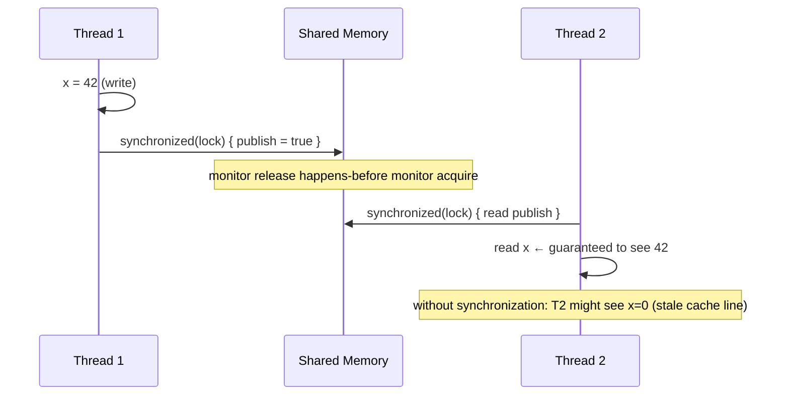
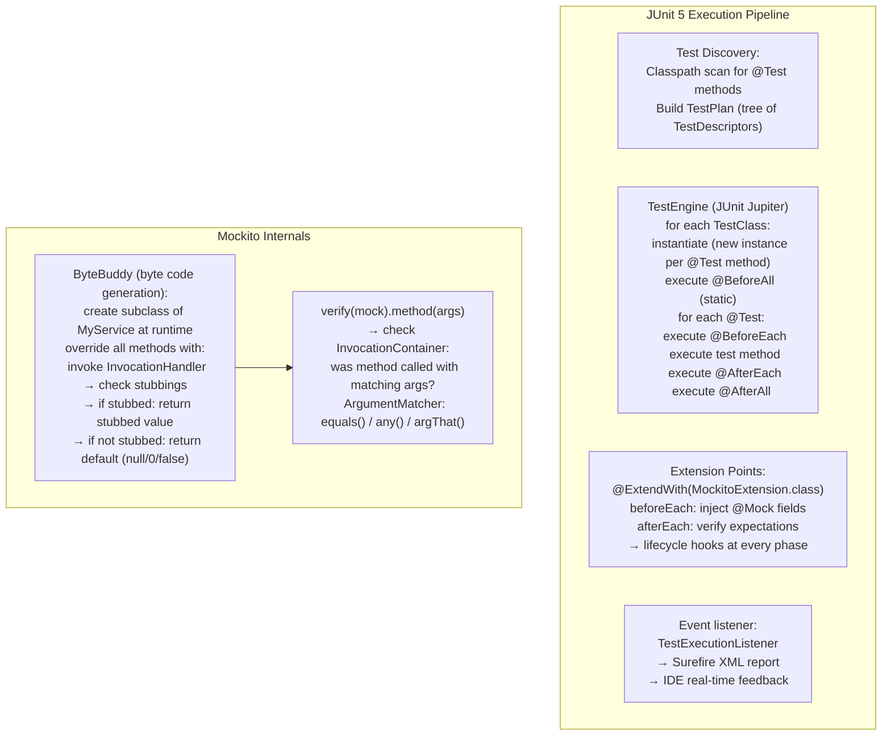
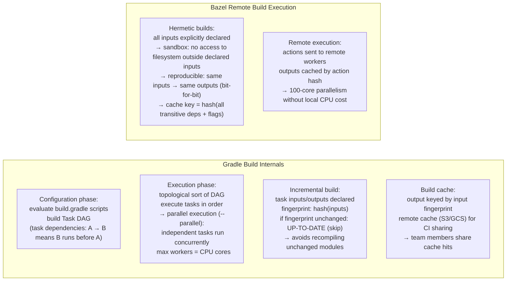
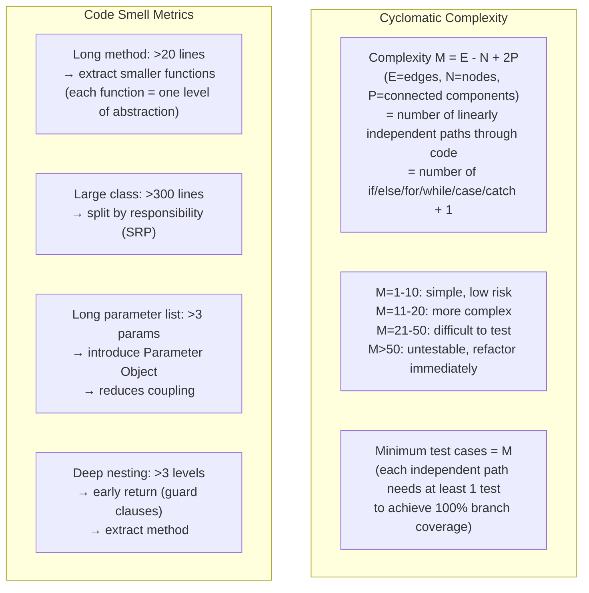
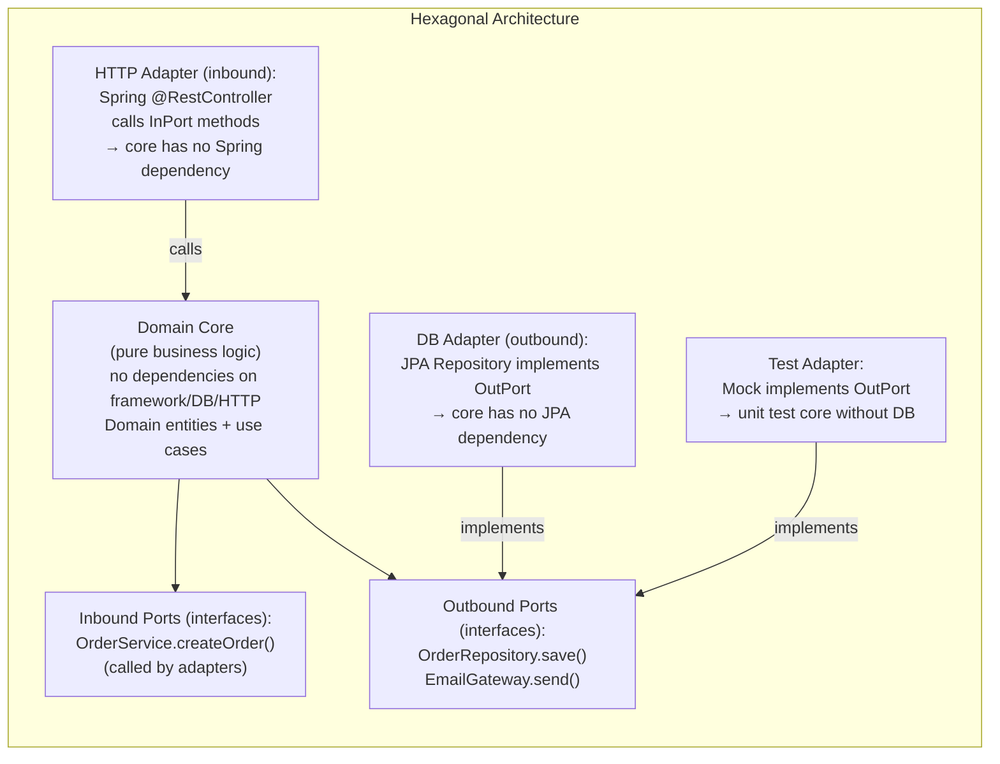
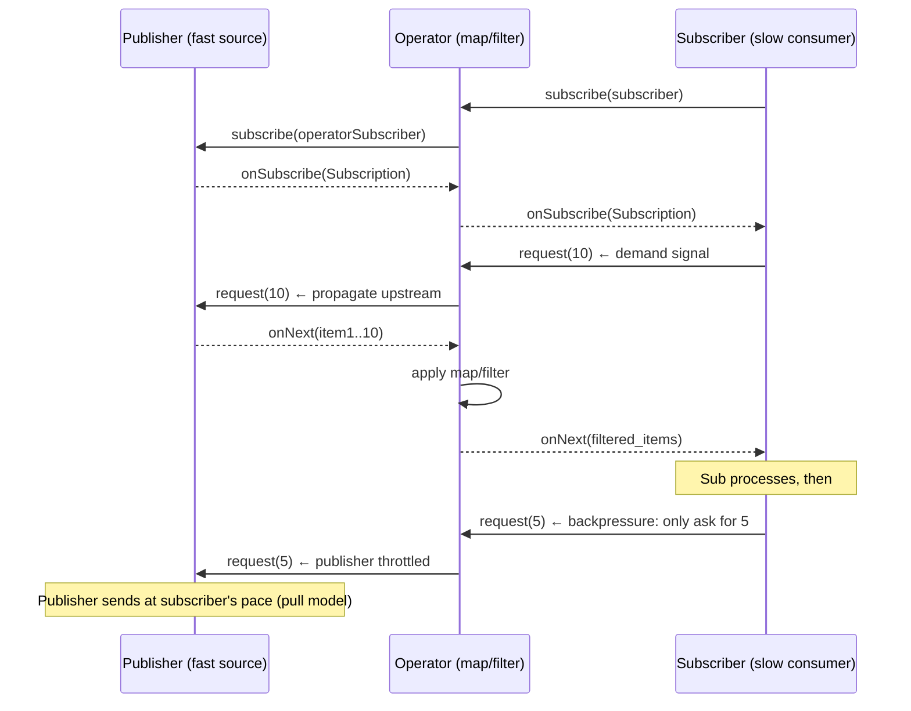
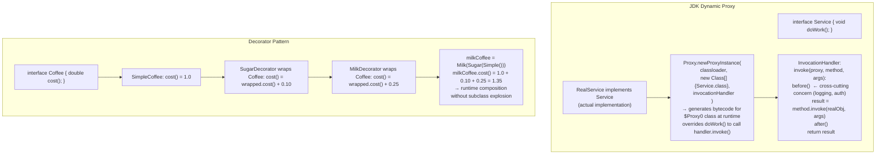
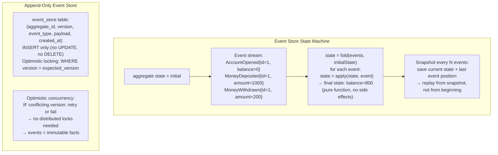

# 소프트웨어 엔지니어링 내부: 내부

> 소스 합성: 디자인 패턴 내부, 동시성 모델, 테스트 프레임워크, 빌드 시스템 및 소프트웨어 아키텍처 메커니즘을 다루는 소프트웨어 엔지니어링 참고서(comp 13, 15, 17, 67–68, 69, 76, 79, 105, 293, 323, 329, 331, 334–335, 337).

---

## 1. 디자인 패턴 - 내부 메커니즘

### 관찰자 패턴 - 이벤트 디스패치 내부

```mermaid
flowchart TD
    subgraph Observer (Event Bus)
        Subject["Subject (EventEmitter)\nobservers: Map<eventType, List<Observer>>\nnotify(event):\n  for obs in observers[event.type]:\n    obs.update(event)  ← synchronous dispatch\n(or async: enqueue to event loop)"]
        O1["Observer A\nupdate(evt): handle evt"]
        O2["Observer B\nupdate(evt): handle evt"]
        O3["Observer C\nupdate(evt): handle evt"]
        Subject -->|"notify loop"| O1 & O2 & O3
    end

    subgraph Push vs Pull Model
        Push["Push: Subject sends full event data\n→ Observer gets all info immediately\n→ Coupling: Observer must know event structure"]
        Pull["Pull: Subject sends minimal notification\n→ Observer calls getState() to get details\n→ Lazy: Observer fetches only what it needs"]
    end

    subgraph Memory Leak Risk
        Leak["Observer registered but never unregistered\n→ Subject holds strong reference\n→ Observer and its closure can never be GC'd\nFix: weak references (WeakRef) or explicit unsubscribe()"]
    end
```

### 전략 패턴 - 파견 메커니즘

```mermaid
flowchart LR
    subgraph Strategy (Function Pointer / Interface)
        Context["Context\nstrategy: SortStrategy\nsort(data):\n  strategy.execute(data)  ← virtual dispatch"]
        S1["QuickSortStrategy\nexecute(data): quicksort in-place\nO(n log n) avg, O(1) space"]
        S2["MergeSortStrategy\nexecute(data): merge sort\nO(n log n), O(n) space, stable"]
        S3["TimSortStrategy\nexecute(data): timsort\n(runs + merge, Python/Java default)"]
        Context -->|"polymorphic call\nvtable lookup"| S1 & S2 & S3
    end

    subgraph vs Switch Statement
        Switch["switch(strategy_type) {\n  case QUICK: quicksort(data); break;\n  case MERGE: mergesort(data); break;\n}\n→ Open/Closed Principle violated:\n  adding sort requires modifying switch\nStrategy: add new class, no existing code changes"]
    end
```

---

## 2. 종속성 주입 — 내부 연결

```mermaid
flowchart TD
    subgraph DI Container (Spring IoC)
        Config["ApplicationContext\n- reads @Configuration classes\n- scans @Component/@Service/@Repository\n- parses @Bean methods"]
        BeanDef["BeanDefinition registry:\n{beanName → BeanDefinition}\n(class, scope, initMethod, dependsOn,\n constructor args, properties)"]
        Instantiate["Bean instantiation:\n1. resolveDependencies (recursive)\n2. newInstance (reflection or CGLIB proxy)\n3. inject @Autowired fields/constructors\n4. call @PostConstruct\n5. register in singleton cache"]
        Proxy["CGLIB proxy:\n@Transactional @Cacheable etc.\n→ subclass generated at runtime\n→ method interceptors wrap around real method\n→ bean reference = proxy, not real instance"]
    end

    subgraph Circular Dependency
        Circ["A depends on B, B depends on A\n→ Detection: currently-being-created set\n→ Resolution: setter injection (A created first,\n  B injected, then A.setB(B))\n→ Constructor injection: CANNOT resolve circles\n  (A constructor needs B, B constructor needs A)\n→ Fail-fast on circular constructor deps"]
    end
```

---

## 3. 동시성 모델 - 스레드 내부

```mermaid
flowchart TD
    subgraph Thread States (Java)
        NEW["NEW: Thread object created\nbut start() not called"]
        RUNNABLE["RUNNABLE: ready to run\nor actively running (OS decides)"]
        BLOCKED["BLOCKED: waiting for monitor lock\n(another thread holds it)"]
        WAITING["WAITING: Object.wait()\nThread.join()\nLockSupport.park()"]
        TIMED_WAITING["TIMED_WAITING: sleep(ms)\nwait(ms)\njoin(ms)"]
        TERMINATED["TERMINATED: run() returned\nor threw exception"]
    end
    NEW --> RUNNABLE
    RUNNABLE --> BLOCKED & WAITING & TIMED_WAITING
    BLOCKED & WAITING & TIMED_WAITING --> RUNNABLE
    RUNNABLE --> TERMINATED

    subgraph Thread Pool Internals (ThreadPoolExecutor)
        TPE["ThreadPoolExecutor:\ncorePoolSize=10, maxPoolSize=20\nworkQueue=LinkedBlockingQueue(1000)\nrejectedExecutionHandler\n\nLogic:\n1. tasks < corePoolSize → create new thread\n2. queue not full → enqueue task\n3. threads < maxPoolSize → create thread\n4. all full → reject (CallerRunsPolicy/AbortPolicy)"]
    end
```

### Java 메모리 모델 - 발생 전



---

## 4. 테스트 주도 개발 — 테스트 실행 내부



---

## 5. 시스템 빌드 - 종속성 그래프 및 증분 빌드



---

## 6. 버전 관리 내부 — Git 개체 저장소

```mermaid
flowchart TD
    subgraph Git Object Model
        Blob["Blob:\ncontent-addressed: SHA1(\"blob {len}\\0{content}\")\nStores file content only (no filename)\nDeduplication: same content = same SHA1 = stored once"]
        Tree["Tree:\ncontent-addressed\nList of {mode, name, SHA1} entries\n040000 tree abc123  src/\n100644 blob def456  README.md"]
        Commit["Commit:\ntree SHA1\nparent SHA1 (chain = history)\nauthor, committer, timestamp, message\n→ parent chain = immutable linked list"]
        Tag["Annotated Tag:\ntag object SHA1\npoints to commit SHA1\nmessage, tagger"]
    end

    subgraph Pack File (gc optimization)
        Loose["Loose objects: .git/objects/{2-char}/{38-char}\n(one file per object)"]
        Pack["Pack file: .git/objects/pack/pack-{sha1}.pack\n+ index: pack-{sha1}.idx\n→ delta compression: base object + binary diff\n→ 10–100× smaller than loose objects\n→ git gc: repack loose → pack"]
    end

    subgraph Merge Internals
        ThreeWay["Three-way merge:\nbase = common ancestor\noursA = our changes from base\ntheirsB = their changes from base\nmerge: combine A+B diffs\n→ conflict: same lines modified differently\n→ non-conflict: different lines → auto-merge"]
    end
```

---

## 7. 견고한 원칙 — 기계적 의미

```mermaid
flowchart LR
    subgraph Single Responsibility (SRP)
        Before["class UserService {\n  createUser(), sendEmail(),\n  generateReport(), saveToCSV()\n}\n→ 4 reasons to change"]
        After["class UserService { createUser() }\nclass EmailService { sendEmail() }\nclass ReportService { generateReport() }\n→ each class: 1 reason to change\n→ smaller compilation units\n→ easier parallel team work"]
    end

    subgraph Open/Closed (OCP)
        OCP["class Discount {\n  if (type==PERCENT) ...\n  else if (type==FIXED) ...\n}\n→ every new discount type: modify class\nVS:\ninterface Discount { apply(price) }\nclass PercentDiscount implements Discount\nclass FixedDiscount implements Discount\n→ add new type: add new class, no existing modification"]
    end

    subgraph Dependency Inversion (DIP)
        DIP["High-level: OrderService\nDepends on abstraction: IPaymentGateway\nLow-level: StripeGateway implements IPaymentGateway\n→ OrderService compiled independently of Stripe SDK\n→ swap: inject MockGateway in tests\n→ runtime: IoC container injects StripeGateway"]
    end
```

---

## 8. 깔끔한 코드 — 순환적 복잡성



---

## 9. 육각형 아키텍처 — 포트 및 어댑터 내부



---

## 10. 반응형 프로그래밍 — 배압 내부



### RxJava 핫 및 콜드 관찰 가능

```mermaid
flowchart LR
    subgraph Cold Observable
        Cold["Cold: each subscriber gets its own data stream\nsubscribe → producer starts fresh\nHTTP request, file read\n→ 2 subscribers = 2 requests"]
    end
    subgraph Hot Observable
        Hot["Hot: shared stream, subscribers tap in\nsource runs regardless of subscribers\nmouse events, Kafka topic\n→ subscribers miss items if subscribed late\nPublish().RefCount() makes multicasting work"]
    end
    subgraph Subject (bridge)
        Subj["Subject = Observable + Observer\ncan emit items imperatively\n→ convert imperative code to reactive\nBehaviorSubject: replay last item to new subscribers"]
    end
```

---

## 11. 디자인 패턴 — 프록시 및 데코레이터 메모리 레이아웃



---

## 12. 이벤트 소싱 및 CQRS 패턴 — 상태 재구성



---

## 주요 내용

- **관찰자 패턴** 디스패치는 기본적으로 동기식입니다. 느린 관찰자는 다른 모든 것을 차단합니다. 비동기 디스패치(이벤트 큐 + 작업자 스레드)는 게시자 처리량에서 관찰자 속도를 분리합니다.
- **DI 컨테이너 빈 라이프사이클**은 프록시를 위해 반사 + CGLIB 바이트코드 생성을 사용합니다. — `@Transactional` 메소드는 실제 인스턴스가 아닌 프록시가 호출을 가로채기 때문에 작동합니다.
- **ThreadPoolExecutor**는 코어 스레드를 먼저 채운 다음 대기열에 넣은 다음 최대 스레드까지 생성합니다. 일반적인 실수는 대기열 용량을 `Integer.MAX_VALUE`로 설정하여 최대 풀 확장을 방지하는 것입니다.
- **Git 객체**는 콘텐츠 주소가 지정됩니다(콘텐츠의 SHA-1). 커밋 전체에서 동일한 파일이 동일한 blob을 공유합니다. 팩 파일 델타 압축은 유사한 blob을 찾아 바이너리 diff만 저장합니다.
- **육각형 아키텍처**는 포트를 통해 종속성을 반전시켜 프레임워크에서 비즈니스 로직을 분리합니다. 도메인은 Spring/JPA/HTTP를 가져오지 않으므로 마이크로초 단위로 단위 테스트가 가능합니다.
- **반응성 배압**은 풀 모델입니다. 가입자는 `request(n)`을 호출하여 유량을 제어합니다. 게시자는 요청한 것보다 더 많이 내보내서는 안 됩니다(무한한 버퍼 증가 방지).
- **순환 복잡도**는 전체 분기 적용에 필요한 최소 테스트 케이스 수와 직접적으로 동일합니다. M=15인 함수는 모든 경로를 포괄하려면 최소 15개의 테스트가 필요합니다.
