# 시스템 프로그래밍 내부: 메모리 모델, Syscall 및 동시성 프리미티브

> 내부 내용: CPU 메모리 모델의 저장/로드 순서, 시스템 호출이 사용자/커널 경계를 넘는 방법, 뮤텍스와 퓨텍스가 커널에서 차단을 구현하는 방법, Rust의 빌림 검사기가 컴파일 타임에 메모리 안전을 강화하는 방법, POSIX 스레드가 커널 스케줄러 엔터티에 매핑되는 방법.

---

## 1. CPU 메모리 모델: 저장/로드 순서

최신 CPU는 성능을 위해 메모리 작업 순서를 변경합니다. 프로그래머의 순차적 정신 모델은 하드웨어 현실과 일치하지 않습니다.

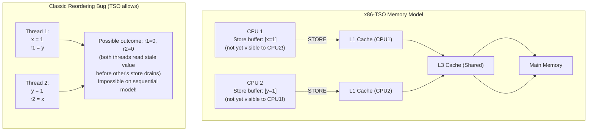

### 기억의 울타리와 장벽

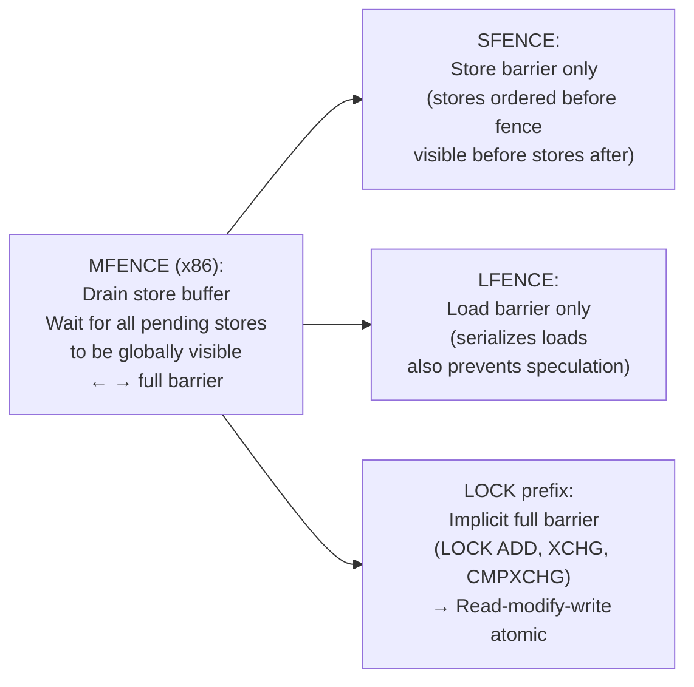

---

## 2. 시스템 호출: 사용자 공간 → 커널 크로싱

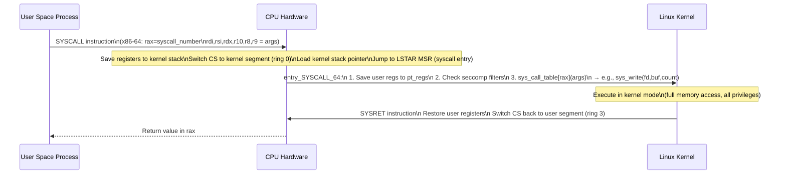

### vDSO: Syscall 오버헤드 방지

부작용 없이 자주 호출되는 syscall(gettimeofday, clock_gettime)의 경우 Linux는 **vDSO**(가상 동적 공유 개체)를 통해 커널 코드를 사용자 프로세스 주소 공간에 직접 매핑합니다.

```
gettimeofday() call in user space:
  NORMAL: SYSCALL → kernel → read clock → SYSRET (~100ns)
  vDSO:   Call vDSO function directly (no ring switch!)
          Reads time from shared memory page (mapped by kernel)
          ~10ns — 10× faster
```

---

## 3. 뮤텍스 구현: Futex

futex(빠른 사용자 공간 뮤텍스)는 경합이 없는 경우 syscall을 방지합니다.

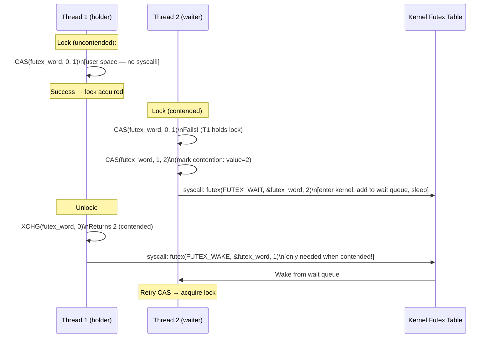

**빠른 경로**: 대기자 없이 잠금/잠금 해제 = 원자 CAS 1개 + 시스템 호출 0개.  
**느린 경로**: 경합이 발생하는 경우에만 syscall이 커널에 들어가 잠자기/깨우기를 수행합니다.

### Spinlock 대 Mutex Tradeoff

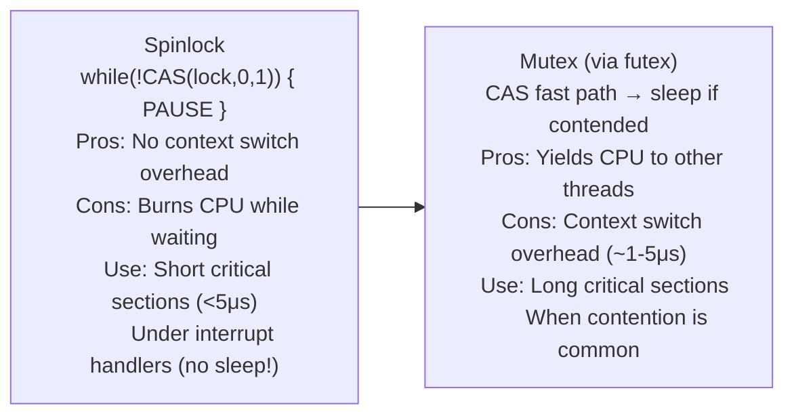

---

## 4. Rust Borrow Checker: 컴파일 타임의 소유권 규칙

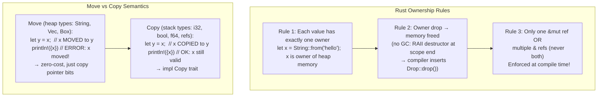

### 수명 주석: 차용 범위 적용

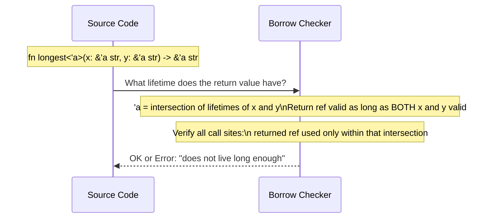

**빌림 검사기는 컴파일 타임에 제거됩니다**:
- Use-after-free: 빌림이 존재하는 동안 소유자가 삭제됨 → 컴파일 오류
- 데이터 경합: 다른 참조가 활성화된 동안 `&mut` 참조 → 컴파일 오류
- 댕글링 참조: 범위를 벗어난 값에 대한 참조 → 컴파일 오류

---

## 5. POSIX 스레드: 커널 매핑 및 스케줄링

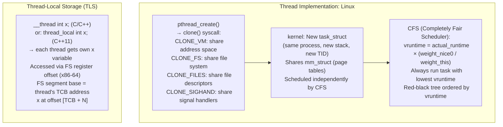

### 컨텍스트 전환: 저장되는 내용

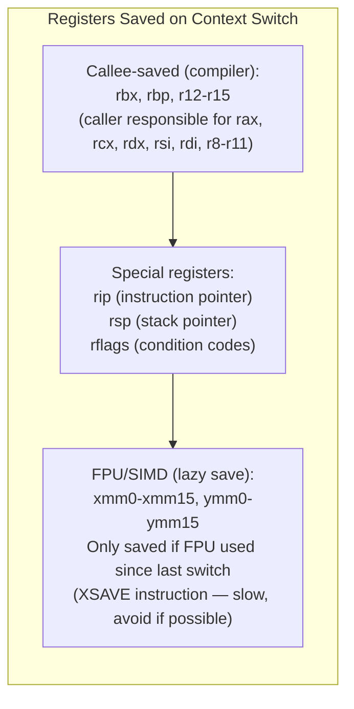

---

## 6. 메모리 할당자 내부: glibc malloc

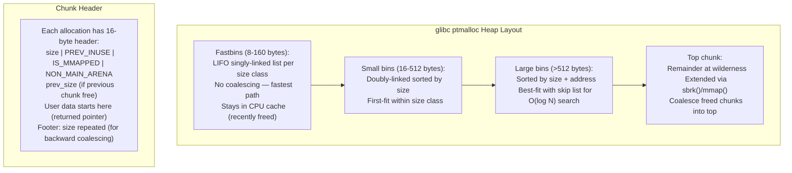

### TCMalloc: 낮은 경합을 위한 스레드 캐싱

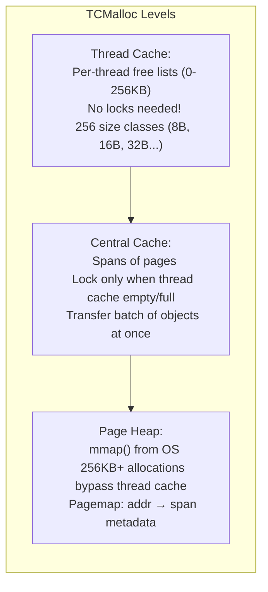

---

## 7. POSIX 파일 I/O: 커널 경로

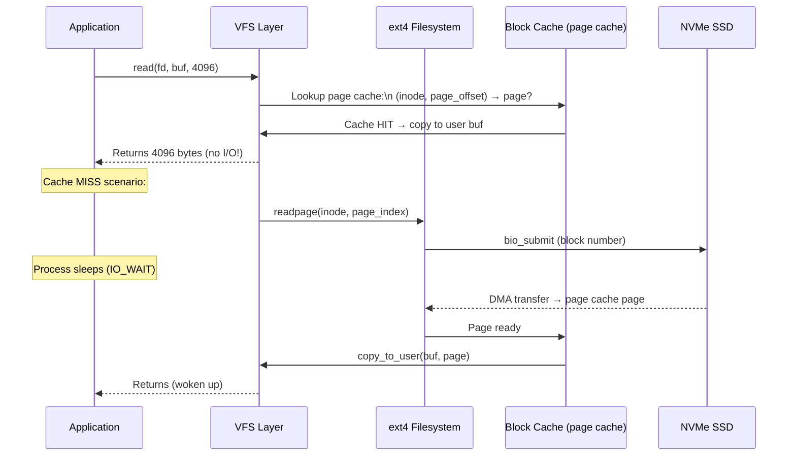

### O_DIRECT: 페이지 캐시 우회

```c
// O_DIRECT: bypass page cache entirely
fd = open("data.bin", O_RDWR | O_DIRECT);
// Requires aligned buffer (aligned to 512 or 4096 bytes)
// Transfers directly: user_buf ↔ disk (via DMA)
// Used by: databases (manage their own cache)
//          backup tools (avoid evicting hot pages)
```

---

## 8. 신호 처리: 전달 및 비동기 안전성

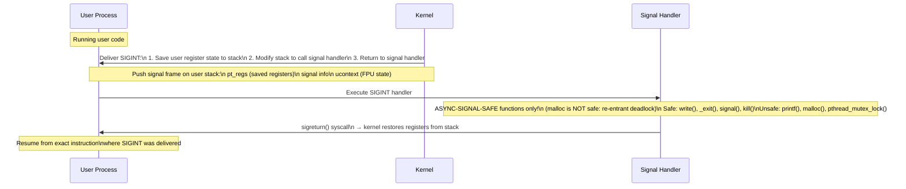

---

## 9. NUMA 아키텍처: 메모리 지역성

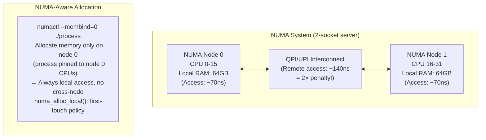

---

## 요약: 시스템 프로그래밍 기본 요소

| 원시 | 구현 | 커널 참여 |
|---|---|---|
| 뮤텍스 잠금(비경합) | 사용자 공간의 CAS | 없음(빠른 경로) |
| 뮤텍스 잠금(경합) | 퓨텍스(FUTEX_WAIT) | 예 — 프로세스가 차단되었습니다 |
| 스레드 생성 | 클론(CLONE_VM\|...) | 예 — 새 task_struct |
| 컨텍스트 전환 | 규정 저장, 규정 로드 | 예 — CFS 스케줄러 |
| 메모리 할당(<256B) | 스레드 캐시 LIFO | 없음(tcmalloc) |
| 메모리 할당(대형) | mmap(MAP_ANON) | 예 — 페이지 테이블 업데이트 |
| 파일 읽기(캐시됨) | 페이지 캐시에서 복사 | 최소 |
| 파일 읽기(캐시되지 않음) | 바이오 제출 + 수면 | 예 — I/O 스케줄러 |
| 신호 전달 | 스택 수정 → 핸들러 | 예 — 사용자 모드로 돌아가기 |
| 시스템 호출 | SYSCALL 명령어 | 예 - 링 0 전환 |
