# Miscellaneous CS Topics — Under the Hood: Graphics, Game Engines, IoT, SRE, and DevOps Internals

> **Focus**: Internal mechanics — not how to use tools, but how game engines implement ECS, how GPUs execute shader pipelines, how Terraform tracks state, and how SRE error budgets drive automated decisions.

---

## 1. Real-Time Graphics: GPU Rendering Pipeline Internals

### Rasterization Pipeline

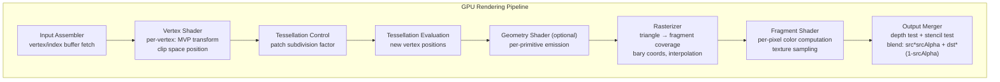

### Depth Buffer and Early-Z

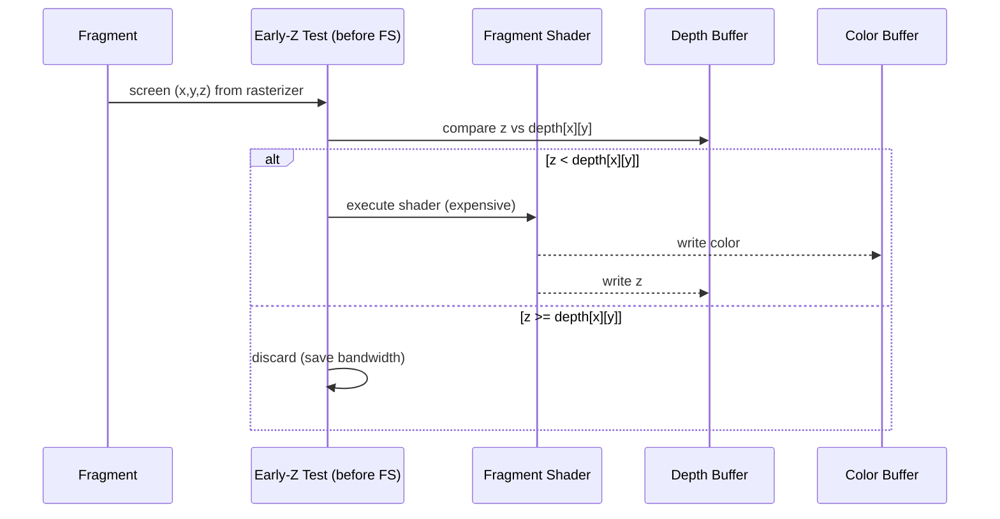

**Early-Z** rejects fragments before shader execution — massive perf win. Broken if shader writes depth or calls `discard`.

### Deferred Rendering vs Forward Rendering

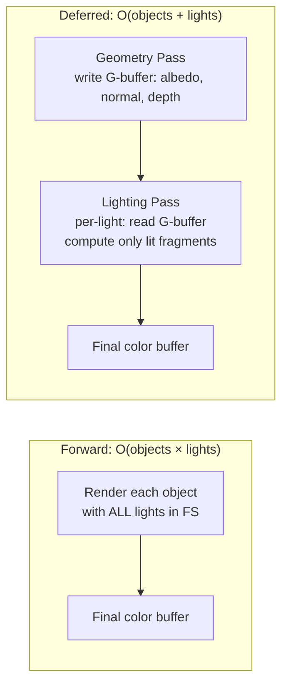

**G-buffer layout** (MRT — Multiple Render Targets):
- RT0: Albedo (RGB) + Roughness (A)
- RT1: World Normal (RGB) + Metalness (A)
- RT2: Depth (32-bit float)
- RT3: Emissive (RGB) + AO (A)

### Ray Tracing: BVH Traversal

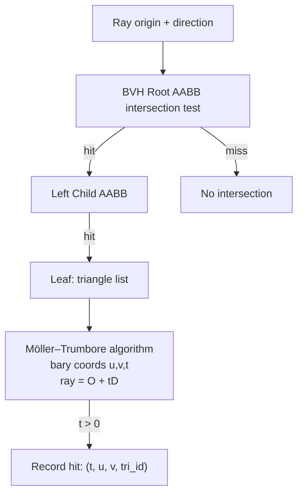

NVIDIA RTX uses **RT Cores** for hardware BVH traversal — a fixed-function unit offloading tree walks from shader processors. BVH build is O(N log N) via Surface Area Heuristic (SAH).

---

## 2. Game Engine Architecture: ECS and Physics

### Entity-Component-System Data Layout

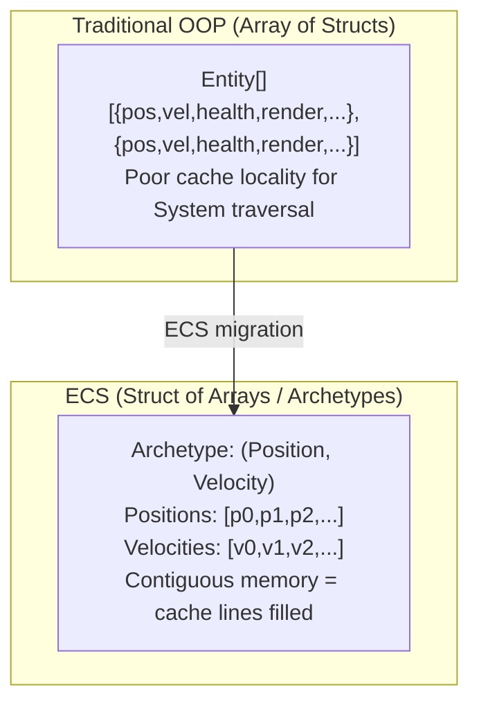

**Archetype** = unique set of component types. Entities with identical component sets share an archetype table. Moving a component to/from an entity = **archetype change** (memcpy row to new table).

### Physics Engine: Broad Phase → Narrow Phase

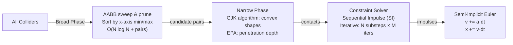

**GJK (Gilbert-Johnson-Keerthi)**: detects convex shape overlap by building a simplex in **Minkowski difference space**. If origin is inside Minkowski difference, shapes overlap.

### Game Loop Timing

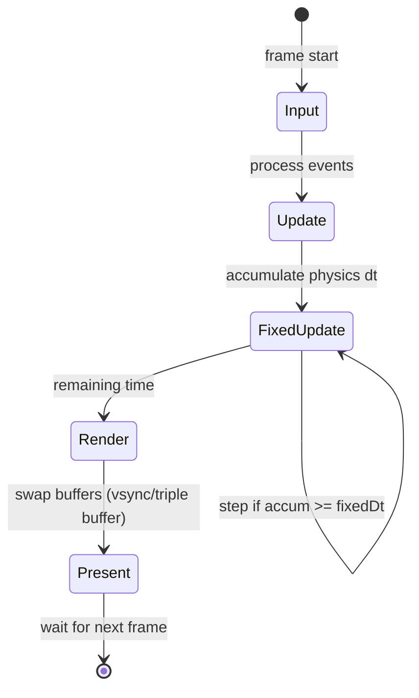

Fixed timestep (typically 50Hz) decouples physics stability from rendering. **Interpolation alpha** = `accum / fixedDt` blends last two physics states for smooth rendering at any FPS.

---

## 3. IoT Architecture: Edge Computing and Protocol Internals

### MQTT Protocol Internals

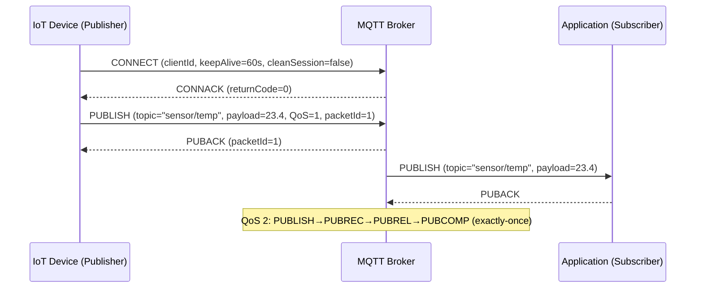

**QoS levels**:
- QoS 0: at-most-once (fire and forget, no ACK)
- QoS 1: at-least-once (PUBACK, may duplicate)
- QoS 2: exactly-once (4-message handshake, store-and-forward)

### Edge Computing: Data Pipeline

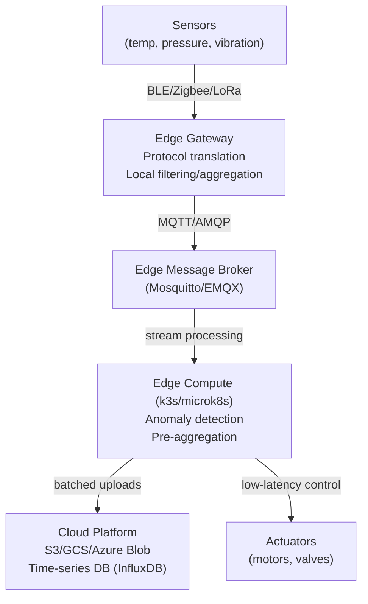

**Local loop latency**: edge-to-actuator < 10ms. Cloud round-trip: 50–200ms — too slow for real-time control.

### TLS on Constrained Devices

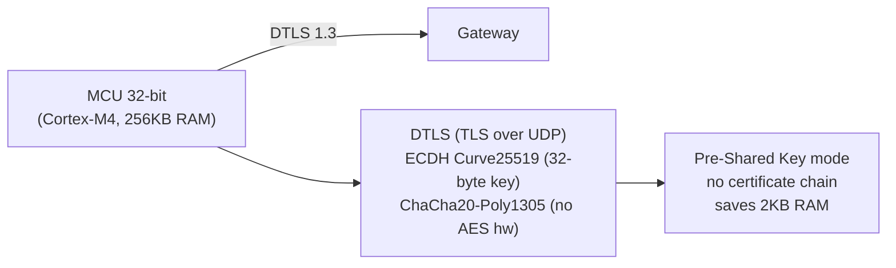

Constrained devices use **DTLS** (Datagram TLS) with PSK to avoid certificate parsing overhead. ChaCha20 is preferred on devices without AES hardware acceleration.

---

## 4. Infrastructure as Code: Terraform State Machine Internals

### Terraform Plan/Apply Lifecycle

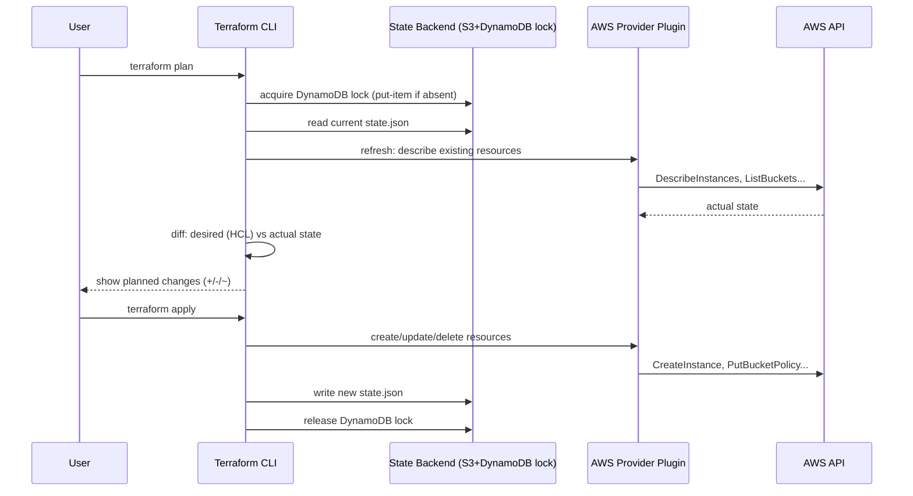

### Dependency Graph and Parallelism

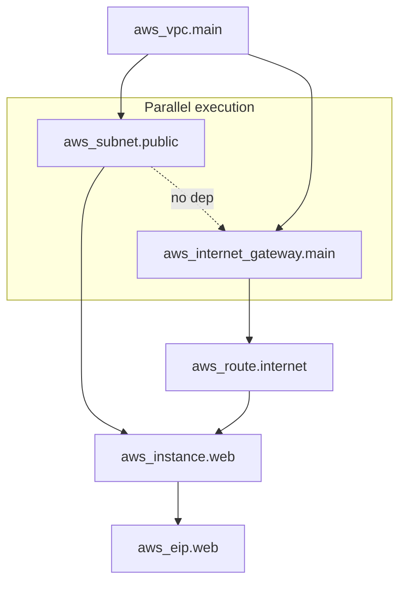

Terraform builds a DAG of resources and applies **parallel** where dependencies allow. The `depends_on` meta-argument forces explicit edges when implicit dependencies aren't captured by references.

### State File Structure

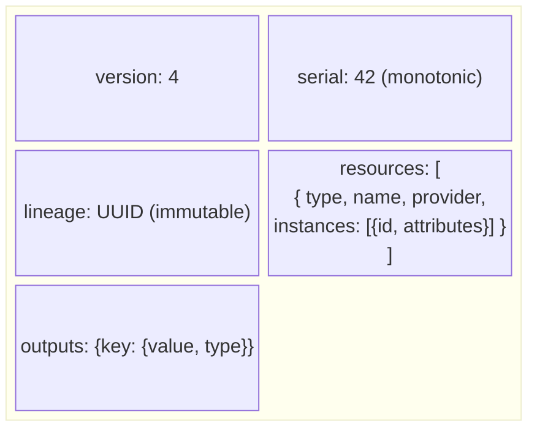

`serial` increments on every apply — used for **optimistic locking**. If remote serial > local serial, apply is rejected (someone else modified first).

---

## 5. Ansible: Push-Based Configuration Internals

### Module Execution Mechanism

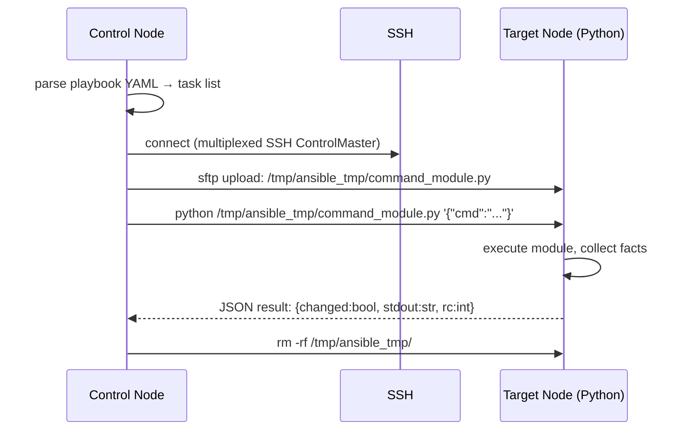

Ansible is **agentless** — Python module files are SCP'd to the target, executed, and cleaned up per-task. This means Python must be available on targets (except `raw` module which uses SSH directly).

### Idempotency and Check Mode

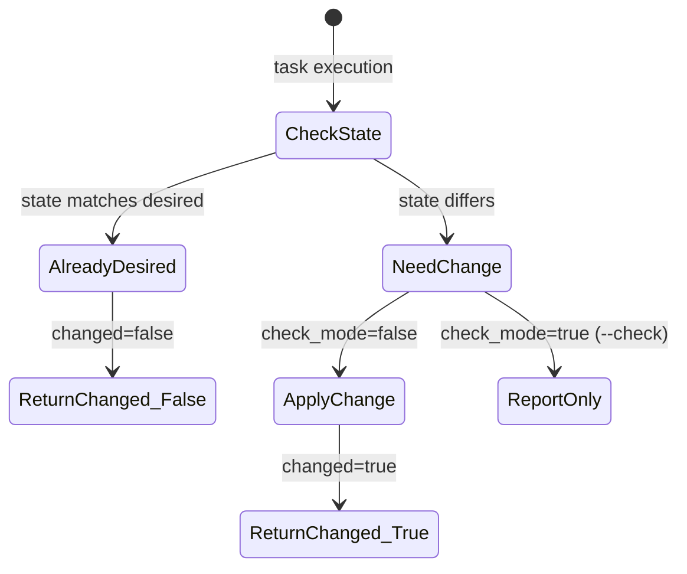

Modules must implement idempotent `get_state` → compare → `set_state` logic. `--check` mode runs `get_state` + compare only, dry-running the entire playbook.

---

## 6. SRE: Error Budgets, SLOs, and Alerting Internals

### SLO Error Budget Mechanics

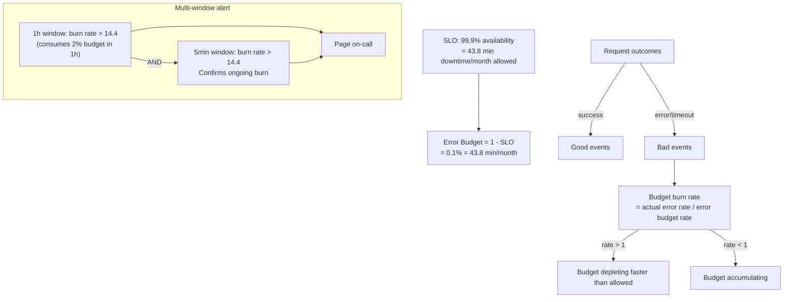

**Multi-window alerting** (Google's approach): short window detects fast burns, long window detects slow burns without false positives.

### Prometheus Alerting Rule Evaluation

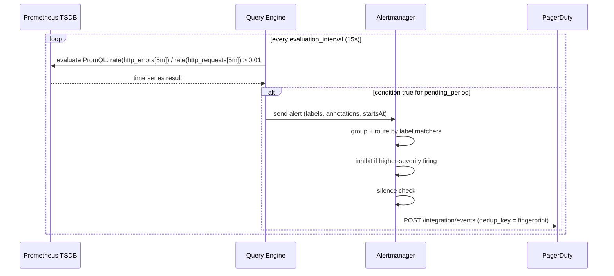

**Fingerprinting**: alert identity = hash of all label key/value pairs. Alertmanager uses fingerprint for deduplication and grouping.

### Distributed Tracing: OpenTelemetry Context Propagation

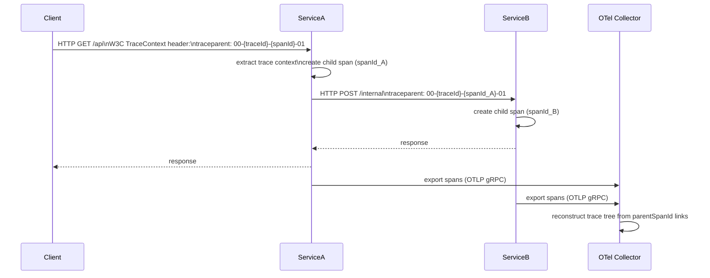

`traceId` (128-bit) spans the entire request tree. `spanId` (64-bit) identifies one service's work unit. `parentSpanId` links child to parent, enabling tree reconstruction.

---

## 7. Testing Methodologies: Property-Based and Mutation Testing Internals

### Property-Based Testing (QuickCheck / Hypothesis)

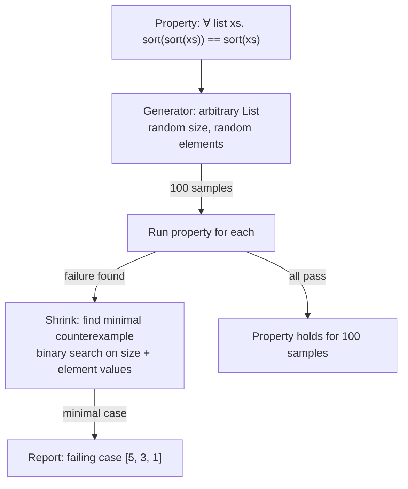

**Shrinking** is the key innovation — QuickCheck doesn't just report the random failure, it minimizes it to the smallest counterexample, making bugs debuggable.

### Mutation Testing Internals

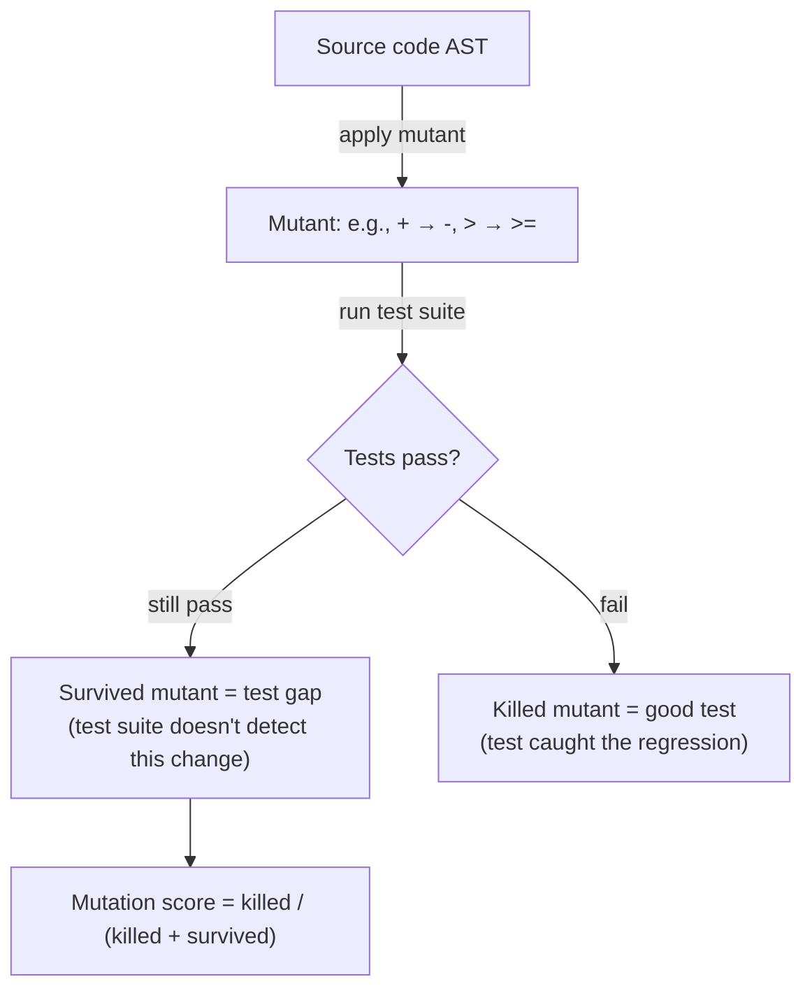

Mutation testing reveals **false confidence** — 100% line coverage can still have high survived-mutation rate if assertions don't verify exact values.

---

## 8. Computer Graphics: Shader Compilation and SPIR-V

### GLSL → SPIR-V → Native ISA

```mermaid
flowchart TD
    GLSL["GLSL / HLSL source"] -->|glslangValidator| SPIRV["SPIR-V binary\n(vendor-neutral IR)"]
    SPIRV -->|driver compilation| ISA["GPU ISA\n(PTX→SASS for NVIDIA\nGCN for AMD\nEU ISA for Intel)"]
    SPIRV -->|optimization passes| SPIRV_Opt["spirv-opt: dead code elim\nvector width optimization"]
    SPIRV --> Vulkan["Vulkan VkShaderModule"]
    SPIRV --> Metal["SPIR-V Cross → MSL (Metal)"]
    SPIRV --> WebGPU["Naga → WGSL (WebGPU)"]
```

**SPIR-V** is a register-based SSA IR with explicit type system for GPU programs. It separates frontend language from backend driver compilation — enables one shader to target multiple platforms.

### Compute Shader Thread Hierarchy (CUDA/Vulkan Compute)

```mermaid
block-betting
    columns 1
    block:hierarchy:1
        columns 1
        g["Grid: 3D array of thread groups"]
        b["Thread Group (workgroup): 64–256 threads\nshared local memory (LDS) ~48KB"]
        t["Thread (lane): executes shader\nregisters: 32–255 per thread"]
        w["Warp (SIMD32/SIMD64): 32/64 threads\nexecute in lockstep (SIMT)"]
    end
```

**Warp divergence**: if threads in a warp take different branches (`if (threadId % 2)`), both paths execute sequentially with inactive lanes masked — worst case 50% utilization.

---

## 9. Database Internals: Query Optimizer and Execution Engine

### Query Optimization: Cost-Based Optimizer

```mermaid
flowchart TD
    SQL["SELECT * FROM orders o JOIN customers c ON o.cust_id = c.id WHERE c.country='US'"] -->
    Parse["Parse → AST"] -->
    Bind["Bind → resolve table/column refs"] -->
    Transform["Logical Plan: Filter → Join → Scan"] -->
    Enumerate["Plan Enumeration\nDP: enumerate join orderings\nO(3^N) with pruning"] -->
    CostModel["Cost Model\nI/O cost: #pages × seq_cost\nCPU cost: #rows × cpu_cost\nStats: table cardinality, column NDV, histograms"] -->
    BestPlan["Best Physical Plan\n(NestLoop vs HashJoin vs MergeJoin)\n(SeqScan vs IndexScan)"]
```

**Statistics** drive cost estimation: `pg_statistic` histograms, most common values (MCV), and null fractions. Stale stats → wrong cardinality estimates → wrong plan.

### Volcano/Iterator Execution Model

```mermaid
sequenceDiagram
    participant Parent as HashAggregate
    participant Child as HashJoin
    participant L as SeqScan (orders)
    participant R as IndexScan (customers)

    Parent->>Child: next()
    Child->>L: next() [build phase: read all right side]
    L-->>Child: tuple
    Child->>R: next()
    R-->>Child: tuple
    Child->>Child: probe hash table
    Child-->>Parent: matched tuple
    Parent->>Parent: update hash group aggregate
```

**Pull model (Volcano)**: each operator calls `next()` on its children — simple but has high function call overhead. Vectorized execution (DuckDB, ClickHouse) processes batches of 1024 rows per `next()` call.

---

## 10. Agile and Software Engineering Process Internals

### Git Branching Strategies: Internal Mechanics

```mermaid
flowchart LR
    subgraph "Trunk-Based Development"
        Main["main branch"] -->|short-lived| FB["feature branch\n(< 2 days)"]
        FB -->|PR + merge| Main
        Main -->|tag| Release["Release tag"]
    end
    subgraph "Gitflow"
        GF_Main["main"] ---|sync| GF_Dev["develop"]
        GF_Dev --> GF_Feature["feature/x"]
        GF_Dev --> GF_Release["release/1.2"]
        GF_Release --> GF_Main
        GF_Main --> GF_Hotfix["hotfix/y"]
        GF_Hotfix --> GF_Main
        GF_Hotfix --> GF_Dev
    end
```

### CI/CD Pipeline Execution Graph

```mermaid
flowchart TD
    Push["git push"] -->|webhook| CI["CI Server\n(Jenkins/GitLab CI/GitHub Actions)"]
    CI --> Checkout["checkout + cache restore"]
    Checkout --> Parallel{parallel jobs}
    Parallel --> Lint["lint + static analysis"]
    Parallel --> UnitTest["unit tests"]
    Parallel --> Build["build artifact"]
    Lint & UnitTest --> IntTest["integration tests\n(docker-compose up)"]
    IntTest & Build --> Package["package Docker image\ndocker build + push registry"]
    Package -->|tag=main| StagingDeploy["deploy to staging\nkubectl rollout"]
    StagingDeploy --> E2E["e2e tests (Playwright)"]
    E2E -->|manual approval| ProdDeploy["deploy to production\nblue/green or canary"]
```

---

## 11. Operating System Scheduling: Real-Time and Multi-Core

### Multi-Core Cache Coherence (MESI Protocol)

```mermaid
stateDiagram-v2
    [*] --> Invalid: cache line not present
    Invalid --> Exclusive: CPU reads, no other has it
    Exclusive --> Modified: CPU writes (no bus traffic)
    Modified --> Shared: another CPU reads (write-back + share)
    Exclusive --> Shared: another CPU reads
    Shared --> Modified: CPU writes (invalidate others)
    Shared --> Invalid: another CPU writes
    Modified --> Invalid: another CPU writes (must evict)
```

**False sharing**: two variables on same cache line (64B) modified by different CPUs → constant MESI state transitions → serialize execution. Fix: `__cacheline_aligned` / `@Contended` annotation.

### NUMA Memory Access Patterns

```mermaid
flowchart LR
    subgraph "NUMA Node 0"
        CPU0["CPU 0–15\nL3 Cache 30MB"]
        RAM0["Local DRAM\n64GB\n~50ns latency"]
    end
    subgraph "NUMA Node 1"
        CPU1["CPU 16–31\nL3 Cache 30MB"]
        RAM1["Remote DRAM\n64GB\n~100ns latency (QPI/xGMI)"]
    end
    CPU0 -->|local| RAM0
    CPU0 -->|remote 2× slower| RAM1
    CPU1 -->|local| RAM1
```

`numactl --membind=0` pins allocations to local NUMA node. Java GC overhead increases 40–60% with cross-NUMA allocations — JVM's NUMA-aware allocator (`-XX:+UseNUMAInterleaving`) mitigates this.

---

## Summary: Miscellaneous CS Internals Map

```mermaid
mindmap
  root((Misc CS Internals))
    Graphics
      Rasterization pipeline stages
      G-buffer deferred rendering
      BVH ray traversal hardware
      SPIR-V cross-platform IR
      Warp divergence SIMT
    Game Engines
      ECS archetype memory layout
      GJK Minkowski difference
      Fixed timestep physics loop
      Interpolation rendering
    IoT
      MQTT QoS 3 levels
      DTLS constrained devices
      Edge compute local latency
    DevOps/IaC
      Terraform DAG parallelism
      State serial optimistic lock
      Ansible agentless SSH module
    SRE
      Error budget burn rate
      Multi-window alerting
      OTel trace context propagation
    Testing
      QuickCheck shrinking
      Mutation testing survivors
    Database
      Cost-based optimizer statistics
      Volcano pull model
      Vectorized batch execution
    OS/Multi-core
      MESI cache coherence protocol
      False sharing cache lines
      NUMA topology memory latency
```
