# Python Internals: Under the Hood

> Synthesized from: Beazley *Python Essential Reference*, Ramalho *Fluent Python* 2nd ed, Martelli *Python in a Nutshell*, CPython source internals, and comp(19/20/32/44/46-47/55/61/64-65/75/77/192/202) Python references.

---

## 1. CPython Object Model — Everything is a PyObject

Every Python value, from integers to functions to classes, is a heap-allocated `PyObject`. This is the foundation of Python's runtime.

### PyObject Structure

```c
// Base type — every Python object starts with this
typedef struct _object {
    Py_ssize_t ob_refcnt;      // reference count (for garbage collection)
    PyTypeObject *ob_type;     // pointer to type object (= type(obj))
} PyObject;

// Variable-length objects (lists, tuples, bytes) extend with:
typedef struct {
    PyObject ob_base;
    Py_ssize_t ob_size;        // number of items
} PyVarObject;

// Integer example:
typedef struct {
    PyObject ob_base;
    Py_ssize_t ob_digit_count; // number of 30-bit digits
    digit ob_digit[1];         // digits array (arbitrary precision!)
} PyLongObject;
```

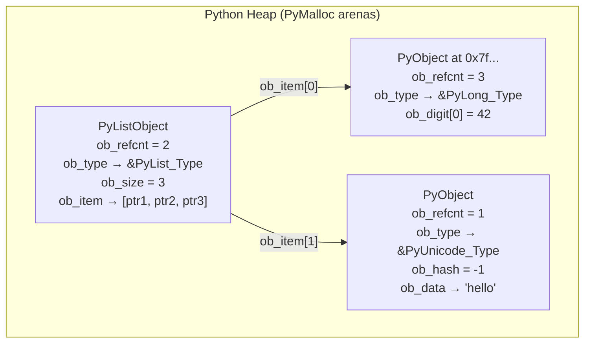

### Small Integer Cache

CPython pre-allocates integer objects for values **-5 to 256**. All references to `x = 5` point to the **same** PyLongObject:

```python
a = 256
b = 256
a is b   # True — same object
a = 257
b = 257
a is b   # False — separate objects (outside cache range)
```

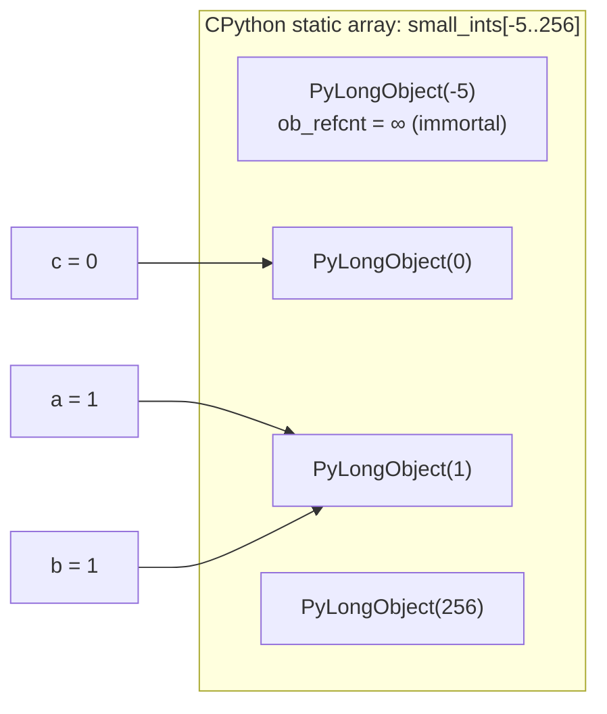

String interning: short identifier-like strings (alphanumeric, ≤20 chars typically) are interned in a global dict `interned`. `'hello' is 'hello'` → True. Arbitrary strings: no guarantee.

---

## 2. Reference Counting and Garbage Collection

### Py_INCREF / Py_DECREF — The Atomic Operations

```c
#define Py_INCREF(op) ((op)->ob_refcnt++)
#define Py_DECREF(op)                        \
    do {                                      \
        if (--((op)->ob_refcnt) == 0)         \
            _Py_Dealloc(op);                  \
    } while(0)
```

Every Python operation that creates a reference increments; every operation that releases decrements. When `ob_refcnt == 0` → `_Py_Dealloc()` called → object's `tp_dealloc` slot invoked → memory returned to `PyMalloc`.

### Cyclic Garbage Collector

Reference counting cannot collect cycles:

```python
a = []
b = [a]
a.append(b)   # a.ob_refcnt = 2, b.ob_refcnt = 2
del a, del b  # both drop to 1 — NOT 0 — leak!
```

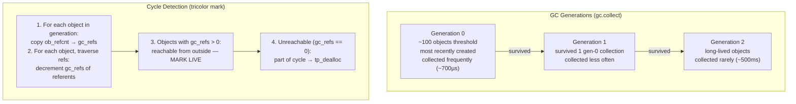

**GIL interaction**: Cyclic GC runs with GIL held (world stop). Large gen-2 collections on CPython can pause for 10-50ms — visible in latency-sensitive apps. Mitigation: `gc.disable()` + manual `gc.collect()` scheduling, or avoid reference cycles.

---

## 3. CPython Bytecode and Eval Loop

### Compilation Pipeline

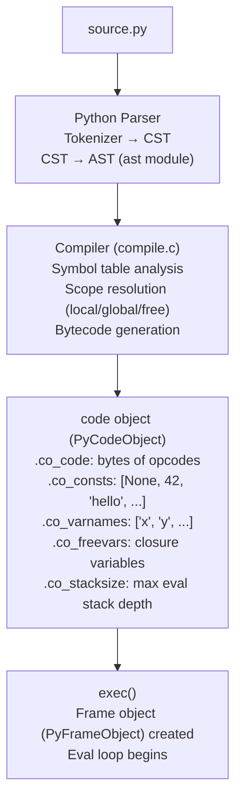

### PyCodeObject and PyFrameObject

```c
typedef struct {
    PyObject_HEAD
    int co_argcount;        // number of positional args
    int co_nlocals;         // number of local variables
    int co_stacksize;       // max eval stack depth needed
    PyObject *co_code;      // bytes: [opcode, arg, opcode, arg, ...]
    PyObject *co_consts;    // tuple: constants referenced by LOAD_CONST
    PyObject *co_varnames;  // tuple: local variable names
    PyObject *co_freevars;  // tuple: names from enclosing scope (closures)
    PyObject *co_filename;
    int co_firstlineno;
    PyObject *co_lnotab;    // line number table: offset → lineno mapping
} PyCodeObject;

typedef struct _frame {
    PyObject_VAR_HEAD
    struct _frame *f_back;      // caller frame (linked list)
    PyCodeObject *f_code;       // code object being executed
    PyObject **f_locals;        // local variable array
    PyObject **f_valuestack;    // base of eval stack
    PyObject **f_stacktop;      // top of eval stack (current)
    int f_lasti;                // index of last attempted instruction
    int f_lineno;               // current line number
} PyFrameObject;
```

### Bytecode — Example Disassembly

```python
def add(a, b):
    return a + b

import dis
dis.dis(add)
```

```
  2           0 LOAD_FAST                0 (a)    ← push locals[0] onto eval stack
              2 LOAD_FAST                1 (b)    ← push locals[1]
              4 BINARY_ADD                        ← pop 2, push result
              6 RETURN_VALUE                      ← pop and return
```

### CPython Eval Loop (ceval.c) — Simplified

```c
for (;;) {
    opcode = *next_instr++;
    oparg  = *next_instr++;
    
    switch(opcode) {
    case LOAD_FAST:
        PyObject *val = fastlocals[oparg];
        Py_INCREF(val);
        PUSH(val);
        break;
    case BINARY_ADD:
        PyObject *right = POP();
        PyObject *left  = TOP();
        PyObject *res   = PyNumber_Add(left, right);  // dispatch through nb_add slot
        Py_DECREF(right); Py_DECREF(left);
        SET_TOP(res);
        break;
    case RETURN_VALUE:
        return POP();
    // ... ~150 more opcodes
    }
    
    // Check for GIL release every sys.getswitchinterval() (5ms default)
    if (--eval_breaker) { check_signals(); maybe_release_GIL(); }
}
```

---

## 4. The GIL — Global Interpreter Lock

### What the GIL Protects

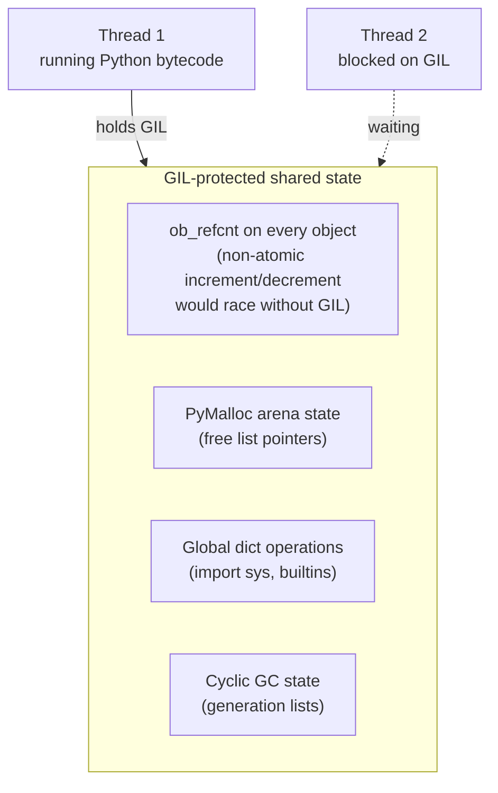

### GIL Release Mechanism

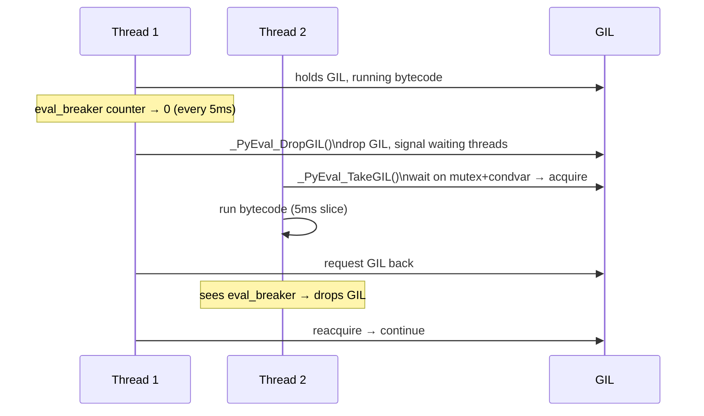

**GIL-free operations**: I/O (read/write/socket), numpy C extensions, ctypes calls — all release GIL while in C code. CPU-bound C extensions (hashlib, zlib, etc.) also release GIL. Only pure Python bytecode execution holds GIL continuously.

**True parallelism**: `multiprocessing` module — separate processes, separate GILs, communicate via pipes/shared memory. PEP 703 (CPython 3.13 experimental): no-GIL build using per-object fine-grained locks and biased reference counting.

---

## 5. Python Memory Manager — PyMalloc

### Three-Level Allocator

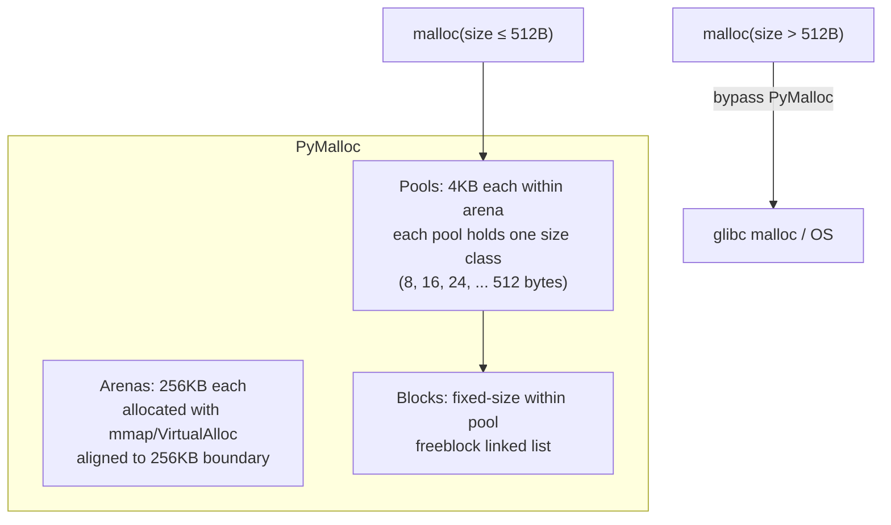

```
Arena (256KB):
+--[pool 0: 4KB]--+--[pool 1: 4KB]--+-- ... --+--[pool 63: 4KB]--+

Pool for 32-byte size class:
+--[header: 8B]--+--[block0: 32B]--+--[block1: 32B]-- ... --+--[block126: 32B]--+
                   ↑ freeblock linked list chains free blocks
```

**usedpools[64]**: Array of pool pointers, one per size class. `malloc(size)` → round up to 8-byte boundary → `size_class = (size-1) / 8` → `pool = usedpools[size_class]` → pop block from pool's freelist.

---

## 6. Descriptors and the Attribute Lookup Protocol

### Attribute Lookup Algorithm (`__getattribute__`)

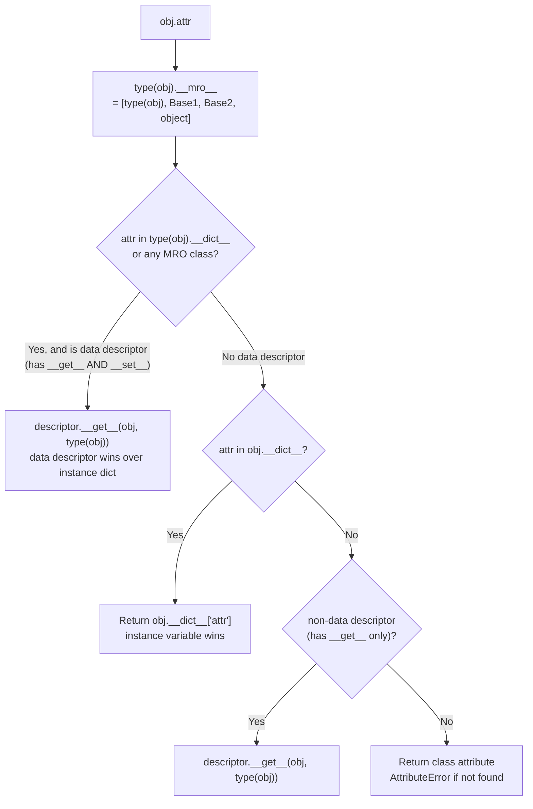

**Property** is a data descriptor:
```python
class Property:
    def __init__(self, fget): self.fget = fget
    def __get__(self, obj, cls):
        if obj is None: return self          # class access → return descriptor itself
        return self.fget(obj)                # instance access → call getter
    def __set__(self, obj, val): raise AttributeError  # data descriptor (blocks instance __dict__)
```

**Function → bound method**: `function.__get__(instance, cls)` returns a `PyMethodObject` wrapping `(self, func)`. Every `obj.method` call dynamically creates a method object (unless cached by `functools.cached_property`).

---

## 7. Generator and Coroutine Internals

### Generator Frame Suspension

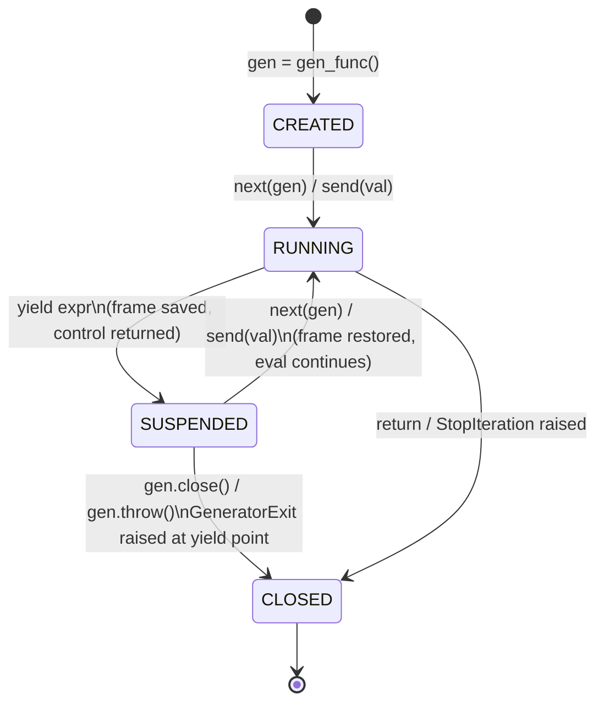

When `yield` executes:
1. Current `f_stacktop` saved in frame
2. `f_lasti` updated to current instruction index
3. Frame's `f_executing` flag cleared
4. Frame **not** freed — kept alive by generator object
5. Yielded value returned to `next()` caller

When `next()` resumes:
1. Same `PyFrameObject` passed back to `_PyEval_EvalFrameDefault()`
2. `f_lasti` resumes from saved instruction
3. Eval stack restored from `f_valuestack`

### async/await — Event Loop Integration

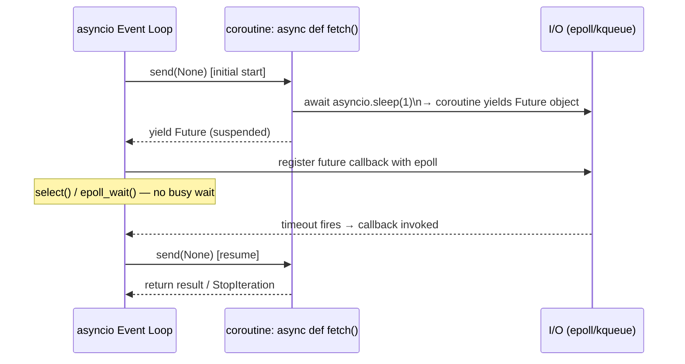

`await expr` compiles to `GET_AWAITABLE` + `YIELD_FROM` bytecodes. The coroutine object is itself an iterator whose `__next__` drives the inner awaitable until it completes.

---

## 8. Python's Data Model — Special Methods and Slots

### Type Object Slots

```c
typedef struct _typeobject {
    PyObject_VAR_HEAD
    const char *tp_name;           // "int", "str", "list", ...
    Py_ssize_t tp_basicsize;       // sizeof(PyXxxObject)
    
    // Number protocol
    PyNumberMethods *tp_as_number; // nb_add, nb_sub, nb_mul, nb_truediv, ...
    
    // Sequence protocol  
    PySequenceMethods *tp_as_sequence; // sq_length, sq_item, sq_contains, ...
    
    // Mapping protocol
    PyMappingMethods *tp_as_mapping;   // mp_length, mp_subscript, ...
    
    // Core slots
    hashfunc tp_hash;       // __hash__
    reprfunc tp_repr;       // __repr__
    ternaryfunc tp_call;    // __call__
    destructor tp_dealloc;  // called when ob_refcnt → 0
    
    // Attribute access
    getattrofunc tp_getattro;  // __getattr__/__getattribute__
    setattrofunc tp_setattro;  // __setattr__/__delattr__
    
    PyObject *tp_dict;      // class __dict__
    PyObject *tp_bases;     // tuple of base classes
    PyObject *tp_mro;       // tuple: Method Resolution Order
} PyTypeObject;
```

`a + b` → `PyNumber_Add(a, b)` → check `type(a)->tp_as_number->nb_add` → if NotImplemented, check `type(b)->tp_as_number->nb_add`. Special methods bypassed for built-in types (direct slot call, faster than dict lookup).

---

## 9. Dictionary Internals — Compact Hash Table

### CPython dict (Python 3.6+ compact layout)

```
indices array (sparse):
[0]: slot=2   [1]: empty   [2]: slot=0   [3]: slot=1   ...
  ↑ 1 byte per entry (small dicts), 2 or 4 for larger

entries array (dense):
slot 0: {hash=0x..., key="name",   value="Alice"}
slot 1: {hash=0x..., key="age",    value=30}
slot 2: {hash=0x..., key="region", value="US"}
```

Lookup `d["age"]`:
1. `h = hash("age")` → e.g. `0x7f3a...`
2. `i = h % len(indices)` → index into indices array
3. `slot = indices[i]` → 1 (if hit, or LINEAR_PROBE on collision)
4. `entries[1].hash == h` and `entries[1].key == "age"` → return `entries[1].value`

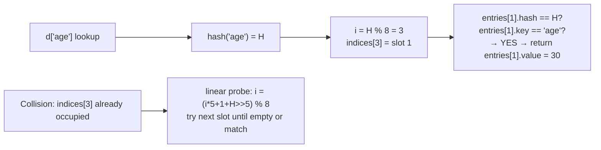

**Dict resize**: When `size / capacity > 2/3`, resize to `capacity * 2`. Entire indices array rebuilt. All entries rehashed. Dict keeps insertion order (guaranteed since Python 3.7) via dense entries array maintaining insertion sequence.

---

## 10. Import System Internals

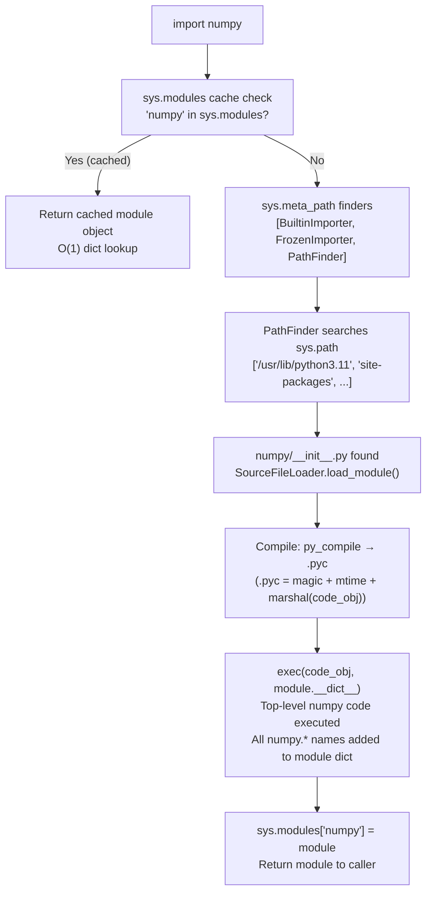

**.pyc cache**: `__pycache__/numpy.cpython-311.pyc`. Magic number = interpreter version. If source mtime unchanged and magic matches → load bytecode directly, skip recompile. `marshal.loads()` deserializes code object from .pyc bytes.

---

## 11. Python Performance Internals

### Profiling at Bytecode Level

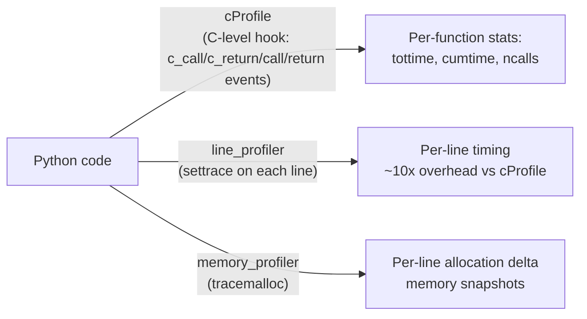

### Common Performance Patterns

| Pattern | Why Slow | Fix |
|---------|----------|-----|
| `str += str` in loop | O(n²) — new allocation each concat | `''.join(list)` |
| `[x for x in gen] * N` | Eagerly materializes | lazy iteration |
| `dict[key]` in loop without `.get()` | KeyError exception path | `dict.get(key, default)` |
| Global variable access | `LOAD_GLOBAL` → dict lookup | bind to local: `g = global_var` |
| `append` vs `extend` | Repeated single-item inserts | batch with `extend` |
| Pure Python loops | ~100 bytecodes/µs | numpy vectorization |

### NumPy — How it Bypasses CPython Slowness

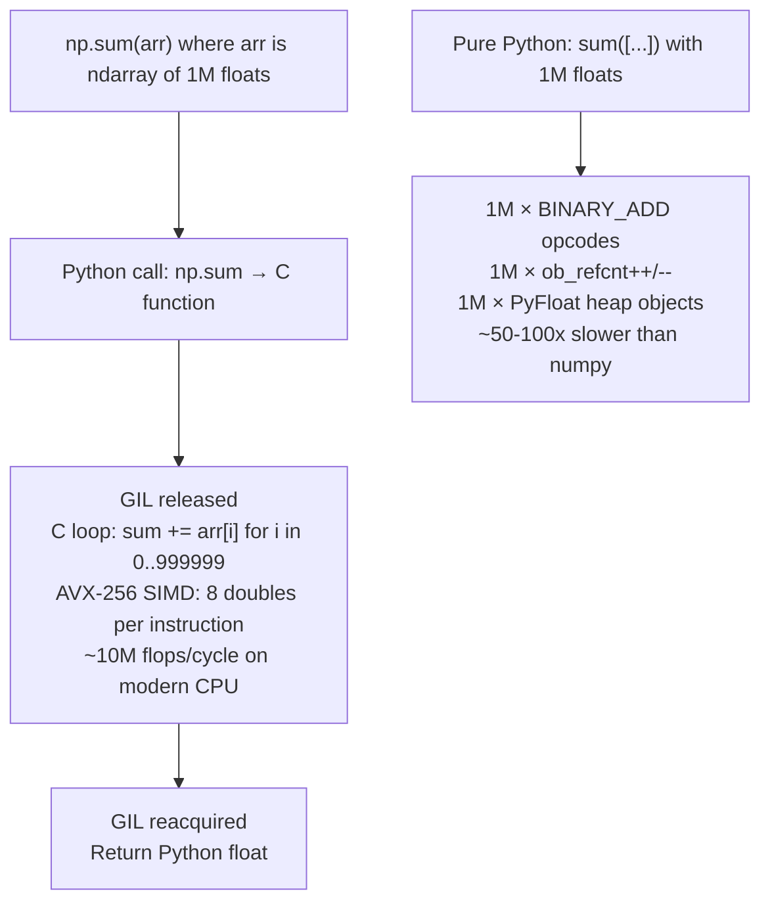

---

## Python Runtime Numbers Reference

| Operation | Time | Notes |
|-----------|------|-------|
| Python bytecode execution | ~100 ns/opcode | per eval loop iteration |
| Function call overhead | ~100-200 ns | frame create + locals setup |
| Attribute lookup (dict) | ~50-100 ns | LOAD_ATTR + tp_getattro |
| Method call (bound method) | ~200-300 ns | __get__ + call overhead |
| List append | ~50 ns | amortized (capacity doubling) |
| Dict lookup | ~50-100 ns | hash + index + compare |
| GC cycle collection (gen-0) | ~100 µs | ~100 objects |
| GC cycle collection (gen-2) | ~10-100 ms | thousands of objects |
| Import cached module | ~100 ns | sys.modules dict lookup |
| Import cold (compile+exec) | 10-500 ms | compile + exec top-level code |
| Thread GIL switch interval | 5 ms | sys.getswitchinterval() |
