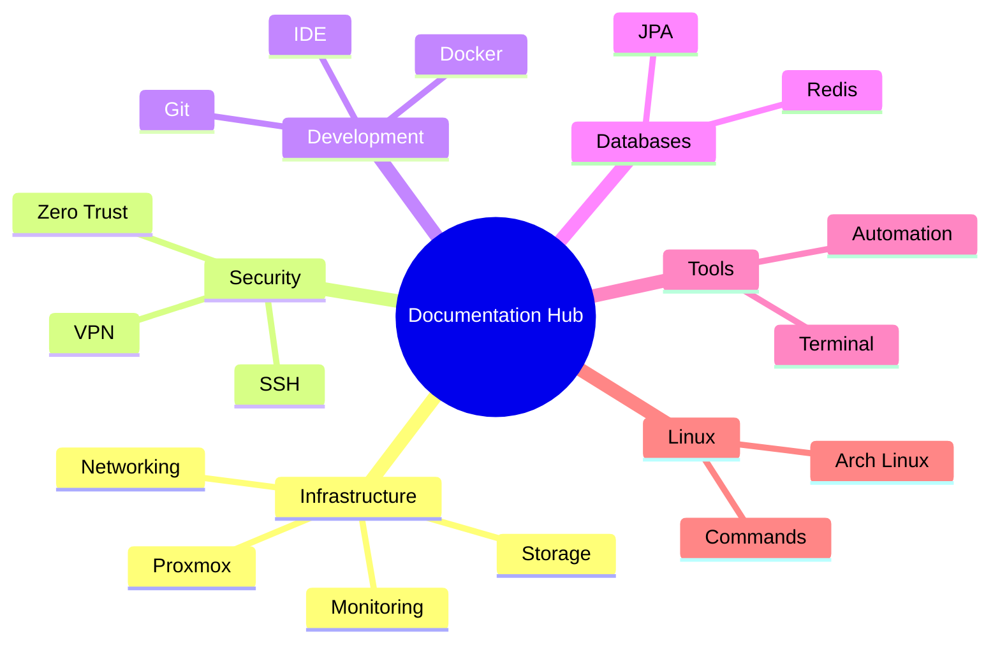

# Documentation Hub

인프라, 개발, 운영에 관한 종합 기술 문서 허브에 오신 것을 환영합니다.

---

## 빠른 시작

-   :material-server:{ .lg .middle } __인프라__

    ---

    서버 구성, 네트워크 설정, 스토리지 관리, 모니터링 가이드

    [:octicons-arrow-right-24: 인프라 문서](infrastructure/index.md)

-   :material-shield-lock:{ .lg .middle } __보안__

    ---

    SSH 설정, 접근 제어, VPN 구성, Zero Trust 아키텍처

    [:octicons-arrow-right-24: 보안 문서](security/index.md)

-   :material-code-braces:{ .lg .middle } __개발__

    ---

    Docker, Git, IDE 설정, 프로그래밍 언어 환경 구성

    [:octicons-arrow-right-24: 개발 문서](development/index.md)

-   :material-database:{ .lg .middle } __데이터베이스__

    ---

    데이터베이스 설치, Redis 캐싱, JPA/QueryDSL 활용

    [:octicons-arrow-right-24: 데이터베이스 문서](databases/index.md)

---

## 주요 문서

### 인프라 설정
| 문서 | 설명 |
|------|------|
| [Proxmox 클러스터](infrastructure/proxmox/cluster.md) | 가상화 플랫폼 클러스터 구성 |
| [네트워크 설정](infrastructure/networking/network-settings.md) | Linux 네트워크 구성 가이드 |
| [Prometheus/Grafana](infrastructure/monitoring/prometheus-grafana-loki.md) | 모니터링 스택 구축 |

### 보안 강화
| 문서 | 설명 |
|------|------|
| [SSH 설정](security/ssh/configuration.md) | SSH 보안 구성 및 최적화 |
| [Tailscale VPN](security/vpn/tailscale.md) | 제로 설정 VPN 구축 |
| [Cloudflare Zero Trust](security/zerotrust/cloudflare.md) | 제로 트러스트 네트워크 |

### 개발 환경
| 문서 | 설명 |
|------|------|
| [Docker 명령어](development/docker/commands.md) | Docker 활용 가이드 |
| [Git 브랜치 관리](development/git/branch-management.md) | Git 워크플로우 |
| [VS Code 설정](development/ide/vscode-plugins.md) | 개발 환경 최적화 |

---

## 카테고리별 탐색

---

## 문서 기여

이 문서는 오픈소스로 관리됩니다. 오류 발견이나 개선 제안은 GitHub에서 Pull Request를 제출해 주세요.

[:material-github: GitHub에서 편집](https://github.com/nodove/document){ .md-button .md-button--primary }
