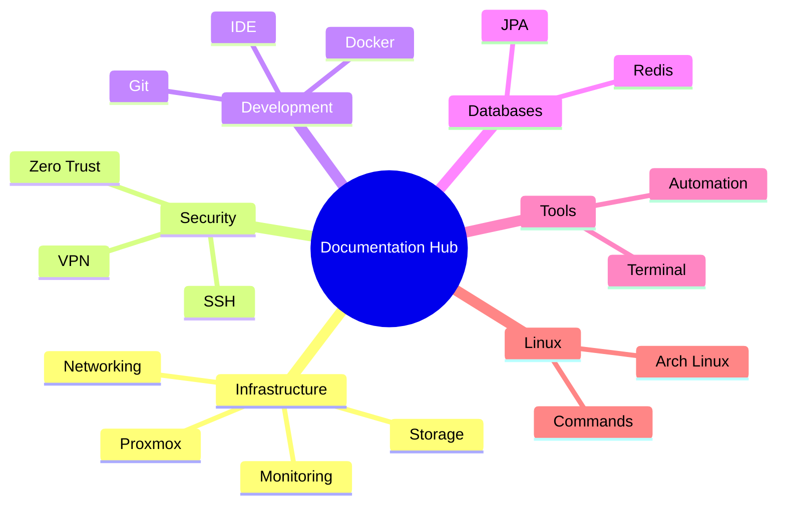

# Documentation Hub

인프라, 개발, 운영에 관한 종합 기술 문서 허브에 오신 것을 환영합니다.

---

## :material-rocket-launch: 빠른 시작

-   :material-server:{ .lg .middle } __인프라__

    ---

    서버 구성, 네트워크 설정, 스토리지 관리, 모니터링 가이드

    [:octicons-arrow-right-24: 인프라 문서](infrastructure/index.md)

-   :material-shield-lock:{ .lg .middle } __보안__

    ---

    SSH 설정, 접근 제어, VPN 구성, Zero Trust 아키텍처

    [:octicons-arrow-right-24: 보안 문서](security/index.md)

-   :material-code-braces:{ .lg .middle } __개발__

    ---

    Docker, Git, IDE 설정, 프로그래밍 언어 환경 구성

    [:octicons-arrow-right-24: 개발 문서](development/index.md)

-   :material-database:{ .lg .middle } __데이터베이스__

    ---

    데이터베이스 설치, Redis 캐싱, JPA/QueryDSL 활용

    [:octicons-arrow-right-24: 데이터베이스 문서](databases/index.md)

---

## :material-fire: 인기 문서

-   :material-console:{ .lg .middle } __터미널 도구__

    ---

    Tmux, Vim, Linux 명령어 마스터

    [:octicons-arrow-right-24: 도구 문서](tools/index.md)

-   :fontawesome-brands-linux:{ .lg .middle } __Linux__

    ---

    Linux 명령어, 파일시스템, Arch Linux 가이드

    [:octicons-arrow-right-24: Linux 문서](linux/index.md)

-   :material-cog:{ .lg .middle } __운영체제__

    ---

    CPU 스케줄링, 동기화, 데드락, 메모리 관리

    [:octicons-arrow-right-24: OS 문서](os/index.md)

-   :material-language-java:{ .lg .middle } __Java__

    ---

    Java 핵심 개념, 메모리 관리, GC 이해

    [:octicons-arrow-right-24: Java 문서](java/index.md)

---

## :material-file-document-multiple: 주요 문서

### :material-server-network: 인프라 설정

| 문서 | 설명 |
|------|------|
| [:material-server-network: Proxmox 클러스터](infrastructure/proxmox/cluster.md) | 가상화 플랫폼 클러스터 구성 |
| [:material-lan: 네트워크 설정](infrastructure/networking/network-settings.md) | Linux 네트워크 구성 가이드 |
| [:material-chart-line: Prometheus/Grafana](infrastructure/monitoring/prometheus-grafana-loki.md) | 모니터링 스택 구축 |

### :material-lock: 보안 강화

| 문서 | 설명 |
|------|------|
| [:material-key: SSH 설정](security/ssh/configuration.md) | SSH 보안 구성 및 최적화 |
| [:material-vpn: Tailscale VPN](security/vpn/tailscale.md) | 제로 설정 VPN 구축 |
| [:material-cloud-lock: Cloudflare Zero Trust](security/zerotrust/cloudflare.md) | 제로 트러스트 네트워크 |

### :material-wrench: 개발 환경

| 문서 | 설명 |
|------|------|
| [:material-docker: Docker 명령어](development/docker/commands.md) | Docker 활용 가이드 |
| [:material-source-branch: Git 브랜치 관리](development/git/branch-management.md) | Git 워크플로우 |
| [:material-microsoft-visual-studio-code: VS Code 설정](development/ide/vscode-plugins.md) | 개발 환경 최적화 |

---

## :material-sitemap: 카테고리별 탐색

---

## :material-information: 문서 정보

!!! tip "문서 업데이트"
    이 문서는 지속적으로 업데이트됩니다. 최신 정보를 확인하려면 정기적으로 방문해 주세요.

!!! info "기여하기"
    오류 발견이나 개선 제안은 GitHub에서 Pull Request를 제출해 주세요.

-   :material-github:{ .lg .middle } __GitHub에서 기여하기__

    ---

    이 문서는 오픈소스로 관리됩니다.

    [:octicons-arrow-right-24: GitHub 저장소](https://github.com/choisimo/document)

-   :material-email:{ .lg .middle } __문의하기__

    ---

    문서에 대한 질문이나 제안이 있으시면 연락주세요.

    [:octicons-arrow-right-24: 연락처](https://github.com/choisimo)

