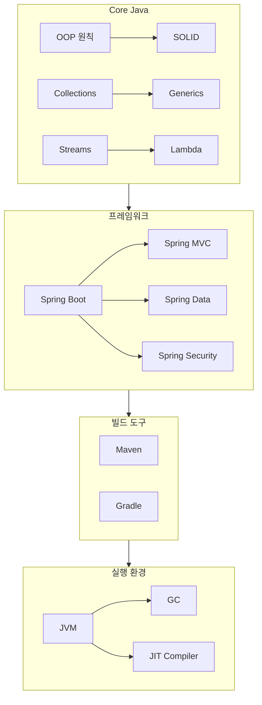
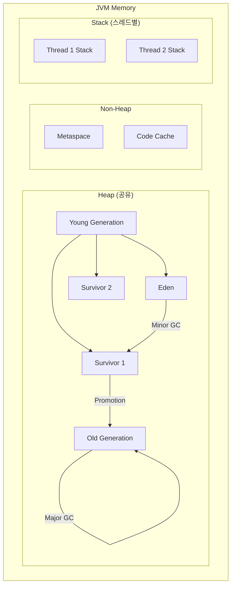

# Java 문서

Java 프로그래밍, 메모리 관리, OOP에 관한 학습 자료입니다.

---

<div class="compose-hero" markdown>
<span class="compose-kicker">Java</span>

## Java 핵심 개념, JVM 메모리 관리, GC 가이드

<div class="landing-meta-list" markdown>
<span>Core Concepts</span>
<span>Memory & GC</span>
<span>JVM</span>
</div>

<div class="compose-actions" markdown>
[:octicons-arrow-right-24: 핵심 개념](core-concepts.md){ .md-button .md-button--primary }
[:material-memory: 메모리와 GC](memory-gc.md){ .md-button }
</div>
</div>

## :material-language-java: 핵심 Java 영역

<div class="grid cards" markdown>

-   :material-book-open-variant:{ .lg .middle } **핵심 개념**

    ---

    Java 문법, 객체지향, 컬렉션 프레임워크

    [:octicons-arrow-right-24: 핵심 개념](core-concepts.md)

-   :material-memory:{ .lg .middle } **메모리와 GC**

    ---

    JVM 메모리 구조, 가비지 컬렉션 알고리즘, 튜닝

    [:octicons-arrow-right-24: 메모리와 GC](memory-gc.md)

</div>

## :fontawesome-brands-java: 문서 목록

<div class="grid cards" markdown>

-   :material-book-open-variant:{ .lg .middle } **핵심 개념**

    ---

    Java 언어의 기본 문법, 객체지향 프로그래밍, 컬렉션 프레임워크

    [:octicons-arrow-right-24: 핵심 개념](core-concepts.md)

-   :material-memory:{ .lg .middle } **메모리와 GC**

    ---

    JVM 메모리 구조, 가비지 컬렉션 알고리즘, 메모리 튜닝

    [:octicons-arrow-right-24: 메모리와 GC](memory-gc.md)

</div>

---

## :material-language-java: Java 생태계 개요



---

## :material-chart-timeline: Java 버전 역사

| 버전 | 출시년도 | 주요 기능 |
|------|---------|----------|
| **Java 8** | 2014 | Lambda, Stream API, Optional |
| **Java 11** | 2018 | LTS, var, HTTP Client |
| **Java 17** | 2021 | LTS, Sealed Classes, Pattern Matching |
| **Java 21** | 2023 | LTS, Virtual Threads, Record Patterns |

---

## :material-head-cog: JVM 메모리 구조



---

## :material-checkbox-marked-circle: OOP 4대 원칙

| 원칙 | 영문 | 설명 | 키워드 |
|------|------|------|--------|
| **캡슐화** | Encapsulation | 데이터와 메서드를 하나로 묶고 외부 접근 제한 | `private`, getter/setter |
| **상속** | Inheritance | 기존 클래스의 특성을 새 클래스가 물려받음 | `extends`, `super` |
| **다형성** | Polymorphism | 같은 인터페이스로 다른 동작 구현 | `@Override`, 인터페이스 |
| **추상화** | Abstraction | 복잡한 구현을 숨기고 필요한 기능만 노출 | `abstract`, `interface` |

---

## :material-package-variant: 필수 패키지

### java.util

```java
// 컬렉션 프레임워크
List<String> list = new ArrayList<>();
Map<String, Integer> map = new HashMap<>();
Set<String> set = new HashSet<>();

// Optional
Optional<String> opt = Optional.ofNullable(value);
opt.orElse("default");
```

### java.util.stream

```java
// Stream API
List<Integer> result = numbers.stream()
    .filter(n -> n > 0)
    .map(n -> n * 2)
    .sorted()
    .collect(Collectors.toList());
```

### java.util.concurrent

```java
// 동시성
ExecutorService executor = Executors.newFixedThreadPool(4);
CompletableFuture<String> future = CompletableFuture
    .supplyAsync(() -> "result")
    .thenApply(s -> s.toUpperCase());
```

---

## :material-link-variant: 관련 문서

- [JPA 개요](../databases/jpa/overview.md) - Java 영속성 API
- [Spring Boot Redis](../databases/redis/springboot-integration.md) - Redis 연동
- [Java 설치 가이드](../development/languages/java-install.md) - JDK 설치

---

## :material-book-open-page-variant: 참고 자료

- [Oracle Java Documentation](https://docs.oracle.com/en/java/)
- [Baeldung](https://www.baeldung.com/) - Java 튜토리얼
- [Java Design Patterns](https://java-design-patterns.com/)
