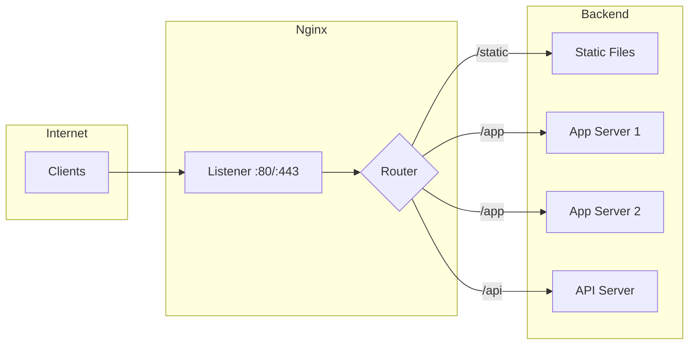

# Nginx Documentation

> Nginx web server configuration, optimization, and proxy management

---

<div class="compose-hero" markdown>
<span class="compose-kicker">Nginx</span>

## Nginx 설정, 리버스 프록시, Kubernetes 배포 가이드

<div class="landing-meta-list" markdown>
<span>Configuration</span>
<span>Proxy Manager</span>
<span>K8s Deployment</span>
</div>

<div class="compose-actions" markdown>
[:octicons-arrow-right-24: Nginx 설정](configuration.md){ .md-button .md-button--primary }
[:material-arrow-decision: Proxy Manager](proxy-manager.md){ .md-button }
</div>
</div>

## :material-web: 핵심 Nginx 영역

<div class="grid cards" markdown>

-   :material-cog:{ .lg .middle } **Configuration**

    ---

    가상 호스트, SSL, 최적화 설정 가이드

    [:octicons-arrow-right-24: View Guide](configuration.md)

-   :material-arrow-decision:{ .lg .middle } **Proxy Manager**

    ---

    Nginx Proxy Manager 설치 및 사용

    [:octicons-arrow-right-24: View Guide](proxy-manager.md)

-   :material-docker:{ .lg .middle } **Docker & K8s**

    ---

    Docker 및 Kubernetes 환경 배포

    [:octicons-arrow-right-24: View Guide](docker-k8s-deployment.md)

</div>

---

## Nginx Architecture



---

## Common Use Cases

| Use Case | Description | Config Section |
|----------|-------------|----------------|
| **Static Hosting** | Serve HTML, CSS, JS files | `root`, `index` |
| **Reverse Proxy** | Forward to backend servers | `proxy_pass` |
| **Load Balancing** | Distribute traffic | `upstream` |
| **SSL Termination** | Handle HTTPS | `ssl_certificate` |
| **Caching** | Cache static content | `proxy_cache` |

---

## Quick Reference

### Basic Server Block

```nginx
server {
    listen 80;
    server_name example.com;
    root /var/www/html;
    
    location / {
        try_files $uri $uri/ =404;
    }
}
```

### Reverse Proxy

```nginx
server {
    listen 80;
    server_name api.example.com;
    
    location / {
        proxy_pass http://localhost:3000;
        proxy_set_header Host $host;
        proxy_set_header X-Real-IP $remote_addr;
    }
}
```

### Load Balancer

```nginx
upstream backend {
    server 192.168.1.10:8080 weight=3;
    server 192.168.1.11:8080 weight=2;
    server 192.168.1.12:8080 backup;
}

server {
    listen 80;
    location / {
        proxy_pass http://backend;
    }
}
```

---

## Essential Commands

```bash
# Test configuration
sudo nginx -t

# Reload configuration
sudo systemctl reload nginx

# View logs
tail -f /var/log/nginx/access.log
tail -f /var/log/nginx/error.log
```

---

## Related Documentation

- [Docker Networking](../development/docker/networking.md)
- [SSL/TLS Configuration](../security/ssh/configuration.md)
- [HAProxy Configuration](../../configs/haproxy/)
