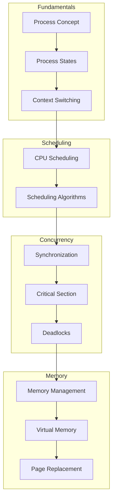
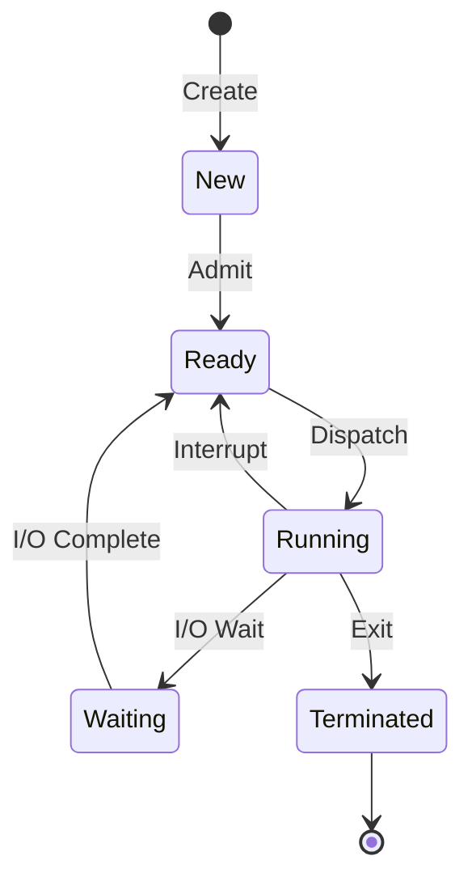

# Operating Systems

> Operating system theory and concepts for computer science studies

---

<div class="compose-hero" markdown>
<span class="compose-kicker">Operating Systems</span>

## CPU 스케줄링, 동기화, 메모리 관리 등 OS 핵심 개념 문서

<div class="landing-meta-list" markdown>
<span>CPU Scheduling</span>
<span>Synchronization</span>
<span>Memory</span>
<span>Deadlocks</span>
</div>

<div class="compose-actions" markdown>
[:octicons-arrow-right-24: CPU Scheduling](cpu-scheduling.md){ .md-button .md-button--primary }
[:material-memory: Memory Management](memory.md){ .md-button }
</div>
</div>

## :material-chip: 핵심 OS 영역

<div class="grid cards" markdown>

-   :material-clock-fast:{ .lg .middle } **CPU Scheduling**

    ---

    FCFS, SJF, Priority, Round Robin, MLFQ 스케줄링 알고리즘

    [:octicons-arrow-right-24: View Guide](cpu-scheduling.md)

-   :material-sync:{ .lg .middle } **Synchronization**

    ---

    Mutex, 세마포어, 모니터, 임계 구역

    [:octicons-arrow-right-24: View Guide](synchronization.md)

-   :material-memory:{ .lg .middle } **Memory Management**

    ---

    가상 메모리, 페이징, 세그멘테이션

    [:octicons-arrow-right-24: View Guide](memory.md)

-   :material-lock:{ .lg .middle } **Deadlocks**

    ---

    교착상태 조건, 방지, 회피, 탐지

    [:octicons-arrow-right-24: View Guide](deadlocks.md)

</div>

## Topics

<div class="grid cards" markdown>

-   :material-clock-fast:{ .lg .middle } **CPU Scheduling**

    ---

    Process scheduling algorithms: FCFS, SJF, Priority, Round Robin, MLFQ.

    [:octicons-arrow-right-24: View Guide](cpu-scheduling.md)

-   :material-sync:{ .lg .middle } **Synchronization**

    ---

    Mutex, semaphores, monitors, and critical section problems.

    [:octicons-arrow-right-24: View Guide](synchronization.md)

-   :material-lock:{ .lg .middle } **Deadlocks**

    ---

    Deadlock conditions, prevention, avoidance, and detection.

    [:octicons-arrow-right-24: View Guide](deadlocks.md)

-   :material-memory:{ .lg .middle } **Memory Management**

    ---

    Virtual memory, paging, segmentation, and page replacement.

    [:octicons-arrow-right-24: View Guide](memory.md)

-   :material-application-cog:{ .lg .middle } **Process Management**

    ---

    Process creation, fork(), exec(), and inter-process communication.

    [:octicons-arrow-right-24: View Guide](process.md)

-   :material-server-network:{ .lg .middle } **Virtualization**

    ---

    Hypervisor mechanisms and Docker vs VM isolation comparison.

    [:octicons-arrow-right-24: View Guide](virtualization.md)

-   :material-graph:{ .lg .middle } **Distributed Deadlocks**

    ---

    Deadlock handling in distributed systems and Edge Chasing algorithm.

    [:octicons-arrow-right-24: View Guide](distributed-deadlocks.md)

</div>

---

## Learning Path



---

## Key Concepts

### Process States



### Scheduling Algorithms Comparison

| Algorithm | Preemptive | Starvation | Best For |
|-----------|------------|------------|----------|
| **FCFS** | No | No | Batch systems |
| **SJF** | Both | Yes | Short jobs |
| **Priority** | Both | Yes | Real-time |
| **Round Robin** | Yes | No | Time-sharing |
| **MLFQ** | Yes | No | General purpose |

### Deadlock Conditions

All four conditions must hold simultaneously:

1. **Mutual Exclusion** - Resource held exclusively
2. **Hold and Wait** - Process holding while waiting
3. **No Preemption** - Cannot forcibly remove
4. **Circular Wait** - Circular chain of processes

---

## Quick Formulas

### CPU Scheduling

```
Turnaround Time = Completion Time - Arrival Time
Waiting Time = Turnaround Time - Burst Time
Response Time = First Response - Arrival Time
Throughput = Number of Processes / Total Time
CPU Utilization = (CPU Busy Time / Total Time) × 100%
```

### Memory Management

```
Page Number = Virtual Address / Page Size
Page Offset = Virtual Address % Page Size
Physical Address = (Frame Number × Page Size) + Offset
```

---

## Related Documentation

- [Linux Process Management](../infrastructure/monitoring/process-management.md)
- [Compiler Theory](../compiler/index.md)
