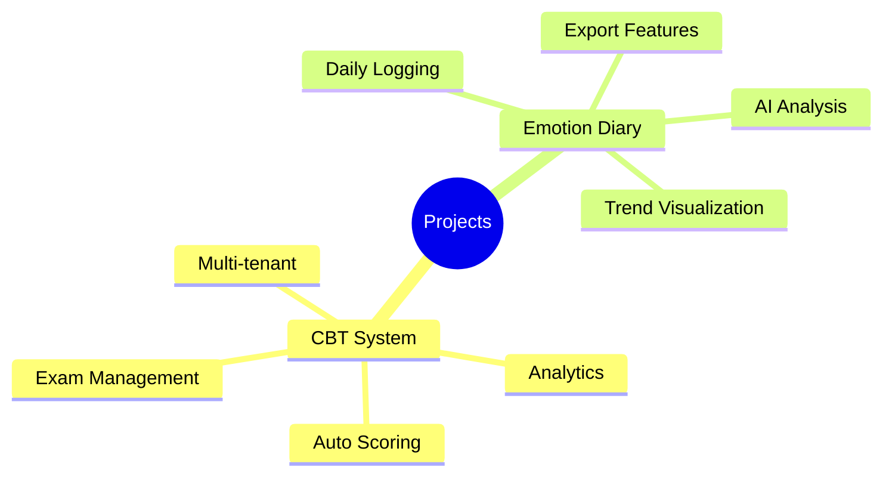

# Projects Documentation

> Project planning, architecture, and implementation documents

---

Projects

## CBT 시스템, 감정 일기 등 실제 프로젝트 아키텍처 문서

CBT System
Emotion Diary
Spring Boot
React

[:octicons-arrow-right-24: CBT System](cbt-system.md){ .md-button .md-button--primary }
[:material-emoticon-happy: Emotion Diary](emotion-diary.md){ .md-button }

## Active Projects

-   :material-school:{ .lg .middle } **CBT System**

    ---

    Computer-Based Testing platform for exam management and automated scoring.

    [:octicons-arrow-right-24: View Documentation](cbt-system.md)

-   :material-emoticon-happy:{ .lg .middle } **Emotion Diary**

    ---

    Emotional tracking application with AI-powered analysis and insights.

    [:octicons-arrow-right-24: View Documentation](emotion-diary.md)

---

## Project Overview

---

## Quick Links

| Project | Stack | Status |
|---------|-------|--------|
| [CBT System](cbt-system.md) | Spring Boot, React, PostgreSQL | Active |
| [Emotion Diary](emotion-diary.md) | React, TypeScript, Spring Boot, MySQL | Active |

---

## Project Templates

Looking to start a new project? Check out:

- [Architecture Design Prompts](../prompts/architecture.md)
- [Database Schema Guide](../prompts/database.md)
