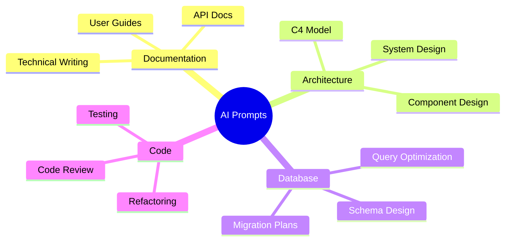

# Prompts & Templates

> AI prompt engineering resources and templates for documentation

---

<div class="compose-hero" markdown>
<span class="compose-kicker">Prompts</span>

## 문서 편집, 데이터베이스, 아키텍처 AI 프롬프트 템플릿

<div class="landing-meta-list" markdown>
<span>Document Editor</span>
<span>Database</span>
<span>Architecture</span>
</div>

<div class="compose-actions" markdown>
[:octicons-arrow-right-24: Document Editor](docs-editor.md){ .md-button .md-button--primary }
[:material-sitemap: Architecture 가이드](architecture.md){ .md-button }
</div>
</div>

## :material-robot: 핵심 프롬프트 영역

<div class="grid cards" markdown>

-   :material-file-document-edit:{ .lg .middle } **Document Editor**

    ---

    기술 문서 작성 및 유지 관리 가이드라인

    [:octicons-arrow-right-24: View Guide](docs-editor.md)

-   :material-database:{ .lg .middle } **Database Prompt**

    ---

    데이터베이스 스키마 설계 및 최적화 프롬프트

    [:octicons-arrow-right-24: View Prompt](database.md)

-   :material-sitemap:{ .lg .middle } **Architecture Design**

    ---

    소프트웨어 아키텍처 문서화 프롬프트

    [:octicons-arrow-right-24: View Guide](architecture.md)

</div>

## Available Prompts

<div class="grid cards" markdown>

-   :material-file-document-edit:{ .lg .middle } **Document Editor**

    ---

    Guidelines for writing and maintaining technical documentation.

    [:octicons-arrow-right-24: View Guide](docs-editor.md)

-   :material-database:{ .lg .middle } **Database Prompt**

    ---

    Prompts for database schema design and optimization.

    [:octicons-arrow-right-24: View Prompt](database.md)

-   :material-sitemap:{ .lg .middle } **Architecture Design**

    ---

    Comprehensive prompts for software architecture documentation.

    [:octicons-arrow-right-24: View Guide](architecture.md)

</div>

---

## Prompt Categories



---

## Usage Guidelines

### Best Practices

1. **Be Specific**: Provide clear context and requirements
2. **Use Examples**: Include sample inputs/outputs when possible
3. **Iterate**: Refine prompts based on results
4. **Document**: Keep track of effective prompts

### Prompt Structure

```markdown
# Role
Define the AI's persona and expertise level

# Context
Provide background information and constraints

# Task
Clearly state what needs to be accomplished

# Output Format
Specify the expected format and structure

# Examples (Optional)
Show sample inputs and expected outputs
```

---

## Related Resources

- [MkDocs Material Documentation](https://squidfunk.github.io/mkdocs-material/)
- [Diátaxis Framework](https://diataxis.fr/)
- [C4 Model](https://c4model.com/)
