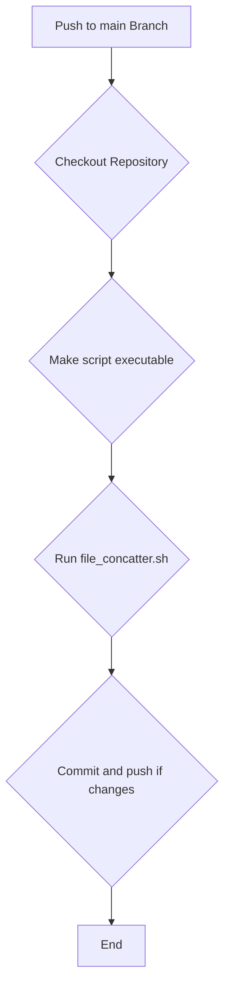

Okay, I can help you with that! To automatically run your `file_concatter.sh` script, create a `total` directory, and place the output file (let's call it `total.txt`) inside it every time you push to your GitHub project, you'll need to use **GitHub Actions**.

Here's how you can set it up:

## 1. Modify Your Shell Script (Optional but Recommended)

It's good practice for your script to handle the directory creation and specific output path.

Here's an updated version of your `file_concatter.sh` script. I've made the following changes:
* The default output directory is now `total/`.
* The default output filename is `total.txt`.
* The script will create the `total` directory if it doesn't exist.

```bash
#!/bin/bash

# 기본값 설정
start_dir="."  # 검색을 시작할 기본 디렉토리 (현재 디렉토리)
output_dir="total" # 결과 파일을 저장할 기본 디렉토리 이름
output_file_name="total.txt" # 결과 파일의 기본 이름
output_path="$output_dir/$output_file_name" # 결과 파일의 전체 경로

# 도움말 표시 함수
show_help() {
    echo "사용법: $0 [옵션]"
    echo "옵션:"
    echo "  -d, --directory DIR  검색 시작 디렉토리 지정 (기본값: 현재 디렉토리)"
    echo "  -o, --output FILE    출력 파일 지정 (기본값: $output_dir/$output_file_name)"
    echo "  -h, --help           도움말 표시"
    exit 0
}

# 인자 파싱을 위한 루프
# $# : 전달된 인자의 총 개수
# [[ $# -gt 0 ]] : 처리할 인자가 남아있는 동안 루프 실행
while [[ $# -gt 0 ]]; do
    case $1 in # 첫 번째 인자($1)를 기준으로 분기
        -d|--directory) # -d 또는 --directory 옵션일 경우
            start_dir="$2" # 다음 인자($2)를 start_dir 변수에 할당
            shift 2 # 처리된 인자 두 개를 제거 (옵션 이름, 옵션 값)
            ;;
        -o|--output) # -o 또는 --output 옵션일 경우
            output_path="$2" # 다음 인자($2)를 output_path 변수에 할당
            output_dir=$(dirname "$output_path") # output_path에서 디렉토리 부분만 추출
            output_file_name=$(basename "$output_path") # output_path에서 파일 이름만 추출
            shift 2 # 처리된 인자 두 개를 제거
            ;;
        -h|--help) # -h 또는 --help 옵션일 경우
            show_help # 도움말 함수 호출
            ;;
        *) # 그 외 알 수 없는 옵션일 경우
            echo "알 수 없는 옵션: $1"
            show_help # 도움말 함수 호출 후 종료
            ;;
    esac
done

# 시작 디렉토리가 실제로 존재하는지 확인
if [ ! -d "$start_dir" ]; then
    echo "오류: 디렉토리 '$start_dir'가 존재하지 않습니다."
    exit 1 # 오류 코드 1로 종료
fi

# 출력 디렉토리 생성 (존재하지 않을 경우에만)
# -p 옵션: 필요하다면 상위 디렉토리까지 함께 생성
mkdir -p "$output_dir"
# 출력 디렉토리 생성 성공 여부 확인
if [ ! -d "$output_dir" ]; then
    echo "오류: 출력 디렉토리 '$output_dir'를 생성할 수 없습니다."
    exit 1 # 오류 코드 1로 종료
fi

# 결과 파일 초기화 (기존 내용 삭제 또는 새 파일 생성)
> "$output_path"

echo "디렉토리 '$start_dir'에서 .h 및 .cpp 파일을 검색하여 '$output_path'에 병합합니다..."

# 파일 카운터 초기화 (find로 찾은 파일 수를 세기 위함)
file_count=0

# 재귀적으로 .h와 .cpp 파일 찾기
# find "$start_dir" : 지정된 디렉토리부터 검색 시작
# -type f : 일반 파일만 대상으로 함 (디렉토리 등 제외)
# \( -name "*.h" -o -name "*.cpp" \) : 이름이 .h로 끝나거나 .cpp로 끝나는 파일 검색 (-o는 OR 연산자)
# -print0 : 찾은 파일 목록을 null 문자로 구분하여 출력 (파일명에 공백 등이 포함된 경우 안전)
# while IFS= read -r -d $'\0' file; do ... done : find의 출력을 한 줄씩 안전하게 읽어 처리
#   IFS= : 필드 구분자를 설정하지 않아 라인 앞뒤 공백 유지
#   read -r : 백슬래시를 이스케이프 문자로 해석하지 않음
#   -d $'\0' : null 문자를 기준으로 라인을 읽음
find "$start_dir" -type f \( -name "*.h" -o -name "*.cpp" \) -print0 |
while IFS= read -r -d $'\0' file; do
    # 'total' 디렉토리 내의 파일은 건너뛰기 (무한 루프 방지 목적)
    # 스크립트가 실수로 output_path 자체를 입력으로 처리하는 것을 방지
    if [[ "$file" == "$output_dir"* ]]; then
        continue # 현재 루프의 나머지 부분을 건너뛰고 다음 파일 처리
    fi

    # 파일 카운터 증가
    ((file_count++))

    # 진행 상황 표시 (어떤 파일이 처리 중인지 보여줌)
    echo "처리 중: $file"

    # 파일 구분자 추가 (결과 파일에서 각 파일의 시작을 명확히 표시)
    echo -e "\n\n===== $file =====\n" >> "$output_path"

    # 파일 내용을 결과 파일에 추가
    cat "$file" >> "$output_path"
done

# 병합 완료 메시지
# find 명령어와 파이프라인으로 연결된 while 루프 내에서 변경된 변수는
# 서브셸에서 실행되기 때문에 메인 스크립트에서 직접 접근하기 어려울 수 있음.
# 따라서, 실제 처리된 파일 수는 결과 파일의 구분자(===== ... =====) 개수를 세어 확인.
actual_files_processed_count=$(grep -c "^===== .* ====$" "$output_path")

# 처리된 파일이 실제로 있는지 여부에 따라 다른 메시지 출력
if [ "$actual_files_processed_count" -eq "0" ] && [ "$file_count" -eq "0" ]; then
    # find로 찾은 파일도 없고, grep으로 찾은 구분자도 없으면 실제 처리 파일이 없는 것
    echo "주의: 병합할 .h 또는 .cpp 파일을 찾지 못했습니다."
    # 필요하다면, 빈 결과 파일 및 디렉토리 삭제 로직 추가
    # 예: rm -f "$output_path"
    # 예: rmdir "$output_dir" 2>/dev/null # 디렉토리가 비었을 경우에만 삭제 (에러 메시지 숨김)
else
    echo "완료: $actual_files_processed_count 개의 파일이 '$output_path'에 병합되었습니다."
fi
```

**Key changes in the script:**
* `output_dir="total"` and `output_file_name="total.txt"` are new default variables.
* `output_path="$output_dir/$output_file_name"` combines them.
* `mkdir -p "$output_dir"` creates the `total` directory if it doesn't exist.
* The script now checks if a found file is within the `output_dir` itself to prevent trying to add `total/total.txt` to itself if the script is run multiple times or if `start_dir` includes `total`.
* Improved the final count message to be more accurate by counting the separators in the output file.

**Directory Structure Example:**

Before running the script:
project-root/
├── .git/
├── src/
│   ├── module1.h
│   ├── module1.cpp
│   └── main.cpp
├── file_concatter.sh
└── README.md

After (script creates 'total/total.txt'):
project-root/
├── .git/
├── src/
│   ├── module1.h
│   ├── module1.cpp
│   └── main.cpp
├── total/
│   └── total.txt
├── file_concatter.sh
└── README.md

---
## 2. Create a GitHub Actions Workflow File

In your GitHub repository, create a directory named `.github` and inside it, another directory named `workflows`. In the `.github/workflows` directory, create a YAML file (e.g., `main.yml` or `build_total.yml`).

```yaml
name: Generate Total Source File

on:
  push:
    branches:
      - main  # 또는 master, develop 등 기본 브랜치명으로 변경하세요.

jobs:
  build:
    runs-on: ubuntu-latest # 실행 환경을 최신 Ubuntu로 설정

    steps:
    # 1. 저장소의 코드를 워크플로우 실행 환경으로 체크아웃합니다.
    - name: Checkout repository
      uses: actions/checkout@v4 # GitHub에서 제공하는 표준 체크아웃 액션 사용

    # 2. 셸 스크립트에 실행 권한을 부여합니다.
    - name: Make script executable
      run: chmod +x ./file_concatter.sh # 스크립트 경로가 다르면 수정하세요.

    # 3. 파일 병합 스크립트를 실행합니다.
    - name: Run file_concatter.sh
      run: ./file_concatter.sh # 스크립트 경로가 다르면 수정하세요.
                               # 이 스크립트는 total/total.txt 파일을 생성/업데이트합니다.

    # 4. 변경 사항이 있을 경우 커밋하고 푸시합니다.
    - name: Commit and push if changes
      run: |
        # Git 사용자 정보 설정 (GitHub Actions 봇으로)
        git config --global user.name 'github-actions[bot]'
        git config --global user.email 'github-actions[bot]@users.noreply.github.com'

        # 생성된 파일을 Git 스테이징 영역에 추가
        git add total/total.txt # 생성된 파일 경로

        # 스테이징된 파일에 실제 변경 사항이 있는지 확인
        # `git diff --staged --quiet`는 변경 사항이 없으면 종료 코드 0을 반환합니다.
        # `!`는 종료 코드를 반전시키므로, 변경 사항이 있으면 if 조건문이 참이 됩니다.
        if ! git diff --staged --quiet; then
          # 변경 사항이 있으면 커밋하고 푸시합니다.
          git commit -m "Automated: Update total.txt"
          git push
        else
          # 변경 사항이 없으면 메시지를 출력합니다.
          echo "No changes to total.txt to commit."
        fi
```

**GitHub Actions Workflow Diagram:**



**Explanation of the `main.yml` file:**

* **`name: Generate Total Source File`**: The name of your workflow, which will appear in the Actions tab of your GitHub repository.
* **`on:`**: Defines the trigger for the workflow.
    * **`push:`**: The workflow runs on push events.
    * **`branches:`**:
        * **`- main`**: Specifies that the workflow should only run for pushes to the `main` branch. You can change this to your default branch (e.g., `master`) or add other branches.
* **`jobs:`**: Defines one or more jobs that run when the workflow is triggered.
    * **`build:`**: The ID of the job (you can name it anything).
    * **`runs-on: ubuntu-latest`**: Specifies that the job will run on the latest version of an Ubuntu virtual machine provided by GitHub.
    * **`steps:`**: A sequence of tasks to be executed.
        * **`name: Checkout repository`**: A descriptive name for the step.
            * **`uses: actions/checkout@v4`**: This uses a pre-built action to check out your repository's code into the runner environment.
        * **`name: Make script executable`**:
            * **`run: chmod +x ./file_concatter.sh`**: This command makes your shell script executable. Adjust the path (`./file_concatter.sh`) if your script is in a different location.
        * **`name: Run file_concatter.sh`**:
            * **`run: ./file_concatter.sh`**: This command executes your script. The script will create the `total/total.txt` file.
        * **`name: Commit and push if changes`**: This step commits the generated `total/total.txt` file back to your repository if it has changed.
            * `git config --global user.name 'github-actions[bot]'`: Sets the Git username for the commit.
            * `git config --global user.email 'github-actions[bot]@users.noreply.github.com'`: Sets the Git email for the commit.
            * `git add total/total.txt`: Stages the generated file.
            * `if ! git diff --staged --quiet; then ... else ... fi`: This checks if there are any staged changes. If `total.txt` hasn't changed since the last commit, it won't create an empty commit.
            * `git commit -m "Automated: Update total.txt"`: Commits the changes with a message.
            * `git push`: Pushes the commit to the repository.

---
## 3. How to Use

1.  **Save your script**: Make sure `file_concatter.sh` (preferably the modified version) is in the root directory of your project (or adjust the path in the YAML file if it's elsewhere).
2.  **Create the workflow file**:
    * In your repository, go to the `.github/workflows/` directory (create these directories if they don't exist).
    * Create a new file named `main.yml` (or any other `.yml` name) and paste the YAML content into it.
3.  **Commit and Push**:
    * Commit the `file_concatter.sh` script (if updated) and the new `.github/workflows/main.yml` file to your repository.
    * Push these changes to your `main` (or specified) branch on GitHub.

Now, every time you push to the `main` branch, the GitHub Action will automatically:
1.  Check out your code.
2.  Run your `file_concatter.sh` script.
3.  The script will create `total/total.txt` with the concatenated content.
4.  The action will commit `total/total.txt` back to your repository if its content has changed.

You can view the progress and logs of your actions in the "Actions" tab of your GitHub repository. 🚀