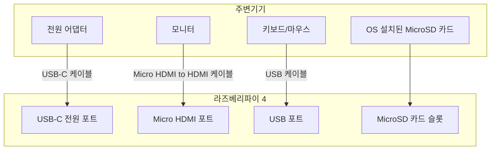
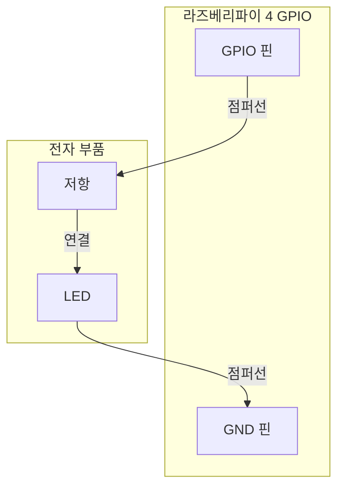
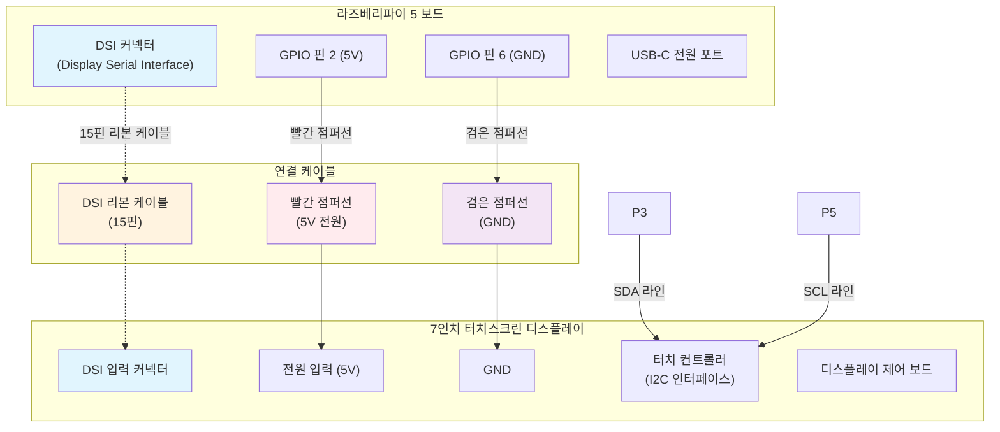
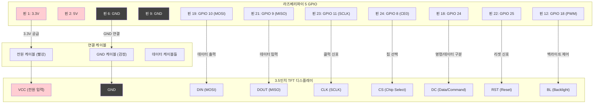
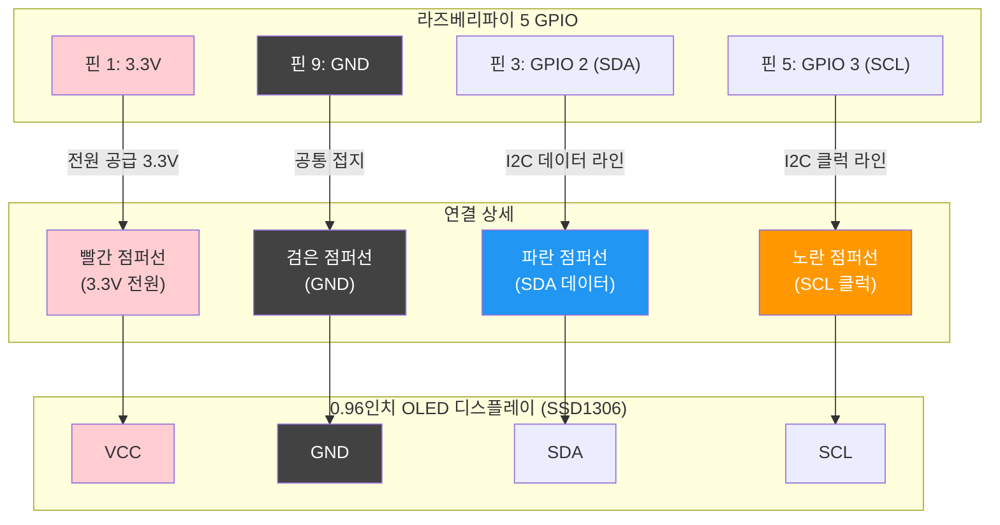

### 라즈베리파이 기본 부품 연결도

가장 기본적인 부품들을 연결한 다이어그램입니다. 라즈베리파이를 처음 설정하고 사용하는 데 필요한 최소한의 구성 요소입니다.

**설명:**

* **전원 어댑터**는 **USB-C 전원 포트**에 연결하여 라즈베리파이에 전원을 공급합니다.
* **모니터**는 **Micro HDMI 포트**에 연결하여 화면을 출력합니다.
* **키보드와 마우스**는 **USB 포트**에 연결하여 라즈베리파이를 제어합니다.
* 운영체제(OS)가 설치된 **MicroSD 카드**는 **슬롯**에 삽입해야 부팅 및 작동이 가능합니다.

---

### GPIO 확장 부품 연결도 (LED 예시)

GPIO(General Purpose Input/Output) 핀을 사용하여 LED와 같은 전자 부품을 연결하는 예시입니다.

**설명:**

* **GPIO 핀** (예: GPIO 17)은 신호를 보내는 역할을 하며, 저항과 연결됩니다.
* **저항**은 LED에 과도한 전류가 흐르는 것을 방지하기 위해 사용됩니다.
* **LED**의 긴 다리(+)는 저항과 연결하고, 짧은 다리(-)는 **GND(Ground) 핀**에 연결합니다.
* 이 연결을 통해 파이썬 코드 등으로 GPIO 핀에 신호를 주어 LED를 켜고 끌 수 있습니다.

---

## 라즈베리파이 5 세부 GPIO 핀 연결도

### 라즈베리파이 5 GPIO 핀맵 (40핀 구조)

### 라즈베리파이 5의 GPIO 핀 구조를 보여주는 다이어그램입니다. 
각 핀의 기능과 연결을 명확히 나타냅니다.

### raspberrypi5_gpio_map diagram 
show the GPIO pinout of Raspberry Pi 5, including power, ground, and various GPIO functions.

```mermaid
graph TD
    subgraph "라즈베리파이 5 GPIO 헤더 (40핀)"
        subgraph "왼쪽 열 (홀수 핀)"
            P1["1: 3.3V"]
            P3["3: GPIO 2 (SDA)"]
            P5["5: GPIO 3 (SCL)"]
            P7["7: GPIO 4"]
            P9["9: GND"]
            P11["11: GPIO 17"]
            P13["13: GPIO 27"]
            P15["15: GPIO 22"]
            P17["17: 3.3V"]
            P19["19: GPIO 10 (MOSI)"]
            P21["21: GPIO 9 (MISO)"]
            P23["23: GPIO 11 (SCLK)"]
            P25["25: GND"]
            P27["27: GPIO 0 (ID_SD)"]
            P29["29: GPIO 5"]
            P31["31: GPIO 6"]
            P33["33: GPIO 13 (PWM1)"]
            P35["35: GPIO 19 (PCM_FS)"]
            P37["37: GPIO 26"]
            P39["39: GND"]
        end
        
        subgraph "오른쪽 열 (짝수 핀)"
            P2["2: 5V"]
            P4["4: 5V"]
            P6["6: GND"]
            P8["8: GPIO 14 (TXD)"]
            P10["10: GPIO 15 (RXD)"]
            P12["12: GPIO 18 (PWM0)"]
            P14["14: GND"]
            P16["16: GPIO 23"]
            P18["18: GPIO 24"]
            P20["20: GND"]
            P22["22: GPIO 25"]
            P24["24: GPIO 8 (CE0)"]
            P26["26: GPIO 7 (CE1)"]
            P28["28: GPIO 1 (ID_SC)"]
            P30["30: GND"]
            P32["32: GPIO 12 (PWM0)"]
            P34["34: GND"]
            P36["36: GPIO 16"]
            P38["38: GPIO 20 (PCM_DIN)"]
            P40["40: GPIO 21 (PCM_DOUT)"]
        end
    end
```

---

### 라즈베리파이 5 + 7인치 터치스크린 DSI 디스플레이 연결도

라즈베리파이 5와 공식 7인치 터치스크린의 세부 연결을 보여주는 다이어그램입니다.

---

### 라즈베리파이 5 + SPI 디스플레이 연결도 (예: 3.5인치 TFT)

SPI 인터페이스를 사용하는 TFT 디스플레이의 세부 연결도입니다.

---

### 라즈베리파이 5 + I2C OLED 디스플레이 연결도

간단한 I2C OLED 디스플레이(예: SSD1306 128x64) 연결 예시입니다.

---

### 연결 시 주의사항

#### **전원 관련**
- **3.3V vs 5V**: 디스플레이 모듈의 전원 요구사항을 확인
- **전류 용량**: 라즈베리파이 5의 GPIO 3.3V는 최대 50mA 제공
- **백라이트**: 큰 디스플레이는 별도 전원 공급 필요

#### **신호 레벨**
- **3.3V 로직**: 라즈베리파이 5는 3.3V 로직 레벨 사용
- **5V 호환**: 5V 신호 입력 시 레벨 시프터 필요

#### **연결 순서**
1. **전원 OFF** 상태에서 연결
2. **GND 먼저** 연결 (정전기 방지)
3. **전원 연결** (VCC/3.3V/5V)
4. **신호선 연결** (SDA, SCL, SPI 등)
5. **연결 확인** 후 전원 ON
