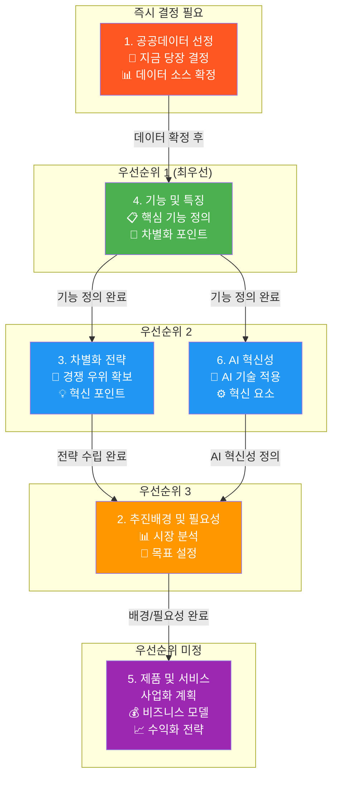
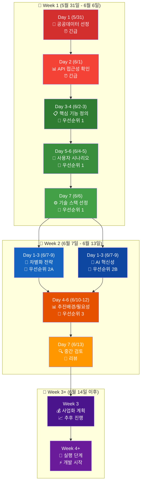
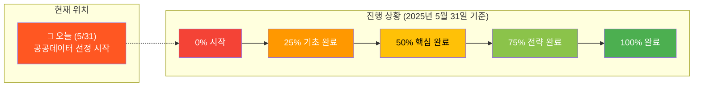
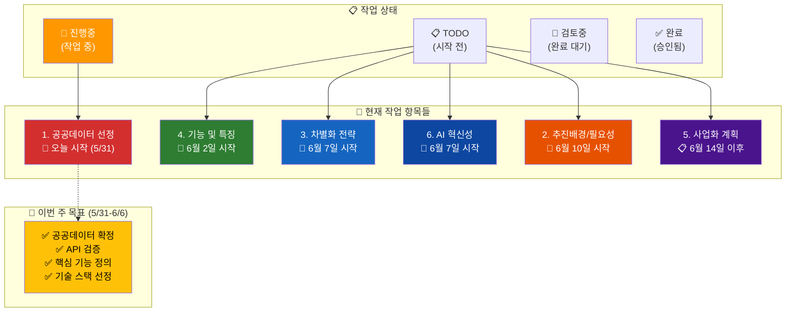
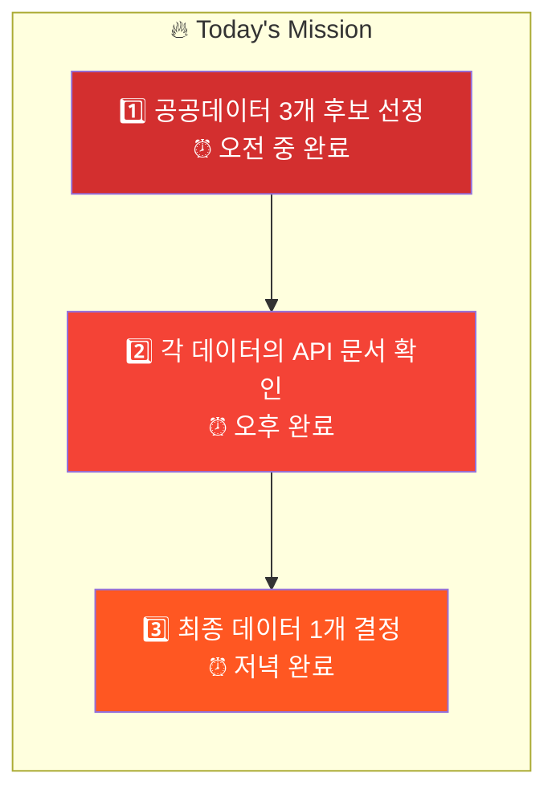
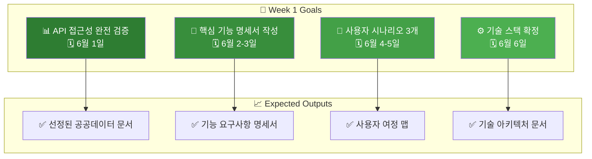
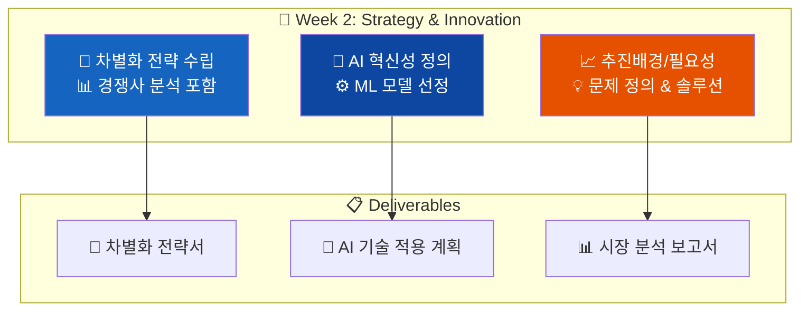
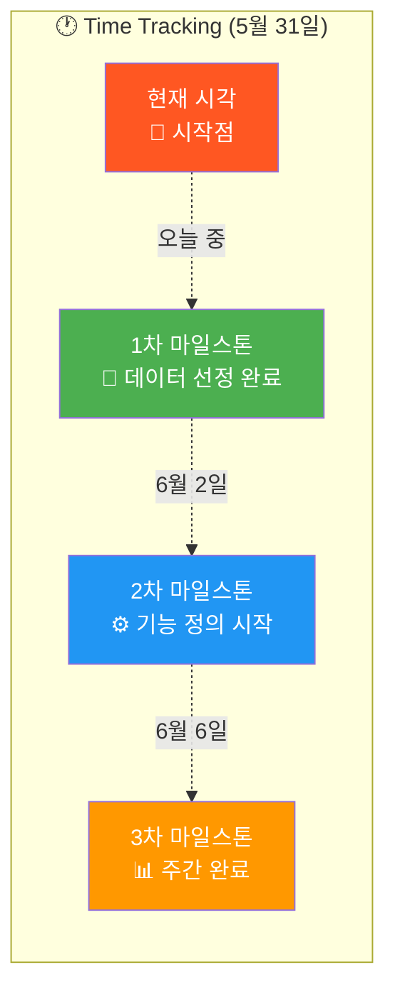

# 프로젝트 일정 및 우선순위 시각화

## 프로젝트 추진 일정표

### 우선순위별 업무 진행 순서

---

## 상세 업무 분해도

### 우선순위별 세부 작업 항목

```mermaid
graph TD
    subgraph "🚨 긴급 (지금 당장)"
        DATA_SELECT["공공데이터 선정"]
        DATA_API["API 접근성 확인"]
        DATA_QUALITY["데이터 품질 검증"]
    end
    
    subgraph "🥇 우선순위 1 - 기능 및 특징"
        CORE_FUNC["핵심 기능 정의"]
        USER_STORY["사용자 시나리오"]
        TECH_STACK["기술 스택 선정"]
        PROTO_DESIGN["프로토타입 설계"]
    end
    
    subgraph "🥈 우선순위 2A - 차별화 전략"
        MARKET_ANALYSIS["시장 분석"]
        COMPETITOR["경쟁사 분석"]
        UNIQUE_VALUE["고유 가치 제안"]
        POSITIONING["포지셔닝 전략"]
    end
    
    subgraph "🥈 우선순위 2B - AI 혁신성"
        AI_ALGORITHM["AI 알고리즘 선정"]
        ML_MODEL["머신러닝 모델"]
        DATA_PROCESSING["데이터 처리 혁신"]
        AI_FEATURE["AI 기반 기능"]
    end
    
    subgraph "🥉 우선순위 3 - 추진배경/필요성"
        PROBLEM_DEF["문제 정의"]
        SOLUTION_FIT["솔루션 적합성"]
        IMPACT_ANALYSIS["임팩트 분석"]
        ROADMAP["로드맵 수립"]
    end
    
    subgraph "📋 추후 진행 - 사업화 계획"
        BUSINESS_MODEL["비즈니스 모델"]
        REVENUE_STREAM["수익 모델"]
        GO_TO_MARKET["시장 진입 전략"]
        SCALING["확장 계획"]
    end
    
    %% 의존성 관계
    DATA_SELECT --> DATA_API
    DATA_API --> DATA_QUALITY
    DATA_QUALITY --> CORE_FUNC
    
    CORE_FUNC --> USER_STORY
    USER_STORY --> TECH_STACK
    TECH_STACK --> PROTO_DESIGN
    
    PROTO_DESIGN --> MARKET_ANALYSIS
    PROTO_DESIGN --> AI_ALGORITHM
    
    MARKET_ANALYSIS --> COMPETITOR
    COMPETITOR --> UNIQUE_VALUE
    UNIQUE_VALUE --> POSITIONING
    
    AI_ALGORITHM --> ML_MODEL
    ML_MODEL --> DATA_PROCESSING
    DATA_PROCESSING --> AI_FEATURE
    
    POSITIONING --> PROBLEM_DEF
    AI_FEATURE --> PROBLEM_DEF
    PROBLEM_DEF --> SOLUTION_FIT
    SOLUTION_FIT --> IMPACT_ANALYSIS
    IMPACT_ANALYSIS --> ROADMAP
    
    ROADMAP --> BUSINESS_MODEL
    BUSINESS_MODEL --> REVENUE_STREAM
    REVENUE_STREAM --> GO_TO_MARKET
    GO_TO_MARKET --> SCALING
    
    %% 스타일링 (긴급도별)
    style DATA_SELECT fill:#d32f2f,color:#fff
    style DATA_API fill:#f44336,color:#fff
    style DATA_QUALITY fill:#ff5722,color:#fff
    
    style CORE_FUNC fill:#2e7d32,color:#fff
    style USER_STORY fill:#388e3c,color:#fff
    style TECH_STACK fill:#43a047,color:#fff
    style PROTO_DESIGN fill:#4caf50,color:#fff
    
    style MARKET_ANALYSIS fill:#1565c0,color:#fff
    style COMPETITOR fill:#1976d2,color:#fff
    style UNIQUE_VALUE fill:#1e88e5,color:#fff
    style POSITIONING fill:#2196f3,color:#fff
    
    style AI_ALGORITHM fill:#0d47a1,color:#fff
    style ML_MODEL fill:#1565c0,color:#fff
    style DATA_PROCESSING fill:#1976d2,color:#fff
    style AI_FEATURE fill:#1e88e5,color:#fff
    
    style PROBLEM_DEF fill:#e65100,color:#fff
    style SOLUTION_FIT fill:#ef6c00,color:#fff
    style IMPACT_ANALYSIS fill:#f57c00,color:#fff
    style ROADMAP fill:#ff9800,color:#fff
    
    style BUSINESS_MODEL fill:#4a148c,color:#fff
    style REVENUE_STREAM fill:#6a1b9a,color:#fff
    style GO_TO_MARKET fill:#7b1fa2,color:#fff
    style SCALING fill:#8e24aa,color:#fff
```

---

## 주간 진행 타임라인

### 추천 진행 일정 (우선순위 기반)

### 📊 진행률 추적 차트

---

## 일정 체크리스트

### ✅ 완료 추적표 (실시간 업데이트)

### 📊 일일 진행 체크 (5월 31일 - 6월 13일)

```mermaid
graph LR
    subgraph "📅 Week 1: 기초 작업"
        D1["5/31 (토)<br>📊 데이터 조사<br>🔍 3개 후보 선정"]
        D2["6/1 (일)<br>📋 데이터 확정<br>🔗 API 테스트"]
        D3["6/2 (월)<br>🎯 기능 정의 시작<br>📝 요구사항 작성"]
        D4["6/3 (화)<br>⚙️ 기능 명세<br>🔧 기술 검토"]
        D5["6/4 (수)<br>👤 시나리오 작성<br>🎨 UI/UX 구상"]
        D6["6/5 (목)<br>📱 프로토타입<br>🛠️ 기술 스택"]
        D7["6/6 (금)<br>✅ Week 1 완료<br>📊 주간 리뷰"]
    end
    
    subgraph "📅 Week 2: 전략 수립"
        D8["6/7-9<br>🚀 차별화 전략<br>🤖 AI 혁신성"]
        D9["6/10-12<br>📊 배경/필요성<br>📈 임팩트 분석"]
        D10["6/13<br>🔍 중간 점검<br>📝 문서 정리"]
    end
    
    D1 --> D2 --> D3 --> D4 --> D5 --> D6 --> D7
    D7 --> D8 --> D9 --> D10
    
    style D1 fill:#ff5722,color:#fff
    style D2 fill:#f44336,color:#fff
    style D3 fill:#2e7d32,color:#fff
    style D4 fill:#388e3c,color:#fff
    style D5 fill:#43a047,color:#fff
    style D6 fill:#4caf50,color:#fff
    style D7 fill:#66bb6a,color:#fff
    style D8 fill:#1565c0,color:#fff
    style D9 fill:#e65100,color:#fff
    style D10 fill:#ff9800,color:#fff
```

---

## 📋 다음 액션 아이템

### 🚨 즉시 실행 필요 (오늘 5월 31일)

### 📅 이번 주 완료 목표 (6월 1일 - 6월 6일)

### 📊 다음 주 진행 예정 (6월 7일 - 6월 13일)

### ⚡ 실시간 진행 상황 추적

---

## 🎯 성공 지표 및 체크포인트

### Week 1 성공 기준 ✅
- [ ] 공공데이터 확정 (5/31)
- [ ] API 접근 가능 확인 (6/1)
- [ ] 핵심 기능 3개 이상 정의 (6/3)
- [ ] 사용자 시나리오 3개 작성 (6/5)
- [ ] 기술 스택 문서화 (6/6)

### Week 2 성공 기준 🎯
- [ ] 경쟁사 분석 완료 (6/9)
- [ ] AI 기술 선정 완료 (6/9)
- [ ] 시장 분석 보고서 (6/12)
- [ ] 중간 검토 미팅 (6/13)

이 시각화를 통해 우선순위가 명확해지고, 어떤 작업을 언제 해야 할지 체계적으로 파악할 수 있습니다! 🚀
