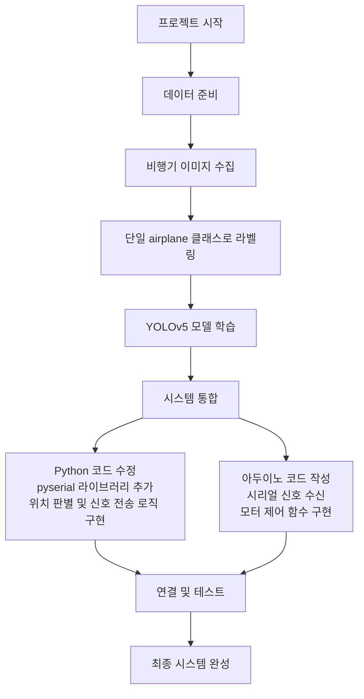
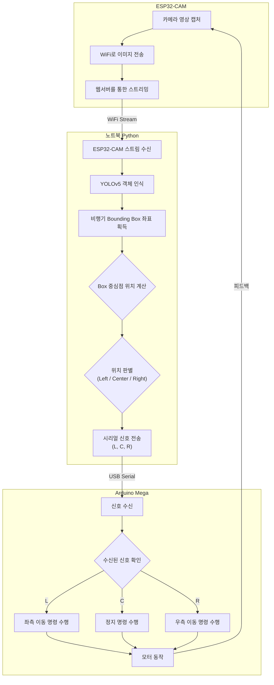
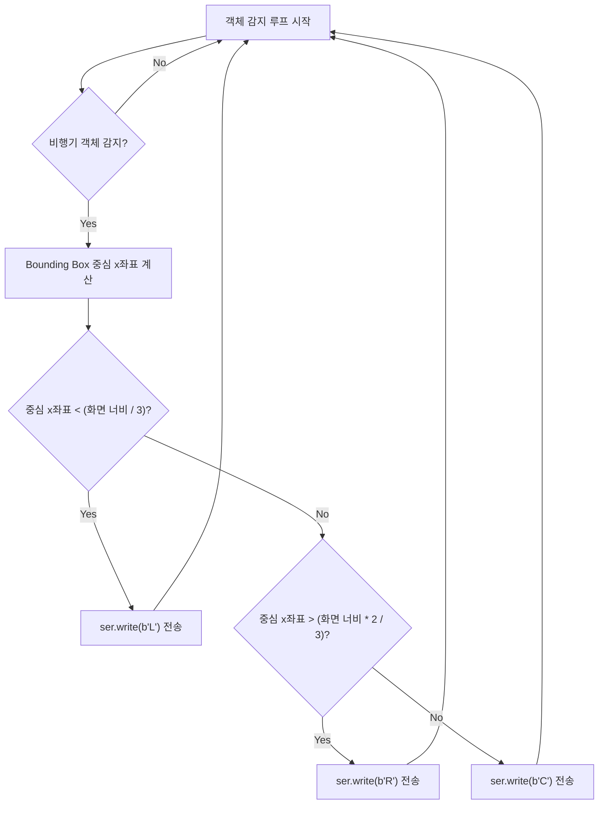
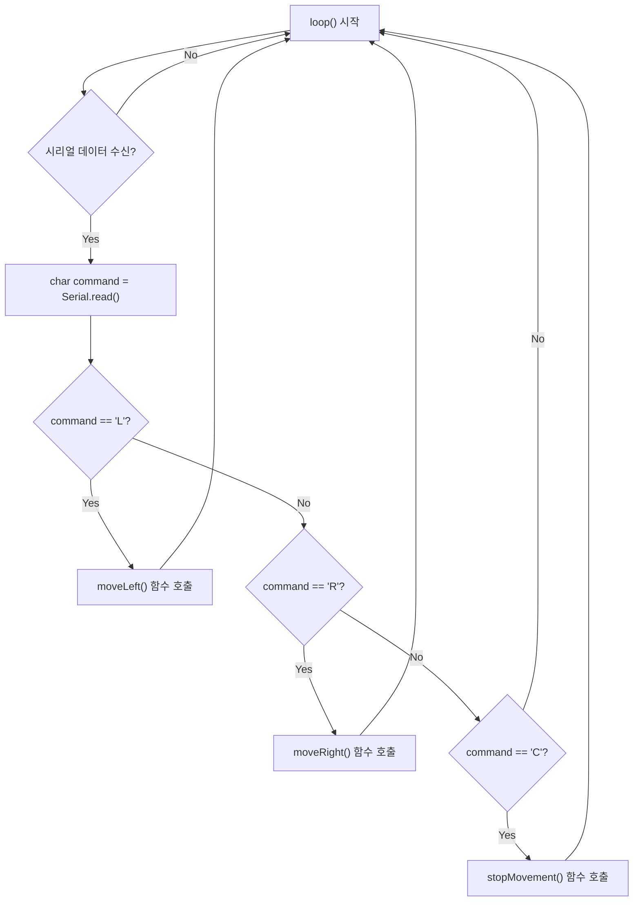

네, 그럼요! 설명해주신 프로젝트의 전체적인 흐름과 각 부분의 로직을 명확하게 파악할 수 있도록 Mermaid 언어를 사용하여 다이어그램으로 시각화해 드릴게요.

아래 다이어그램들을 통해 프로젝트의 큰 그림부터 세부적인 로직까지 한눈에 이해하실 수 있을 겁니다.

---

### **1. 전체 프로젝트 개발 흐름도**

프로젝트 시작부터 최종 테스트까지의 전체적인 개발 단계를 보여주는 흐름도입니다.



---

### **2. 실시간 제어 로직 순서도 (ESP32-CAM ↔️ Arduino Mega)**

ESP32-CAM과 Arduino Mega가 실시간으로 어떻게 상호작용하며 제어가 이루어지는지를 보여주는 순서도입니다. 이 부분이 프로젝트의 핵심 동작 로직입니다.



---

### **3. Python 위치 판별 로직 상세 다이어그램**

Python 코드 내에서 감지된 객체의 위치를 어떻게 판단하고 어떤 신호를 보낼지 결정하는 부분의 상세 로직입니다.



---

### **4. 아두이노 제어 로직 상세 다이어그램**

아두이노가 시리얼 신호를 수신했을 때, 어떤 판단을 통해 모터를 제어하는지에 대한 상세 로직입니다.



---

## **5. 시스템 구성 요소 상세 설명**

### **5.1 하드웨어 구성**
- **카메라**: ESP32-CAM (WiFi 스트리밍)
- **아두이노**: Arduino Mega 2560 (USB 시리얼 통신)
- **모터**: 서보모터 또는 스테퍼모터 (좌우 이동용)
- **연결**: 
  - ESP32-CAM ↔ 노트북: WiFi 네트워크
  - 노트북 ↔ Arduino Mega: USB 케이블

### **5.2 소프트웨어 구성**
- **ESP32-CAM**: Arduino IDE로 웹서버 펌웨어 (카메라 스트리밍)
- **Python**: YOLOv5, OpenCV, pyserial, requests/urllib
- **Arduino Mega**: Arduino IDE로 모터 제어 펌웨어
- **통신 프로토콜**: 
  - ESP32-CAM → Python: HTTP 스트리밍
  - Python → Arduino Mega: 시리얼 ASCII ('L', 'C', 'R')

---

## **6. Python 코드 구현 예제**

### **6.1 메인 제어 코드**

```python
import cv2
import torch
import serial
import time
import requests
import numpy as np
from yolov5 import YOLOv5

class AirplaneTracker:
    def __init__(self, model_path='yolov5s.pt', arduino_port='COM3', baudrate=9600, esp32_url='http://192.168.1.100'):
        # YOLOv5 모델 초기화
        self.model = YOLOv5(model_path, device='cpu')
        
        # 아두이노 시리얼 통신 초기화
        try:
            self.ser = serial.Serial(arduino_port, baudrate, timeout=1)
            time.sleep(2)  # 아두이노 초기화 대기
            print(f"Arduino Mega 연결 성공: {arduino_port}")
        except:
            print("Arduino Mega 연결 실패")
            self.ser = None
        
        # ESP32-CAM 스트림 URL 설정
        self.esp32_stream_url = f"{esp32_url}/stream"
        self.esp32_capture_url = f"{esp32_url}/capture"
        
        # 화면 너비 (ESP32-CAM 기본 해상도: 640x480)
        self.frame_width = 640
        
        print(f"ESP32-CAM 스트림 URL: {self.esp32_stream_url}")
        
    def get_frame_from_esp32(self):
        """ESP32-CAM에서 프레임 가져오기"""
        try:
            response = requests.get(self.esp32_capture_url, timeout=5)
            if response.status_code == 200:
                # 바이트 데이터를 numpy 배열로 변환
                nparr = np.frombuffer(response.content, np.uint8)
                # 이미지로 디코드
                frame = cv2.imdecode(nparr, cv2.IMREAD_COLOR)
                return True, frame
            else:
                return False, None
        except Exception as e:
            print(f"ESP32-CAM 연결 오류: {e}")
            return False, None
        
    def detect_and_track(self):
        """실시간 객체 감지 및 추적"""
        print("객체 추적 시작...")
        
        while True:
            # ESP32-CAM에서 프레임 획득
            ret, frame = self.get_frame_from_esp32()
            if not ret or frame is None:
                print("ESP32-CAM에서 프레임을 가져올 수 없습니다.")
                time.sleep(0.1)
                continue
                
            # YOLOv5로 객체 감지
            results = self.model(frame)
            
            # 비행기 객체 필터링
            airplane_detections = []
            for *box, conf, cls in results.xyxy[0]:
                if results.names[int(cls)] == 'airplane' and conf > 0.5:
                    airplane_detections.append((box, conf))
            
            # 위치 판별 및 제어 신호 전송
            if airplane_detections:
                # 가장 신뢰도 높은 객체 선택
                best_detection = max(airplane_detections, key=lambda x: x[1])
                x1, y1, x2, y2 = best_detection[0]
                center_x = (x1 + x2) / 2
                
                # 화면을 3등분하여 위치 판별
                command = self.determine_position(center_x)
                self.send_command(command)
                
                # 시각화
                cv2.rectangle(frame, (int(x1), int(y1)), (int(x2), int(y2)), (0, 255, 0), 2)
                cv2.putText(frame, f'Command: {command}', (10, 30), 
                           cv2.FONT_HERSHEY_SIMPLEX, 1, (0, 255, 0), 2)
                cv2.putText(frame, f'Conf: {best_detection[1]:.2f}', (10, 70), 
                           cv2.FONT_HERSHEY_SIMPLEX, 0.7, (255, 255, 0), 2)
            
            # ESP32-CAM 스트림 표시
            cv2.putText(frame, 'ESP32-CAM Stream', (10, frame.shape[0] - 20), 
                       cv2.FONT_HERSHEY_SIMPLEX, 0.7, (255, 255, 255), 2)
            
            cv2.imshow('Airplane Tracking - ESP32-CAM', frame)
            if cv2.waitKey(1) & 0xFF == ord('q'):
                break
                
        self.cleanup()
    
    def determine_position(self, center_x):
        """객체 위치에 따른 명령 결정"""
        left_threshold = self.frame_width / 3
        right_threshold = self.frame_width * 2 / 3
        
        if center_x < left_threshold:
            return 'L'  # 왼쪽
        elif center_x > right_threshold:
            return 'R'  # 오른쪽
        else:
            return 'C'  # 중앙
    
    def send_command(self, command):
        """Arduino Mega로 제어 명령 전송"""
        if self.ser and self.ser.is_open:
            self.ser.write(command.encode())
            print(f"Arduino Mega 명령 전송: {command}")
    
    def cleanup(self):
        """리소스 정리"""
        cv2.destroyAllWindows()
        if self.ser:
            self.ser.close()
        print("시스템 종료")

if __name__ == "__main__":
    # ESP32-CAM IP 주소를 실제 주소로 변경하세요
    tracker = AirplaneTracker(esp32_url='http://192.168.1.100', arduino_port='COM3')
    tracker.detect_and_track()
```

---

## **7. 아두이노 코드 구현 예제**

### **7.1 ESP32-CAM 웹서버 코드**

```cpp
#include "esp_camera.h"
#include <WiFi.h>
#include "esp_http_server.h"

// WiFi 설정
const char* ssid = "YOUR_WIFI_SSID";
const char* password = "YOUR_WIFI_PASSWORD";

// ESP32-CAM AI Thinker 핀 설정
#define PWDN_GPIO_NUM     32
#define RESET_GPIO_NUM    -1
#define XCLK_GPIO_NUM      0
#define SIOD_GPIO_NUM     26
#define SIOC_GPIO_NUM     27
#define Y9_GPIO_NUM       35
#define Y8_GPIO_NUM       34
#define Y7_GPIO_NUM       39
#define Y6_GPIO_NUM       36
#define Y5_GPIO_NUM       21
#define Y4_GPIO_NUM       19
#define Y3_GPIO_NUM       18
#define Y2_GPIO_NUM        5
#define VSYNC_GPIO_NUM    25
#define HREF_GPIO_NUM     23
#define PCLK_GPIO_NUM     22

httpd_handle_t stream_httpd = NULL;
httpd_handle_t camera_httpd = NULL;

static esp_err_t capture_handler(httpd_req_t *req) {
    camera_fb_t * fb = NULL;
    esp_err_t res = ESP_OK;
    
    fb = esp_camera_fb_get();
    if (!fb) {
        httpd_resp_send_500(req);
        return ESP_FAIL;
    }
    
    httpd_resp_set_type(req, "image/jpeg");
    httpd_resp_set_hdr(req, "Content-Disposition", "inline; filename=capture.jpg");
    httpd_resp_set_hdr(req, "Access-Control-Allow-Origin", "*");
    
    res = httpd_resp_send(req, (const char *)fb->buf, fb->len);
    esp_camera_fb_return(fb);
    return res;
}

static esp_err_t stream_handler(httpd_req_t *req) {
    camera_fb_t * fb = NULL;
    esp_err_t res = ESP_OK;
    size_t _jpg_buf_len = 0;
    uint8_t * _jpg_buf = NULL;
    char * part_buf[64];

    res = httpd_resp_set_type(req, "multipart/x-mixed-replace;boundary=frame");
    if(res != ESP_OK){
        return res;
    }

    while(true){
        fb = esp_camera_fb_get();
        if (!fb) {
            res = ESP_FAIL;
        } else {
            _jpg_buf_len = fb->len;
            _jpg_buf = fb->buf;
        }

        if(res == ESP_OK){
            size_t hlen = snprintf((char *)part_buf, 64, 
                "Content-Type: image/jpeg\r\nContent-Length: %u\r\n\r\n", 
                _jpg_buf_len);
            res = httpd_resp_send_chunk(req, (const char *)part_buf, hlen);
        }
        if(res == ESP_OK){
            res = httpd_resp_send_chunk(req, (const char *)_jpg_buf, _jpg_buf_len);
        }
        if(res == ESP_OK){
            res = httpd_resp_send_chunk(req, "\r\n--frame\r\n", 13);
        }
        if(fb){
            esp_camera_fb_return(fb);
            fb = NULL;
            _jpg_buf = NULL;
        } else if(_jpg_buf){
            free(_jpg_buf);
            _jpg_buf = NULL;
        }
        if(res != ESP_OK){
            break;
        }
    }
    return res;
}

void startCameraServer() {
    httpd_config_t config = HTTPD_DEFAULT_CONFIG();
    config.server_port = 80;

    httpd_uri_t capture_uri = {
        .uri       = "/capture",
        .method    = HTTP_GET,
        .handler   = capture_handler,
        .user_ctx  = NULL
    };

    httpd_uri_t stream_uri = {
        .uri       = "/stream",
        .method    = HTTP_GET,
        .handler   = stream_handler,
        .user_ctx  = NULL
    };

    if (httpd_start(&camera_httpd, &config) == ESP_OK) {
        httpd_register_uri_handler(camera_httpd, &capture_uri);
    }
    
    config.server_port += 1;
    config.ctrl_port += 1;
    if (httpd_start(&stream_httpd, &config) == ESP_OK) {
        httpd_register_uri_handler(stream_httpd, &stream_uri);
    }
}

void setup() {
    Serial.begin(115200);
    
    // 카메라 설정
    camera_config_t config;
    config.ledc_channel = LEDC_CHANNEL_0;
    config.ledc_timer = LEDC_TIMER_0;
    config.pin_d0 = Y2_GPIO_NUM;
    config.pin_d1 = Y3_GPIO_NUM;
    config.pin_d2 = Y4_GPIO_NUM;
    config.pin_d3 = Y5_GPIO_NUM;
    config.pin_d4 = Y6_GPIO_NUM;
    config.pin_d5 = Y7_GPIO_NUM;
    config.pin_d6 = Y8_GPIO_NUM;
    config.pin_d7 = Y9_GPIO_NUM;
    config.pin_xclk = XCLK_GPIO_NUM;
    config.pin_pclk = PCLK_GPIO_NUM;
    config.pin_vsync = VSYNC_GPIO_NUM;
    config.pin_href = HREF_GPIO_NUM;
    config.pin_sscb_sda = SIOD_GPIO_NUM;
    config.pin_sscb_scl = SIOC_GPIO_NUM;
    config.pin_pwdn = PWDN_GPIO_NUM;
    config.pin_reset = RESET_GPIO_NUM;
    config.xclk_freq_hz = 20000000;
    config.pixel_format = PIXFORMAT_JPEG;
    
    // 프레임 크기 설정
    config.frame_size = FRAMESIZE_VGA; // 640x480
    config.jpeg_quality = 12;
    config.fb_count = 1;

    // 카메라 초기화
    esp_err_t err = esp_camera_init(&config);
    if (err != ESP_OK) {
        Serial.printf("카메라 초기화 실패: 0x%x", err);
        return;
    }

    // WiFi 연결
    WiFi.begin(ssid, password);
    while (WiFi.status() != WL_CONNECTED) {
        delay(500);
        Serial.print(".");
    }
    Serial.println("");
    Serial.println("WiFi 연결됨");
    Serial.print("IP 주소: ");
    Serial.println(WiFi.localIP());

    // 웹서버 시작
    startCameraServer();
    
    Serial.print("카메라 스트림: http://");
    Serial.print(WiFi.localIP());
    Serial.println("/stream");
    Serial.print("카메라 캡처: http://");
    Serial.print(WiFi.localIP());
    Serial.println("/capture");
}

void loop() {
    delay(1000);
}
```

### **7.2 Arduino Mega 모터 제어 코드**

```cpp
#include <Servo.h>

// 서보모터 핀 정의 (Arduino Mega 핀 배치)
#define SERVO_PIN 9
#define LED_PIN 13

Servo trackingServo;
int currentPosition = 90;  // 초기 중앙 위치
int targetPosition = 90;
char lastCommand = 'C';

void setup() {
    Serial.begin(9600);
    trackingServo.attach(SERVO_PIN);
    pinMode(LED_PIN, OUTPUT);
    
    // 초기 위치로 이동
    trackingServo.write(currentPosition);
    digitalWrite(LED_PIN, HIGH);
    
    Serial.println("Arduino Mega 추적 시스템 초기화 완료");
    delay(1000);
    digitalWrite(LED_PIN, LOW);
}

void loop() {
    // 시리얼 데이터 확인
    if (Serial.available() > 0) {
        delay(20); // 데이터 안정화 대기
        char command = Serial.read();
        
        // 버퍼 클리어 (Mega는 더 큰 버퍼를 가짐)
        while(Serial.available() > 0) {
            Serial.read();
        }
        
        // 명령 처리
        switch (command) {
            case 'L':
                moveLeft();
                lastCommand = 'L';
                break;
            case 'R':
                moveRight();
                lastCommand = 'R';
                break;
            case 'C':
                moveCenter();
                lastCommand = 'C';
                break;
            default:
                Serial.print("알 수 없는 명령: ");
                Serial.println(command);
                break;
        }
        
        // 응답 전송
        Serial.print("실행됨: ");
        Serial.println(command);
    }
    
    // 부드러운 모터 이동
    smoothMove();
    delay(20);
}

void moveLeft() {
    targetPosition = 45;  // 왼쪽 45도
    digitalWrite(LED_PIN, HIGH);
    Serial.println("왼쪽으로 이동");
}

void moveRight() {
    targetPosition = 135; // 오른쪽 135도
    digitalWrite(LED_PIN, HIGH);
    Serial.println("오른쪽으로 이동");
}

void moveCenter() {
    targetPosition = 90;  // 중앙 90도
    digitalWrite(LED_PIN, LOW);
    Serial.println("중앙으로 이동");
}

void smoothMove() {
    if (currentPosition != targetPosition) {
        if (currentPosition < targetPosition) {
            currentPosition += 2;
        } else {
            currentPosition -= 2;
        }
        
        // 범위 제한
        currentPosition = constrain(currentPosition, 0, 180);
        trackingServo.write(currentPosition);
    }
}
```

---

## **8. 시스템 설치 및 설정 가이드**

### **8.1 Python 환경 설정**

```bash
# 필요한 라이브러리 설치
pip install torch torchvision
pip install yolov5
pip install opencv-python
pip install pyserial
pip install requests
pip install numpy

# YOLOv5 모델 다운로드 (선택사항)
# 사전 훈련된 모델 사용 또는 커스텀 모델 훈련
```

### **8.2 ESP32-CAM 설정**

1. Arduino IDE에서 ESP32 보드 패키지 설치
2. ESP32-CAM 카메라 웹서버 펌웨어 업로드
3. WiFi 네트워크 설정 (SSID, 비밀번호)
4. IP 주소 확인 (시리얼 모니터에서 출력)

### **8.3 Arduino Mega 설정**

1. Arduino IDE에서 위 코드를 업로드
2. 시리얼 모니터에서 통신 확인
3. 서보모터를 9번 핀에 연결
4. 전원 공급 확인 (Mega는 더 많은 핀과 메모리 제공)

### **8.4 시스템 연동 테스트**

```python
# ESP32-CAM 연결 테스트
import requests
import cv2
import numpy as np

def test_esp32_cam(esp32_ip="192.168.1.100"):
    try:
        response = requests.get(f"http://{esp32_ip}/capture", timeout=5)
        if response.status_code == 200:
            print("ESP32-CAM 연결 성공!")
            # 이미지 표시 테스트
            nparr = np.frombuffer(response.content, np.uint8)
            img = cv2.imdecode(nparr, cv2.IMREAD_COLOR)
            cv2.imshow('ESP32-CAM Test', img)
            cv2.waitKey(5000)  # 5초 표시
            cv2.destroyAllWindows()
        else:
            print("ESP32-CAM 연결 실패")
    except Exception as e:
        print(f"ESP32-CAM 테스트 오류: {e}")

# Arduino Mega 연결 테스트
import serial
import time

def test_arduino_mega(port='COM3'):
    try:
        ser = serial.Serial(port, 9600, timeout=1)
        time.sleep(2)
        
        # 테스트 명령 전송
        commands = ['L', 'C', 'R', 'C']
        for cmd in commands:
            ser.write(cmd.encode())
            print(f"Arduino Mega로 전송: {cmd}")
            time.sleep(2)
            
            # 응답 읽기
            if ser.in_waiting > 0:
                response = ser.readline().decode().strip()
                print(f"Arduino Mega 응답: {response}")
        
        ser.close()
        print("Arduino Mega 테스트 완료")
    except Exception as e:
        print(f"Arduino Mega 테스트 오류: {e}")

# 전체 시스템 테스트
if __name__ == "__main__":
    print("=== ESP32-CAM 테스트 ===")
    test_esp32_cam("192.168.1.100")  # 실제 IP로 변경
    
    print("\n=== Arduino Mega 테스트 ===")
    test_arduino_mega("COM3")  # 실제 포트로 변경
```

---

## **9. 트러블슈팅 가이드**

### **9.1 일반적인 문제**

| 문제                   | 원인                          | 해결책                              |
| ---------------------- | ----------------------------- | ----------------------------------- |
| ESP32-CAM 연결 실패    | WiFi 설정 오류/IP 주소 변경   | 시리얼 모니터에서 IP 주소 확인      |
| Arduino Mega 연결 실패 | 잘못된 포트/보드레이트        | Device Manager에서 포트 확인        |
| 객체 인식 불량         | 조명/각도/해상도 문제         | ESP32-CAM 위치 조정, 품질 설정 변경 |
| 모터 동작 불량         | 전원 부족/핀 연결 오류        | 외부 전원 공급, 핀 배치 확인        |
| 통신 지연              | 네트워크 지연/버퍼 오버플로우 | 프레임률 조정, 버퍼 클리어 추가     |
| ESP32-CAM 스트림 끊김  | 메모리 부족/과열              | 프레임 크기 줄이기, 냉각 개선       |

### **9.2 성능 최적화**

- **FPS 향상**: ESP32-CAM 해상도 조정, JPEG 품질 설정
- **정확도 향상**: 커스텀 데이터셋으로 재훈련, 조명 개선
- **반응성 향상**: 비동기 통신 구현, Arduino Mega의 향상된 처리 능력 활용
- **안정성 향상**: WiFi 재연결 로직, 예외 처리 강화

### **9.3 ESP32-CAM 특화 팁**

- **전원 공급**: 5V 2A 이상 어댑터 사용 권장
- **WiFi 신호**: 안정적인 2.4GHz 네트워크 사용
- **카메라 설정**: FRAMESIZE_VGA(640x480) 권장
- **메모리 관리**: 프레임 버퍼 즉시 반환
- **방열**: 장시간 사용 시 방열판 고려

---

## **10. 프로젝트 확장 아이디어**

### **10.1 고급 기능**
- **다중 객체 추적**: 여러 비행기 동시 추적
- **예측 추적**: 물체 이동 경로 예측
- **자동 줌**: 거리에 따른 자동 확대/축소

### **10.2 하드웨어 업그레이드**
- **팬-틸트 시스템**: 상하좌우 자유로운 움직임
- **고해상도 카메라**: 더 정확한 인식
- **무선 통신**: WiFi/Bluetooth 연결

이제 YOLOv5와 아두이노 연동 프로젝트가 완전히 구현 가능한 형태로 정리되었습니다! 🚀
