# 📝 Ultimate Document Editor Instructions
*Transform your documents into professional, engaging, and accessible content*

## 📋 Table of Contents
- [🎯 Overview](#-overview)
- [📊 Document Enhancement Framework](#-document-enhancement-framework)
- [🔧 Implementation Guidelines](#-implementation-guidelines)
- [✅ Quality Assurance Checklist](#-quality-assurance-checklist)
- [📚 Additional Resources](#-additional-resources)
- [🎓 Best Practices Examples](#-best-practices-examples)
- [🚀 Action Plan Template](#-action-plan-template)

## 🎯 Overview

This comprehensive guide provides systematic instructions for transforming ordinary documents into **exceptional content** that meets the highest standards of quality, accessibility, and user engagement.

### 🌟 Key Benefits
- **Enhanced User Experience**: Improved readability and navigation
- **Professional Appearance**: Consistent, visually appealing design
- **Better Accessibility**: Inclusive content for all users
- **Increased Engagement**: Interactive and compelling content

### 📈 Document Quality Metrics

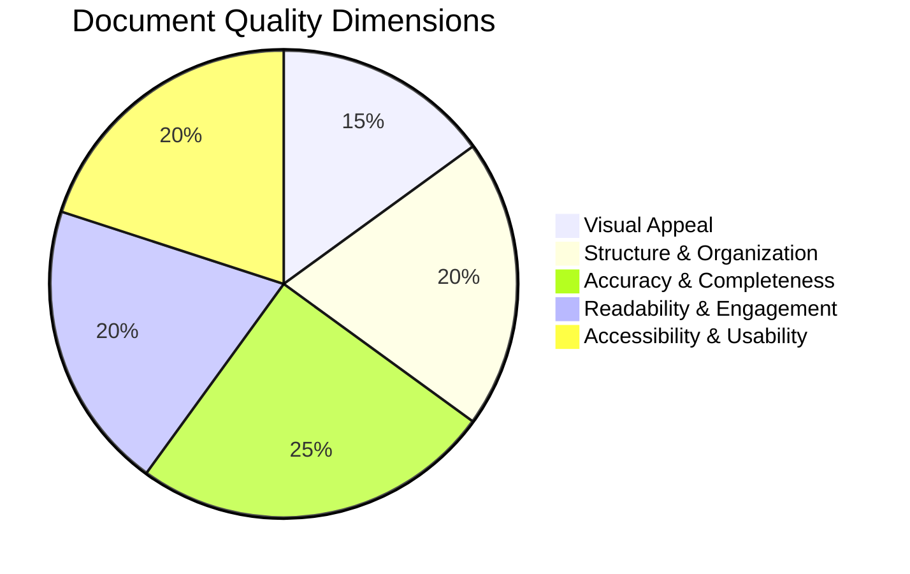

---

## 📊 Document Enhancement Framework

Follow these **13 core principles** to transform your documents:

### 1. 🎨 **Visual Excellence**
> **Objective**: Transform text-heavy documents into visually engaging experiences

#### 📸 Visual Elements to Include:
- **Mermaid Diagrams**: flowcharts, sequence diagrams, class diagrams, state diagrams
- **Charts & Graphs**: pie charts, bar charts, timeline visualizations
- **Icons & Emojis**: Strategic use for section headers and important points
- **Infographics**: Complex data simplified into visual formats

#### 🛠️ Mermaid Diagram Types:
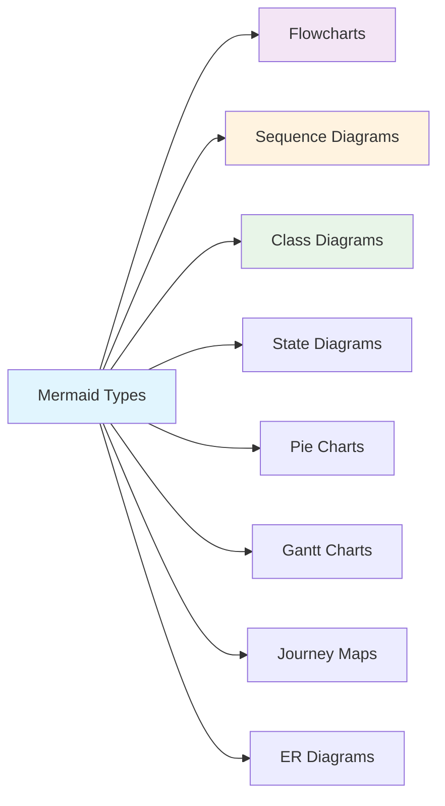

**💡 Pro Tip**: Each visual should have a clear purpose and directly support the content's understanding.

---

### 2. 🏗️ **Structural Organization**
> **Objective**: Create logical, hierarchical content structure for optimal navigation

#### 📐 Organization Principles:
- **Hierarchical Headings**: Use H1-H6 consistently
- **Logical Flow**: Each section builds upon the previous
- **Clear Sections**: Distinct purposes for each content block
- **Progressive Disclosure**: Important information first

#### 📋 Content Structure Template:
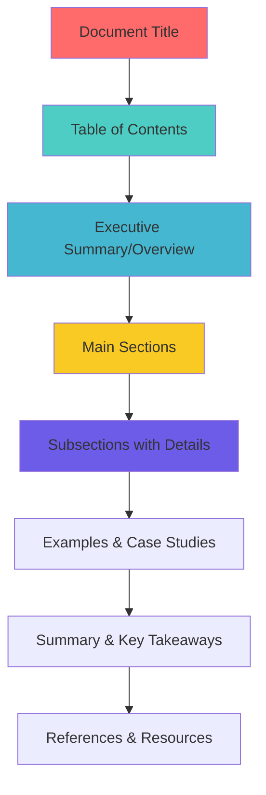

**✅ Structure Checklist**:
- [ ] Clear heading hierarchy (H1 → H6)
- [ ] Logical content flow
- [ ] Consistent formatting
- [ ] Scannable bullet points
- [ ] Numbered lists for procedures

---

### 3. 🎯 **Accuracy & Verification**
> **Objective**: Ensure all information is current, correct, and credible

#### 🔍 Verification Process:
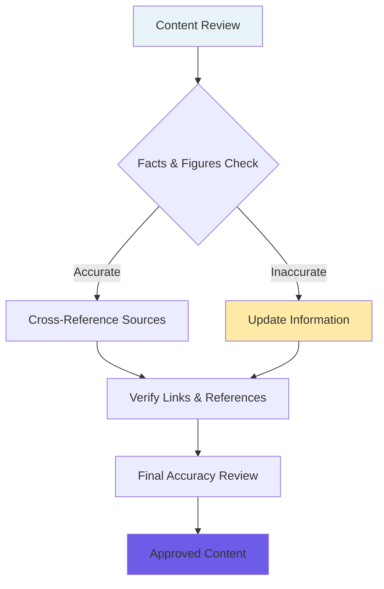

#### 📚 Source Verification Standards:
- **Primary Sources**: Original research, official documentation
- **Recent Information**: Published within last 2-3 years
- **Authoritative Sources**: Recognized experts and institutions
- **Multiple Confirmations**: Cross-check critical facts

**⚡ Quick Accuracy Tips**:
- Fact-check all statistics and data points
- Verify URLs and external links functionality
- Update dated examples and case studies
- Include publication dates for references

---

### 4. 📚 **Comprehensive Coverage**
> **Objective**: Address all aspects of the topic without information gaps

#### 🧩 Completeness Framework:
- **Core Concepts**: Fundamental principles and definitions
- **Practical Examples**: Real-world applications and use cases
- **Edge Cases**: Uncommon but important scenarios
- **Troubleshooting**: Common problems and solutions

#### 📊 Content Gap Analysis:
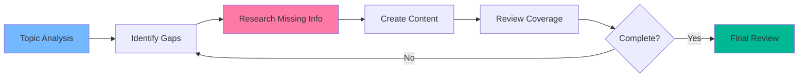

**🔍 Coverage Checklist**:
- [ ] All subtopics addressed
- [ ] Beginner to advanced levels covered
- [ ] Examples for each major concept
- [ ] Common questions answered
- [ ] Next steps or follow-up actions provided

---

### 5. 📖 **Enhanced Readability**
> **Objective**: Make content accessible and easy to understand for all readers

#### ✍️ Writing Best Practices:
- **Clear Language**: Simple, direct communication
- **Short Sentences**: 15-20 words maximum per sentence
- **Active Voice**: Prefer active over passive voice
- **Consistent Terminology**: Define technical terms once, use consistently

#### 📏 Readability Metrics:
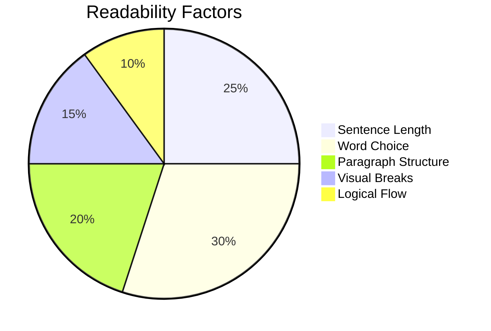

**🎯 Readability Targets**:
- **Flesch-Kincaid Grade Level**: 8-10 (accessible to most readers)
- **Sentence Length**: Average 15-20 words
- **Paragraph Length**: 3-5 sentences maximum
- **Technical Terms**: Always defined on first use

**💡 Quick Readability Tips**:
- Use transition words to connect ideas
- Break up long paragraphs with subheadings
- Include white space for visual breathing room
- Use bullet points for lists and key information

---

### 6. 🎪 **Reader Engagement**
> **Objective**: Create compelling content that holds attention and encourages interaction

#### 🎭 Engagement Strategies:
- **Interactive Elements**: Quizzes, polls, self-assessment tools
- **Conversational Tone**: Direct address to reader ("you", "your")
- **Real Examples**: Case studies, success stories, practical scenarios
- **Call-to-Action**: Clear next steps and reader involvement

#### 🎮 Interactive Content Ideas:
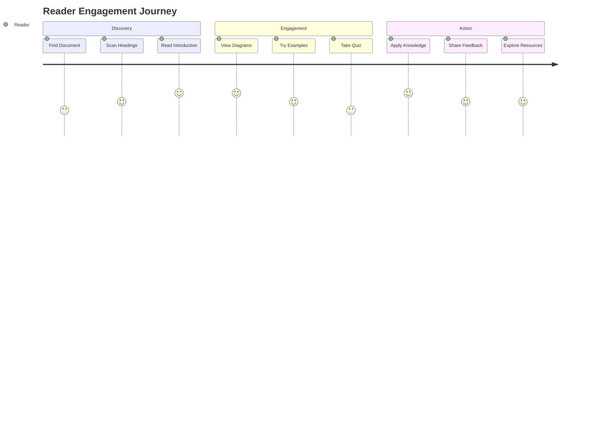

**🎯 Engagement Elements**:
- ❓ **Knowledge Check Questions**: Test understanding
- 💭 **Thought Experiments**: "What would you do if..."
- 📝 **Practical Exercises**: Hands-on activities
- 🗣️ **Discussion Prompts**: Questions for team discussions
- 📊 **Self-Assessment Tools**: Progress tracking

**Example Engagement Block**:
> 💡 **Quick Challenge**: Before reading further, think about a time when poor documentation caused you problems. What made it difficult to use? Keep this in mind as we explore best practices.

---

### 7. ♿ **Universal Accessibility**
> **Objective**: Ensure content is usable by everyone, including users with disabilities

#### 🌐 WCAG 2.1 Compliance Checklist:
- **Alt Text**: Descriptive text for all images and diagrams
- **Color Contrast**: 4.5:1 ratio for normal text, 3:1 for large text
- **Keyboard Navigation**: All interactive elements accessible via keyboard
- **Screen Reader Compatibility**: Proper heading structure and semantic markup

#### 🎯 Accessibility Implementation:
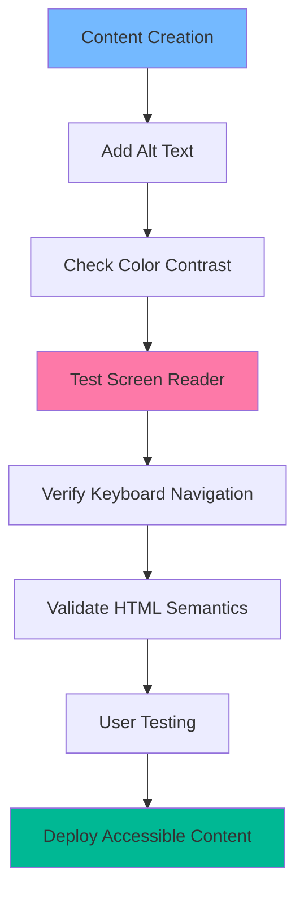

**♿ Accessibility Features**:
- **Alt Text Example**: `alt="Flowchart showing document review process with 5 steps"`
- **Color Independence**: Information not conveyed by color alone
- **Clear Headings**: Logical H1-H6 hierarchy for screen readers
- **Link Descriptions**: Meaningful link text (not "click here")
- **Table Headers**: Proper `<th>` elements for data tables

**📋 Accessibility Quick Check**:
- [ ] All images have descriptive alt text
- [ ] Headings follow logical hierarchy
- [ ] Links have meaningful descriptions
- [ ] Color contrast meets standards
- [ ] Content works without images/CSS

---

### 8. 🎨 **Consistent Design System**
> **Objective**: Maintain uniformity across all documentation for professional appearance

#### 📐 Style Guide Elements:
- **Typography**: Consistent font hierarchy and sizing
- **Color Palette**: Standardized colors for different content types
- **Spacing**: Uniform margins, padding, and line heights
- **Formatting**: Consistent code blocks, quotes, and callouts

#### 🎯 Consistency Framework:
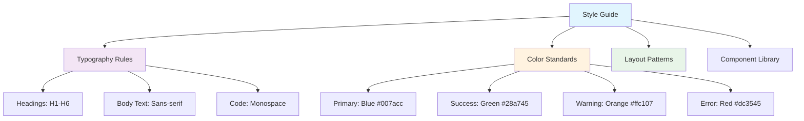

**📝 Consistency Checklist**:
- [ ] Same heading styles throughout
- [ ] Consistent bullet point formats
- [ ] Uniform code block styling
- [ ] Standardized callout boxes
- [ ] Consistent image sizing and placement

**🎨 Style Examples**:
```
# H1: Main Title (Bold, 32px)
## H2: Section Header (Bold, 24px)  
### H3: Subsection (Bold, 20px)

**Bold Text**: Important concepts
*Italic Text*: Emphasis
`Code Text`: Technical terms
```

---

### 9. 🔎 **Search Optimization**
> **Objective**: Make content easily discoverable through search and navigation

#### 🎯 SEO Best Practices:
- **Descriptive Titles**: Clear, keyword-rich headings
- **Meta Descriptions**: Concise summaries for each section
- **Internal Linking**: Cross-references between related sections
- **Keyword Strategy**: Natural integration of relevant terms

#### 🗺️ Navigation Enhancement:
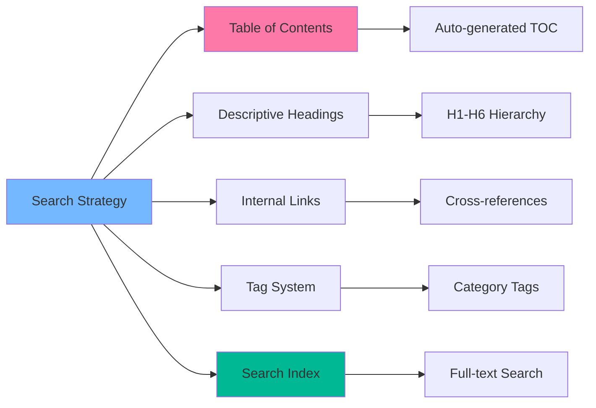

**🔍 Searchability Features**:
- **Table of Contents**: Auto-generated with anchor links
- **Section Summaries**: Brief overviews for quick scanning
- **Related Links**: "See also" sections
- **Tag System**: Categorization for filtering
- **Glossary**: Alphabetical term definitions

**📊 Search Optimization Checklist**:
- [ ] Descriptive page titles and headings
- [ ] Table of contents with clickable links
- [ ] Internal cross-references
- [ ] Tag or category system
- [ ] Search-friendly URL structure

---

### 10. 🤝 **Collaborative Framework**
> **Objective**: Foster community contribution and continuous improvement

#### 👥 Collaboration Features:
- **Comment Systems**: Allow reader feedback and discussions
- **Contribution Guidelines**: Clear process for submitting improvements
- **Version Control**: Track changes and maintain edit history
- **Community Building**: Forums, discussion boards, or chat channels

#### 🔄 Collaboration Workflow:
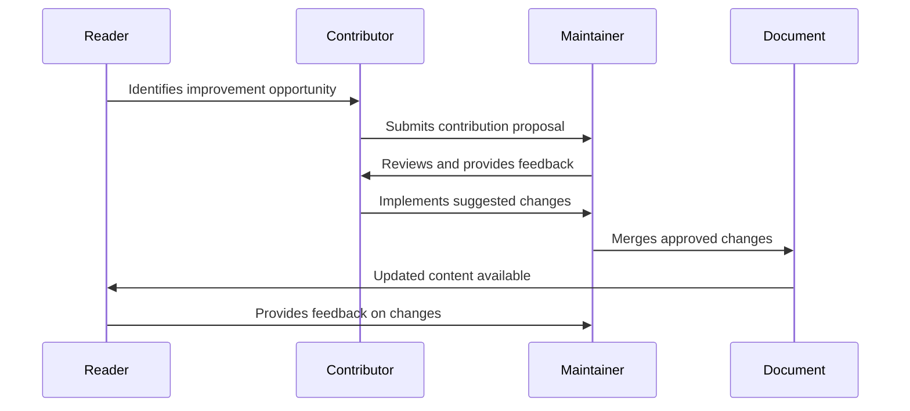

**🛠️ Collaboration Tools**:
- **GitHub Issues**: Bug reports and feature requests
- **Pull Requests**: Code/content contributions
- **Discussion Forums**: Community Q&A
- **Feedback Forms**: Structured user input
- **Version History**: Change tracking and rollback

**📝 Contribution Guidelines Template**:
```markdown
## How to Contribute
1. **Report Issues**: Use GitHub issues for bugs/improvements
2. **Suggest Changes**: Fork → Edit → Pull Request
3. **Style Guide**: Follow established formatting rules
4. **Review Process**: All changes reviewed before merging
```

---

### 11. 📚 **Information Enrichment**
> **Objective**: Provide comprehensive resources and credible references

#### 🎓 Resource Categories:
- **Primary Sources**: Official documentation, research papers
- **Tutorials**: Step-by-step guides and walkthroughs  
- **Related Reading**: Books, articles, and blog posts
- **Tools & Software**: Recommended applications and utilities
- **Community Resources**: Forums, groups, and expert networks

#### 📖 Reference Management:
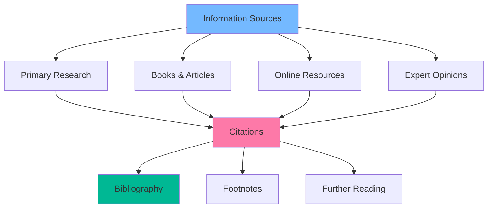

**📋 Resource Integration Methods**:
- **Inline Citations**: `[1]` reference numbers
- **Footnotes**: Detailed source information at page bottom
- **Further Reading**: Curated list of related materials
- **External Links**: Direct links to authoritative sources
- **Resource Boxes**: Highlighted additional materials

**🔗 Example Resource Section**:
```markdown
## 📚 Additional Resources

### Books
- [Title] by Author (Year) - Brief description
- [Title] by Author (Year) - Brief description

### Online Resources  
- [Website Name](URL) - Description
- [Documentation](URL) - Official guide

### Tools
- [Tool Name](URL) - Purpose and benefits
```

---

### 12. 👤 **User-Centered Design**
> **Objective**: Create intuitive, user-friendly documentation experiences

#### 🎯 User Experience Principles:
- **Intuitive Navigation**: Logical menu structure and breadcrumbs
- **Clear Calls-to-Action**: Obvious next steps and pathways
- **Responsive Design**: Works well on all devices and screen sizes
- **Fast Loading**: Optimized images and efficient code

#### 🚀 User Journey Optimization:
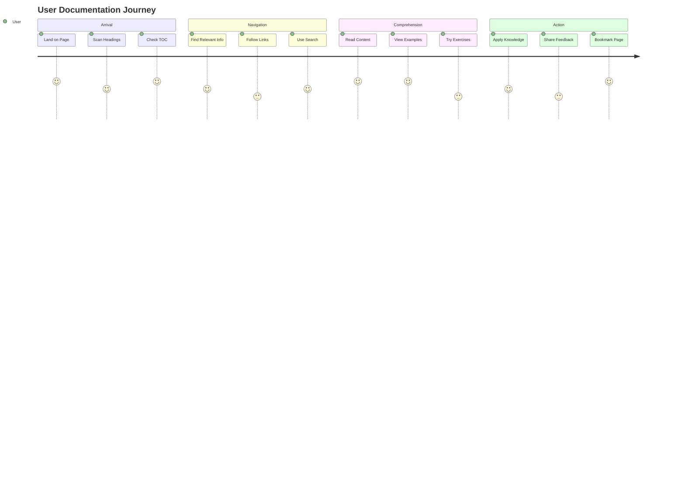

**🎨 UX Design Elements**:
- **Progressive Disclosure**: Show details when needed
- **Visual Hierarchy**: Guide attention to important content
- **Consistent Patterns**: Familiar interactions and layouts
- **Error Prevention**: Clear instructions and examples
- **Feedback Mechanisms**: Success messages and progress indicators

**📱 Mobile-First Considerations**:
- Readable text without zooming
- Touch-friendly buttons and links
- Collapsible sections for better mobile navigation
- Fast loading times on slower networks

**✅ User-Friendly Checklist**:
- [ ] Clear navigation breadcrumbs
- [ ] Obvious call-to-action buttons
- [ ] Mobile-responsive design
- [ ] Fast page load times
- [ ] Easy-to-use search functionality

---

### 13. 🔍 **Quality Assurance Process**
> **Objective**: Ensure excellence through systematic review and continuous improvement

#### 🎯 Multi-Stage Review Process:
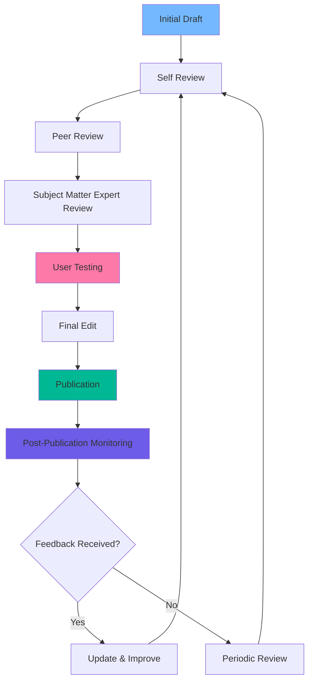

#### 📋 Review Checklist Categories:

| Category | Key Items | Tools |
|----------|-----------|-------|
| **Content** | Accuracy, Completeness, Relevance | Fact-checking, Expert review |
| **Structure** | Logical flow, Clear sections, TOC | Outline review, Navigation test |
| **Language** | Clarity, Tone, Grammar | Grammarly, Readability tools |
| **Accessibility** | Alt text, Contrast, Screen reader | WAVE, Color contrast analyzers |
| **Visual** | Images, Diagrams, Formatting | Design review, Cross-browser test |

#### 🔄 Continuous Improvement Cycle:
1. **Monitor Usage**: Analytics and user behavior
2. **Collect Feedback**: Surveys, comments, support tickets  
3. **Identify Patterns**: Common questions or issues
4. **Plan Updates**: Prioritize improvements
5. **Implement Changes**: Update content systematically
6. **Measure Impact**: Track improvement metrics

**⏰ Review Schedule Recommendation**:
- **Daily**: Monitor for urgent issues or feedback
- **Weekly**: Review recent changes and user comments
- **Monthly**: Comprehensive content audit
- **Quarterly**: Strategic review and major updates
- **Annually**: Complete documentation overhaul

---

## 🔧 Implementation Guidelines

### 🚀 Getting Started

#### Phase 1: Assessment (Week 1)
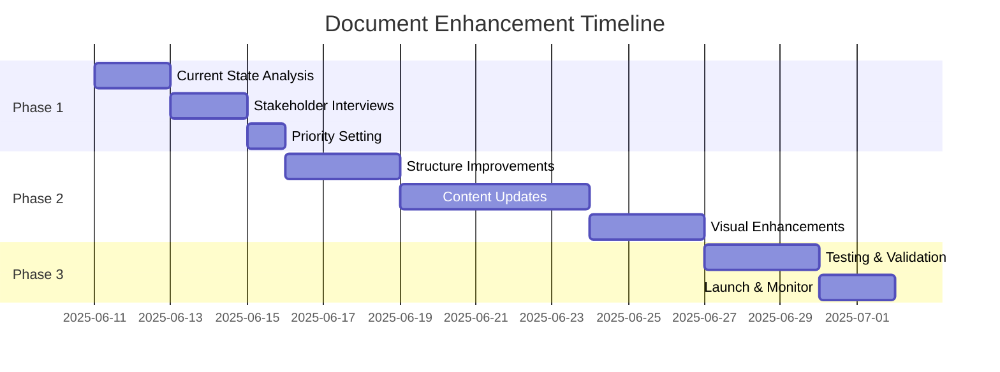

#### Assessment Framework:
1. **Current State Analysis**: Evaluate existing documentation
2. **Gap Identification**: Compare against the 13 principles
3. **Impact Assessment**: Prioritize high-value improvements
4. **Resource Planning**: Allocate time and tools needed
5. **Success Metrics**: Define measurable goals

### 📊 Progress Tracking

#### Document Quality Scorecard:
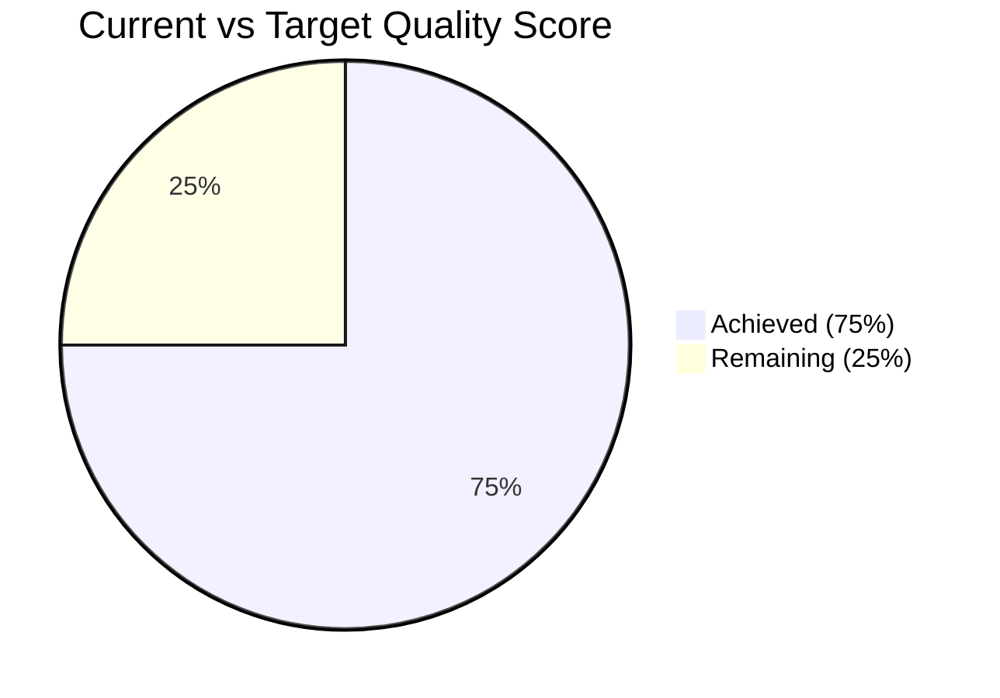

| Principle | Current Score | Target Score | Priority |
|-----------|---------------|--------------|----------|
| Visual Excellence | 6/10 | 9/10 | High |
| Structure | 8/10 | 9/10 | Medium |
| Accuracy | 7/10 | 10/10 | High |
| Completeness | 5/10 | 9/10 | High |
| Readability | 7/10 | 9/10 | Medium |

---

## ✅ Quality Assurance Checklist

### 📝 Pre-Publication Checklist

#### Content Quality
- [ ] **Visual**: Diagrams enhance understanding and are properly labeled
- [ ] **Structure**: Clear hierarchy and logical flow between sections
- [ ] **Accuracy**: Facts verified and sources cited
- [ ] **Complete**: No information gaps or missing steps
- [ ] **Readable**: Clear, concise language appropriate for target audience

#### Technical Quality  
- [ ] **Engaging**: Interactive elements and examples included
- [ ] **Accessible**: WCAG 2.1 AA compliance verified
- [ ] **Consistent**: Style guide followed throughout
- [ ] **Searchable**: SEO optimized with proper headings and keywords
- [ ] **Collaborative**: Feedback mechanisms and contribution guidelines in place

#### User Experience
- [ ] **Informative**: References and additional resources provided
- [ ] **User-Friendly**: Navigation intuitive and mobile-responsive
- [ ] **Quality Assured**: Multi-stage review process completed

### 🎯 Success Metrics

#### Quantitative Metrics:
- **User Engagement**: 
  - Time on page: Target 3+ minutes
  - Bounce rate: Target <40%
  - Return visits: Target 25%+
- **Task Completion**: 
  - Users successfully complete intended actions: Target 80%+
- **Accessibility**: 
  - WCAG compliance score: Target 95%+
  - Screen reader compatibility: Target 100%

#### Qualitative Metrics:
- **Satisfaction Scores**: Target 4.5/5 in user feedback
- **Content Quality**: Expert review ratings
- **Usability**: User testing feedback

---

## 📚 Additional Resources

### 🛠️ Essential Tools

#### Content Creation
- **Mermaid**: Diagram creation ([mermaid.js.org](https://mermaid.js.org))
- **Figma**: Design and prototyping ([figma.com](https://figma.com))
- **Canva**: Visual content creation ([canva.com](https://canva.com))

#### Quality Assurance
- **WAVE**: Accessibility testing ([wave.webaim.org](https://wave.webaim.org))
- **Grammarly**: Writing assistance ([grammarly.com](https://grammarly.com))
- **Hemingway**: Readability analysis ([hemingwayapp.com](https://hemingwayapp.com))
- **Lighthouse**: Performance and accessibility audits

#### Analytics & Feedback
- **Google Analytics**: User behavior tracking
- **Hotjar**: Heatmaps and user recordings
- **Typeform**: Feedback collection
- **GitHub**: Version control and collaboration

### 📖 Further Reading

#### Style Guides
- [Microsoft Style Guide](https://docs.microsoft.com/style-guide/) - Comprehensive writing standards
- [Google Developer Documentation Style Guide](https://developers.google.com/style) - Technical writing best practices
- [Atlassian Design System](https://atlassian.design/) - Component and pattern library

#### Accessibility Resources
- [WCAG 2.1 Guidelines](https://www.w3.org/WAI/WCAG21/quickref/) - Web accessibility standards
- [WebAIM](https://webaim.org/) - Accessibility evaluation and training
- [A11y Project](https://www.a11yproject.com/) - Community-driven accessibility resource

### 🎓 Training Resources

#### Online Courses
- **Technical Writing**: 
  - Google Technical Writing Courses (free)
  - Coursera Technical Writing Specialization
  - edX Professional Writing courses
- **UX Writing**: 
  - UX Writing Hub courses
  - Designlab UX Writing course
- **Accessibility**: 
  - WebAIM training programs
  - Deque University courses

#### Certifications
- **Technical Writing**: Society for Technical Communication (STC)
- **Accessibility**: International Association of Accessibility Professionals (IAAP)
- **Content Strategy**: Content Marketing Institute

---

## 🎓 Best Practices Examples

### 📋 Before & After Transformation

#### ❌ Before: Poor Documentation Example
```markdown
## Setup

Install the software. Configure the settings. Run the program.

Requirements:
- Node.js
- Database
```

#### ✅ After: Enhanced Documentation Example
```markdown
## 🚀 Quick Start Setup Guide

Follow these simple steps to get your application running in under 10 minutes.

### 📋 Prerequisites Checklist
Before you begin, ensure you have:
- [ ] **Node.js** v16+ ([Download here](https://nodejs.org/))
- [ ] **PostgreSQL** v12+ ([Installation guide](link))
- [ ] **Git** ([Setup instructions](link))

### 🔧 Installation Steps

1. **Clone the repository**
   ```bash
   git clone https://github.com/your-repo/project.git
   cd project
   ```

2. **Install dependencies**
   ```bash
   npm install
   ```

3. **Configure environment**
   ```bash
   cp .env.example .env
   # Edit .env with your database credentials
   ```

4. **Start the application**
   ```bash
   npm start
   ```

### ✅ Verification
Your application should now be running at `http://localhost:3000`

> 💡 **Having issues?** Check our [troubleshooting guide](link) or [contact support](link).
```

### 🎨 Visual Enhancement Examples

#### Mermaid Diagram Templates

**Process Flow:**
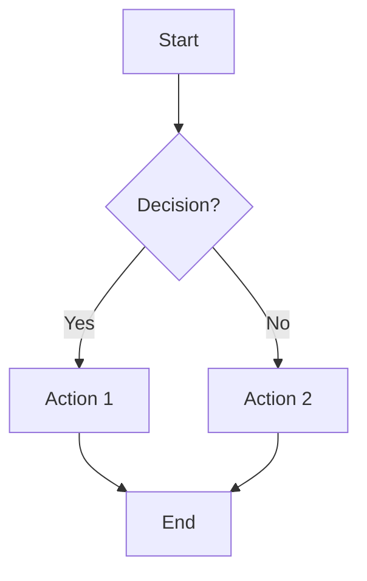

**User Journey:**
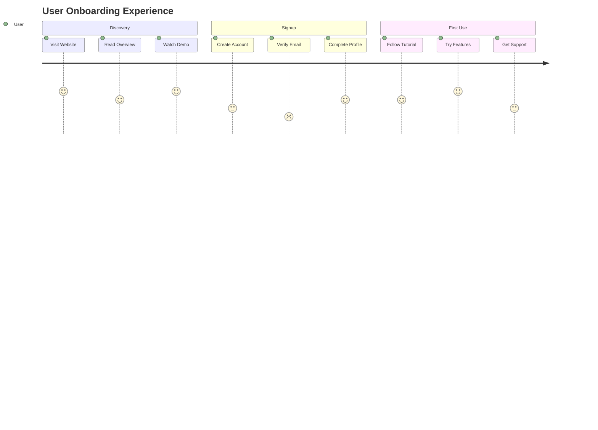

---

## 🚀 Action Plan Template

### 📅 30-Day Implementation Plan

#### Week 1: Foundation
- [ ] **Day 1-2**: Assess current documentation quality
- [ ] **Day 3-4**: Identify top 3 improvement priorities  
- [ ] **Day 5-7**: Set up tools and establish style guide

#### Week 2: Structure & Content
- [ ] **Day 8-10**: Reorganize content structure and navigation
- [ ] **Day 11-12**: Update headings and create table of contents
- [ ] **Day 13-14**: Add visual elements and diagrams

#### Week 3: Enhancement
- [ ] **Day 15-17**: Improve readability and add examples
- [ ] **Day 18-19**: Ensure accessibility compliance
- [ ] **Day 20-21**: Add interactive elements and calls-to-action

#### Week 4: Quality & Launch
- [ ] **Day 22-24**: Comprehensive review and testing
- [ ] **Day 25-26**: Gather feedback and make final adjustments
- [ ] **Day 27-28**: Launch improved documentation
- [ ] **Day 29-30**: Monitor usage and collect initial feedback

### 📊 Progress Tracking Template

| Metric | Baseline | Target | Current | Status |
|--------|----------|---------|---------|---------|
| Page Views | 1000/month | 1500/month | - | 🔄 In Progress |
| Time on Page | 1:30 | 3:00 | - | 📅 Planned |
| User Satisfaction | 3.2/5 | 4.5/5 | - | 📅 Planned |
| Accessibility Score | 65% | 95% | - | 🔄 In Progress |

### 🎯 Success Celebration Milestones

- **🏆 Quick Win**: First visual diagram added
- **🏆 Major Progress**: 50% of principles implemented  
- **🏆 Achievement Unlocked**: All accessibility requirements met
- **🏆 Excellence**: User satisfaction >4.5/5
- **🏆 Mastery**: Documentation becomes company standard

---

> 💡 **Final Reminder**: Great documentation is never finished—it evolves with your users' needs and feedback. Start with the basics, implement systematically, and continuously improve based on real usage patterns and user feedback.

> 🚀 **Ready to Transform Your Documentation?** Use this guide as your roadmap to creating exceptional content that your users will love and actually use!
