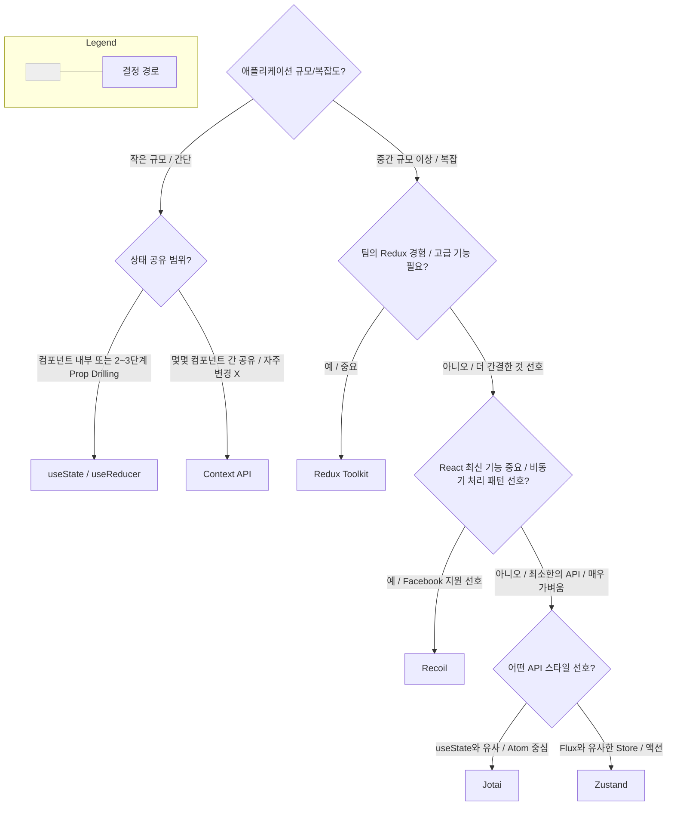

React 상태 관리란?

React에서 **상태(State)**는 컴포넌트의 UI를 그리는데 사용되는, 시간이 지남에 따라 변경될 수 있는 JavaScript 객체입니다. 이는 단순한 변수를 넘어, UI의 현재 모습을 결정짓는 핵심 데이터입니다.

상태가 변경될 수 있는 요인은 다양합니다:
*   사용자의 인터랙션 (버튼 클릭, 폼 입력, 드래그 앤 드롭 등)
*   네트워크 응답 (API 호출 결과, 웹소켓 메시지 수신)
*   내부 로직 (타이머 만료, 애니메이션 진행 상태)

React의 핵심 원칙 중 하나는 **"UI는 상태의 함수다 (UI = f(state))"** 입니다. 이 말은 마치 수학 함수처럼, 동일한 상태가 주어지면 항상 동일한 UI가 그려져야 함을 의미하며, UI는 전적으로 상태에 의존하여 결정됩니다. 따라서 상태가 변경되면 React는 이 변화를 감지하고, 자동으로 해당 상태를 사용하는 컴포넌트와 그 자식 컴포넌트들을 효율적으로 다시 렌더링하여 UI를 최신 상태로 일관성 있게 유지합니다.

효율적인 상태 관리는 React 애플리케이션의 복잡성을 제어하고, 예측 가능성을 높이며, 유지보수 및 테스트를 용이하게 만드는 데 매우 중요합니다. 애플리케이션의 규모가 커지고 기능이 다양해질수록 관리해야 할 상태의 양과 복잡도는 기하급수적으로 증가할 수 있습니다.

상태 관리가 제대로 이루어지지 않으면, 다음과 같은 문제들이 발생할 수 있습니다:
*   **데이터 흐름 추적의 어려움**: 상태가 어디서 어떻게 변경되는지 파악하기 어려워져 디버깅 시간이 길어집니다.
*   **버그 발생 가능성 증가**: 여러 컴포넌트가 동일한 상태를 각기 다른 방식으로 수정하려 할 때 데이터 불일치나 예기치 않은 동작이 발생할 수 있습니다.
*   **애플리케이션 성능 저하**: 불필요한 리렌더링이 빈번하게 발생하거나, 상태 업데이트 로직이 비효율적일 경우 성능에 악영향을 줄 수 있습니다.
*   **코드 재사용성 및 확장성 저해**: 특정 컴포넌트에 강하게 결합된 상태 로직은 다른 부분에서 재사용하기 어렵게 만들고, 새로운 기능을 추가할 때 기존 코드를 대폭 수정해야 하는 상황을 초래할 수 있습니다.

따라서 React 개발자는 다양한 상태 관리 기법과 도구들을 이해하고, 프로젝트의 특성과 요구사항에 맞는 최적의 전략을 선택하여 적용하는 능력이 필수적입니다.

1.  **로컬 상태 (Local State)**

로컬 상태는 특정 컴포넌트 내에서만 유효하고 관리되는 상태를 의미합니다.
*   다른 컴포넌트와 직접적으로 공유되지 않습니다.
*   해당 컴포넌트의 생명주기와 밀접하게 연관됩니다. (컴포넌트가 마운트될 때 생성, 언마운트될 때 사라짐)
*   주로 해당 컴포넌트 내부의 UI 로직(예: 모달창 열림/닫힘 여부, 입력 필드의 현재 값, 토글 버튼의 활성화 상태 등)을 처리하는 데 사용됩니다.

**useState**: 함수형 컴포넌트에서 가장 기본적인 상태 관리 훅(Hook)입니다.
*   컴포넌트 내에서 독립적인 상태 값(숫자, 문자열, 불리언, 객체, 배열 등 다양한 JavaScript 데이터 타입)을 관리할 때 사용됩니다.
*   `useState`는 현재 상태 값과 해당 상태 값을 업데이트할 수 있는 함수(Setter 함수)를 배열 형태로 반환합니다.

// 기본 사용법: 카운터 예제
import React, { useState } from 'react';

function Counter() {
  // 'count'는 상태 변수, 'setCount'는 count 값을 변경하는 함수
  // useState(0)에서 0은 count의 초기값
  const [count, setCount] = useState(0);

  return (
    <div>
      <p>현재 카운트: {count}</p>
      <button onClick={() => setCount(count + 1)}>증가</button>
      <button onClick={() => setCount(prevCount => prevCount - 1)}>감소 (함수형 업데이트)</button>
      <button onClick={() => setCount(0)}>초기화</button>
    </div>
  );
}

// 객체 상태 관리: 사용자 정보 입력 폼 예제
function UserForm() {
  const [userInfo, setUserInfo] = useState({ name: '', email: '' });

  const handleChange = (event) => {
    const { name, value } = event.target;
    // 객체 상태를 업데이트할 때는 이전 상태를 복사하고 변경된 부분만 덮어써야 합니다. (불변성 유지)
    // 이렇게 하지 않으면 name만 업데이트되고 email은 사라지거나, 그 반대가 될 수 있습니다.
    setUserInfo(prevUserInfo => ({
      ...prevUserInfo, // 이전 userInfo 객체의 모든 속성을 그대로 가져옴
      [name]: value    // 변경된 속성(name 또는 email)의 값만 새로 설정
    }));
  };

  const handleSubmit = (event) => {
    event.preventDefault();
    console.log('제출된 사용자 정보:', userInfo);
    // 여기서 API 호출 등으로 userInfo를 서버에 전송할 수 있습니다.
  };

  return (
    <form onSubmit={handleSubmit}>
      <label>
        이름:
        <input type="text" name="name" value={userInfo.name} onChange={handleChange} />
      </label>
      <br />
      <label>
        이메일:
        <input type="email" name="email" value={userInfo.email} onChange={handleChange} />
      </label>
      <br />
      <button type="submit">제출</button>
    </form>
  );
}

// 배열 상태 관리: 할 일 목록(Todo List) 예제
function TodoList() {
  const [todos, setTodos] = useState([
    { id: 1, text: 'React 복습하기', completed: false },
    { id: 2, text: 'useState 예제 작성', completed: true }
  ]);
  const [newTodoText, setNewTodoText] = useState('');

  const addTodo = () => {
    if (!newTodoText.trim()) return; // 빈 내용은 추가하지 않음
    setTodos(prevTodos => [
      ...prevTodos, // 이전 할 일 목록을 그대로 유지
      { id: Date.now(), text: newTodoText, completed: false } // 새로운 할 일 추가
    ]);
    setNewTodoText(''); // 입력 필드 초기화
  };

  const toggleTodo = (id) => {
    setTodos(prevTodos =>
      prevTodos.map(todo =>
        todo.id === id ? { ...todo, completed: !todo.completed } : todo
      )
    );
  };

  const deleteTodo = (id) => {
    setTodos(prevTodos => prevTodos.filter(todo => todo.id !== id));
  };

  return (
    <div>
      <input
        type="text"
        value={newTodoText}
        onChange={(e) => setNewTodoText(e.target.value)}
        placeholder="새 할 일 입력"
      />
      <button onClick={addTodo}>추가</button>
      <ul>
        {todos.map(todo => (
          <li key={todo.id} style={{ textDecoration: todo.completed ? 'line-through' : 'none' }}>
            <span onClick={() => toggleTodo(todo.id)}>{todo.text}</span>
            <button onClick={() => deleteTodo(todo.id)} style={{ marginLeft: '10px' }}>삭제</button>
          </li>
        ))}
      </ul>
    </div>
  );
}

#### useState 사용 시 고려 사항

*   **불변성(Immutability)**:
    *   객체나 배열과 같은 참조 타입의 상태를 `useState`로 관리할 때, 원본을 직접 수정하는 대신 항상 새로운 객체나 배열을 생성하여 상태를 업데이트해야 합니다.
    *   예: `array.push()`나 `object.property = value`와 같이 직접 수정하면 React는 상태 변경을 제대로 감지하지 못할 수 있습니다.
    *   대신 전개 연산자(`...`), `map`, `filter`, `slice` 등의 배열 메소드를 사용하여 새로운 복사본을 만들고 변경 사항을 적용해야 합니다.
    *   이는 React가 상태 변경을 효율적으로 감지하고 올바르게 리렌더링을 수행하도록 보장하며, 예기치 않은 부작용(side effects)을 방지하고 디버깅을 용이하게 합니다.
*   **상태 업데이트 함수(Setter 함수)의 동작**:
    *   `setCount(count + 1)`: 다음 상태 값을 직접 인자로 전달합니다. 간단한 업데이트에 사용됩니다.
    *   `setCount(prevCount => prevCount + 1)`: 함수를 인자로 전달하며, 이 함수는 이전 상태 값(`prevCount`)을 인자로 받아 새로운 상태 값을 반환합니다.
        *   이 함수형 업데이트 방식은 여러 상태 업데이트가 비동기적으로 또는 짧은 시간 내에 연속적으로 발생할 때(React의 상태 업데이트는 배치 처리될 수 있음) 이전 상태 값을 정확하게 참조하여 다음 상태를 계산할 수 있도록 보장합니다.
        *   예: 짧은 시간 안에 `setCount(count + 1)`을 여러 번 호출해도 `count` 값은 한 번만 증가할 수 있지만, `setCount(prev => prev + 1)`을 여러 번 호출하면 호출한 횟수만큼 증가합니다.
        *   따라서 이전 상태에 의존하여 상태를 업데이트할 때는 함수형 업데이트를 사용하는 것이 더 안전하고 예측 가능합니다.
*   **상태 그룹화 vs. 개별 상태**:
    *   관련된 여러 상태 값들이 있다면, 이를 하나의 객체로 묶어 `useState`로 관리할지, 아니면 각각을 별개의 `useState`로 관리할지 결정해야 합니다.
    *   **그룹화 장점**: 관련된 데이터임을 명확히 하고, 상태 업데이트 로직을 한 곳에서 처리할 수 있습니다.
    *   **그룹화 단점**: 객체의 일부만 변경해도 전체 객체를 새로 만들어야 하며, 관련 없는 부분까지 리렌더링을 유발할 수 있습니다. (물론 `React.memo` 등으로 최적화 가능)
    *   **개별 상태 장점**: 각 상태가 독립적으로 업데이트되므로 더 세밀한 제어가 가능하고, 불필요한 리렌더링을 줄일 수 있습니다.
    *   **개별 상태 단점**: 상태가 너무 많아지면 코드가 장황해지고 관리가 어려워질 수 있습니다.
    *   일반적으로 서로 밀접하게 연관되어 함께 변경되는 경우가 많다면 객체로, 그렇지 않다면 개별 상태로 관리하는 것이 좋습니다.

**useReducer**: `useState`보다 더 복잡한 상태 로직을 관리할 때 유용합니다.
*   Redux와 유사한 패턴(액션 객체를 받아 상태를 변경하는 리듀서 함수)을 사용하여 상태를 업데이트합니다.
*   여러 하위 값을 포함하는 복잡한 객체나 배열 상태를 다룰 때 유용합니다.
*   다음 상태가 이전 상태에 여러 방식으로 의존적인 경우(예: 상태 전이 로직이 복잡한 경우)에 적합합니다.
*   상태 업데이트 로직이 여러 이벤트 핸들러나 컴포넌트 내 여러 위치에서 반복될 가능성이 있을 때 코드의 구조를 더 명확하게 만들고 중앙 집중화할 수 있습니다.

// 초기 상태 정의
const initialState = {
  count: 0,
  step: 1,
  lastAction: null,
  history: [] // 상태 변경 이력을 추적하는 예시
};

// 리듀서 함수: 액션 타입에 따라 상태를 어떻게 변경할지 정의
// 리듀서 함수는 반드시 순수 함수여야 합니다. (동일한 입력에 대해 항상 동일한 출력을 반환하고, 외부 상태를 변경하지 않음)
function complexCounterReducer(state, action) {
  // action 객체는 보통 type (필수)과 payload (선택) 속성을 가집니다.
  // payload는 상태 변경에 필요한 추가 데이터를 담습니다.
  switch (action.type) {
    case 'INCREMENT':
      return {
        ...state,
        count: state.count + state.step,
        lastAction: 'INCREMENT',
        history: [...state.history, { action: 'INCREMENT', prevCount: state.count, newCount: state.count + state.step, timestamp: Date.now() }]
      };
    case 'DECREMENT':
      return {
        ...state,
        count: state.count - state.step,
        lastAction: 'DECREMENT',
        history: [...state.history, { action: 'DECREMENT', prevCount: state.count, newCount: state.count - state.step, timestamp: Date.now() }]
      };
    case 'RESET':
      return {
        ...initialState, // 초기 상태로 리셋 (history는 유지하거나 초기화할 수 있음)
        history: [...state.history, { action: 'RESET', timestamp: Date.now() }],
        lastAction: 'RESET'
      };
    case 'SET_STEP':
      if (typeof action.payload !== 'number' || action.payload <= 0) {
        // 유효하지 않은 payload는 무시하거나 에러 처리
        return state;
      }
      return {
        ...state,
        step: action.payload,
        lastAction: 'SET_STEP',
        history: [...state.history, { action: 'SET_STEP', newStep: action.payload, timestamp: Date.now() }]
      };
    case 'UNDO_LAST_ACTION': // 예시: 마지막 액션 취소 (간단한 구현)
      if (state.history.length > 0) {
        const lastChange = state.history[state.history.length - 1];
        if (lastChange.prevCount !== undefined) { // count 변경 액션이었던 경우
          return {
            ...state,
            count: lastChange.prevCount,
            history: state.history.slice(0, -1),
            lastAction: 'UNDO'
          }
        }
      }
      return state; // 변경 없음
    default:
      // 처리할 수 없는 액션 타입에 대해서는 에러를 발생시키거나 현재 상태를 그대로 반환
      console.warn(`Unhandled action type: ${action.type}`);
      return state;
      // throw new Error(`Unhandled action type: ${action.type}`); // 엄격하게 처리하려면 에러 발생
  }
}

// 컴포넌트 내 사용
function ComplexCounter() {
  // useReducer는 [현재 상태, dispatch 함수]를 반환합니다.
  // dispatch 함수를 통해 액션 객체를 리듀서로 전달합니다.
  const [state, dispatch] = useReducer(complexCounterReducer, initialState);

  return (
    <div>
      <p>Count: {state.count}, Step: {state.step}, Last Action: {state.lastAction || 'None'}</p>
      <button onClick={() => dispatch({ type: 'INCREMENT' })}>증가 (+{state.step})</button>
      <button onClick={() => dispatch({ type: 'DECREMENT' })}>감소 (-{state.step})</button>
      <button onClick={() => dispatch({ type: 'RESET' })}>리셋</button>
      <div>
        <label>
          Step 설정:
          <input
            type="number"
            value={state.step}
            onChange={(e) => dispatch({ type: 'SET_STEP', payload: Number(e.target.value) })}
            min="1"
          />
        </label>
      </div>
      <button onClick={() => dispatch({ type: 'UNDO_LAST_ACTION' })} disabled={state.history.length === 0}>
        마지막 작업 취소
      </button>
      <h4>변경 이력:</h4>
      <ul>
        {state.history.slice(-5).reverse().map((item, index) => ( // 최근 5개 이력만 표시
          <li key={index}>
            {item.action}
            {item.newCount !== undefined ? ` (결과: ${item.newCount})` : ''}
            {item.newStep !== undefined ? ` (새로운 Step: ${item.newStep})` : ''}
            - {new Date(item.timestamp).toLocaleTimeString()}
          </li>
        ))}
      </ul>
    </div>
  );
}

#### useReducer 사용 시 고려 사항 (더 자세히)

`useState` 대신 `useReducer`를 고려해야 하는 경우는 다음과 같습니다:

*   **상태 로직의 복잡성 증가**:
    *   상태 업데이트 로직이 단순한 값 할당을 넘어 여러 조건과 계산을 포함할 때, `useState`의 setter 함수 내에서 이 모든 로직을 처리하면 가독성이 떨어지고 관리하기 어려워집니다.
    *   `useReducer`는 이러한 로직을 리듀서 함수로 분리하여 컴포넌트 코드와 상태 관리 로직을 명확하게 구분할 수 있습니다.
*   **다음 상태가 이전 상태와 액션 객체에 복합적으로 의존**:
    *   여러 종류의 액션에 따라 상태가 다르게 변경되어야 하고, 이 변경이 단순히 이전 상태 값 하나에만 의존하는 것이 아니라 여러 상태 속성 또는 액션에 담긴 추가 데이터(payload)에 의해 결정될 때 `useReducer`가 더 적합합니다.
*   **상태 업데이트 로직의 재사용성 및 테스트 용이성**:
    *   리듀서 함수는 순수 함수이므로 컴포넌트와 독립적으로 테스트하기 쉽습니다.
    *   동일한 리듀서 로직을 여러 컴포넌트에서 재사용(커스텀 훅 등을 통해)하기도 용이합니다.
*   **여러 상태 값의 연관 관리**:
    *   여러 상태 값들이 하나의 논리적 단위로 묶여 있고, 하나의 액션이 이들 여러 상태 값에 영향을 미칠 때, `useReducer`를 사용하면 이들을 하나의 상태 객체로 관리하고 리듀서 내에서 일관되게 업데이트할 수 있습니다.
    *   이는 `useState`를 여러 번 사용하여 각 상태를 개별적으로 관리하고 동기화하는 것보다 오류 발생 가능성을 줄여줍니다.
*   **성능 최적화의 용이성**:
    *   `dispatch` 함수는 컴포넌트 리렌더링 시에도 동일한 참조를 유지하는 것이 보장됩니다. (단, `useCallback`으로 감싸지 않은 콜백 함수 내에서 `dispatch`를 호출하는 경우, 해당 콜백 함수 자체가 매번 새로 생성될 수 있으므로 주의).
    *   이는 `React.memo`나 `useCallback`, `useMemo`와 함께 사용하여 자식 컴포넌트의 불필요한 리렌더링을 방지하는 데 도움이 될 수 있습니다. `useState`의 setter 함수도 참조 안정성을 가지지만, 복잡한 상태 업데이트 로직을 콜백으로 전달할 경우 해당 콜백이 매번 새로 생성될 수 있습니다.

**로컬 상태 (useState, useReducer) 요약**

| 구분     | 장점 (Pros)                                                                                              | 단점 (Cons)                                                                                                                               |
| :------- | :------------------------------------------------------------------------------------------------------- | :---------------------------------------------------------------------------------------------------------------------------------------- |
| **useState** | - 배우고 사용하기 매우 쉽고 간결합니다.<br>- 컴포넌트 내부의 간단한 상태 관리에 이상적입니다.<br>- React에 내장되어 있어 별도 설치가 필요 없습니다.                         | - 복잡한 상태 로직이나 여러 관련된 상태를 함께 관리하기에는 부적합할 수 있습니다.<br>- 상태 업데이트 로직이 컴포넌트 내에 흩어지기 쉽습니다.                                                 |
| **useReducer** | - `useState`보다 복잡한 상태 로직을 체계적으로 관리할 수 있습니다.<br>- 상태 업데이트 로직을 리듀서 함수로 분리하여 가독성과 유지보수성을 높입니다.<br>- 액션 기반으로 상태를 업데이트하여 상태 변경 과정을 예측 가능하게 합니다.<br>- 리듀서 함수는 순수 함수이므로 테스트가 용이합니다. | - `useState`에 비해 상대적으로 초기 설정 및 코드 작성이 더 많습니다.<br>- 간단한 상태에는 과도하게 느껴질 수 있습니다.<br>- Redux와 같은 전문 라이브러리만큼 다양한 미들웨어나 개발 도구를 제공하지는 않습니다. |

2.  **Props를 통한 상태 전달 (Prop Drilling)**

부모 컴포넌트에서 자식 컴포넌트로 데이터를 전달하는 가장 기본적인 방법은 **props** (properties의 줄임말)를 이용하는 것입니다.
*   이는 React의 핵심적인 **단방향 데이터 흐름(One-way Data Flow)** 원칙에 부합합니다.
*   데이터는 항상 부모에서 자식으로, 위에서 아래로만 흐릅니다.
*   자식 컴포넌트는 전달받은 props를 직접 수정할 수 없습니다 (props는 읽기 전용).
*   만약 자식 컴포넌트에서 부모의 상태를 변경해야 한다면, 부모 컴포넌트가 상태 변경 함수 자체를 props로 자식에게 전달하고, 자식은 그 함수를 호출하는 방식을 사용합니다.

하지만 애플리케이션의 컴포넌트 구조가 깊어질수록 (즉, 여러 단계의 중첩된 컴포넌트를 거쳐 상태를 전달해야 할 경우), 중간에 위치한 컴포넌트들이 실제로 해당 props를 사용하지 않음에도 불구하고 단순히 하위 컴포넌트로 전달하기 위해 props를 받아 넘겨야 하는 상황이 발생합니다. 이를 마치 드릴로 구멍을 뚫어 아래로 전달하는 모습에 비유하여 **"Prop Drilling"** 또는 "Props 내리꽂기"라고 부릅니다.

```mermaid
graph TD
    A[App Component (데이터 소유)] -- Props --> B(중간 컴포넌트 1);
    B -- Props --> C(중간 컴포넌트 2);
    C -- Props --> D(중간 컴포넌트 3);
    D -- Props --> E[최하위 컴포넌트 (데이터 사용)];
    subgraph Legend
        direction LR
        X[ ]:::legend --- Y[데이터 흐름]:::legendKey
    end
    classDef legend fill:#eee,stroke:#ccc,color:#333
    classDef legendKey display:inline-block,margin-left:5px
```

// Prop Drilling 예시: 사용자 설정(테마, 언어)을 깊은 곳까지 전달
import React, { useState } from 'react';

// 최상위 App 컴포넌트
function App() {
  const [userSettings, setUserSettings] = useState({ theme: "light", language: "ko" });

  const toggleTheme = () => {
    setUserSettings(prev => ({ ...prev, theme: prev.theme === "light" ? "dark" : "light" }));
  };

  const changeLanguage = (lang) => {
    setUserSettings(prev => ({ ...prev, language: lang }));
  };

  // userSettings와 변경 함수들을 Page 컴포넌트로 전달
  return <Page userSettings={userSettings} toggleTheme={toggleTheme} changeLanguage={changeLanguage} />;
}

// 중간 컴포넌트 1: Page
// Page 컴포넌트는 userSettings를 직접 사용하지 않고, Header와 Content로 전달만 함
function Page({ userSettings, toggleTheme, changeLanguage }) {
  return (
    <div className={`page-container ${userSettings.theme}`}>
      {/* Header와 Content 컴포넌트로 userSettings와 함수들을 그대로 전달 */}
      <Header userSettings={userSettings} toggleTheme={toggleTheme} />
      <Content userSettings={userSettings} changeLanguage={changeLanguage} />
    </div>
  );
}

// 중간 컴포넌트 2: Header
// Header 컴포넌트는 theme 정보만 사용하고, toggleTheme 함수를 ThemeToggleButton으로 전달
function Header({ userSettings, toggleTheme }) {
  return (
    <header>
      <h1>{userSettings.language === "ko" ? "애플리케이션 헤더" : "Application Header"}</h1>
      {/* ThemeToggleButton으로 theme과 toggleTheme 함수 전달 */}
      <ThemeToggleButton currentTheme={userSettings.theme} onToggle={toggleTheme} />
    </header>
  );
}

// 중간 컴포넌트 3: Content
// Content 컴포넌트는 language 정보만 사용하고, changeLanguage 함수를 LanguageSelector로 전달
function Content({ userSettings, changeLanguage }) {
  return (
    <main>
      <p>{userSettings.language === "ko" ? "메인 콘텐츠 영역입니다." : "This is the main content area."}</p>
      {/* LanguageSelector로 currentLanguage와 onSelect 함수 전달 */}
      <LanguageSelector currentLanguage={userSettings.language} onSelect={changeLanguage} />
      <UserInfoDisplay username="Guest" /> {/* 이 컴포넌트는 userSettings가 필요 없을 수도 있음 */}
    </main>
  );
}

// 실제 props를 사용하는 최하위 컴포넌트들
function ThemeToggleButton({ currentTheme, onToggle }) {
  return (
    <button onClick={onToggle}>
      현재 테마: {currentTheme} (전환하기)
    </button>
  );
}

function LanguageSelector({ currentLanguage, onSelect }) {
  return (
    <select value={currentLanguage} onChange={(e) => onSelect(e.target.value)}>
      <option value="ko">한국어</option>
      <option value="en">English</option>
    </select>
  );
}

function UserInfoDisplay({ username }) {
  // 이 컴포넌트는 userSettings와 무관하게 username만 받아서 표시
  return <div>사용자: {username}</div>;
}

export default App;

위 예시에서 `Page` 컴포넌트는 `userSettings`, `toggleTheme`, `changeLanguage`를 모두 받지만, 직접 사용하는 것은 `userSettings.theme` (클래스명 설정) 뿐이고 나머지는 `Header`와 `Content`로 그대로 전달합니다. `Header`는 `userSettings.language`와 `userSettings.theme`, `toggleTheme`을 받아서 `userSettings.language`는 제목에, `userSettings.theme`과 `toggleTheme`은 `ThemeToggleButton`으로 전달합니다. 이처럼 중간 컴포넌트들이 props를 단순히 통과시키는 역할만 하는 경우가 많아집니다.

#### Prop Drilling의 문제점 (더 자세히)

*   **가독성 저하 및 추적의 어려움**:
    *   데이터가 어디서부터 시작되어 어떤 경로를 거쳐 최종적으로 사용되는지 파악하기 매우 어려워집니다.
    *   특정 props의 출처를 찾기 위해 여러 컴포넌트 파일을 열어보며 props의 흐름을 역추적해야 합니다. 이는 코드 분석 시간을 늘리고, 새로운 팀원이 프로젝트에 적응하는 데 더 많은 시간을 소요하게 만듭니다.
*   **유지보수 및 리팩토링의 어려움**:
    *   props의 이름, 데이터 구조, 또는 전달해야 할 props의 개수가 변경되면, 해당 props를 전달하는 경로에 있는 모든 중간 컴포넌트들의 코드를 일일이 수정해야 합니다.
    *   이는 사소한 변경에도 많은 파일을 건드려야 하므로 작업량을 늘리고, 실수로 누락하거나 잘못 수정할 가능성을 높입니다. 예를 들어, `userSettings` 객체에 `fontSize`라는 새로운 설정을 추가하려면 `App` -> `Page` -> `Content` -> (만약 필요하다면) `SomeDeepComponent` 까지 모두 수정해야 할 수 있습니다.
*   **불필요한 리렌더링 유발 가능성 및 성능 문제**:
    *   중간 컴포넌트가 실제로 사용하지 않는 props를 받더라도, 그 props가 변경되면 React는 기본적으로 해당 중간 컴포넌트를 리렌더링합니다.
    *   `React.memo`와 같은 최적화 기법을 사용하여 props가 실제로 변경되었는지 비교하여 리렌더링을 막을 수 있지만, 이는 추가적인 코드와 비교 연산 비용을 발생시킵니다.
    *   Prop Drilling이 심할수록 이러한 불필요한 리렌더링 경로가 많아져 애플리케이션 전체 성능에 부정적인 영향을 줄 수 있습니다.
*   **컴포넌트 재사용성 저해**:
    *   컴포넌트가 특정 props 구조에 강하게 의존하게 되어 다른 컨텍스트나 다른 프로젝트에서 재사용하기 어려워집니다.
    *   예를 들어, `Header` 컴포넌트는 항상 `userSettings`라는 특정 구조의 객체를 받아야만 동작하도록 만들어져 있다면, `userSettings`가 없는 다른 곳에서는 사용하기 곤란합니다. 컴포넌트가 자신이 직접 필요한 props만 명시적으로 받는 것이 재사용성을 높이는 방법입니다.
*   **코드의 장황함**: props를 전달하기 위한 코드들이 반복적으로 나타나 컴포넌트 코드가 불필요하게 길어지고 복잡해 보일 수 있습니다.

Prop Drilling이 2~3단계 정도로 얕고, 전달되는 props의 개수가 적다면 큰 문제가 아닐 수 있지만, 애플리케이션이 복잡해지고 컴포넌트 트리가 깊어질수록 위에 언급된 문제점들이 심각하게 대두되어 개발 경험과 애플리케이션 품질을 저하시킵니다. 이러한 문제를 해결하기 위해 등장한 것이 바로 전역 상태 관리 기법들입니다.

3.  **전역 상태 관리 (Global State Management)**

Prop Drilling 문제를 해결하고, 애플리케이션 전반의 여러 컴포넌트에서 공유되어야 하는 상태를 효율적으로 관리하기 위해 다양한 전역 상태 관리 솔루션이 사용됩니다.
(예: 현재 로그인한 사용자 정보, 애플리케이션 테마 설정, 선택된 언어, 장바구니 내용, 알림 메시지 등)

이러한 솔루션들은 상태를 컴포넌트 트리 외부의 **중앙 집중식 저장소(Store)**에 두고, 필요한 컴포넌트가 계층 구조에 상관없이 직접 해당 상태에 접근하거나 상태를 변경(미리 정의된 규칙에 따라)할 수 있도록 하는 메커니즘을 제공합니다.

**Context API**: React에 내장된 기능입니다.
*   props를 사용하지 않고도 컴포넌트 트리 전체에 데이터를 "방송(broadcast)"하고, 트리 내의 어떤 컴포넌트에서든 해당 데이터를 "구독(subscribe)"하여 사용할 수 있게 해줍니다.
*   중간 컴포넌트들을 거치지 않고 특정 상태에 접근해야 하는 컴포넌트가 직접 해당 상태를 사용할 수 있어 Prop Drilling을 효과적으로 피할 수 있습니다.
*   비교적 간단한 전역 상태나, 자주 변경되지 않는 데이터(예: 테마 정보, 사용자 인증 상태, 언어 설정 등)를 공유할 때 적합합니다.

```mermaid
graph TD
    subgraph ComponentTree
        direction TB
        P[Provider (데이터 제공)];
        C1(중간 컴포넌트 1);
        C2(중간 컴포넌트 2);
        Sub1[Consumer 1 (데이터 사용)];
        Sub2[Consumer 2 (데이터 사용)];
        P --> C1;
        P --> C2;
        C1 --> Sub1;
        C2 --> Sub2;
    end
    P -.-> Sub1;
    P -.-> Sub2;

    subgraph Legend
        direction LR
        X[ ]:::legend --- Y[데이터 직접 제공]:::legendKey
        A[ ]:::legendNormal --- B[일반적인 Props 전달]:::legendKeyNormal
    end
    classDef legend fill:#eee,stroke:#ccc,color:#333
    classDef legendKey display:inline-block,margin-left:5px
    classDef legendNormal display:inline-block,margin-left:5px
    linkStyle 3 stroke-dasharray: 5 5;
    linkStyle 4 stroke-dasharray: 5 5;
```

**`React.createContext(defaultValue)`**:
*   새로운 Context 객체를 생성합니다.
*   `defaultValue`는 해당 Context의 Provider를 찾지 못했을 때 Consumer 컴포넌트가 사용하게 될 기본값입니다.
*   이 기본값은 Provider 없이 Context를 테스트하거나, Provider가 아직 렌더링되지 않은 상황에서 유용할 수 있습니다.

// contexts/AuthContext.js
import React from 'react';

// 인증 상태와 로그인/로그아웃 함수를 위한 Context 생성
// 기본값으로 사용자가 로그인하지 않은 상태와 빈 함수들을 설정
const AuthContext = React.createContext({
  isAuthenticated: false,
  user: null,
  login: (userData) => {}, // 로그인 함수 시그니처
  logout: () => {}         // 로그아웃 함수 시그니처
});

export default AuthContext;
Context.Provider: Context를 구독하는 컴포넌트들에게 context의 변화를 알리는 역할을 합니다. value prop을 통해 하위 컴포넌트에게 현재 Context 값을 전달합니다. Provider 컴포넌트 하위에 있는 모든 컴포넌트는 이 value에 접근할 수 있으며, value prop이 변경될 때마다 해당 Provider를 구독하는 모든 Consumer 컴포넌트들이 리렌더링됩니다.// App.js (또는 최상위 컴포넌트)
import React, { useState, useCallback } from 'react';
import AuthContext from './contexts/AuthContext';
import UserProfile from './components/UserProfile';
import LoginButton from './components/LoginButton';
import SomeOtherComponent from './components/SomeOtherComponent';

function App() {
  const [isAuthenticated, setIsAuthenticated] = useState(false);
  const [user, setUser] = useState(null);

  // 로그인 함수 (메모이제이션을 위해 useCallback 사용)
  const login = useCallback((userData) => {
    setIsAuthenticated(true);
    setUser(userData);
    console.log('로그인 성공:', userData);
  }, []);

  // 로그아웃 함수 (메모이제이션을 위해 useCallback 사용)
  const logout = useCallback(() => {
    setIsAuthenticated(false);
    setUser(null);
    console.log('로그아웃 성공');
  }, []);

  // Provider에게 전달할 value 객체
  // 이 객체가 변경되면 Consumer들이 리렌더링되므로, 가능하면 안정적인 참조를 유지하는 것이 좋음
  // (예: useMemo를 사용하거나, login/logout 함수를 useCallback으로 감싸기)
  const authContextValue = {
    isAuthenticated,
    user,
    login,
    logout
  };

  return (
    // AuthContext.Provider로 전체 애플리케이션 또는 필요한 부분을 감쌈
    <AuthContext.Provider value={authContextValue}>
      <div className="app">
        <h1>My Application</h1>
        <UserProfile />
        <LoginButton />
        <SomeOtherComponent /> {/* 이 컴포넌트는 AuthContext를 사용하지 않을 수도 있음 */}
      </div>
    </AuthContext.Provider>
  );
}
export default App;

**`Context.Consumer` 또는 `useContext` 훅**: Context의 값을 구독하여 사용할 수 있게 합니다.

*   **`Context.Consumer`**:
    *   Render Prop 패턴을 사용하는 방식입니다.
    *   Provider 하위에서 Context 값을 사용하려는 부분에 `<MyContext.Consumer>{value => /* value를 사용한 JSX */}</MyContext.Consumer>` 형태로 사용합니다.
    *   함수형 컴포넌트와 클래스형 컴포넌트 모두에서 사용 가능하지만, 코드가 다소 장황해질 수 있습니다.
*   **`useContext(MyContext)`**:
    *   함수형 컴포넌트에서 Context 값을 훨씬 간결하게 가져올 수 있는 훅입니다.
    *   `const value = useContext(MyContext);` 한 줄로 Context 값을 가져와 변수처럼 사용할 수 있습니다.
    *   이 방식이 더 현대적이고 권장됩니다.

// components/UserProfile.js
import React, { useContext } from 'react';
import AuthContext from '../contexts/AuthContext';

function UserProfile() {
  // useContext 훅을 사용하여 AuthContext의 현재 값을 가져옴
  const auth = useContext(AuthContext);

  if (!auth.isAuthenticated) {
    return <p>로그인이 필요합니다.</p>;
  }

  return (
    <div>
      <p>환영합니다, {auth.user ? auth.user.name : '사용자'}님!</p>
      {/* 여기서 auth.user의 다른 정보도 표시 가능 */}
    </div>
  );
}
export default UserProfile;

// components/LoginButton.js
import React, { useContext } from 'react';
import AuthContext from '../contexts/AuthContext';

function LoginButton() {
  const { isAuthenticated, login, logout, user } = useContext(AuthContext); // 구조 분해 할당으로 필요한 값만 가져오기

  const handleLogin = () => {
    // 실제로는 API 호출 등을 통해 사용자 정보를 받아옴
    login({ id: '123', name: '홍길동', email: 'hong@example.com' });
  };

  return isAuthenticated ? (
    <button onClick={logout}>로그아웃 ({user?.name})</button>
  ) : (
    <button onClick={handleLogin}>로그인</button>
  );
}
export default LoginButton;

#### Context API의 고려 사항 및 최적화

*   **리렌더링 범위**:
    *   Context의 `value` prop이 변경되면, 해당 Provider의 모든 하위 Consumer 컴포넌트가 기본적으로 리렌더링됩니다.
    *   이는 `value` prop이 객체이고, 이 객체가 Provider 컴포넌트의 렌더링마다 새로 생성될 경우(참조가 달라질 경우) 특히 문제가 될 수 있습니다.
    *   상태가 매우 자주 변경되거나, Provider 하위에 많은 수의 Consumer 컴포넌트가 있는 경우 성능 문제가 발생할 수 있습니다.
*   **최적화 1: `value` prop 안정화**:
    *   Provider의 `value`로 전달되는 객체나 배열이 불필요하게 매번 새로 생성되지 않도록 `useMemo` (객체/배열의 경우)나 `useCallback` (함수의 경우, 위 예제의 `login`, `logout` 함수처럼)을 사용하여 참조 안정성을 유지해야 합니다.
*   **최적화 2: Context 분리**:
    *   하나의 거대한 Context에 모든 전역 상태를 넣기보다는, 서로 관련 있는 상태들끼리 묶어 여러 개의 작은 Context로 분리하는 것이 좋습니다.
    *   예를 들어, `ThemeContext`, `AuthContext`, `NotificationContext` 등으로 나누면, 특정 Context의 변경이 다른 Context를 구독하는 컴포넌트들에게 영향을 주지 않아 리렌더링 범위를 줄일 수 있습니다.
*   **최적화 3: `React.memo`와 Consumer 컴포넌트**:
    *   Consumer 컴포넌트가 Context 값의 변경 외에 다른 props의 변경이 없을 때 리렌더링되지 않도록 `React.memo`로 감쌀 수 있습니다.
*   **상태 관리 로직의 부재**:
    *   Context API 자체는 상태를 "전달"하는 메커니즘에 가깝고, 복잡한 상태 업데이트 로직을 직접 제공하지는 않습니다.
    *   따라서 복잡한 상태 변경 로직은 여전히 `useState`나 `useReducer`를 Provider 컴포넌트 내에서 사용하여 구현하고, 그 결과 상태와 상태 변경 함수들을 Context `value`를 통해 전달해야 합니다.
*   **언제 Context API가 적합한가?**:
    *   애플리케이션 전체에서 사용되지만 자주 변경되지 않는 데이터 (테마, 언어 설정, 사용자 정보 등).
    *   Prop Drilling을 피하기 위한 간단한 솔루션이 필요할 때.
    *   상태 업데이트 로직이 비교적 단순할 때.
    *   외부 라이브러리 의존성을 최소화하고 싶을 때.

매우 빈번하게 업데이트되는 상태나, 상태 업데이트 로직이 매우 복잡하고 다양한 미들웨어가 필요한 경우에는 Context API만으로는 부족할 수 있으며, 이럴 때 Redux와 같은 전문 상태 관리 라이브러리를 고려하게 됩니다.

**Context API 요약**

| 장점 (Pros)                                                                                                                             | 단점 (Cons)                                                                                                                                                              |
| :-------------------------------------------------------------------------------------------------------------------------------------- | :----------------------------------------------------------------------------------------------------------------------------------------------------------------------- |
| - React에 내장되어 있어 별도 라이브러리 설치가 필요 없습니다.<br>- Prop Drilling 문제를 간단하게 해결할 수 있습니다.<br>- 사용법이 비교적 간단하여 쉽게 배울 수 있습니다.<br>- 자주 변경되지 않는 전역 데이터(테마, 언어 설정, 사용자 인증 정보 등) 공유에 적합합니다. | - Context `value`가 변경될 때마다 해당 Provider 하위의 모든 Consumer 컴포넌트가 리렌더링될 수 있어 성능 문제를 유발할 수 있습니다 (최적화 필요).<br>- 상태 업데이트 로직을 직접 제공하지 않으므로, 복잡한 상태 관리는 `useState`나 `useReducer`와 함께 사용해야 합니다.<br>- 상태가 매우 자주 변경되거나 상태 구조가 복잡한 경우 관리가 어려워질 수 있습니다.<br>- 여러 Context를 중첩해서 사용하면 컴포넌트 트리가 복잡해질 수 있습니다. |

**Redux**: 가장 널리 사용되는 상태 관리 라이브러리 중 하나입니다.
*   Flux 아키텍처에서 영감을 받아 만들어졌습니다.
*   **액션(Action)**, **리듀서(Reducer)**, **스토어(Store)**, **디스패치(Dispatch)**, **미들웨어(Middleware)** 라는 핵심 개념을 통해 예측 가능하고 중앙 집중화된 상태 관리를 제공합니다.

```mermaid
graph TD
    A[View] -- User Interaction --> B(Action Creator);
    B -- Action Object --> C{Dispatch};
    C -- Action --> D[Middleware (optional)];
    D -- Action --> E[Reducer];
    E -- New State --> F[Store];
    F -- State --> A;
    subgraph Legend
        direction LR
        X[ ]:::legend --- Y[데이터/호출 흐름]:::legendKey
    end
    classDef legend fill:#eee,stroke:#ccc,color:#333
    classDef legendKey display:inline-block,margin-left:5px
```

*   **Store**:
    *   애플리케이션의 전체 상태 트리를 가지고 있는 단일 JavaScript 객체입니다.
    *   스토어는 상태를 읽고, 상태를 업데이트(디스패치를 통해)하고, 리스너를 등록/해제하는 메소드를 제공합니다.
    *   애플리케이션에는 단 하나의 스토어만 존재합니다.
*   **Action**:
    *   상태를 변경하려는 "의도"를 나타내는 일반 JavaScript 객체입니다.
    *   `type` 필드를 필수로 가지며, 이 `type`은 문자열로 보통 대문자와 스네이크 케이스로 작성됩니다 (예: `'ADD_TODO'`, `'INCREMENT_COUNTER'`).
    *   `type` 외에 상태 변경에 필요한 추가 데이터는 `payload` (또는 다른 이름의 속성)에 담아 전달합니다. (예: `{ type: 'ADD_TODO', payload: { id: 1, text: '새로운 할 일' } }`)
*   **Reducer**:
    *   순수 함수(Pure Function)로, 현재 상태(`state`)와 액션(`action`) 객체를 인자로 받아 새로운 상태(`newState`)를 반환합니다. `(previousState, action) => newState` 형태를 가집니다.
    *   리듀서는 절대로 기존 상태를 직접 수정해서는 안 되며(불변성 유지), 항상 새로운 상태 객체를 반환해야 합니다.
    *   또한, API 호출이나 라우팅 전환과 같은 부수 효과(Side Effect)를 발생시켜서는 안 됩니다.
    *   애플리케이션의 상태가 복잡해지면 여러 개의 작은 리듀서로 나누고, 이를 `combineReducers` 유틸리티 함수를 사용하여 루트 리듀서(Root Reducer)로 합칠 수 있습니다.
*   **Dispatch**:
    *   액션을 스토어로 보내는 유일한 방법입니다.
    *   컴포넌트에서 `store.dispatch(action)`을 호출하면, 스토어는 해당 액션을 루트 리듀서에게 전달하고, 리듀서는 액션 타입에 따라 상태를 변경하여 새로운 상태를 반환합니다.
    *   그러면 스토어는 새로운 상태로 업데이트되고, 스토어를 구독하고 있는 UI 컴포넌트들이 리렌더링됩니다.
*   **미들웨어(Middleware)**:
    *   액션이 디스패치되어 리듀서에 도달하기 전, 또는 리듀서에서 상태 변경 후 추가적인 작업을 수행할 수 있게 해주는 확장 지점입니다.
    *   비동기 처리(예: API 호출 후 액션 디스패치 - `redux-thunk`, `redux-saga`), 로깅, 분석, 라우팅 연동 등 다양한 부가 기능을 Redux 파이프라인에 통합할 수 있게 해줍니다.

#### Redux의 장점

*   **예측 가능한 상태 관리**: 단방향 데이터 흐름과 순수 함수인 리듀서를 통해 상태 변경 과정을 명확하게 추적할 수 있습니다.
*   **중앙 집중식 관리**: 모든 상태가 하나의 스토어에 모여 있어 애플리케이션 전체의 상태를 한눈에 파악하고 관리하기 용이합니다.
*   **강력한 개발 도구**: `Redux DevTools`와 같은 브라우저 확장 프로그램을 사용하면 시간 여행 디버깅(과거 상태로 돌아가거나 액션을 다시 실행), 액션 및 상태 변화 로깅 등을 통해 개발 및 디버깅 효율을 크게 높일 수 있습니다.
*   **테스트 용이성**: 액션 생성 함수와 리듀서는 순수 함수이므로 단위 테스트가 매우 용이합니다.
*   **큰 규모의 애플리케이션에 적합**: 상태 로직이 복잡하고, 여러 개발자가 협업하는 대규모 프로젝트에서 일관된 상태 관리 패턴을 제공하여 안정성을 높입니다.

#### Redux의 단점 (전통적인 방식)

*   **보일러플레이트 코드**: 액션 타입, 액션 생성 함수, 리듀서 등을 각각 정의해야 하므로 초기 설정과 새로운 기능을 추가할 때 작성해야 할 코드가 많습니다.
*   **학습 곡선**: Redux의 여러 개념과 동작 방식을 이해하는 데 시간이 걸릴 수 있습니다.

**Redux Toolkit (RTK)**:
*   이러한 단점들을 해결하기 위해 등장한 것이 Redux 공식 추천 방식인 Redux Toolkit입니다.
*   RTK는 Redux 사용을 위한 모범 사례들을 내장하고 있으며, 보일러플레이트를 크게 줄여주고, `Immer.js`를 사용하여 불변성 유지를 더 쉽게 만들어주며, 비동기 로직(Thunks) 설정 등을 간소화합니다.
*   `configureStore`, `createSlice`, `createAsyncThunk` 등의 유틸리티를 제공하여 Redux 개발 경험을 크게 향상시킵니다.
*   현대 Redux 개발에서는 RTK 사용이 거의 표준으로 여겨집니다.

**Redux (and Redux Toolkit) 요약**

| 구분             | 장점 (Pros)                                                                                                                                                                                             | 단점 (Cons)                                                                                                                                                                                                |
| :--------------- | :------------------------------------------------------------------------------------------------------------------------------------------------------------------------------------------------------ | :--------------------------------------------------------------------------------------------------------------------------------------------------------------------------------------------------------- |
| **Redux (전통적)** | - 예측 가능한 상태 관리 (단방향 데이터 흐름, 순수 리듀서).<br>- 중앙 집중식 스토어로 상태 관리 용이.<br>- 강력한 개발 도구 (Redux DevTools - 시간 여행 디버깅 등).<br>- 테스트 용이성 (순수 함수 위주).<br>- 대규모 애플리케이션, 팀 협업에 적합한 일관된 패턴 제공.<br>- 풍부한 미들웨어 생태계.                               | - 보일러플레이트 코드가 많아 초기 설정 및 기능 추가 시 번거로움.<br>- 학습 곡선이 높은 편.<br>- 간단한 애플리케이션에는 과도할 수 있음.                                                                                             |
| **Redux Toolkit** | - Redux의 장점을 대부분 계승.<br>- 보일러플레이트 코드를 획기적으로 줄여줌 (`createSlice`, `configureStore`).<br>- Immer.js 내장으로 불변성 관리가 쉬워짐.<br>- `createAsyncThunk`로 비동기 로직 관리가 간편해짐.<br>- Redux 사용을 위한 모범 사례를 기본 제공하여 개발 생산성 향상. | - 여전히 Redux의 기본 개념(액션, 리듀서, 스토어 등)에 대한 이해가 필요.<br>- Zustand나 Jotai 같은 최신 경량 라이브러리에 비해서는 상대적으로 설정이 더 필요할 수 있음.                                                                       |

**Zustand**:
*   Redux보다 훨씬 간결하고 사용하기 쉬운 API를 제공하는 상태 관리 라이브러리입니다.
*   "곰"을 의미하는 독일어에서 이름을 따왔으며, "bear necessities" (최소한의 필수품)라는 컨셉으로 매우 가볍고 유연합니다.
*   훅(Hook) 기반으로 동작하며, 최소한의 보일러플레이트로 빠르게 전역 상태를 설정하고 사용할 수 있습니다.
*   Context API의 편리함과 Redux의 강력한 기능 일부(미들웨어 지원 등)를 결합한 형태로, 최근 많은 개발자들이 선호하는 추세입니다.

#### Zustand 주요 특징

*   **간단한 API**: `create` 함수 하나로 스토어를 만들고, 반환된 훅을 컴포넌트에서 사용하여 상태와 액션을 가져옵니다.
*   **보일러플레이트 최소화**: 액션 타입, 액션 생성 함수, 리듀서 등을 명시적으로 정의할 필요가 거의 없습니다.
*   **훅 기반**: React 훅과 자연스럽게 통합됩니다.
*   **선택적 렌더링**: 컴포넌트는 스토어의 특정 부분만 구독하여 해당 부분이 변경될 때만 리렌더링되도록 최적화하기 쉽습니다.
*   **미들웨어 지원**: `Redux DevTools`, `Immer`, `persist` (상태 영속화) 등 다양한 미들웨어를 지원합니다.
*   **React 외부에서도 사용 가능**: 스토어 로직이 React에 의존적이지 않아, 필요하다면 React 컴포넌트 외부에서도 상태를 읽거나 업데이트할 수 있습니다.

**Zustand 요약**

| 장점 (Pros)                                                                                                                               | 단점 (Cons)                                                                                                                                  |
| :---------------------------------------------------------------------------------------------------------------------------------------- | :------------------------------------------------------------------------------------------------------------------------------------------- |
| - API가 매우 간단하고 직관적이며, 학습 곡선이 낮습니다.<br>- 보일러플레이트 코드가 거의 없어 빠르게 상태 관리를 설정할 수 있습니다.<br>- 훅 기반으로 React와 자연스럽게 통합됩니다.<br>- 선택적 렌더링(Selector 최적화)이 용이하여 성능에 유리합니다.<br>- Redux DevTools, Immer, persist 등 다양한 미들웨어를 지원합니다.<br>- 가볍고 유연하며, React 외부에서도 사용 가능합니다. | - Redux만큼 거대한 생태계나 아주 상세한 고급 사용 사례에 대한 자료는 상대적으로 적을 수 있습니다.<br>- 상태 로직이 매우 복잡해질 경우, Redux의 엄격한 구조가 더 도움이 될 수도 있습니다.<br>- 너무 많은 자유도가 오히려 팀 내 컨벤션 부재 시 혼란을 야기할 수도 있습니다. |

**Recoil**:
*   Facebook(현 Meta)에서 만든 상태 관리 라이브러리로, React의 내부 동작 방식과 유사하게 설계되었습니다.
*   React의 Concurrent Mode와 같은 최신 기능들과 잘 통합되도록 만들어졌습니다.
*   상태 관리의 단위를 **Atoms**(공유 가능한 상태의 단위)와 **Selectors**(파생된 상태 또는 비동기적으로 계산되는 상태)로 나누어 관리합니다.

#### Recoil 주요 특징

*   **Atoms**:
    *   컴포넌트가 구독할 수 있는 상태의 조각입니다.
    *   Atom이 업데이트되면 이를 구독하는 모든 컴포넌트가 리렌더링됩니다.
    *   `useState`와 유사하지만, 여러 컴포넌트에서 공유될 수 있다는 점이 다릅니다.
*   **Selectors**:
    *   Atoms나 다른 Selectors를 입력으로 받아 동기적 또는 비동기적으로 새로운 데이터를 계산하는 순수 함수입니다.
    *   입력된 상태가 변경되면 Selector는 자동으로 재계산됩니다.
    *   이를 통해 파생 데이터를 효율적으로 관리하고, 비동기 데이터 로딩 로직을 상태 관리 시스템 내에 깔끔하게 통합할 수 있습니다.

**Recoil 요약**

| 장점 (Pros)                                                                                                                                 | 단점 (Cons)                                                                                                                                    |
| :------------------------------------------------------------------------------------------------------------------------------------------ | :--------------------------------------------------------------------------------------------------------------------------------------------- |
| - React의 Concurrent Mode 등 최신 기능과 잘 통합되도록 설계되었습니다.<br>- Atom과 Selector를 통해 상태와 파생 데이터를 명확하게 분리하여 관리할 수 있습니다.<br>- 비동기 작업을 Selector 내에서 자연스럽게 처리할 수 있습니다.<br>- 필요한 상태 조각(Atom)만 구독하여 리렌더링 범위를 최적화할 수 있습니다.<br>- Facebook(Meta)에서 개발하여 비교적 안정적인 지원을 기대할 수 있습니다. | - 아직 Redux만큼 성숙한 생태계를 가지고 있지는 않습니다.<br>- 상대적으로 다른 경량 라이브러리(Zustand, Jotai)에 비해 초기 설정 (`RecoilRoot`)이 필요합니다.<br>- Atom key가 문자열이므로, key 충돌 가능성에 주의해야 합니다.<br>- 일부 개발자에게는 Atom과 Selector의 개념이 초기에 다소 생소할 수 있습니다. |

**Jotai**:
*   Zustand와 유사하게 원자적(Atomic) 상태 관리를 지향하는 라이브러리입니다.
*   "상태"를 의미하는 일본어에서 이름을 따왔습니다.
*   매우 작은 API 표면을 가지고 있으며, React의 `useState`와 유사한 사용 경험을 제공하여 학습이 쉽습니다.
*   Recoil과 유사하게 Atom을 기본 단위로 사용하지만, Recoil보다 더 유연하고 타입스크립트 지원이 강력하다는 평가를 받기도 합니다.

#### Jotai 주요 특징

*   **원자적 접근**: 상태를 작은 Atom 단위로 나누어 관리합니다.
*   **`useState`와 유사한 API**: `useAtom` 훅을 사용하여 상태를 읽고 씁니다.
*   **보일러플레이트 없음**: Recoil의 `RecoilRoot`와 같은 Provider 설정이 필요할 수 있지만, 전반적으로 매우 간결합니다.
*   **파생 상태 및 비동기 처리**: Atom을 조합하여 파생 상태를 만들거나 비동기 작업을 처리할 수 있습니다.

**Jotai 요약**

| 장점 (Pros)                                                                                                                                 | 단점 (Cons)                                                                                                                                 |
| :------------------------------------------------------------------------------------------------------------------------------------------ | :------------------------------------------------------------------------------------------------------------------------------------------ |
| - API가 매우 작고 `useState`와 유사하여 배우기 쉽습니다.<br>- 보일러플레이트 코드가 거의 없습니다 (`RecoilRoot` 같은 Provider가 필요할 수 있지만 선택적).<br>- Atom 단위로 상태를 관리하여 유연하고 직관적입니다.<br>- 파생 Atom 및 비동기 Atom 처리가 간결합니다.<br>- 타입스크립트 지원이 우수합니다.<br>- Zustand와 함께 가장 가볍고 사용하기 쉬운 라이브러리 중 하나로 평가받습니다. | - Recoil과 마찬가지로 아직 Redux만큼의 방대한 생태계나 자료는 부족할 수 있습니다.<br>- 매우 큰 규모의 애플리케이션에서 많은 Atom을 관리할 때 구조화 전략이 중요해집니다.<br>- 상대적으로 신생 라이브러리에 속하여 장기적인 프로젝트에서는 커뮤니티 성숙도를 고려할 수 있습니다. |

### 어떤 상태 관리 방식을 선택해야 할까요?

애플리케이션의 규모, 복잡도, 팀의 경험, 개발 기간, 성능 요구사항 등을 종합적으로 고려하여 적절한 상태 관리 방식을 선택하는 것이 중요합니다. 정답은 없으며, 각 프로젝트의 특성에 맞는 "최적의 도구"를 찾는 과정입니다.



*   **작은 규모의 애플리케이션 또는 특정 컴포넌트 트리 내에서의 상태 공유**:
    *   **`useState`, `useReducer` (로컬 상태)**: 대부분의 경우 컴포넌트 자체의 로컬 상태로 충분합니다. Prop Drilling이 2~3단계를 넘지 않는다면 이 방식이 가장 간단하고 직관적입니다.
    *   **Context API**: 로컬 상태만으로는 부족하고, 몇몇 상태를 여러 컴포넌트에서 공유해야 하지만 상태 변경이 빈번하지 않고 로직이 복잡하지 않다면 Context API가 좋은 선택입니다. 외부 라이브러리 없이 React 내장 기능만으로 해결할 수 있다는 장점이 있습니다. (예: 앱 전체의 테마 설정, 현재 로그인한 사용자 정보(자주 바뀌지 않는다면) 등)
*   **중간 규모 이상의 애플리케이션, 복잡한 상태 로직, 예측 가능성 및 디버깅 용이성 중요**:
    *   **Zustand, Jotai, Recoil (경량 라이브러리)**: Redux만큼의 모든 기능이 필요하지는 않지만, Context API보다는 더 체계적이고 강력한 상태 관리가 필요할 때 좋은 대안입니다. 학습 곡선이 낮고, 보일러플레이트가 적어 빠르게 도입할 수 있습니다. 특히 Zustand와 Jotai는 매우 간결한 API를 제공하여 개발 생산성을 높여줍니다. Recoil은 React와의 깊은 통합과 비동기 처리에 강점이 있습니다.
    *   **Redux (특히 Redux Toolkit 사용 시)**:
        *   **대규모 애플리케이션**: 상태가 매우 복잡하고, 여러 도메인에 걸쳐 있으며, 많은 개발자가 협업하는 경우. Redux의 엄격한 규칙과 패턴은 코드의 일관성을 유지하고 예측 가능성을 높이는 데 도움이 됩니다.
        *   **고급 기능 필요**: 시간 여행 디버깅, 정교한 미들웨어 체인(로깅, 분석, API 호출 관리 등), 상태 변화에 대한 세밀한 추적 등이 중요한 경우. Redux DevTools는 매우 강력한 디버깅 경험을 제공합니다.
        *   **팀의 경험**: 팀원들이 이미 Redux에 익숙하다면, 새로운 라이브러리를 학습하는 비용 없이 기존 지식을 활용할 수 있습니다.
        *   **서버 상태 캐싱 및 동기화**: `React Query`, `SWR`과 같은 서버 상태 관리 라이브러리와 함께 클라이언트 상태 관리를 위해 Redux를 사용할 수도 있습니다. (최근에는 서버 상태 관리 라이브러리들이 클라이언트 상태 관리 기능도 일부 제공하거나, Zustand 등과 쉽게 통합되기도 합니다.)

#### 선택을 위한 추가 고려 사항

*   **팀의 규모와 숙련도**: 팀원들이 쉽게 배우고 사용할 수 있는 도구를 선택하는 것이 중요합니다.
*   **애플리케이션의 생명주기 및 확장 계획**: 단기 프로젝트인지, 장기적으로 확장될 가능성이 높은 프로젝트인지에 따라 선택이 달라질 수 있습니다.
*   **성능 요구사항**: 상태 변경 빈도, 구독하는 컴포넌트의 수 등을 고려하여 불필요한 리렌더링을 최소화할 수 있는 솔루션을 선택해야 합니다.
*   **커뮤니티 지원 및 생태계**: 활발한 커뮤니티와 풍부한 자료, 잘 갖춰진 생태계는 문제 해결과 학습에 도움이 됩니다.

가장 중요한 것은 "만능 해결책"은 없다는 점을 인지하고, 프로젝트의 현재 상황과 미래의 요구사항을 균형 있게 고려하여 가장 적합한 도구를 선택하는 것입니다. 때로는 여러 상태 관리 기법을 혼용하는 것이 최적의 해결책이 될 수도 있습니다 (예: 전반적인 전역 상태는 Redux/Zustand로, 특정 UI 컴포넌트 그룹 내의 상태는 Context API로, 각 컴포넌트의 로컬 상태는 `useState`/`useReducer`로 관리).