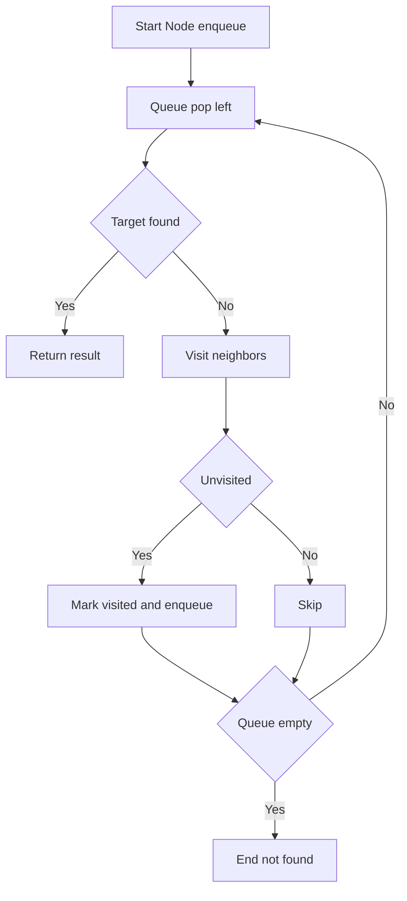
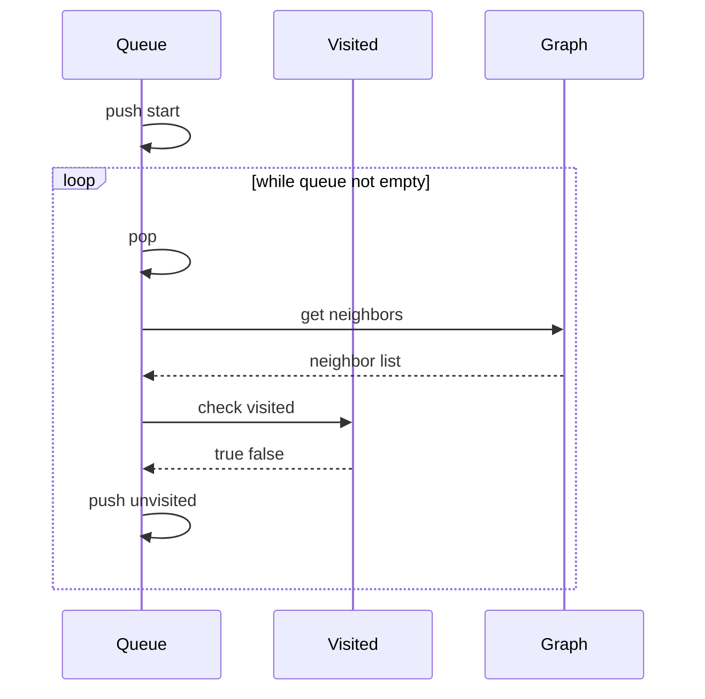

# BFS (너비 우선 탐색) - GitHub Pages 해설

## 문서 목적
- 원본 템플릿 `01-graph/01-bfs.md` 의 내부 동작을 GitHub Markdown에서 바로 읽을 수 있게 설명합니다.
- 코드 레이어(초기화/루프/조건/갱신/종료)를 분해하고, Mermaid로 제어 흐름을 시각화합니다.
- 실전 문제에 붙일 때 반드시 수정해야 하는 지점을 체크리스트로 제공합니다.

## 원본 템플릿
- Source: [01-graph/01-bfs.md](../../01-graph/01-bfs.md)

## 적용 계약과 근거 경계

- Python 3.x, hashable 노드, 인접 리스트 mapping을 전제로 합니다. mapping에 없는 노드는 outgoing edge가 없는 것으로 처리합니다.
- 아래 함수는 시작점부터 목표까지의 최소 **간선 수**를 반환하며, 도달 불가는 `None`입니다.
- FIFO 레이어 순서가 최단 hop을 보장하는 근거입니다. 도달 가능한 부분 그래프 기준 시간 `O(V+E)`, 공간 `O(V)`이며 실제 시간은 입력·인터프리터에 따라 다릅니다.

## 내부 메커니즘 (Flow)


## 내부 상호작용 (Sequence)


## 핵심 코드
```python
# [BFS 템플릿: 아키텍트 버전]
# Use Case: 무가중치 그래프의 최소 간선 수
# Components: Queue (FIFO), Visited Set
# Constraint: 큐에 넣을 때 방문 처리 필수 (중복 방지)

from collections import deque

def bfs_shortest_hops(start_node, graph, target):
    # 1. 초기화 (Initialization Layer)
    #    - 큐 생성, 시작점 삽입, 방문 처리
    queue = deque([(start_node, 0)])
    visited = {start_node}
    
    # 2. 메인 루프 (Process Loop)
    #    - 큐가 빌 때까지 반복
    while queue:
        current, hops = queue.popleft()
        
        # 3. 비즈니스 로직 (Core Logic)
        #    - (필요하다면) 여기서 정답 체크 혹은 데이터 가공
        if current == target:
            return hops
        
        # 4. 확장 로직 (Expansion Layer)
        #    - 연결된 노드 탐색 및 조건 필터링
        for neighbor in graph.get(current, ()):
            if neighbor not in visited:
                visited.add(neighbor)
                queue.append((neighbor, hops + 1))
    
    return None  # 탐색 실패
```

## 코드 레이어 해설
- **Initialization**: 상태 테이블/포인터/큐/스택/부모 배열 등 탐색의 기준 상태를 만든다.
- **Process Loop / Recursion**: 입력 공간을 순회하며 상태 전이를 반복한다.
- **Decision Rule**: 분기 조건(완화 가능 여부, 유효 선택 여부, 종료 조건)을 적용한다.
- **State Update**: 거리/DP/집합/결과 배열을 갱신하고 다음 단계로 전달한다.
- **Termination**: 목표 도달, 범위 소진, 큐/스택 고갈, 사이클 검출 등으로 종료한다.

## 실전 적용 체크리스트
- 방향성, 시작·목표 노드의 존재 규칙과 중복 간선 처리를 고정합니다.
- 큐에 넣을 때 방문 표시한다는 불변식을 확인합니다.
- 시작점과 목표가 같은 경우 0, cycle, sink 노드, 도달 불가를 시험합니다.
- 작은 그래프는 모든 단순 경로나 검증된 라이브러리 결과와 대조합니다.
