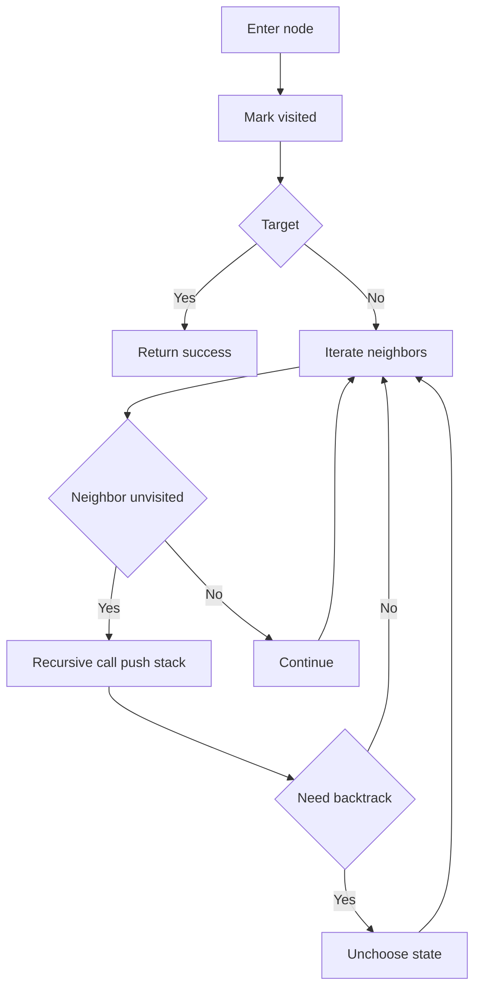
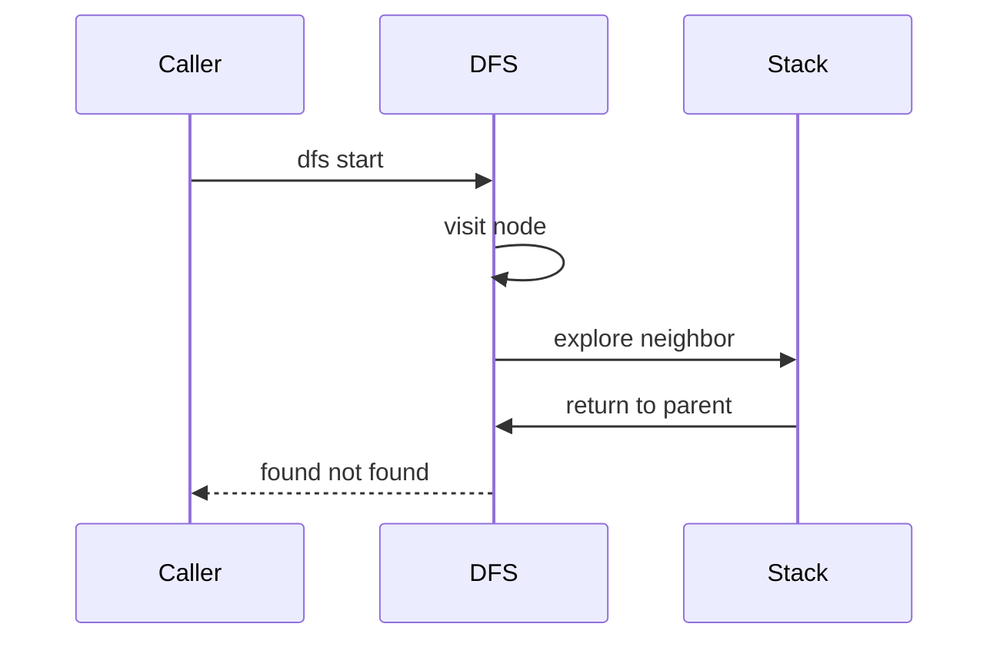

# DFS (깊이 우선 탐색) - GitHub Pages 해설

## 문서 목적
- 원본 템플릿 `01-graph/02-dfs.md` 의 내부 동작을 GitHub Markdown에서 바로 읽을 수 있게 설명합니다.
- 코드 레이어(초기화/루프/조건/갱신/종료)를 분해하고, Mermaid로 제어 흐름을 시각화합니다.
- 실전 문제에 붙일 때 반드시 수정해야 하는 지점을 체크리스트로 제공합니다.

## 원본 템플릿
- Source: [01-graph/02-dfs.md](../../01-graph/02-dfs.md)

## 적용 계약과 근거 경계

- Python 3.x의 인접 리스트 graph와 hashable 노드를 전제로 하며, 누락 key는 outgoing edge가 없는 노드로 처리합니다.
- 함수는 목표 도달 여부만 반환합니다. 최단 경로나 방문 순서는 보장하지 않습니다.
- 시간 `O(V+E)`, 방문 집합 `O(V)` 외에 재귀 깊이 `O(V)`가 가능하므로 깊은 그래프는 반복형 stack이나 recursion limit 정책이 필요합니다.

## 내부 메커니즘 (Flow)


## 내부 상호작용 (Sequence)


## 핵심 코드
```python
# [DFS 템플릿: 아키텍트 버전]
# Use Case: 경로 탐색, 사이클 검출, 연결 요소 찾기
# Components: Stack (LIFO) 또는 재귀
# Constraint: 백트래킹 시 방문 해제 필요한 경우 있음

# [DFS 재귀 버전]
def dfs_recursive(node, graph, target, visited=None):
    # 1. 초기화 (Initialization Layer)
    #    - 방문 집합 생성 (최초 호출 시)
    if visited is None:
        visited = set()
    
    # 2. 방문 처리 (Visit Layer)
    visited.add(node)
    
    # 3. 비즈니스 로직 (Core Logic)
    #    - 목표 발견 시 조기 종료
    if node == target:
        return True
    
    # 4. 재귀 확장 (Recursive Expansion)
    #    - 인접 노드로 깊이 우선 탐색
    for neighbor in graph.get(node, ()):
        if neighbor not in visited:
            if dfs_recursive(neighbor, graph, target, visited):
                return True
    
    return False
```

## 코드 레이어 해설
- **Initialization**: 상태 테이블/포인터/큐/스택/부모 배열 등 탐색의 기준 상태를 만든다.
- **Process Loop / Recursion**: 입력 공간을 순회하며 상태 전이를 반복한다.
- **Decision Rule**: 분기 조건(완화 가능 여부, 유효 선택 여부, 종료 조건)을 적용한다.
- **State Update**: 거리/DP/집합/결과 배열을 갱신하고 다음 단계로 전달한다.
- **Termination**: 목표 도달, 범위 소진, 큐/스택 고갈, 사이클 검출 등으로 종료한다.

## 실전 적용 체크리스트
- graph reachability에서는 방문 표시를 되돌리지 않습니다. 조합 백트래킹의 선택 해제와 구분합니다.
- 시작점과 목표가 같은 경우, cycle, 누락 adjacency, 도달 불가를 시험합니다.
- 방문 집합 때문에 각 노드가 최대 한 번 확장되는지 확인합니다.
- 매우 긴 chain은 `RecursionError` 가능성을 확인하고 반복형 구현으로 전환합니다.
