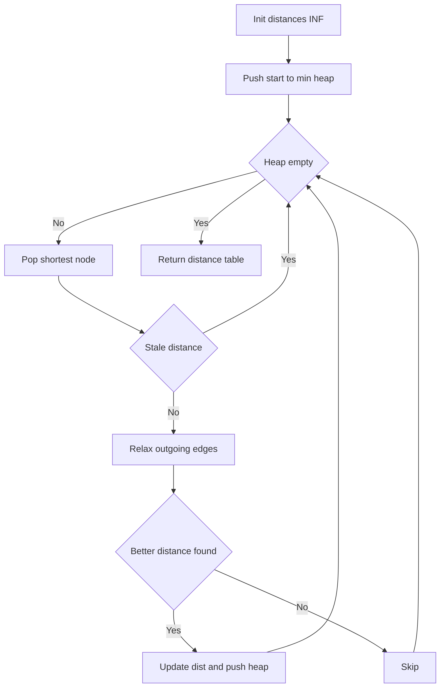
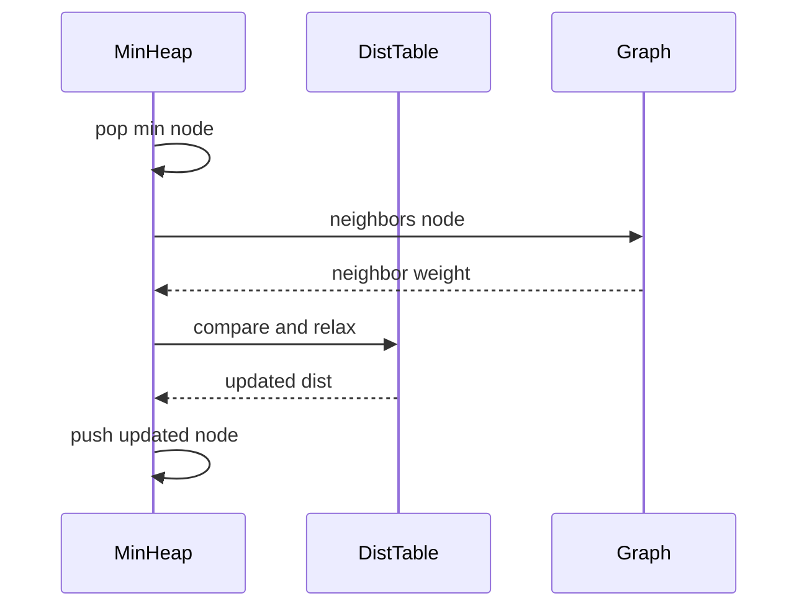

# 다익스트라 (Dijkstra) - GitHub Pages 해설

## 문서 목적
- 원본 템플릿 `01-graph/03-dijkstra.md` 의 내부 동작을 GitHub Markdown에서 바로 읽을 수 있게 설명합니다.
- 코드 레이어(초기화/루프/조건/갱신/종료)를 분해하고, Mermaid로 제어 흐름을 시각화합니다.
- 실전 문제에 붙일 때 반드시 수정해야 하는 지점을 체크리스트로 제공합니다.

## 원본 템플릿
- Source: [01-graph/03-dijkstra.md](../../01-graph/03-dijkstra.md)

## 적용 계약과 근거 경계

- 노드는 `1..n`, graph 값은 `(neighbor, weight)` 목록이며 모든 도달 가능한 간선 가중치는 0 이상이어야 합니다.
- 결과의 `inf`는 시작점에서 도달 불가라는 뜻입니다. 경로 자체가 필요하면 predecessor를 별도로 기록합니다.
- 중복 heap entry를 허용하는 구현으로 시간 `O((V+E) log V)`, 거리·heap 공간은 최악 `O(V+E)`입니다.

## 내부 메커니즘 (Flow)


## 내부 상호작용 (Sequence)


## 핵심 코드
```python
# [Dijkstra 템플릿: 아키텍트 버전]
# Use Case: 가중치 그래프의 최단 경로
# Components: Priority Queue (Min-Heap), Distance Table
# Constraint: 음수 가중치 불가

import heapq

def dijkstra(start, graph, n):
    # 1. 초기화 (Initialization Layer)
    #    - 거리 테이블 무한대로 초기화
    #    - 우선순위 큐에 시작점 삽입
    INF = float('inf')
    distances = [INF] * (n + 1)
    distances[start] = 0
    pq = [(0, start)]  # (거리, 노드)
    
    # 2. 메인 루프 (Process Loop)
    #    - 우선순위 큐가 빌 때까지
    while pq:
        current_dist, current_node = heapq.heappop(pq)
        
        # 3. 최적화 레이어 (Optimization Layer)
        #    - 이미 처리된 노드는 스킵
        if current_dist > distances[current_node]:
            continue
        
        # 4. 확장 로직 (Expansion Layer)
        #    - 인접 노드의 거리 갱신
        for neighbor, weight in graph.get(current_node, ()):
            if weight < 0:
                raise ValueError("Dijkstra requires non-negative weights")
            new_dist = current_dist + weight
            
            # 5. 갱신 조건 (Update Condition)
            if new_dist < distances[neighbor]:
                distances[neighbor] = new_dist
                heapq.heappush(pq, (new_dist, neighbor))
    
    return distances
```

## 코드 레이어 해설
- **Initialization**: 상태 테이블/포인터/큐/스택/부모 배열 등 탐색의 기준 상태를 만든다.
- **Process Loop / Recursion**: 입력 공간을 순회하며 상태 전이를 반복한다.
- **Decision Rule**: 분기 조건(완화 가능 여부, 유효 선택 여부, 종료 조건)을 적용한다.
- **State Update**: 거리/DP/집합/결과 배열을 갱신하고 다음 단계로 전달한다.
- **Termination**: 목표 도달, 범위 소진, 큐/스택 고갈, 사이클 검출 등으로 종료한다.

## 실전 적용 체크리스트
- `start`와 모든 endpoint 범위를 검증하고 directed/undirected 간선 생성 규칙을 고정합니다.
- 음수 간선은 예외로 종료하며 Bellman-Ford 전환 조건을 호출자에게 전달합니다.
- 0 가중치, 평행 간선, sink, 도달 불가, stale heap entry를 시험합니다.
- 작은 그래프는 Bellman-Ford 결과와 모든 거리 값을 대조합니다.
