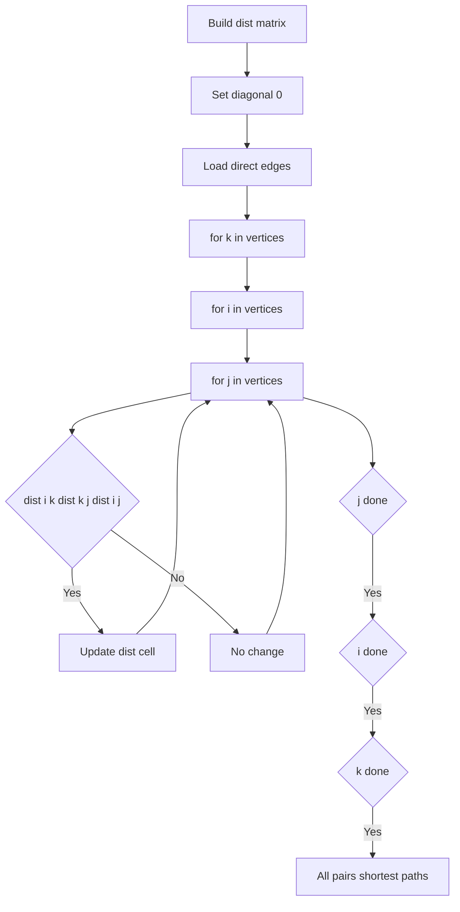
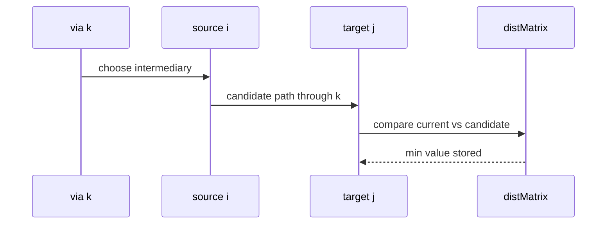

# 플로이드-워셜 (Floyd-Warshall) - GitHub Pages 해설

## 문서 목적
- 원본 템플릿 `01-graph/05-floyd-warshall.md` 의 내부 동작을 GitHub Markdown에서 바로 읽을 수 있게 설명합니다.
- 코드 레이어(초기화/루프/조건/갱신/종료)를 분해하고, Mermaid로 제어 흐름을 시각화합니다.
- 실전 문제에 붙일 때 반드시 수정해야 하는 지점을 체크리스트로 제공합니다.

## 원본 템플릿
- Source: [01-graph/05-floyd-warshall.md](../../01-graph/05-floyd-warshall.md)

## 적용 계약과 근거 경계

- 노드 `1..n`과 directed edge tuple을 전제로 하며 평행 간선은 최소 가중치를 사용합니다.
- 음수 간선은 허용하지만 `dist[v][v] < 0`이면 음수 사이클의 영향을 받는 쌍에는 유한 최단 거리가 없습니다. 아래 함수는 이 경우 예외를 냅니다.
- 시간 `O(V³)`, 공간 `O(V²)`이므로 “정점 수가 적다”는 고정 숫자가 아니라 메모리·시간 예산으로 판단합니다.

## 내부 메커니즘 (Flow)


## 내부 상호작용 (Sequence)


## 핵심 코드
```python
# [Floyd-Warshall 템플릿: 아키텍트 버전]
# Use Case: 모든 쌍 최단 경로
# Components: 2D Distance Matrix
# Constraint: O(V³) 시간 복잡도, 정점 수 적을 때만 사용

def floyd_warshall(graph, n):
    # 1. 초기화 (Initialization Layer)
    #    - 2차원 거리 행렬 생성
    INF = float('inf')
    dist = [[INF] * (n + 1) for _ in range(n + 1)]
    
    # 자기 자신으로 가는 거리 0
    for i in range(1, n + 1):
        dist[i][i] = 0
    
    # 초기 간선 정보 입력
    for u, v, weight in graph:
        dist[u][v] = min(dist[u][v], weight)
    
    # 2. 3중 루프 (Triple Loop)
    #    - k: 경유 노드
    #    - i: 출발 노드
    #    - j: 도착 노드
    for k in range(1, n + 1):  # 경유점
        for i in range(1, n + 1):  # 출발
            for j in range(1, n + 1):  # 도착
                # 3. 갱신 로직 (Update Logic)
                #    - k를 거쳐가는 것이 더 짧은지 확인
                if dist[i][k] + dist[k][j] < dist[i][j]:
                    dist[i][j] = dist[i][k] + dist[k][j]
    
    if any(dist[v][v] < 0 for v in range(1, n + 1)):
        raise ValueError("negative cycle detected")

    return dist
```

## 코드 레이어 해설
- **Initialization**: 상태 테이블/포인터/큐/스택/부모 배열 등 탐색의 기준 상태를 만든다.
- **Process Loop / Recursion**: 입력 공간을 순회하며 상태 전이를 반복한다.
- **Decision Rule**: 분기 조건(완화 가능 여부, 유효 선택 여부, 종료 조건)을 적용한다.
- **State Update**: 거리/DP/집합/결과 배열을 갱신하고 다음 단계로 전달한다.
- **Termination**: 목표 도달, 범위 소진, 큐/스택 고갈, 사이클 검출 등으로 종료한다.

## 실전 적용 체크리스트
- endpoint 범위, directed/undirected 입력과 평행 간선 규칙을 확인합니다.
- 대각선 0, `inf` 도달 불가, 음수 간선과 음수 사이클을 각각 시험합니다.
- 각 `k` 단계에서 허용된 중간 정점만 쓰는 불변식을 설명합니다.
- 작은 그래프는 각 시작점 Bellman-Ford 결과와 행별로 대조합니다.
