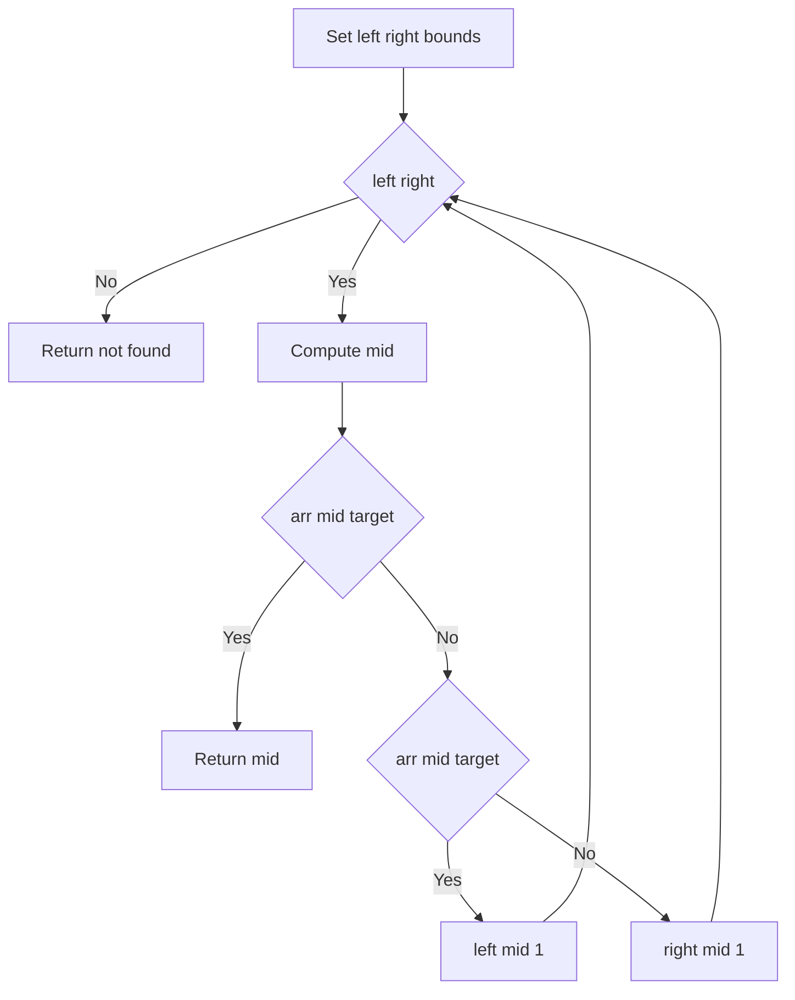
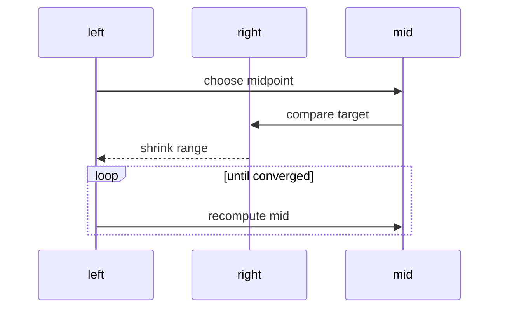

# 이진 탐색 (Binary Search) - GitHub Pages 해설

## 문서 목적
- 원본 템플릿 `02-sorting-searching/01-binary-search.md` 의 내부 동작을 GitHub Markdown에서 바로 읽을 수 있게 설명합니다.
- 코드 레이어(초기화/루프/조건/갱신/종료)를 분해하고, Mermaid로 제어 흐름을 시각화합니다.
- 실전 문제에 붙일 때 반드시 수정해야 하는 지점을 체크리스트로 제공합니다.

## 원본 템플릿
- Source: [02-sorting-searching/01-binary-search.md](../../02-sorting-searching/01-binary-search.md)

## 적용 계약과 근거 경계

- `arr`는 target과 같은 비교 규칙으로 오름차순 정렬된 random-access sequence여야 합니다.
- 중복 값이 있으면 일치하는 인덱스 중 하나를 반환하며 first/last occurrence를 보장하지 않습니다. `-1`은 없음입니다.
- 비교 횟수는 `O(log N)`, 추가 공간은 `O(1)`입니다. 정렬 비용은 포함하지 않습니다.

## 내부 메커니즘 (Flow)


## 내부 상호작용 (Sequence)


## 핵심 코드
```python
# [Binary Search 템플릿: 아키텍트 버전]
# Use Case: 정렬된 배열에서 O(log N) 탐색
# Components: Left, Right 포인터, Mid
# Constraint: 배열이 정렬되어 있어야 함

def binary_search(arr, target):
    # 1. 초기화 (Initialization Layer)
    #    - 탐색 범위 설정
    left, right = 0, len(arr) - 1
    
    # 2. 분할 루프 (Division Loop)
    #    - 범위가 유효한 동안 반복
    while left <= right:
        # 3. 중간점 계산 (Mid Calculation)
        mid = (left + right) // 2
        
        # 4. 비교 로직 (Comparison Logic)
        if arr[mid] == target:
            return mid  # 발견
        elif arr[mid] < target:
            left = mid + 1  # 오른쪽 절반 탐색
        else:
            right = mid - 1  # 왼쪽 절반 탐색
    
    return -1  # 찾지 못함
```

## 코드 레이어 해설
- **Initialization**: 상태 테이블/포인터/큐/스택/부모 배열 등 탐색의 기준 상태를 만든다.
- **Process Loop / Recursion**: 입력 공간을 순회하며 상태 전이를 반복한다.
- **Decision Rule**: 분기 조건(완화 가능 여부, 유효 선택 여부, 종료 조건)을 적용한다.
- **State Update**: 거리/DP/집합/결과 배열을 갱신하고 다음 단계로 전달한다.
- **Termination**: 목표 도달, 범위 소진, 큐/스택 고갈, 사이클 검출 등으로 종료한다.

## 실전 적용 체크리스트
- 정렬 방향과 비교 가능성, 중복 시 원하는 위치 정책을 고정합니다.
- 빈 배열, 단일 원소, 양 끝, 중복, 범위 밖 target을 시험합니다.
- 루프마다 target 후보 구간이 `[left, right]`에만 남는 불변식을 확인합니다.
- Python `bisect` 또는 선형 검색과 무작위 정렬 배열 결과를 대조합니다.
