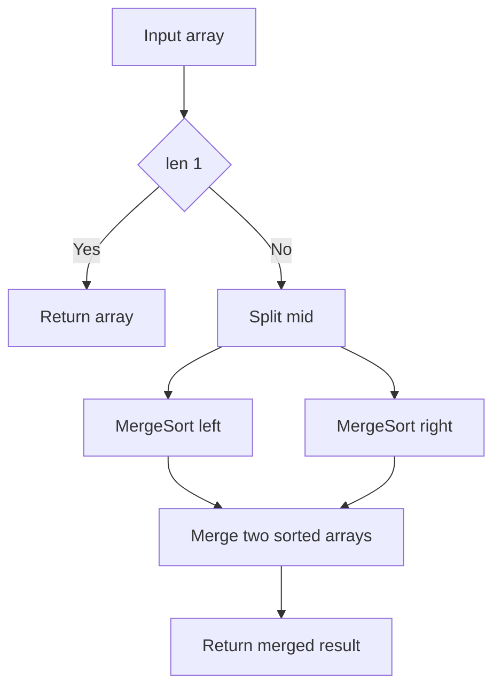
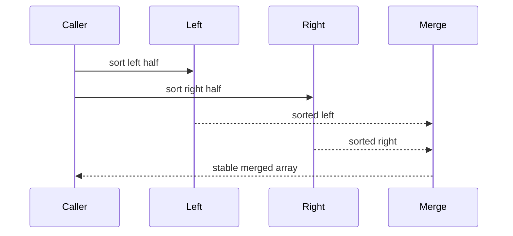

# 병합 정렬 (Merge Sort) - GitHub Pages 해설

## 문서 목적
- 원본 템플릿 `02-sorting-searching/03-merge-sort.md` 의 내부 동작을 GitHub Markdown에서 바로 읽을 수 있게 설명합니다.
- 코드 레이어(초기화/루프/조건/갱신/종료)를 분해하고, Mermaid로 제어 흐름을 시각화합니다.
- 실전 문제에 붙일 때 반드시 수정해야 하는 지점을 체크리스트로 제공합니다.

## 원본 템플릿
- Source: [02-sorting-searching/03-merge-sort.md](../../02-sorting-searching/03-merge-sort.md)

## 적용 계약과 근거 경계

- 상호 비교 가능한 sequence를 받아 새 list를 반환합니다. `<=`일 때 왼쪽을 먼저 선택하므로 이 구현은 동등 키의 상대 순서를 보존합니다.
- 시간 `O(N log N)`, 병합 결과의 peak 보조 공간은 `O(N)`이며 Python slicing의 추가 할당도 발생합니다.
- “안정적”은 comparator가 일관된 total preorder를 제공한다는 전제의 알고리즘 성질이지 실행 시간 보장이 아닙니다.

## 내부 메커니즘 (Flow)


## 내부 상호작용 (Sequence)


## 핵심 코드
```python
# [Merge Sort 템플릿: 아키텍트 버전]
# Use Case: 안정적인 O(N log N) 정렬
# Components: Divide, Merge
# Constraint: O(N) 추가 공간 필요

def merge_sort(arr):
    # 1. 베이스 케이스 (Base Case)
    if len(arr) <= 1:
        return arr
    
    # 2. 분할 레이어 (Division Layer)
    mid = len(arr) // 2
    left = arr[:mid]
    right = arr[mid:]
    
    # 3. 재귀 정복 (Recursive Conquer)
    left = merge_sort(left)
    right = merge_sort(right)
    
    # 4. 병합 레이어 (Merge Layer)
    return merge(left, right)


def merge(left, right):
    # 1. 초기화 (Initialization)
    result = []
    i = j = 0
    
    # 2. 병합 루프 (Merge Loop)
    #    - 두 배열을 비교하며 작은 것부터 추가
    while i < len(left) and j < len(right):
        if left[i] <= right[j]:
            result.append(left[i])
            i += 1
        else:
            result.append(right[j])
            j += 1
    
    # 3. 잔여 처리 (Remaining Elements)
    result.extend(left[i:])
    result.extend(right[j:])
    
    return result
```

## 코드 레이어 해설
- **Initialization**: 상태 테이블/포인터/큐/스택/부모 배열 등 탐색의 기준 상태를 만든다.
- **Process Loop / Recursion**: 입력 공간을 순회하며 상태 전이를 반복한다.
- **Decision Rule**: 분기 조건(완화 가능 여부, 유효 선택 여부, 종료 조건)을 적용한다.
- **State Update**: 거리/DP/집합/결과 배열을 갱신하고 다음 단계로 전달한다.
- **Termination**: 목표 도달, 범위 소진, 큐/스택 고갈, 사이클 검출 등으로 종료한다.

## 실전 적용 체크리스트
- 빈·단일·중복·이미 정렬·역정렬 입력을 시험합니다.
- 결과 정렬성, 길이와 multiset 보존을 확인합니다.
- 동일 key에 원래 순번을 붙여 stability를 검증합니다.
- `sorted`와 결과를 대조하고 큰 입력은 시간뿐 아니라 peak memory도 측정합니다.
