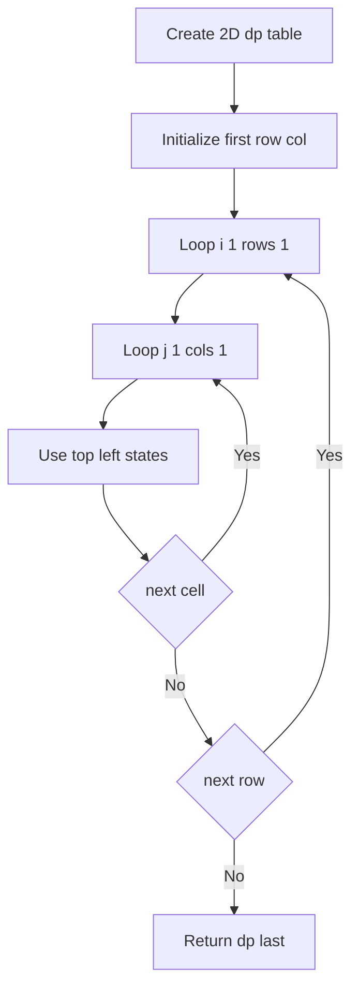
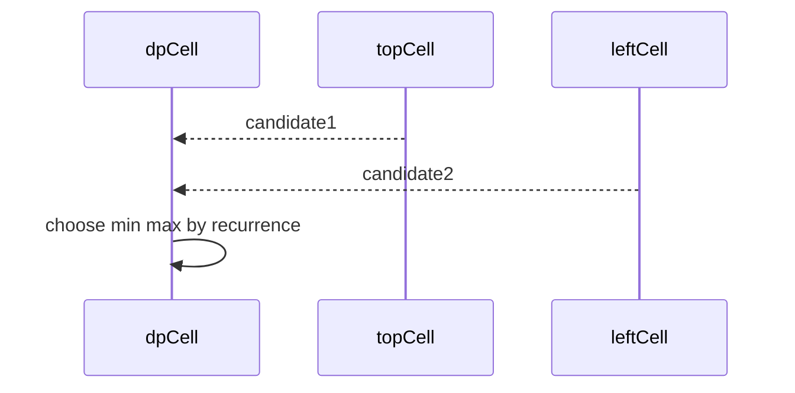

# 2차원 DP (2D Dynamic Programming - 격자형) - GitHub Pages 해설

## 문서 목적
- 원본 템플릿 `03-dynamic-programming/02-dp-2d.md` 의 내부 동작을 GitHub Markdown에서 바로 읽을 수 있게 설명합니다.
- 코드 레이어(초기화/루프/조건/갱신/종료)를 분해하고, Mermaid로 제어 흐름을 시각화합니다.
- 실전 문제에 붙일 때 반드시 수정해야 하는 지점을 체크리스트로 제공합니다.

## 원본 템플릿
- Source: [03-dynamic-programming/02-dp-2d.md](../../03-dynamic-programming/02-dp-2d.md)

## 적용 계약과 근거 경계

- 비어 있지 않은 직사각형 숫자 grid에서 오른쪽 또는 아래로만 이동하는 최소 경로 합입니다. LCS나 편집 거리에 그대로 쓰는 범용 2D DP가 아닙니다.
- 시간과 공간은 모두 `O(rows·cols)`입니다. predecessor를 저장하지 않으므로 경로 자체는 반환하지 않습니다.
- 빈·ragged grid는 명시적 예외이며, 음수 cell은 DAG 이동이므로 허용할 수 있습니다.

## 내부 메커니즘 (Flow)


## 내부 상호작용 (Sequence)


## 핵심 코드
```python
# [2D DP 템플릿: 아키텍트 버전]
# Use Case: 격자 경로, LCS, 편집 거리
# Components: 2D DP Table
# Constraint: 2차원 상태 관리

def dp_2d_grid(grid):
    if not grid or not grid[0]:
        raise ValueError("grid must be non-empty")
    if any(len(row) != len(grid[0]) for row in grid):
        raise ValueError("grid must be rectangular")

    # 1. 초기화 (Initialization Layer)
    rows, cols = len(grid), len(grid[0])
    dp = [[0] * cols for _ in range(rows)]
    
    # 2. 베이스 케이스 (Base Case)
    dp[0][0] = grid[0][0]
    
    # 첫 행 초기화
    for j in range(1, cols):
        dp[0][j] = dp[0][j-1] + grid[0][j]
    
    # 첫 열 초기화
    for i in range(1, rows):
        dp[i][0] = dp[i-1][0] + grid[i][0]
    
    # 3. 2중 루프 (Double Loop)
    for i in range(1, rows):
        for j in range(1, cols):
            # 4. 점화식 (Recurrence)
            #    - 위에서 오거나 왼쪽에서 오거나
            dp[i][j] = grid[i][j] + min(dp[i-1][j], dp[i][j-1])
    
    return dp[rows-1][cols-1]
```

## 코드 레이어 해설
- **Initialization**: 상태 테이블/포인터/큐/스택/부모 배열 등 탐색의 기준 상태를 만든다.
- **Process Loop / Recursion**: 입력 공간을 순회하며 상태 전이를 반복한다.
- **Decision Rule**: 분기 조건(완화 가능 여부, 유효 선택 여부, 종료 조건)을 적용한다.
- **State Update**: 거리/DP/집합/결과 배열을 갱신하고 다음 단계로 전달한다.
- **Termination**: 목표 도달, 범위 소진, 큐/스택 고갈, 사이클 검출 등으로 종료한다.

## 실전 적용 체크리스트
- `1x1`, 한 행·한 열, 음수 값, 빈·ragged 입력을 시험합니다.
- 각 cell이 그 위치까지의 최소 합이라는 불변식을 확인합니다.
- 작은 grid는 모든 right/down 경로를 열거한 결과와 대조합니다.
- 메모리 최적화 시 이전 행 덮어쓰기 순서가 점화식을 깨지 않는지 확인합니다.
