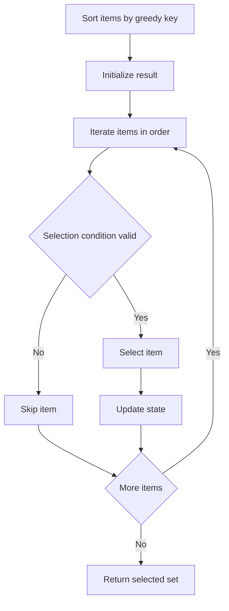
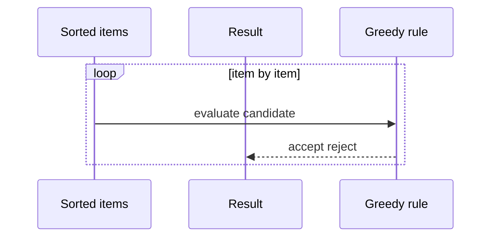

# 그리디 (Greedy) - GitHub Pages 해설

## 문서 목적
- 원본 템플릿 `04-greedy/01-greedy.md` 의 내부 동작을 GitHub Markdown에서 바로 읽을 수 있게 설명합니다.
- 코드 레이어(초기화/루프/조건/갱신/종료)를 분해하고, Mermaid로 제어 흐름을 시각화합니다.
- 실전 문제에 붙일 때 반드시 수정해야 하는 지점을 체크리스트로 제공합니다.

## 원본 템플릿
- Source: [04-greedy/01-greedy.md](../../04-greedy/01-greedy.md)

## 적용 계약과 근거 경계

- 아래 코드는 일반 greedy가 아니라 `(start, end)` interval 중 겹치지 않는 최대 개수를 고르는 종료 시각 정렬 알고리즘입니다.
- 각 interval은 `start <= end`이고 같은 endpoint 접촉을 허용한다고 가정합니다. 입력은 수정하지 않습니다.
- 정렬 때문에 시간 `O(n log n)`, 결과 공간 `O(n)`입니다. 최적성은 가장 이른 종료 interval로 교환 가능한 논증에 의존합니다.

## 내부 메커니즘 (Flow)


## 내부 상호작용 (Sequence)


## 핵심 코드
```python
# [Greedy 템플릿: 아키텍트 버전]
# Use Case: 최적 부분 구조, 탐욕적 선택 속성
# Components: Sorting (대부분), Selection Logic
# Constraint: 매 순간 최선의 선택이 전체 최적해 보장해야 함

def select_intervals(items):
    if any(len(item) < 2 or item[0] > item[1] for item in items):
        raise ValueError("each interval must satisfy start <= end")

    # 1. 정렬 레이어 (Sorting Layer)
    #    - 그리디 기준에 따라 정렬
    sorted_items = sorted(items, key=lambda x: x[1])
    
    # 2. 초기화 (Initialization)
    result = []
    last_selected = None
    
    # 3. 순차 선택 (Sequential Selection)
    for item in sorted_items:
        # 4. 선택 조건 (Selection Condition)
        #    - 탐욕적 규칙에 부합하는지 확인
        if is_valid(item, last_selected):
            result.append(item)
            last_selected = item
    
    return result

def is_valid(item, last_selected):
    # 선택 가능 여부 판단 로직
    if last_selected is None:
        return True
    return item[0] >= last_selected[1]  # 예: 시작 시간 >= 이전 종료 시간
```

## 코드 레이어 해설
- **Initialization**: 상태 테이블/포인터/큐/스택/부모 배열 등 탐색의 기준 상태를 만든다.
- **Process Loop / Recursion**: 입력 공간을 순회하며 상태 전이를 반복한다.
- **Decision Rule**: 분기 조건(완화 가능 여부, 유효 선택 여부, 종료 조건)을 적용한다.
- **State Update**: 거리/DP/집합/결과 배열을 갱신하고 다음 단계로 전달한다.
- **Termination**: 목표 도달, 범위 소진, 큐/스택 고갈, 사이클 검출 등으로 종료한다.

## 실전 적용 체크리스트
- endpoint 접촉, 동일 종료 시각, 포함 관계, 빈 입력과 잘못된 interval을 시험합니다.
- 선택 결과가 pairwise compatible인지 확인합니다.
- 작은 입력은 모든 부분 집합 중 최대 compatible 개수와 대조합니다.
- 가중 interval scheduling에는 이 규칙이 최적을 보장하지 않으므로 DP로 전환합니다.
