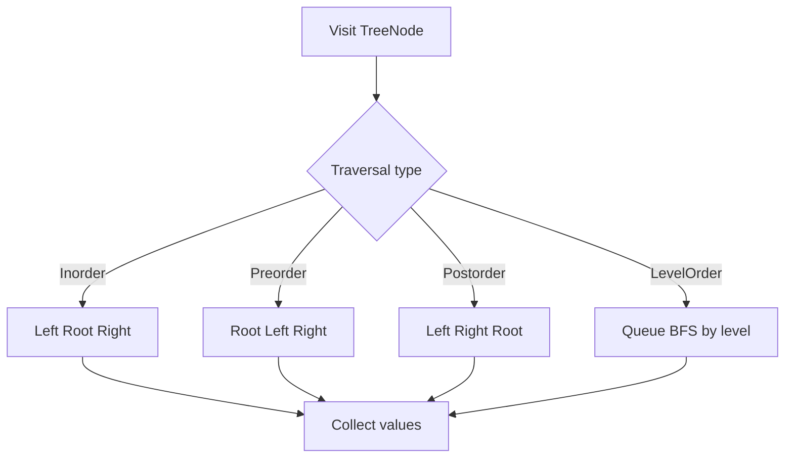
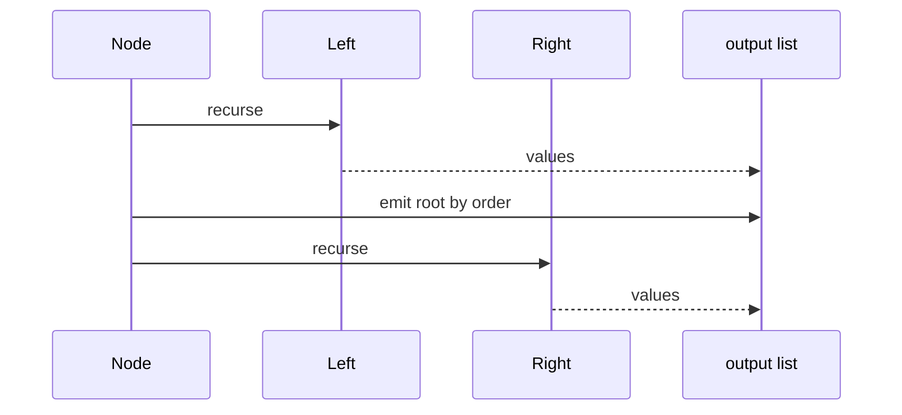

# 트리 순회 (Tree Traversal) - GitHub Pages 해설

## 문서 목적
- 원본 템플릿 `05-tree/01-tree-traversal.md` 의 내부 동작을 GitHub Markdown에서 바로 읽을 수 있게 설명합니다.
- 코드 레이어(초기화/루프/조건/갱신/종료)를 분해하고, Mermaid로 제어 흐름을 시각화합니다.
- 실전 문제에 붙일 때 반드시 수정해야 하는 지점을 체크리스트로 제공합니다.

## 원본 템플릿
- Source: [05-tree/01-tree-traversal.md](../../05-tree/01-tree-traversal.md)

## 적용 계약과 근거 경계

- cycle과 공유 child가 없는 binary tree를 전제로 합니다. node value의 유일성은 요구하지 않습니다.
- 각 함수는 값 list를 반환합니다. 시간 `O(n)`이며 재귀 순회는 tree 높이 `O(h)` stack, level order는 최대 폭에 비례한 queue를 사용합니다.
- 매우 치우친 tree는 Python recursion limit을 넘을 수 있어 반복형 순회가 필요합니다.

## 내부 메커니즘 (Flow)


## 내부 상호작용 (Sequence)


## 핵심 코드
```python
from collections import deque

class TreeNode:
    def __init__(self, val=0, left=None, right=None):
        self.val = val
        self.left = left
        self.right = right


def inorder(root):
    result = []

    def visit(node):
        if node is None:
            return
        visit(node.left)
        result.append(node.val)
        visit(node.right)

    visit(root)
    return result


def preorder(root):
    if root is None:
        return []
    return [root.val] + preorder(root.left) + preorder(root.right)


def postorder(root):
    if root is None:
        return []
    return postorder(root.left) + postorder(root.right) + [root.val]


def level_order(root):
    if root is None:
        return []
    queue = deque([root])
    result = []
    while queue:
        node = queue.popleft()
        result.append(node.val)
        if node.left is not None:
            queue.append(node.left)
        if node.right is not None:
            queue.append(node.right)
    return result
```

## 코드 레이어 해설
- **Initialization**: 상태 테이블/포인터/큐/스택/부모 배열 등 탐색의 기준 상태를 만든다.
- **Process Loop / Recursion**: 입력 공간을 순회하며 상태 전이를 반복한다.
- **Decision Rule**: 분기 조건(완화 가능 여부, 유효 선택 여부, 종료 조건)을 적용한다.
- **State Update**: 거리/DP/집합/결과 배열을 갱신하고 다음 단계로 전달한다.
- **Termination**: 목표 도달, 범위 소진, 큐/스택 고갈, 사이클 검출 등으로 종료한다.

## 실전 적용 체크리스트
- 빈 tree, 단일 node, 왼쪽·오른쪽 편향, 중복 value를 시험합니다.
- 결과 길이가 node 수와 같고 각 node가 한 번만 방출되는지 확인합니다.
- 알려진 작은 tree의 네 순서를 손으로 계산해 대조합니다.
- 외부 입력이 graph일 수 있으면 cycle 검증 또는 visited 정책을 추가합니다.
