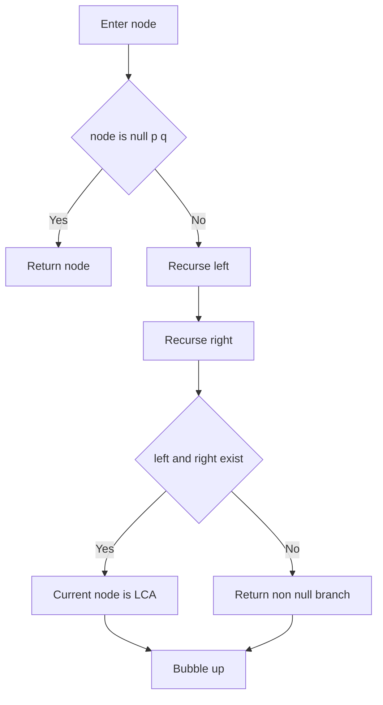
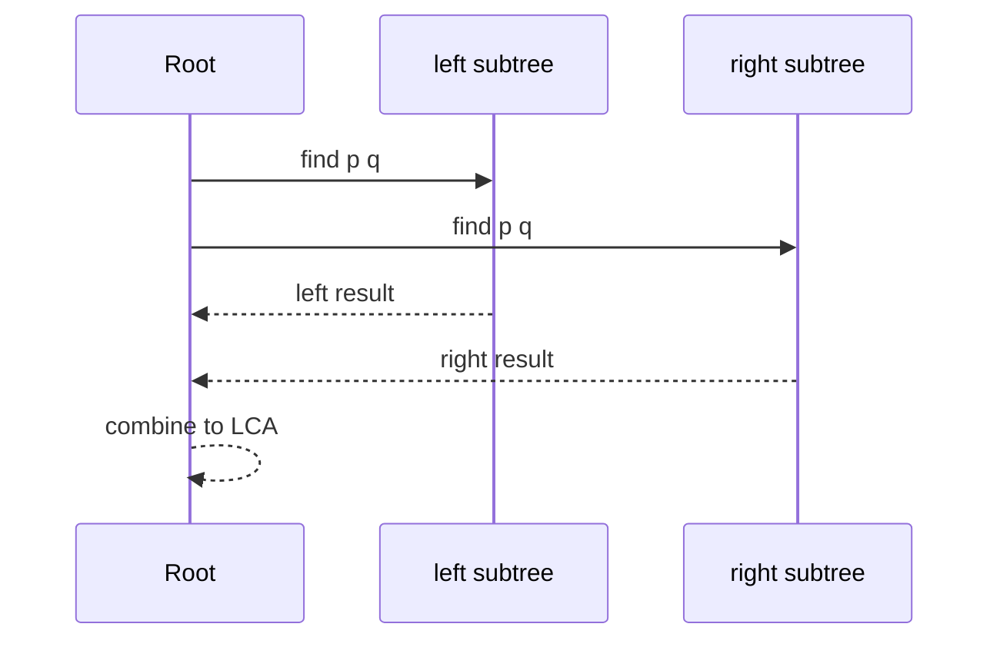

# 최소 공통 조상 (LCA - Lowest Common Ancestor) - GitHub Pages 해설

## 문서 목적
- 원본 템플릿 `05-tree/02-lca.md` 의 내부 동작을 GitHub Markdown에서 바로 읽을 수 있게 설명합니다.
- 코드 레이어(초기화/루프/조건/갱신/종료)를 분해하고, Mermaid로 제어 흐름을 시각화합니다.
- 실전 문제에 붙일 때 반드시 수정해야 하는 지점을 체크리스트로 제공합니다.

## 원본 템플릿
- Source: [05-tree/02-lca.md](../../05-tree/02-lca.md)

## 적용 계약과 근거 경계

- cycle 없는 binary tree에서 객체 identity로 `p`와 `q`를 찾습니다. value가 같아도 같은 node로 간주하지 않습니다.
- 둘 중 하나라도 tree에 없으면 `None`을 반환합니다. `p is q`이면 그 node가 tree에 있을 때 자기 자신을 반환합니다.
- 시간 `O(n)`, 재귀 stack `O(h)`이며 깊은 tree는 반복형 또는 parent map 방식이 필요합니다.

## 내부 메커니즘 (Flow)


## 내부 상호작용 (Sequence)


## 핵심 코드
```python
# [LCA 템플릿: 아키텍트 버전]
# Use Case: 두 노드의 공통 조상 찾기
# Components: Tree Structure, Parent Tracking
# Constraint: 트리 구조 필수

def lowest_common_ancestor(root, p, q):
    def visit(node):
        if node is None:
            return None, False, False

        left_lca, left_p, left_q = visit(node.left)
        right_lca, right_p, right_q = visit(node.right)
        found_p = left_p or right_p or node is p
        found_q = left_q or right_q or node is q

        if left_lca is not None and right_lca is not None:
            candidate = node
        elif node is p or node is q:
            candidate = node
        else:
            candidate = left_lca if left_lca is not None else right_lca

        return candidate, found_p, found_q

    candidate, found_p, found_q = visit(root)
    return candidate if found_p and found_q else None
```

## 코드 레이어 해설
- **Initialization**: 상태 테이블/포인터/큐/스택/부모 배열 등 탐색의 기준 상태를 만든다.
- **Process Loop / Recursion**: 입력 공간을 순회하며 상태 전이를 반복한다.
- **Decision Rule**: 분기 조건(완화 가능 여부, 유효 선택 여부, 종료 조건)을 적용한다.
- **State Update**: 거리/DP/집합/결과 배열을 갱신하고 다음 단계로 전달한다.
- **Termination**: 목표 도달, 범위 소진, 큐/스택 고갈, 사이클 검출 등으로 종료한다.

## 실전 적용 체크리스트
- 두 subtree에 분리, 조상·자손, 같은 node, 한쪽·양쪽 누락을 시험합니다.
- 반환 node가 둘의 조상이고 그 자식에는 두 node가 함께 있지 않은지 확인합니다.
- parent map으로 만든 ancestor set 결과와 작은 무작위 tree에서 대조합니다.
- value 비교가 아니라 identity 비교라는 API 계약을 호출자와 맞춥니다.
