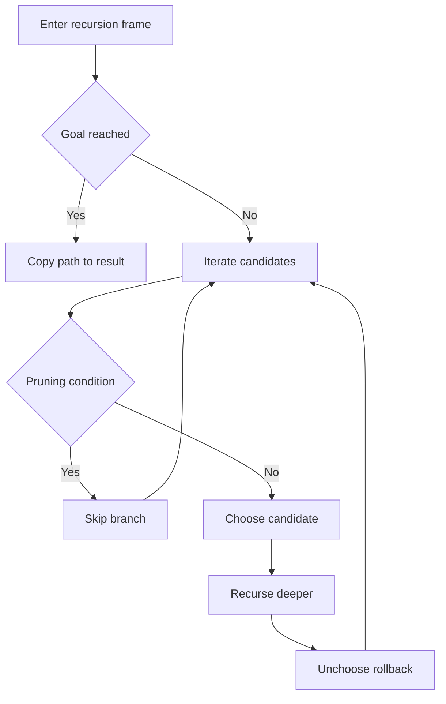
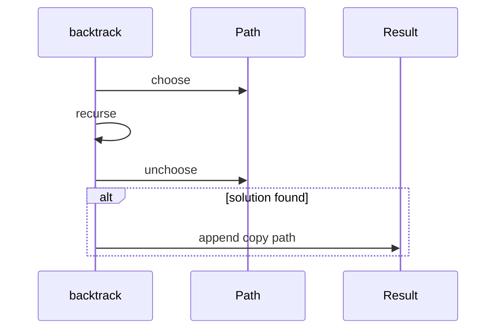

# 백트래킹 (Backtracking) - GitHub Pages 해설

## 문서 목적
- 원본 템플릿 `09-backtracking/01-backtracking.md` 의 내부 동작을 GitHub Markdown에서 바로 읽을 수 있게 설명합니다.
- 코드 레이어(초기화/루프/조건/갱신/종료)를 분해하고, Mermaid로 제어 흐름을 시각화합니다.
- 실전 문제에 붙일 때 수정 지점을 체크리스트로 정리한다.

## 원본 템플릿
- Source: [09-backtracking/01-backtracking.md](../../09-backtracking/01-backtracking.md)

## 내부 메커니즘 (Flow)


## 내부 상호작용 (Sequence)


## 핵심 코드
```python
# [Backtracking 템플릿: 아키텍트 버전]
# Use Case: 모든 경우의 수 탐색, 조합, 순열
# Components: Recursive DFS, Choice, Constraint
# Constraint: 가지치기(Pruning)로 최적화

def backtrack_template(candidates, target):
    # 1. 초기화 (Initialization Layer)
    result = []
    
    # 2. 백트래킹 함수 (Backtracking Function)
    def backtrack(path, start, remaining):
        # 3. 종료 조건 (Base Case)
        if remaining == 0:
            result.append(path[:])  # 복사 필수
            return
        
        # 4. 후보 탐색 (Candidate Exploration)
        for i in range(start, len(candidates)):
            # 5. 가지치기 (Pruning)
            if candidates[i] > remaining:
                break  # 정렬되어 있다면 조기 종료
            
            # 6. 선택 (Choose)
            path.append(candidates[i])
            
            # 7. 재귀 탐색 (Explore)
            backtrack(path, i, remaining - candidates[i])
            
            # 8. 복원 (Unchoose / Backtrack)
            path.pop()
    
    candidates.sort()  # 가지치기 효율화
    backtrack([], 0, target)
    return result
```

## 코드 레이어 해설
- **Initialization**: 상태 테이블/포인터/큐/스택/부모 배열 등 탐색의 기준 상태를 만든다.
- **Process Loop / Recursion**: 입력 공간을 순회하며 상태 전이를 반복한다.
- **Decision Rule**: 분기 조건(완화 가능 여부, 유효 선택 여부, 종료 조건)을 적용한다.
- **State Update**: 거리/DP/집합/결과 배열을 갱신하고 다음 단계로 전달한다.
- **Termination**: 목표 도달, 범위 소진, 큐/스택 고갈, 사이클 검출 등으로 종료한다.

## 실전 적용 체크리스트
- 입력 자료구조 형식(인접 리스트, 간선 리스트, 정렬 여부, 1-index/0-index)을 먼저 고정한다.
- 시간 복잡도 한계에 맞게 자료구조를 교체한다 (`list.pop(0)` -> `deque.popleft` 등).
- 실패/예외 경로를 명시한다 (도달 불가, 음수 사이클, 빈 결과, 사이클 존재).
- 테스트는 최소 3개: 정상 케이스, 경계 케이스, 반례 케이스를 포함한다.
