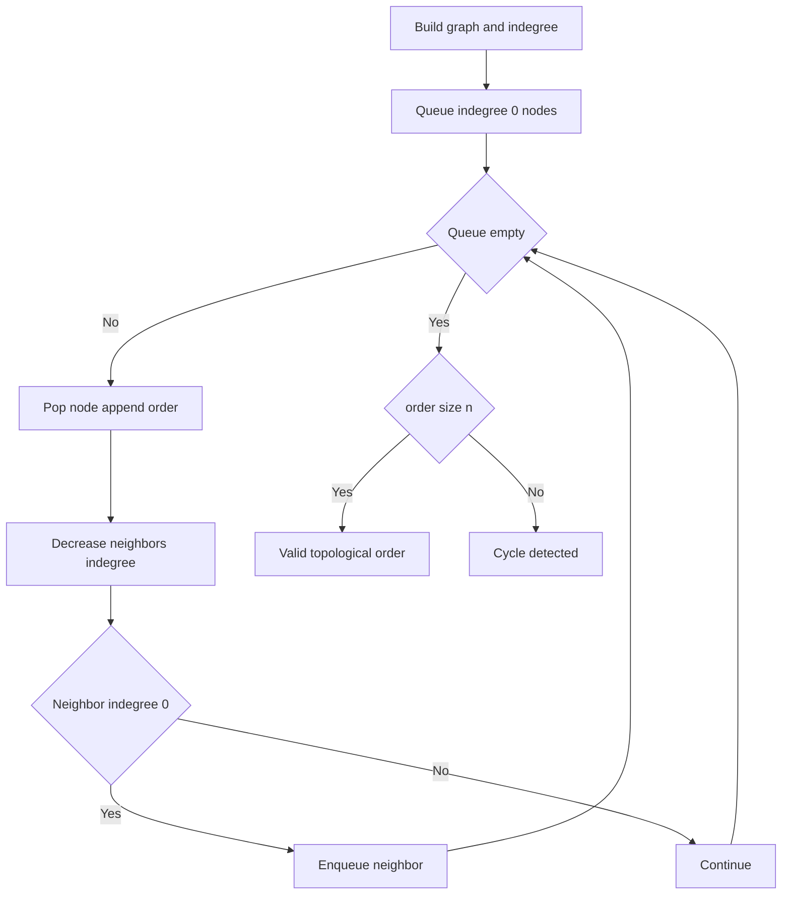
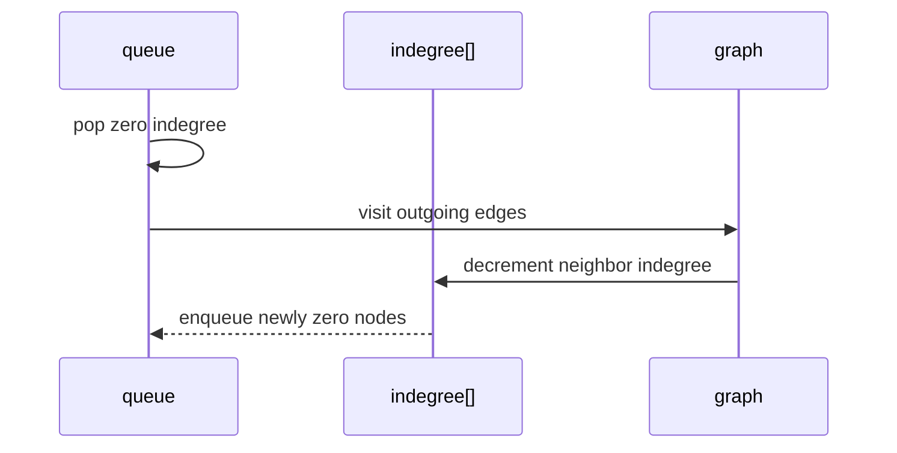

# 위상 정렬 (Topological Sort) - GitHub Pages 해설

## 문서 목적
- 원본 템플릿 `10-topological-sort/01-topological-sort.md` 의 내부 동작을 GitHub Markdown에서 바로 읽을 수 있게 설명합니다.
- 코드 레이어(초기화/루프/조건/갱신/종료)를 분해하고, Mermaid로 제어 흐름을 시각화합니다.
- 실전 문제에 적용할 때 graph representation, cycle failure와 tie-order 요구를 검토할 checklist를 제공합니다.

## 원본 템플릿
- Source: [10-topological-sort/01-topological-sort.md](../../10-topological-sort/01-topological-sort.md)

## 적용 범위와 검증 기준

- **범위:** directed graph가 DAG일 때의 ordering template 해설입니다. adjacency list에서 vertex·edge를 제한된 횟수 처리할 때 `O(V+E)`이며 유효 order는 여러 개일 수 있습니다.
- **전제:** Kahn 방식은 indegree와 processed count, DFS 방식은 visiting/visited state로 cycle을 검출해야 합니다. cycle이 있으면 full order 대신 명시적 failure를 반환합니다.
- **실패 조건:** duplicate edge, disconnected component, cycle, recursion depth와 tie order의 비결정성을 포함합니다.
- **완료 증거:** 모든 edge `u→v`에서 `u`가 먼저인지, 각 vertex가 한 번 있는지와 cycle fixture의 실패 판정을 reference와 비교합니다.

---

## 내부 메커니즘 (Flow)


## 내부 상호작용 (Sequence)


## 핵심 코드
```python
# [Topological Sort 템플릿: 아키텍트 버전]
# Use Case: DAG(방향 비순환 그래프)의 선후 관계 정렬
# Components: Indegree Array, Queue
# Constraint: 사이클이 있으면 불가능

def topological_sort_bfs(n, edges):
    # [Kahn's Algorithm (BFS 기반)]
    
    # 1. 초기화 (Initialization Layer)
    #    - 진입 차수(Indegree) 계산
    graph = [[] for _ in range(n)]
    indegree = [0] * n
    
    for u, v in edges:
        graph[u].append(v)
        indegree[v] += 1
    
    # 2. 진입 차수 0인 노드를 큐에 삽입
    queue = [i for i in range(n) if indegree[i] == 0]
    result = []
    
    # 3. 메인 루프 (Process Loop)
    while queue:
        current = queue.pop(0)
        result.append(current)
        
        # 4. 인접 노드의 진입 차수 감소
        for neighbor in graph[current]:
            indegree[neighbor] -= 1
            
            # 5. 진입 차수가 0이 되면 큐에 추가
            if indegree[neighbor] == 0:
                queue.append(neighbor)
    
    # 6. 사이클 검출 (Cycle Detection)
    if len(result) != n:
        return []  # 사이클 존재
    
    return result
```

## 코드 레이어 해설
- **Initialization**: 상태 테이블/포인터/큐/스택/부모 배열 등 탐색의 기준 상태를 만든다.
- **Process Loop / Recursion**: 입력 공간을 순회하며 상태 전이를 반복한다.
- **Decision Rule**: 분기 조건(완화 가능 여부, 유효 선택 여부, 종료 조건)을 적용한다.
- **State Update**: 거리/DP/집합/결과 배열을 갱신하고 다음 단계로 전달한다.
- **Termination**: 목표 도달, 범위 소진, 큐/스택 고갈, 사이클 검출 등으로 종료한다.

## 실전 적용 체크리스트
- 입력 자료구조 형식(인접 리스트, 간선 리스트, 정렬 여부, 1-index/0-index)을 먼저 고정한다.
- 시간 복잡도 한계에 맞게 자료구조를 교체한다 (`list.pop(0)` -> `deque.popleft` 등).
- 실패/예외 경로를 명시한다 (도달 불가, 음수 사이클, 빈 결과, 사이클 존재).
- DAG의 여러 valid order, disconnected graph, duplicate edge와 cycle을 포함해 invariant coverage로 test를 정한다.
